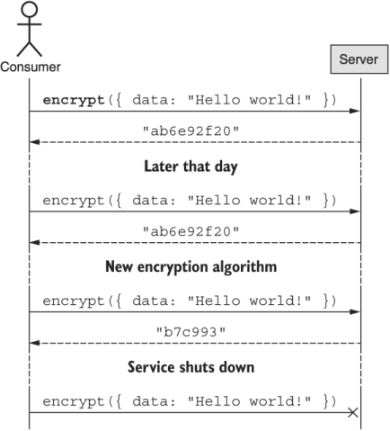
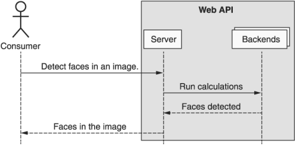
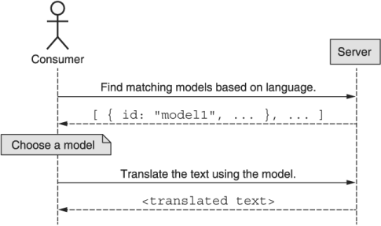

**本章涵盖内容如下：**

- 什么是接口？
- 什么是 API？
- 什么是资源导向？
- 是什么让 API 变得"好"？

通过阅读本书，你可能已经熟悉 API 的高级概念。 此外，你可能已经知道 API 代表应用程序编程接口，因此本章的重点将更详细地介绍这些基础知识的实际含义，以及它们为何重要。 让我们从更仔细地研究 API 的这个想法开始。

## 1.1 什么是Web API

API 定义了计算机系统交互的方式。而且由于极少数系统是孤立存在的，API 无处不在也就不足为奇了。我们可以在我们使用的语言包管理器的库中找到 API（例如: 提供函数 encrypt(input: string): string 之类的方法的加密库）和技术上我们自己编写的代码中的 API，即使它从未打算使用由其他任何人。但是有一种特殊类型的 API 可以通过网络公开并由许多不同的人远程使用，而这些类型正是本书的重点，通常称为"Web API"。

Web API 在很多方面都很有趣，但这个特殊类别中最有趣的方面可以说是这样一个事实，即构建 API 的人拥有如此多的控制权，而使用 Web API 的人则相对较少。当我们使用库时，我们处理库本身的本地副本，这意味着构建 API 的人可以随时随地做任何他们想做的事情，而不会伤害用户。 Web API 是不同的，因为没有副本。相反，当 Web API 的构建者进行更改时，无论用户是否要求，这些更改都会强加于用户。

例如: 想象一个允许你加密数据的 Web API 调用。如果在此 API 上工作的团队决定在加密你的数据时使用不同的算法，那么你实际上别无选择。调用加密方法时，你的数据将使用最新算法进行加密。在更极端的例子中，团队可以决定完全关闭 API 并忽略你的请求。那时，你的应用程序将突然停止工作，你对此无能为力。这两种情况如图 1.1 所示。



然而，对于消费者而言，Web API 的缺点通常是构建 API 的主要好处：他们能够保持对 API 的完全控制。 例如: 如果加密 API 使用了一种超级秘密的新算法，构建它的团队可能不希望以库的形式将该代码公开给全世界。 相反，他们可能更喜欢使用 Web API，这将允许他们公开超级秘密算法的功能，而不会泄露他们宝贵的知识产权。 其他时候，系统可能需要非凡的计算能力，如果将其部署为图书馆并在家用计算机或笔记本电脑上运行，则需要很长时间才能运行。 在这些情况下，例如对于许多机器学习 API，构建 Web API 允许你公开强大的功能，同时对消费者隐藏计算需求，如图 1.2 所示。



现在我们了解了 API（尤其是 Web API）是什么，这就提出了一个问题：它们为什么重要？

## 1.2 为什么 API 很重要？

专门为人类使用而设计和构建的软件并不少见，这从根本上没有错。然而，在过去的几年里，我们看到越来越多的人关注自动化，我们的目标是构建能够完成人类工作的计算机程序，而且速度更快。不幸的是，正是在这一点上，"仅限人类"的软件变得有点问题。

当我们设计专供人类使用的东西时，我们的交互涉及鼠标和键盘，我们倾向于将系统的布局和视觉方面与原始数据和功能方面混为一谈。这是一个问题，因为很难向计算机解释如何与图形界面交互。这个问题变得更糟，因为改变程序的视觉方面可能还需要我们重新训练计算机如何与这个新的图形界面交互。实际上，虽然更改对我们来说可能只是装饰性的，但它们对于计算机来说是完全无法识别的。换句话说，对于计算机来说，没有"仅用于化妆品"这样的东西。

API 是专门为具有重要属性的计算机提供的接口，以使计算机易于使用它们。例如: 这些界面没有视觉方面，因此无需担心表面上的变化。而且这些接口通常仅以"兼容"的方式发展（参见第 24 章），因此面对新的变化，无需重新调整计算机的任何内容。简而言之，API 提供了一种方式来表达计算机以安全稳定的方式进行交互所需的语言。

但这并不止于简单的自动化。 API 还为组合打开了大门，这使我们能够像对待乐高积木一样处理功能，以新颖的方式将各个部分组装在一起，以构建远大于各部分总和的东西。为了完成这个循环，这些新的 API 组合同样可以加入可重用构建块的行列，从而实现更复杂和非凡的未来项目。

但这引出了一个重要的问题：我们如何确保我们构建的 API 像乐高积木一样组合在一起？让我们首先研究一种称为资源导向的策略。

## 1.3 什么是面向资源的 API？
当今存在的许多 Web API 的行为有点像仆人：你要求他们做某事，他们就会去做。例如: 如果我们想要家乡的天气，我们可能会命令 Web API 像仆人一样预测天气（```postalCode=10011```）。这种通过调用预先配置的子例程或方法来命令另一台计算机的方式通常被称为进行"远程过程调用"（**RPC**），因为我们有效地调用了要在另一台计算机上执行的库函数（或过程）某处可能很远（或偏远）。像这样的 API 的关键方面是主要关注正在执行的操作。也就是说，我们考虑计算天气 (```predictWeather(postalCode=...)```) 或加密数据 (```encrypt(data=...)```) 或发送电子邮件 (```sendEmail(to=...)```)，每个都有一个强调"做"某事。

那么为什么不是所有的 API 都是面向 RPC 的呢？主要原因之一与"有状态"的概念有关，其中 API 调用可以是"有状态的"或"无状态的"。当一个 API 调用可以独立于所有其他 API 请求进行时，它被认为是无状态的，没有任何额外的上下文或数据。例如: 用于预测天气的 Web API 调用仅涉及一个独立输入（邮政编码），因此将被视为无状态。另一方面，存储用户最喜欢的城市并提供这些城市天气预报的 Web API 没有运行时输入，但要求用户已经存储了他们感兴趣的城市。因此，这种 API 请求，涉及其他先前请求或先前存储的数据，将被视为有状态。事实证明，RPC 样式的 API 非常适合无状态功能，但当我们引入有状态 API 方法时，它们往往不太适合。

注意 如果你碰巧熟悉 REST，现在可能是指出本节不是专门关于 REST 和 RESTful API 的好时机，而是更一般地关于强调"资源"的 API（正如大多数 RESTful API 所做的那样）。换句话说，虽然与 REST 的主题有很多重叠，但本节比 REST 更笼统一些。

要了解为什么会这样，让我们考虑一个用于预订航空公司航班的有状态 API 的示例。在表 1.1 中，我们可以看到用于与航空公司旅行计划交互的 RPC 列表，涵盖诸如安排新预订、查看现有预订和取消不需要的旅行等操作。

表 1.1 示例航班预订 API 的方法摘要

|        方法         |                 描述                 |
| :-----------------: | :----------------------------------: |
|  ScheduleFlight()   |             安排新的航班             |
| GetFlightDetails()  |        显示有关特定航班的信息        |
|  ShowAllBookings()  |      显示当前预订的所有旅行计划      |
| CancelReservation() |          取消现有的航班预订          |
| RescheduleFlight()  | 将现有航班重新安排到另一个日期或时间 |
|    UpgradeTrip()    |         从经济舱升级到头等舱         |

这些 RPC 中的每一个都非常具有描述性，但我们必须记住这些 API 方法，每个方法都与其他方法略有不同。例如: 有时一个方法谈论"航班"（例如: ```RescheduleFlight()```），而其他时间则对"预订"进行操作（例如: ```CancelReservation()```）。我们还必须记住使用了动作的许多同义形式中的哪一种。例如: 我们需要记住查看所有预订的方式是 ```ShowFlights()```、```ShowAllFlights()```、```ListFlights()``` 还是 ```ListAllFlights()```（在本例中为 ```ShowAllFlights()```）。但是我们能做些什么来解决这个问题呢？答案以标准化的形式出现。

资源导向旨在通过提供一组标准的构建块来帮助解决这个问题，以便在两个领域设计 API 时使用。首先，面向资源的 API 依赖于"资源"的概念，这是我们存储和交互的关键概念，标准化 API 管理的"事物"。其次，面向资源的 API 不是对我们能想到的任何动作使用任意的 RPC 名称，而是将动作限制在一个小的标准集（在表 1.2 中描述），它适用于每个资源以形成 API 中的有用动作。换个角度思考，面向资源的 API 实际上只是一种特殊类型的 RPC 样式 API，其中每个 RPC 都遵循一个清晰且标准化的模式：<StandardMethod><Resource>()。

表 1.2 标准方法总结及其含义

|        RPC         |              描述               |
| :----------------: | :-----------------------------: |
| Create<Resource>() |     创建一个新的 <Resource>     |
|  Get<Resource>()   | 显示有关特定 <Resource> 的信息  |
| List<Resources>()  | 显示所有现有 <Resources> 的列表 |
| Delete<Resource>() |      删除现有的 <Resource>      |
| Update<Resource>() |    就地更新现有的 <Resource>    |

如果我们沿着这条特殊的、有限的 RPC 路线走下去，这意味着我们可以提出一个单一的资源（例如 FlightReservation），而不是表 1.1 中所示的各种不同的 RPC 方法，并使用一组标准获得等效的功能 方法，见表1.3。
表 1.3 适用于飞行资源的标准方法总结

| Method |      |     Resource      |      |          Methods          |
| :----: | :--: | :---------------: | :--: | :-----------------------: |
| Create |  ×   | FlightReservation |  =   | CreateFlightReservation() |
|  Get   |      |                   |      |  GetFlightReservation()   |
|  List  |      |                   |      | ListFlightReservations()  |
| Delete |      |                   |      | DeleteFlightReservation() |
| Update |      |                   |      | UpdateFlightReservation() |

标准化显然更有条理，但这是否意味着所有面向资源的 API 都严格优于面向 RPC 的 API？实际上，没有。对于某些场景，面向 RPC 的 API 将更适合（特别是在 API 方法是无状态的情况下）。然而，在许多其他情况下，面向资源的 API 会让用户更容易学习、理解和记住。这是因为面向资源的 API 提供的标准化使你可以轻松地将你已经知道的内容（例如: 标准方法集）与你可以轻松学习的内容（例如: 新资源的名称）结合起来，开始与立即使用 API。再多说一点，如果你熟悉五种标准方法，那么，由于可靠模式的力量，学习一个新资源实际上与学习五个新的 RPC 是一样的。

显然，需要注意的是，并非每个 API 都是相同的，根据"要学习的东西"的待办事项列表的大小来定义 API 的复杂性有点粗糙。另一方面，这里有一个重要的原则在起作用：模式的力量。似乎学习可组合的部分并将它们组合成遵循固定模式的更复杂的东西往往比每次都学习遵循自定义设计的预构建复杂事物更容易。由于面向资源的 API 利用了久经考验的设计模式的力量，因此它们通常更容易学习，因此比面向 RPC 的等价物"更好"。但这给我们带来了一个重要的问题：这里的"更好"是什么意思？我们如何知道 API 是否"好"？ "好"到底是什么意思？

## 1.4 什么使 API"好"？
在我们探索使 API"好"的几个不同方面之前，我们首先需要深入研究为什么我们有一个 API。 换句话说，首先构建 API 的目的是什么？ 通常这归结为两个简单的原因：

1. 我们有一些用户想要的功能。
2. 这些用户希望以编程方式使用此功能。

例如: 我们可能有一个非常擅长将文本从一种语言翻译成另一种语言的系统。 世界上可能有很多人想要这种能力，但这还不够。 毕竟，我们可以推出一个翻译移动应用程序，公开这个惊人的翻译系统而不是 API。 要想获得一个 API，想要这个功能的人还必须要编写一个使用它的程序。 鉴于这两个标准，在考虑 API 的理想品质时，这会将我们引向何方？

### 1.4.1 操作
从最重要的部分开始，无论最终界面是什么样子，整个系统都必须是可操作的。换句话说，它必须做用户真正想要的事情。如果这是一个打算将文本从一种语言翻译成另一种语言的系统，它实际上必须能够这样做。此外，大多数系统可能有许多非操作性需求。例如: 如果我们的系统将文本从一种语言翻译成另一种语言，则可能存在与延迟（例如: 翻译任务应该花费几毫秒，而不是几天）或准确性（例如: 翻译不应该误导）。我们说正是这两个方面共同构成了系统的操作方面。

### 1.4.2 表现力

如果系统能够做某事很重要，那么该系统的界面允许用户清晰简单地表达他们想要做的事情也同样重要。换句话说，如果系统将文本从一种语言翻译成另一种语言，那么 API 的设计应该有一种清晰而简单的方法来做到这一点。在这种情况下，它可能是一个名为 TranslateText() 的 RPC。这种类型的事情可能听起来很明显，但实际上可能比看起来更复杂。

这种隐藏的复杂性的一个例子是 API 已经支持某些功能的情况，但由于我们的疏忽，我们没有意识到用户想要它，因此没有为用户构建一种表达方式来访问该功能.像这样的场景往往表现为变通方法，在这种情况下，用户会做一些不寻常的事情来访问隐藏的功能。例如: 如果一个 API 提供了将文本从一种语言翻译成另一种语言的能力，那么即使用户对翻译任何内容并不真正感兴趣，用户也有可能强迫该 API 充当语言检测器，如清单 1.1 所示.正如你可能想象的那样，如果用户拥有一个名为 DetectLanguage() 的 RPC，而不是进行大量 API 调用来猜测语言，那会好得多。

清单 1.1 仅使用 TranslateText API 方法检测语言的功能

```typescript
function detectLanguage(inputText: string): string {
  const supportedLanguages: string[] = ['en', 'es', ... ];
  for (let language of supportedLanguages) {
    let translatedText = TranslateApi.TranslateText({    // ❶
      text: inputText, 
      targetLanguage: language
    });
    if (translatedText == inputText) {                 // ❷
      return language;
    }
  }
  return null;                                         // ❸
}
```

❶ 这假设所讨论的 API 定义了一个 TranslateText 方法，该方法接受一些输入文本和要翻译成的目标语言。
❷ 如果翻译的文本和输入的文本相同，我们就知道两种语言是一样的。
❸ 如果没有找到与输入文本相同的翻译文本，则返回null，表示无法检测输入文本的语言。

如本示例所示，支持某些功能但不方便用户访问该功能的 API 不会很好。 另一方面，富有表现力的 API 为用户提供了明确指示他们想要什么（例如: 翻译文本）甚至他们想要如何完成（例如: "在 150 毫秒内，准确度为 95%"）的能力。

### 1.4.3 简单

与任何系统的可用性相关的最重要的事情之一是简单性。虽然人们很容易争辩说，简单的事情会减少 API 中的事物（例如: RPC、资源等）的数量，但不幸的是，这种情况很少发生。例如: 一个 API 可以依赖一个处理所有功能的 ExecuteAction() 方法；然而，这并没有真正简化任何事情。相反，它将复杂性从一个地方（大量不同的 RPC）转移到另一个地方（单个 RPC 中的大量配置）。那么一个简单的 API 到底是什么样的呢？

API 不应试图过度减少 RPC 的数量，而应旨在以尽可能最直接的方式公开用户想要的功能，使 API 尽可能简单，但不能更简单。例如: 假设一个翻译 API 想要添加检测某些输入文本语言的能力。我们可以通过在翻译的响应中返回检测到的源文本来做到这一点；然而，这仍然通过将其隐藏在为其他目的而设计的方法中来混淆功能。相反，创建一个专门为此目的而设计的新方法（例如 ```DetectLanguage()```）会更有意义。 （请注意，我们可能还会在翻译内容时包含检测到的语言，但这完全是出于另一个目的。）

关于简单性的另一个常见立场采用了关于"常见情况"（"使常见情况快速"）的古老说法，但重点放在可用性上，同时为边缘情况留出空间。这个重述是为了"让普通案例变得很棒，让高级案例成为可能"。这意味着，无论何时你为了高级用户的利益而添加可能使 API 复杂化的内容时，最好对只对常见情况感兴趣的典型用户充分隐藏这种复杂性。这使得更频繁的场景变得简单和容易，同时仍然为那些需要它们的人提供更高级的功能。

例如: 假设我们的翻译 API 包含翻译文本时使用的机器学习模型的概念，我们不是指定目标语言，而是根据目标语言选择一个模型并将该模型用作"翻译引擎" 。"虽然此功能为用户提供了更多的灵活性和控制，但它也更加复杂，新的常见情况如图 1.3 所示。



清单 1.2 选择模型后翻译文本

```typescript
function translateText(inputText: string, 
                       targetLanguage: string): string {
  let sourceLanguage = TranslateAPI.DetectLanguage(inputText);    // ❶
  let model = TranslateApi.ListModels({         // ❷
    filter: `sourceLanguage:${sourceLanguage}
             targetLanguage:${targetLanguage}`,
  })[0];
  return TranslateApi.TranslateText({
    text: inputText,
    modelId: model.id                            // ❸
  });
}
```

❶ 既然我们需要选择一个模型，我们首先需要知道输入文本的语言。 为了确定这一点，我们可以依赖 API 提供的假设 DetectLanguage() 方法。
❷ 一旦我们知道源语言和目标语言，我们就可以选择 API 提供的任何匹配模型。
❸ 现在我们终于拥有了所有必需的输入，我们可以回到将文本翻译成目标语言的最初目标。

我们如何才能将这个 API 设计得尽可能简单，但又不能更简单，并使普通案例变得很棒，并使高级案例成为可能？ 由于常见情况涉及并不真正关心特定模型的用户，因此我们可以通过设计 API 使其接受 targetLanguage 或 modelId 来实现这一点。 高级情况仍然有效（实际上，清单 1.2 中显示的代码将继续有效），但普通情况看起来要简单得多，仅依赖于 targetLanguage 参数（并期望 modelId 参数未定义）。

清单 1.3 将文本翻译成目标语言（常见情况）

```typescript
function translateText(inputText: string, 
                       targetLanguage: string, 
                       modelId?: string): string {
  return TranslateApi.TranslateText({
    text: inputText,
    targetLanguage: targetLanguage,
    modelId: modelId,
  });
}
```

现在我们对简单性是"好"API 的一个重要属性有了一些了解，让我们看看最后一部分：可预测性。

### 1.4.4 可预测

虽然我们生活中的惊喜有时很有趣，但有一个地方不属于 API，无论是在接口定义中还是在底层行为中。这有点像关于投资的古老格言："如果它令人兴奋，那你就做错了。"那么我们所说的"不出所料"的 API 是什么意思呢？

不出所料的 API 依赖于应用于 API 表面定义和行为的重复模式。例如: 如果一个翻译文本的 API 有一个 ```TranslateText()``` 方法，该方法将输入内容作为一个名为 text 的字段作为参数，那么当我们添加一个 ```DetectLanguage()``` 方法时，输入内容也应该被称为文本（不是```inputText``` 或 ```content``` 或 ```textContent```）。虽然这现在看起来很明显，但请记住，许多 API 是由多个团队构建的，并且在提供一组选项时选择调用字段的内容通常是任意的。这意味着当两个不同的人负责这两个不同的领域时，他们肯定会做出不同的任意选择。当这种情况发生时，我们最终会得到一个不一致（因此令人惊讶）的 API。

尽管这种不一致可能看起来微不足道，但事实证明，此类问题远比看起来重要得多。这是因为 API 的用户通过彻底阅读所有 API 文档来了解每一个细节实际上是非常罕见的。相反，用户阅读足以完成他们想做的事情。这意味着，如果有人知道在一个请求消息中一个字段被称为 text，他们几乎肯定会假设它在另一个中以相同的方式命名，有效地建立在他们已经学到的知识的基础上，对他们的事物进行有根据的猜测还没学会。如果这个过程失败（例如: 因为另一个名为该字段 inputText 的消息），他们的生产力就会碰壁，他们必须停止他们正在做的事情，以找出他们的假设失败的原因。

显而易见的结论是，依赖于重复的、可预测的模式（例如: 一致地命名字段）的 API 更容易、更快地学习，因此更好。类似的好处来自更复杂的模式，例如我们在探索面向资源的 API 时看到的标准操作。这将我们带到了本书的全部目的：使用众所周知的、定义明确的、清晰的和（希望）简单模式构建的 API 将导致 API 可预测且易于学习，这应该导致整体"更好"蜜蜂。现在我们已经很好地掌握了 API 以及它们的优点，让我们开始考虑在设计它们时可以遵循的更高级别的模式。

## 总结

- 接口是定义两个系统应该如何相互交互的契约。
- API 是一种特殊类型的接口，用于定义两个计算机系统如何相互交互，有多种形式，例如可下载的库和 Web API。
- Web API 很特别，因为它们通过网络公开功能，隐藏了该功能所需的特定实现或计算要求。
- 面向资源的 API 是一种设计 API 的方法，它依赖于一组称为方法的标准操作，跨有限的一组事物（称为资源）来降低复杂性。
- API"好"的原因有点含糊不清，但通常好的 API 是可操作的、富有表现力的、简单的和可预测的。