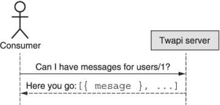
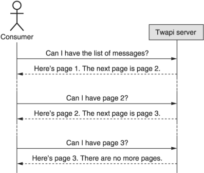

本章涵盖内容

1. 什么是 API 设计模式
2. 为什么 API 设计模式很重要
3. API 设计模式的剖析和结构
4. 使用和不使用设计模式设计 API

现在我们已经掌握了 API 是什么以及它们"好"的原因，我们可以探索在构建 API 时如何应用不同的模式。 我们将首先探索什么是 API 设计模式，它们为何重要，以及在后面的章节中将如何描述它们。 最后，我们将看一个示例 API，看看如何使用预先构建的 API 设计模式可以节省大量时间和未来的麻烦。

## 2.1 什么是 API 设计模式？

在我们开始探索 API 设计模式之前，我们必须先打好基础，从一个简单的问题开始：什么是设计模式？如果我们注意到软件设计是指为了解决问题而编写的一些代码的结构或布局，那么软件设计模式就是当一个特定的设计可以一遍又一遍地应用于许多类似的软件问题时发生的事情，只有微调以适应不同的场景。这意味着该模式不是我们用来解决单个问题的一些预先构建的库，而是更多用于解决类似结构问题的蓝图。

如果这看起来太抽象了，让我们巩固一下，想象一下我们想在我们的后院放一个棚子。有几种不同的选择可供选择，从我们几百年前所做的到我们今天所做的，这要归功于 Lowe's 和 Home Depot 等公司的魔力。有很多选择，但常见的有以下四种：

1. 买一个预先建好的棚子，把它放在后院。
2. 购买棚屋套件（蓝图和材料）并自行组装。
3. 购买一套棚屋蓝图，根据需要修改设计，然后自己建造。
4. 从头开始设计和建造整个棚屋。

如果我们从它们的软件等价物的角度考虑这些，它们的范围从使用预先构建的现成软件包一直到编写完全自定义的系统来解决我们的问题。在表 2.1 中，我们看到随着我们在列表中移动，这些选项变得越来越困难，但也增加了从一个选项到下一个选项的越来越多的灵活性。换句话说，最不困难的具有最小的灵活性，而最困难的具有最大的灵活性。

表2.1 搭建棚屋方式与搭建软件方式对比

|         选项          |   困难    |   灵活性    |                等效软件                |
| :-------------------: | :-------: | :---------: | :------------------------------------: |
|     Buy pre-built     |  Simple   |    None     |    Use a pre-built software package    |
|  Assemble from a kit  |   Easy    | Very little | Build by customizing existing software |
| Build from blueprints | Moderate  |    Some     |      Build from a design document      |
|  Build from scratch   | Difficult |    Most     |    Write completely custom software    |

大多数情况下，软件工程师倾向于选择"从头开始构建"选项。有时这是必要的，特别是在我们解决的问题是新问题的情况下。其他时候，这种选择会在成本效益分析中胜出，因为我们的问题完全不同，足以阻止我们依赖更简单的选择之一。还有其他时候，我们知道有一个库恰好可以解决我们的问题（或足够接近），我们选择依赖已经解决了手头问题的其他人。事实证明，选择中间选项之一（自定义现有软件或从设计文档构建）不太常见，但可能会更频繁地使用并获得很好的结果。这就是设计模式适合的地方。

在高层次上，设计模式是应用于软件的"从蓝图构建"选项。就像棚屋的蓝图有尺寸、门窗位置和屋顶材料一样，设计模式也有我们编写的代码的一些规范和细节。在软件中，这通常意味着指定代码的高级布局以及依赖布局来解决特定设计问题的细微差别。然而，很少有设计模式完全独立使用。大多数情况下，设计模式关注特定组件而不是整个系统。换句话说，蓝图专注于单个方面（如屋顶形状）或组件（如窗户设计）的形状，而不是整个棚屋。乍一看，这似乎是一个缺点，但只有当目标是建造一个棚屋时，情况才会如此。如果你正在尝试建造类似棚屋但又不完全是棚屋的东西，那么拥有每个单独组件的蓝图意味着你可以将它们中的许多混合和匹配到你想要建造的确切位置，选择屋顶形状 A 和窗口设计 B. 这会延续到我们对设计模式的讨论中，因为每个设计模式都倾向于关注系统的单个组件或问题类型，通过组装大量预先设计的部分来帮助你准确地构建你想要的东西。

例如: 如果你想在系统中添加调试日志，你可能需要一种且只有一种方式来记录消息。有很多方法可以做到这一点（例如: 使用单个共享全局变量），但恰好有一种设计模式旨在解决这个软件问题。这种模式在开创性著作《设计模式》（Gamma 等人，1994 年）中有所描述，称为单例模式，它确保只创建一个类的单个实例。这个"蓝图"需要一个带有私有构造函数和一个名为 ```getInstance()``` 的静态方法的类，它总是返回该类的单个实例（当且仅当它不存在时，它才处理创建该单个实例）。这种模式根本不完整（毕竟，拥有一个什么都不做的单例类有什么好处？）；然而，当你需要解决始终只有一个类的单个实例的小分区问题时，它是一个定义明确且经过充分测试的模式。

现在我们知道了一般的软件设计模式是什么，我们要问一个问题：什么是 API 设计模式？使用第 1 章中描述的 API 定义，API 设计模式只是应用于 API 的软件设计模式，而不是一般的所有软件。这意味着 API 设计模式，就像常规设计模式一样，只是设计和构建 API 方法的蓝图。由于重点是接口而不是实现，因此在大多数情况下，API 设计模式将只关注接口，而不必构建实现。虽然大多数 API 设计模式通常对这些接口的底层实现并不关心，但有时它们会决定 API 行为的某些方面。例如: API 设计模式可能指定某个 RPC 可以最终保持一致，这意味着从该 RPC 返回的数据可能稍微过时（例如: 它可以从缓存而不是权威存储系统中读取）。

我们将在后面的部分中更正式地解释我们计划如何记录 API 模式，但首先让我们快速了解一下为什么我们应该关心 API 设计模式。

## 2.2 为什么 API 设计模式很重要？

正如我们已经了解到的，API 设计模式在构建 API 时很有用，就像构建棚屋时的蓝图一样：它们充当我们可以在项目中使用的预先设计的构建块。我们没有深入研究的是为什么我们首先需要这些预先设计的蓝图。难道我们都不够聪明来构建好的 API 吗？我们不是最了解我们的业务和技术问题吗？虽然情况经常如此，但事实证明，我们用来构建真正设计良好的软件的一些技术在构建 API 时效果不佳。更具体地说，敏捷开发过程特别提倡的迭代方法在设计 API 时很难应用。要了解原因，我们必须查看软件系统的两个方面。首先，我们要普遍探索各种界面的灵活性（或刚性），然后我们必须了解界面的受众对我们进行更改和迭代整体设计的能力有何影响。让我们从灵活性开始。

正如我们在第 1 章中看到的，API 是一种特殊的接口，主要是为了计算系统可以相互交互。虽然以编程方式访问系统非常有价值，但它也更加脆弱，因为对界面的更改很容易导致使用界面的人失败。例如: 更改 API 中字段的名称会导致用户在名称更改发生之前编写的任何代码失败。从 API 服务器的角度来看，旧代码要求使用不再存在的名称的东西。这与其他类型的界面截然不同，例如图形用户界面 (**GUI**)，**GUI** 主要由人类而不是计算机使用，因此更能适应变化。这意味着即使更改可能令人沮丧或在美学上令人不快，但它通常不会导致我们根本无法再使用界面的灾难性故障。例如: 更改网页上按钮的颜色或位置可能很丑陋且不方便，但我们仍然可以弄清楚如何通过界面完成我们需要做的事情。

我们经常将接口的这一方面称为它的灵活性，即用户可以轻松适应变化的接口是灵活的，即使是很小的变化（如重命名字段）也会导致完全失败的接口是刚性的。这种区别很重要，因为进行大量更改的能力在很大程度上取决于界面的灵活性。最重要的是，我们可以看到刚性接口使我们更难像在其他软件项目中那样迭代一个伟大的设计。这意味着我们经常最终陷入所有设计决策，无论好坏。这可能会让你认为 API 的僵化意味着我们永远无法使用迭代开发过程，但由于接口的另一个重要方面：可见性，情况并非总是如此。

通常，我们可以将大多数界面分为两个不同的类别：用户可以看到并与之交互的那些（在软件中通常称为前端）和那些他们看不到的（通常称为后端）。例如: 当我们打开浏览器时，我们可以很容易地看到 Facebook 的图形用户界面；然而，我们无法看到 Facebook 如何存储我们的社交图谱和其他数据。为了对可见性的这一方面使用更正式的术语，我们可以说前端（所有用户看到并与之交互的部分）通常被认为是公共的，而后端（仅对较小的内部组可见）被认为是私有的。这种区别很重要，因为它在一定程度上决定了我们对不同类型的接口进行更改的能力，尤其是像 API 这样的刚性接口。

如果我们对一个公共接口进行更改，整个世界都会看到它并可能受到它的影响。由于受众如此之多，粗心地进行更改可能会导致用户生气或沮丧。虽然这当然适用于像 API 这样的刚性接口，但它也同样适用于灵活的接口。例如: 在 Facebook 的早期，大多数主要的功能或设计变化都在几周内引起了大学生的愤怒。但是如果接口不是公开的呢？对只有某些私有内部人群的成员才能看到的后端接口进行更改是否有什么大不了的？在这种情况下，受更改影响的用户数量要少得多，甚至可能仅限于同一团队或同一办公室的人员，因此我们似乎获得了更多进行更改的自由。这是个好消息，因为这意味着我们应该能够快速迭代以实现理想的设计，并在此过程中应用敏捷原则。

那么为什么 API 很特别呢？事实证明，当我们设计许多 API（根据定义是严格的）并与世界分享时，我们确实有两个方面的最坏情况。这意味着进行更改比这两个属性的任何其他组合都要困难得多（如表 2.2 所示）。

表 2.2 各种接口更换难度

| 灵活性 |  观众  |     示例界面      |    修改难度    |
| :----: | :----: | :---------------: | :------------: |
| 灵活的 | 私有的 |  内部监控控制台   |   Very easy    |
| 灵活的 | 公有的 |   Facebook.com    |    Moderate    |
| 死板的 | 私有的 | 内部照片存储 API  |   Difficult    |
| 死板的 | 公有的 | 公共 Facebook API | Very difficult |

简而言之，这种"两全其美"的场景（既僵化又难以更改）使得可重用和经过验证的设计模式对于构建 API 比其他类型的软件更加重要。 虽然在大多数软件项目中代码通常是私有的并且不可见，但 API 中的设计决策是最重要的，向服务的所有用户展示。 由于这严重限制了我们对设计进行渐进式改进的能力，因此依赖经过时间考验的现有模式对于第一次将事情做好是非常有价值的，而不是像大多数软件那样最终做到这一点。

既然我们已经探讨了这些设计模式重要的一些原因，让我们通过剖析和探索它的各种组件来进入 API 设计模式。

## 2.3 API 设计模式剖析

与软件设计中的大多数部分一样，API 设计模式由几个不同的组件组成，每个组件负责使用模式本身的不同方面。 显然，主要组件侧重于模式本身的工作方式，但还有其他组件针对使用设计模式的技术性较低的方面。 这些事情例如找出一组给定的问题存在模式，了解该模式是否适合你正在处理的问题，以及了解为什么该模式以一种方式做事而不是使用（可能） 更简单）替代方案。

由于这个解剖课可能会变得有点复杂，让我们假设我们正在构建一个存储数据的服务，并且该服务的客户需要一个 API，以便他们可以从服务中获取数据。 我们将依靠这个示例场景来引导我们讨论接下来要探索的每个模式组件，从开头开始：名称。

### 2.3.1 名称和概要
目录中的每个设计模式都有一个名称，用于唯一标识目录中的模式。该名称将具有足够的描述性以传达该模式正在做什么，但不会冗长到在嘈杂的房间中不容易大喊大叫。例如: 在描述解决我们导出数据示例场景的模式时，我们可以将其称为"导入、导出、备份、还原、快照和回滚模式"，但最好将其命名为"输入/输出模式"或简称"IO模式"。

虽然名称本身通常足以理解和识别模式，但有时不够详细，无法充分解释模式解决的问题。为了确保对模式本身有一个简短而简单的介绍，名称后面还会有一个模式的简短摘要，其中将简要描述它要解决的问题。例如: 我们可能会说输入/输出模式"提供了一种将数据移入或移出各种不同存储源和目的地的结构化方式"。简而言之，本节的总体目标是轻松快速地确定是否有任何特定模式值得进一步研究，以作为解决给定问题的潜在适合。

### 2.3.2 动机

由于 API 设计模式的目标是为一类问题提供解决方案，因此最好的起点是定义该模式旨在涵盖的问题空间。本节旨在解释基本问题，以便容易理解为什么我们首先需要一个模式。这意味着我们首先需要一个详细的问题陈述，它通常以以用户为中心的目标的形式出现。在我们的数据导出示例中，我们可能有这样一个场景：用户"想要将一些数据从服务导出到另一个外部存储系统中"。

在那之后，我们必须更深入地挖掘用户想要完成的细节。例如: 我们可能会发现用户需要将他们的数据导出到各种存储系统，而不仅仅是亚马逊的 S3。他们还可能需要对数据的导出方式施加进一步的限制，例如在传输前是否对其进行压缩或加密。这些需求将对设计模式本身产生直接影响，因此我们必须阐明我们正在使用此特定模式解决的问题的这些细节。

接下来，一旦我们更全面地了解用户目标，我们需要探索在实际实现的正常过程中可能出现的边缘情况。例如: 我们应该了解当数据太大时系统应该如何表现（以及多大是太大，因为这些词通常对不同的人意味着不同的数字）。我们还必须探索系统在故障场景中应该如何反应。例如: 当导出作业失败时，我们应该描述是否应该重试。这些不寻常的场景可能比我们通常预期的要常见得多，即使我们可能不必立即决定如何解决每个场景，模式记下这些空白至关重要，以便最终可以填补它们通过一个实现。

### 2.3.3 概述
现在我们越来越接近有趣的部分：解释设计模式推荐什么作为问题空间的解决方案。在这一点上，我们不再专注于定义问题，而是提供解决方案的高级描述。这意味着我们开始探索我们将采用的策略来解决问题以及我们将使用的方法。例如: 在我们的导出数据场景中，本节将概述各种组件及其职责，例如一个组件用于描述要导出哪些数据的详细信息，另一个用于描述作为导出数据目的地的存储系统，还有一个用于描述在将数据发送到该目的地之前应用的加密和压缩设置。

在许多情况下，问题定义和解决方案要求列表将规定解决方案的总体轮廓。在这些情况下，概述的目标是明确地阐明这个大纲，而不是让它从问题描述中推断出来，无论解决方案看起来多么明显。例如: 如果我们正在定义一个搜索资源列表的模式，那么显然有一个查询参数；但是，其他方面（例如该参数的格式或搜索的一致性保证）可能不那么明显，值得进一步讨论。毕竟，即使是显而易见的解决方案也可能具有值得解决的微妙影响，正如他们所说，魔鬼往往在细节中。

其他时候，虽然问题是明确定义的，但可能没有一个明显的解决方案，而是几个不同的选项，每个选项都有自己的权衡。例如: 在 API 中建模多对多关系的方法有很多种，每种方法都有不同的优点和缺点；然而，重要的是 API 选择一个选项并始终如一地应用它。在这种情况下，概述将讨论每个不同的选项和推荐模式采用的策略。本节可能包含对提到的其他可能选项的优缺点的简要讨论，但大部分讨论将留给模式描述末尾的权衡部分。

### 2.3.4 实现
我们已经了解了每个设计模式中最重要的部分：我们如何实现它。在这一点上，我们应该彻底了解我们试图解决的问题空间，并了解我们将采用的高级策略和策略来解决它。本节最重要的部分是定义为代码的接口定义，它解释了使用此模式解决问题的 API 会是什么样子。 API 定义将侧重于资源的结构以及与这些资源交互的各种特定方式。这将包括各种内容，例如资源或请求上存在的字段、可以进入这些字段的数据格式（例如 Base64 编码的字符串），以及资源如何相互关联（例如: 分层关系）。

在许多情况下，API 表面和字段定义本身可能不足以解释 API 的实际工作方式。换句话说，虽然字段的结构和列表可能看起来很清楚，但这些结构的行为和不同字段之间的交互可能要复杂得多，而不是简单明了。在这些情况下，我们需要对设计的这些不明显的方面进行更详细的讨论。例如: 在导出数据时，我们可能会在到存储服务的途中指定一种压缩方式，使用字符串字段来指定压缩算法。在这种情况下，模式可能会讨论该字段的各种可能值（它可能使用 Accept-Encoding HTTP 标头使用的相同格式），提供无效选项时该怎么办（它可能返回错误），以及当请求将该字段留空时意味着什么（它可能默认为 gzip 压缩）。

最后，本节将包含一个示例 API 定义，并附有解释正确实现此模式的 API 应该是什么样子的注释。这将在代码中定义，并带有解释各个字段行为的注释，并将依赖于说明模式解决的问题的场景的特定示例。这部分几乎肯定是最长的，也有最多的细节。

### 2.3.5 权衡

在这一点上，我们了解设计模式给了我们什么，但我们还没有讨论它带走了什么，这实际上非常重要。坦率地说，如果按照设计来实现设计模式，那么可能只是有些事情是不可能的。在这些情况下，了解为了获得依赖设计模式带来的好处需要做出哪些牺牲是非常重要的。这里的可能性是多种多样的，从功能限制（例如: 不可能在 Web 浏览器中直接将数据作为下载导出给用户）到增加的复杂性（例如: 需要更多的输入来描述你想要发送数据的位置)，甚至更多的技术方面，如数据一致性（例如: 你可以看到可能有点陈旧的数据，但你无法确定），因此讨论的范围可以从简单的解释到对细微限制的详细探索当依赖于特定的设计模式时。

此外，虽然给定的设计模式通常可能完美地适合问题空间，但肯定会存在足够接近但不完美的场景。在这些情况下，重要的是要了解依赖处于这个独特位置的设计模式会产生什么后果：不是错误的模式，但也不是完美的模式。本节将讨论这种轻微错位的后果。

现在我们已经更好地掌握了 API 设计模式的结构和解释方式，让我们换个角度看看这些模式在构建一个所谓的简单 API 时可以产生的不同。

## 2.4 案例研究：Twapi，一个类似 Twitter 的 API

如果你不熟悉 Twitter，把它想象成一个你可以与他人分享短信的地方——就是这样。 认为整个企业都建立在每个人都在创造微小的信息之上，这有点可怕，但显然这足以值得一家价值数十亿美元的科技公司。 这里没有提到的是，即使是一个极其简单的概念，表面之下也恰好隐藏着相当多的复杂性。 为了更好地理解这一点，让我们从探索 Twitter 的 API 可能是什么样子开始，我们将其称为 Twapi。

### 2.4.1 概述
对于 Twapi，我们的主要职责是允许人们发布新消息和查看其他人发布的消息。从表面上看，这看起来很简单，但正如你可能猜到的，我们需要注意一些隐藏的陷阱。让我们首先假设我们有一个简单的 API 调用来创建 Twapi 消息。之后，我们将查看此 API 可能需要的两个额外操作：列出大量消息并将所有消息导出到不同的存储系统。

在我们开始行动之前，有两件重要的事情需要考虑。首先，这只是一个示例 API。这意味着重点将仍然放在我们定义接口的方式上，而不是实现的实际工作方式上。用编程术语来说，这有点像说我们只讨论函数定义，而函数体留待以后填写。其次，这将是我们第一次尝试查看 API 定义。如果你还没有浏览过"关于这本书"部分，现在可能是阅读的好时机，因此 TypeScript 风格的格式不会太令人惊讶。

既然这些事情已经解决了，让我们看看我们将如何列出一些 Twapi 消息。

### 2.4.2 列出消息

如果我们可以创建消息，那么我们想要列出我们创建的消息似乎很合理。此外，我们希望看到我们的朋友创建的消息，更进一步，我们可能希望看到一长串消息，这些消息是我们朋友的热门消息的优先集合（有点像新闻提要）。让我们从定义一个简单的 API 方法开始，完全不依赖任何设计模式。

##### 没有设计模式

从一开始，我们需要发送一个请求，要求列出一堆消息。为此，我们需要知道我们想要谁的消息，我们称之为"父母"。作为回应，我们希望我们的 API 发回一个简单的消息列表。图 2.1 概述了这种相互作用。



现在我们了解了列出这些消息所涉及的流程，让我们将其形式化为实际的 API 定义。

```typescript
abstract class Twapi {                                            // ❶
  static version = "v1";                                          // ❷
  static title = "Twapi API";
 
  @get("/{parent=users/*}/messages")                              // ❸
  ListMessages(req: ListMessagesRequest): ListMessagesResponse;   // ❹
}
 
interface ListMessagesRequest {
  parent: string;                                                 // ❺
}
 
interface ListMessagesResponse {
  results: Message[];                                             // ❻
}
```

❶ 首先，我们将 API 服务定义为一个抽象类。 这只是定义为 TypeScript 函数的 API 方法的集合。
❷ 我们可以使用 TypeScript 静态变量来存储有关 API 的元数据，例如名称或版本。
❸ 在这里，我们依靠特殊的包装函数来定义应该映射到此函数的 HTTP 方法 (GET) 和 URL 模式 (/users/<user-id>/messages)。
❹ 这里，ListMessages 函数接受一个 ListMessagesRequest 并返回一个 ListMessagesResponse。
❺ ListMessagesRequest 接受一个参数：父级。 这是我们尝试列出的消息的所有者。
❻ ListMessagesResponse 返回提供的用户拥有的消息的简单列表。

如你所见，这个 API 定义非常简单。它接受单个参数并返回匹配消息的列表。但让我们想象一下，我们将它部署为我们的 API，并考虑随着时间的推移可能出现的最大问题之一：大量数据。

随着越来越多的人使用该服务，此消息列表可能会变得很长。这可能不是什么大问题，因为响应开始有数以万计或数百条消息，但是当你开始收到数千条、数十万条甚至数百万条消息时呢？单个 HTTP 响应携带 500,000 条消息，每条消息最多 140 个字符，这意味着这可能高达 70 兆字节的数据！对于普通的 API 用户来说，这似乎很麻烦，更不用说单个 HTTP 请求将导致 Twapi 数据库服务器向下发送 70 兆字节的数据这一事实。

所以，我们能做些什么？显而易见的答案是允许 API 将可能变得非常大的响应分解成更小的部分，并允许用户一次请求所有消息一个块。为此，我们可以依靠分页模式（参见第 26 章）。

##### 分页模式

正如我们将在第 26 章中学到的，分页模式是一种在更小、更易于管理的数据块中检索一长串项目的方法，而不是一次发送整个列表。 该模式依赖于请求和响应的额外字段； 然而，这些看起来应该很简单。 这种模式的一般流程如图 2.2 所示。



这是实际 API 定义中的样子。

```typescript
abstract class Twapi {
  static version = "v1";
  static title = "Twapi API";
  @get("/{parent=users/*}/messages")
  ListMessages(req: ListMessagesRequest): ListMessagesResponse;   // ❶
}
 
interface ListMessagesRequest {
  parent: string;
  pageToken: string;                                              // ❷
  maxPageSize: number?;                                           // ❸
}
 
interface ListMessagesResponse {
  results: Message[];
  nextPageToken: string;                                          // ❹
}
```

❶ 注意方法定义保持不变； 这里不需要更改。
❷ 为了明确我们请求的是哪个数据块（或页面），我们在请求中包含了一个页面令牌参数。
❸ 我们还提供了一种方法来指定 Twapi 服务器应该在单个块中返回给我们的最大消息数。
❹ 来自 Twapi 服务器的响应将包括一种获取下一个消息块的方法。

##### 如果我们不从模式开始呢？

通过对 API 服务的这些小改动，我们实际上已经组合了一个 API 方法，它能够在 Twapi 消息数量激增的情况下存活下来，但这留下了一个明显的问题没有答案：我为什么要费心遵循这种模式从头开始？为什么不在以后出现问题时添加这些字段呢？换句话说，我们为什么要费心去修复尚未损坏的东西？正如我们稍后在探索向后兼容性时会了解到的那样，原因很简单，只是为了避免导致现有软件崩溃。

在这种情况下，从我们更简单的原始设计（在单个响应中发回所有数据）更改为依赖分页模式（将数据拆分为更小的块）可能看起来无害，但它实际上会导致任何以前的现有软件无法正常运行。在这种情况下，现有代码希望单个响应包含请求的所有数据，而不是其中的一部分。结果，有两个大问题。

首先，因为之前编写的软件期望在单个请求中返回所有数据，所以它无法找到显示在后续页面上的数据。结果，在更改之前编写的代码实际上与第一块数据之外的所有数据都被切断了，这导致了第二个问题。

由于现有消费者不知道如何获得额外的数据块，他们留下的印象是，尽管只有一小部分数据，但他们已经获得了所有数据。这种误解可能导致难以发现的错误。例如: 尝试计算某些数据的平均值的消费者最终可能会得到一个看起来准确但实际上只是返回的第一个数据块的平均值的值。显然，这可能会导致不正确的值，但不会产生明显的错误。因此，此错误可能会在相当长的一段时间内未被发现。

既然我们已经看过了列出消息的例子，让我们来探讨一下为什么我们可能想要在导出数据时使用设计模式。

### 2.4.3 导出数据
在某些时候，Twapi 服务的用户可能希望能够导出他们的所有消息。与列出消息类似，我们首先必须考虑到我们需要导出的数据量可能会变得非常大（可能有数百 MB）。此外，与列出消息不同的是，我们应该考虑到这些数据的接收端可能有很多不同的存储系统，理想情况下，我们有办法在新系统流行时与它们集成。此外，在导出数据之前，我们可能希望对数据应用许多不同的转换，例如加密、压缩或根据需要对其某些部分进行匿名化。最后，所有这些都不太可能以同步方式很好地工作，这意味着我们需要一种方式来表示有一些待处理的工作（即数据的实际导出）在后台运行，供消费者监控进步。

让我们首先为这个 API 提出一个简单的实现，然后看看未来可能出现的各种问题。

##### 没有设计模式

如前所述，我们有几个主要关注点：大量数据、数据的最终目的地、数据的各种转换或配置（例如: 压缩或加密），最后是 API 的异步性质。由于我们只是试图获得用于导出 Twapi 消息的基本 API，因此涵盖大多数这些因素的最简单选项是触发生成压缩文件以供将来下载。简而言之，当有人向这个 API 发出请求时，响应实际上并不包含数据本身。相反，它包含一个指向将来某个时间点可能下载数据的位置的指针。

清单 2.3 用于导出消息的简单 API

```typescript
abstract class Twapi {
  static version = "v1";
  static title = "Twapi API";
 
  @post("/{parent=users/*}/messages:export")   // ❶
  ExportMessages(req: ExportMessagesRequest):
      ExportMessagesResponse;                  // ❷
}
 
interface ExportMessagesRequest {
  // The parent user of the messages to be exported.
  parent: string;                              // ❸
}
 
interface ExportMessagesResponse {
  // The location of a compressed file
  // containing the messages requested.
  exportDownloadUri: string;                   // ❹
}
```

❶ 我们映射到的 URI 使用 POST HTTP 动词，以及一种特殊的语法来表示这是正在执行的特殊操作，而不是标准 REST 操作之一。
❷ 就像我们之前的例子一样，我们依赖一个 ```ExportMessages``` 函数，它接受一个请求并返回一个响应。
❸ 我们只想允许一次为一个用户导出数据，因此导出方法的范围仅限于单个父级（用户）。
❹ 来自 Twapi 服务器的响应指定了稍后要从简单文件服务器而不是此 API 服务下载的压缩文件的位置。

该 API 确实完成了主要任务（导出数据）和一些次要任务（异步检索），但遗漏了一些重要方面。首先，我们无法为所涉及的数据定义额外的配置。例如: 我们没有机会选择加密数据时使用的压缩格式或密钥和算法。接下来，我们无法选择数据的最终目的地。相反，我们只是被告知我们以后可能会去哪里寻找它。最后，如果我们更仔细地观察，很明显接口的异步特性只是部分有用：虽然服务确实异步返回了一个我们可以下载数据的位置，但我们无法监控导出的进度操作，也不是在我们不再对数据感兴趣的情况下中止操作的方法。

让我们看看我们是否可以通过使用稍后在我们的设计模式目录中定义的一些设计模式来改进这个设计，主要关注导入/导出模式。

##### 导入/导出模式

正如我们将在第 28 章中学到的，导入/导出模式针对的是这样的问题：我们的 API 服务中有一定数量的数据，而消费者想要一种将其导出（或导入）的方法。然而，与我们之前讨论的分页模式不同，这种模式将依赖其他模式，例如长期运行的操作模式（在第 13 章中讨论）来完成工作。让我们从定义 API 开始，然后更仔细地研究每个部分如何协同工作。就像以前一样，请记住，我们不会深入研究模式每个方面的所有细节，而是尝试给出相关部分的高级视图。

清单 2.4 使用设计模式导出消息的 API

```typescript
abstract class Twapi {
  static version = "v1";
  static title = "Twapi API";
 
  @post("/{parent=users/*}/messages:export")
  ExportMessages(req: ExportMessagesRequest):
      Operation<ExportMessagesResponse,
                ExportMessagesMetadata>;           // ❶
}
 
interface ExportMessagesRequest {
  // The parent user of the messages to be exported.
  parent: string;
  outputConfig: MessageOutputConfig;               // ❷
}
 
interface MessageOutputConfig {
  destination: Destination;                        // ❸
  compressionConfig?: CompressionConfig;           // ❹
  encryptionConfig?: EncryptionConfig;
}
 
interface ExportMessagesResponse {
  outputConfig: MessageOutputConfig;               // ❺
}
 
interface ExportMessagesMetadata {
  // An integer between 0 and 100
  // representing the progress of the operation.
  progressPercent: number;                         // ❻
}
```

❶ 与前面的示例不同，我们的 ```ExportMessages``` 方法的返回类型是一个长时间运行的操作，它在完成后返回一个 ```ExportMessagesResponse``` 并使用 ```ExportMessagesMetadata``` 接口报告有关该操作的元数据。
❷ 除了父（用户）之外，ExportMessagesRequest 还接受一些关于结果输出数据的额外配置。
❸ 这里我们定义了"目的地"，它表示操作完成时数据应该结束的地方。
❹ 此外，我们可以使用单独的配置对象来调整数据压缩或加密的方式。
❺ 结果将与将数据输出到结果目的地时使用的配置相呼应。
❻ ```ExportMessagesMetadata``` 将包含有关操作的信息，例如进度（以百分比表示）。

这种模式有什么好处？ 首先，依靠封装的输出配置接口，我们能够在请求时接受各种参数，然后在我们的响应中重用相同的内容作为对消费者的确认。 接下来，在这个配置中，我们可以定义几个不同的配置选项，我们将在清单 2.5 中详细介绍。 最后，我们能够使用长时间运行的操作的元数据信息来跟踪导出操作的进度，该信息将操作的进度存储为百分比（0% 表示"未开始"，100% 表示"完成"） ）。

尽管如此，你可能已经注意到，我们在之前的 API 定义中使用的一些构建块没有被定义。 让我们在提供一些示例配置的同时准确定义它们的外观。

清单 2.5 用于配置目的地和配置的接口

```typescript
interface Destination {
  typeId: string;
}
 
interface FileDestination extends Destination {        // ❶
  // The uploaded file will be hosted on our servers.
  fileName: string;
}
 
interface AmazonS3Destination extends Destination {    // ❷
  // This requires write access to the bucket
  // and object prefix granted to
  // AWS Account ID 1234-5678-1234.
  uriPrefix: string;
}
 
interface CompressionConfig {
  typeId: string;
}
 
interface GzipCompressionConfig {                      // ❸
  // An integer value between 1 and 9.
  compressionLevel: number;
}
 
interface EncryptionConfig {                           // ❹
  // All sorts of encryption configuration here
  // can go here, or this can be
  // extended as CompressionConfig is.
}
```

❶ 就像原来的例子一样，在这里我们可以定义一个文件目的地，它将输出放在文件服务器上以便稍后下载。
❷ 除了文件下载示例，我们还可以请求将数据存储在 Amazon 的 Simple Storage Service (S3) 上的某个位置。
❸ 在这里，我们定义了提供的各种压缩选项以及每个选项的配置值。
❹我们可以在单个界面中定义所有加密配置选项，也可以为各种选择使用相同的子分类结构（如压缩所示）。

在这里，我们可以看到定义配置选项的各种方法，例如数据的目的地或数据的压缩方式。 剩下的唯一事情就是了解这个长期运行的操作究竟是如何工作的。 我们将在第 28 章更详细地探讨这种模式，但现在，让我们抛开这些接口的简单 API 定义，以便我们至少对它们在做什么有一个高层次的理解。

清单 2.6 常见错误和长时间运行的操作接口定义

```typescript
interface OperationError {                  // ❶
  code: string;
  message: string;
  details?: any;
}
 
interface Operation<ResultT, MetadataT> {   // ❷
  id: string;
  done: boolean;
  result?: ResultT | OperationError;
  metadata?: MetadataT;
}
```

❶ 我们需要的一个基本组件是错误的概念，它（至少）是错误代码和消息。 它还可能包含一个可选字段，其中包含有关错误的更多详细信息。
❷ 长时间运行的操作是一种类似于 ```promise``` 的结构，基于结果和元数据类型进行参数化（就像 Java 泛型一样）。

与其他特定于导出消息的接口不同，这些（错误和操作）更通用，可以在整个 API 中共享。换句话说，将这些更像是常见的构建块而不是特定于特定功能是安全的。

##### 如果我们不从模式开始会发生什么？

与我们之前的示例不同，模式驱动和非模式驱动的选项看起来非常接近，在这种情况下，这两个选项在生成的 API 表面上有显着差异。因此，这个问题的答案很明确：如果你发现自己需要所提供的功能（不同的导出目的地、单独的配置等），那么以非模式驱动的方法开始将导致消费者发生重大变化。通过从模式驱动的方法开始解决这个问题，API 将随着新功能的需要而优雅地发展。

## 总结

1. API 设计模式有点像用于设计和构建 API 的适应性蓝图。
2. API 设计模式很重要，因为 API 通常非常"刚性"，因此不容易更改，因此设计模式有助于最大限度地减少对大型结构更改的需求。
3. 在本书中，API 设计模式将有几个部分，包括名称和摘要、建议的规则、动机、概述、实现以及使用提供的模式而不是自定义替代方案的权衡。