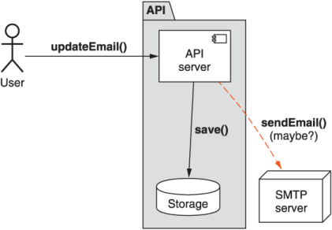
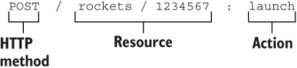
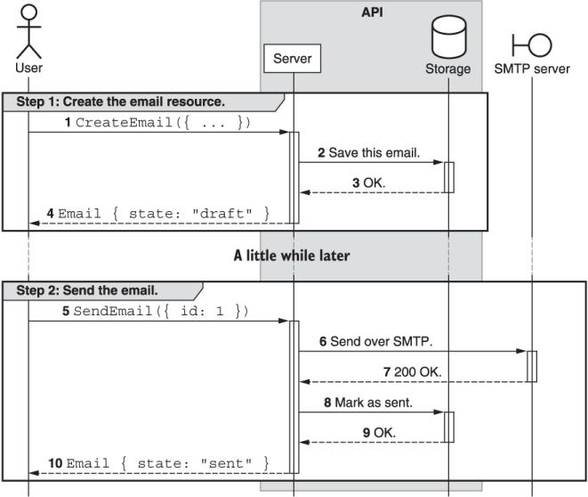

本章涵盖内容

- 为什么标准方法不能涵盖所有可能的场景
- 在需要副作用的情况下使用自定义方法
- 如何将无状态自定义方法用于以计算为中心的 API 方法
- 确定自定义方法的目标（资源与集合）

通常，我们需要对 API 资源执行一些操作，而这些操作不能很好地融入标准方法之一。 虽然这些行为在技术上可以通过资源的标准更新方法来处理，但其中许多操作的行为要求对于标准方法来说是完全不合适的，导致一个令人惊讶、混乱和过于复杂的界面。 为了解决这个问题，该模式探索了如何安全地支持对 Web API 中的资源执行这些操作，同时使用我们称之为自定义方法的方式维护一个简单、可预测且功能强大的 API。

## 9.1 动机
在大多数 API 中，总会有一段时间我们需要表达特定操作的能力，而该操作实际上不太适合其中一种标准方法。例如: 发送电子邮件或即时翻译一些文本的正确 API 是什么？如果你被禁止存储任何数据（也许你正在为 CIA 翻译文本）怎么办？虽然你可以将这些操作混搭为一个标准方法（最有可能是创建操作或更新操作），但此时你正在调整这些标准方法的框架以适应不太适合的内容。这导致了一个明显的问题：我们是否应该尝试将我们想要的行为塞进现有方法中，稍微弯曲框架以适应我们的需求？或者我们应该将我们的行为改变成一种更适合框架的形式吗？或者我们应该改变框架以适应我们的新场景？

这个问题的答案取决于场景，但在本章中，我们将探索自定义方法作为这个难题的一种潜在解决方案。从本质上讲，这与第三种选择相吻合，即我们更改框架以适应我们的新场景，从而确保没有任何事情只是为了使事情适合。

正如你可能猜到的，使用自定义方法背后的概念并不复杂——毕竟，大多数基于 RPC 的 API 一直都在使用这个想法。自定义方法的棘手部分在于细节。什么时候使用它们是安全的？我们真的确定标准方法不是一种选择吗？我们可以参数化自定义方法调用吗？名单还在继续。

在本章中，我们将探索自定义方法以及它们带来的所有细节和细微差别。但在我们讨论自定义方法的工作原理之前，让我们花点时间解决一下房间里的大象：我们真的需要使用自定义方法吗？

### 9.1.1 为什么不只是标准方法？

虽然我们在第 7 章中学到的标准方法通常足以用 API 做几乎任何事情，但有时它们感觉不太正确。在这些情况下，我们常常感觉好像我们在遵循法律条文，而不是法律精神：标准方法的行为与预期完全不同，导致意外，因此不是一个很好的 API。简而言之，仅仅因为我们可以使用标准方法执行操作并不意味着我们应该执行该操作。但这是什么决定的？除了感觉不对之外，我们还能做更多的解释吗？让我们通过一个具体的例子来看看这个：状态变化。

通常，API 资源可以以多种状态之一存在。例如: 一封电子邮件可能以草稿状态开始，然后进入已发送状态，并且可能（如果我们使用一些精美的电子邮件服务）未发送。这显然是我们可以使用标准更新方法的场景之一，但这样做似乎不太正确。

为什么状态更改不适合更新方法？第一个原因很简单：大多数状态更改都是某种形式的转换，因此，转换到新状态（恰好存储在某个状态字段中）与设置标量字段的值有着根本的不同（例如: 设置电子邮件的主题）。因此，设置状态以指示此转换发生可能会令人困惑和惊讶，这两者都不是一个好的 API。

清单 9.1 使用标准更新方法将电子邮件标记为已发送

```typescript
const email = GetEmail({id: 'email id here'});   // ❶
UpdateEmail({id: email.id, state: 'sent'});      // ❷
```

❶ 首先，电子邮件的状态是草稿。
❷ 在本例中，我们通过将状态字段更新为已发送来发送电子邮件。
如你所见，通过更新状态属性来发送电子邮件有点令人反感。这个字段感觉应该由 API 服务本身管理而不是由客户端更新。简而言之，将字段视为我们从一种状态转换到另一种状态的机制可能会非常令人困惑。此外，它混淆了 update 方法的真正目的，因为它提供了更新存储数据以及同时转换到新状态的能力——两个独立的概念性操作。

除了更新字段以转换到新状态所造成的混乱之外，我们还有第二个潜在问题与副作用有关。正如我们在第 7 章中了解到的，标准方法除了它们名称所暗示的特定操作之外，真的不应该做任何事情。换句话说，一个 create 方法应该创建一个新资源而不做其他任何事情。同样，更新方法应该更新资源，仅此而已。但通常，状态更改伴随着需要执行的额外操作。例如: 如果我们有一个电子邮件资源，我们想将其从草稿更改为已发送，我们还必须实际将电子邮件发送给收件人（否则，将其标记为已发送实际上毫无意义）。简单地将状态字段更新为已发送是一种非常微妙的方式，暗示你将与 SMTP 服务器通信以便向某个收件人发送电子邮件。

问题只会从那里扩展。当我们使用标准的更新方法来执行具有这些副作用的操作时，我们必须考虑这样一个事实，即现在我们可能需要与两个不同的系统进行通信以完成更新操作（如图 9.1 所示）。首先，对于每次更新，无论如何，我们都需要与存储系统进行通信，以使用新信息更新某个位置的数据库。其次，如果更新碰巧将电子邮件资源的状态从草稿更改为已发送，我们还需要与电子邮件发送系统（必须与收件人的电子邮件服务进一步通信）进行通信以完成工作。本来应该是一个简单的"更新数据库"操作，现在变成了一个混乱的依赖链和潜在的长时间运行的后台操作，其中任何步骤都可能出现故障。



更糟糕的是，这意味着，根据正在更新的内容，标准更新方法可能会立即返回结果或延迟一段时间直到电子邮件发送发生。当用户只是尝试更新有关其电子邮件的某些内容时，这会导致各种混乱。

需要注意的是，这张图在技术上没有任何问题。许多 API 调用可能会与许多不同的服务进行通信，这不一定是件坏事。问题是这个图打破了之前定义的关于标准方法应该做什么和不应该做什么的规则。因此，问题不在于与多个不同系统对话的 API 调用；它是关于一种标准方法（例如更新）与多个不同的系统对话，触发副作用，并承担下游依赖。这使得 API 从根本上变得更糟，因为它破坏了我们依赖标准方法某些方面的能力，而是使标准方法变得不可预测和混乱。

在结束之前，我们还有一头大象要解决：为什么不重新安排我们的资源，以便我们想要执行的操作更符合标准方法的期望？在此示例中，我们可能拥有 ```EmailDraft``` 资源和电子邮件资源，其中我们不会在状态之间转换，而是基于 ```EmailDraft``` 资源创建新的电子邮件资源。

清单 9.2 安排资源以适应标准方法

```typescript
abstract class EmailApi {
  @post("/{parent=users/*}/emailDrafts")                 // ❶
  CreateEmailDraft(CreateEmailDraftRequest req): EmailDraft;
 
  @post("/{parent=users/*}/emails")                      // ❷
  CreateEmail(CreateEmailRequest req): Email;
}
 
interface EmailDraft {                                   // ❸
  id: string;
  subject: string;
  // ...
}
 
interface Email {
  id: string;
  content: EmailDraft;                                   // ❹
}
```

❶ 我们总是从创建可变的 ```EmailDraft``` 资源开始。
❷ 创建电子邮件资源实际上也会发送电子邮件。电子邮件资源将是不可变的。
❸ 一个```EmailDraft``` 资源包含所有要发送的关键信息。
❹ 实际的电子邮件引用了 ```EmailDraft``` 的内容。
虽然这当然是可以接受的，但像这样的洗牌假设只依赖标准方法是 API 设计的一些神圣原则。事实上，标准方法是达到目的的手段；在这种情况下，目标是一个可操作、富有表现力、简单且可预测的 API。当设计脱离这一点时，几乎肯定会更好地调整你的工具以适应 API 的需求，而不是相反。

我们该怎么办？显而易见的答案是依靠一个不是标准方法的单独 API 调用（因此可能有副作用）将功能隔离到一个地方，而不是重载现有的标准方法。虽然这看起来很简单，但与 API 设计中的大多数事情一样，问题在于细节。现在我们已经了解了为什么需要自定义方法，在下一节中，我们将简要介绍自定义方法是什么以及一些常见用途。

## 9.2 概述
自定义方法只不过是超出标准方法范围的 API 调用，因此不受我们对标准方法强加的严格要求的约束。它们可能看起来有点不同，我们将在下一节中看到，但从纯粹的技术角度来看，自定义方法确实没有什么特别之处。

标准方法为我们提供了一些与 API 一起使用的奇妙构建块，但是这个非常广泛的范围的成本是标准方法的指南、规则和限制的广泛集合。另一方面，自定义方法几乎没有任何限制，这意味着它们可以自由地为场景做任何最好的事情，而不是强迫场景适应标准方法的结构和规则。

这也带来了一些缺点，尤其是 API 的用户无法像对标准方法列表那样对自定义方法做出尽可能多的假设。这并不是说 API 中的自定义方法都应该相互矛盾或不一致。相反，自定义方法应该在 API 中保持一致。但是，关键是对于开箱即用的自定义方法通常没有硬性规定。相反，选择权留给 API 设计者来决定一组规则和先例，然后这些规则应该在整个 API 中保持一致。

虽然这种模式的概念很简单（参见清单 9.3 的自定义方法示例），但由于我们必须处理相当多的不同场景以及它们背后的细微差别，因此该模式很快就会变得复杂。例如: 如果状态更改需要额外的上下文或参数化，那么应该如何提供这些额外的信息？如果该方法对资源集合而不是单个资源进行操作会怎样？完全不涉及国家的情况呢？

清单 9.3 发射火箭的自定义方法示例

```typescript
abstract class RocketApi {
  @post("/{id=rockets/*}:launch")                  // ❶
  LaunchRocket(LaunchRocketRequest req): Rocket;   // ❷
}
 
interface Rocket {
  id: string;
  // ...
}
 
interface LaunchRocketRequest {
  id: string;
}
```

❶ 自定义方法使用 ```POST HTTP``` 动词和特殊的":"分隔符来声明操作本身。
❷ 自定义方法遵循与标准方法类似的命名约定（<动词><名词>）。
既然我们已经看到了自定义方法的外观，并且首先了解了为什么我们需要这些，那么让我们深入了解自定义方法的工作原理。

## 9.3 实现
在大多数情况下，自定义方法看起来就像标准方法。有一些区别，其中之一是 HTTP 请求的格式。虽然标准方法依赖于请求路径和 HTTP 方法的组合来指示方法的行为（例如: 资源上的 PATCH 总是指示更新标准方法），但自定义方法不能依赖于相同的机制； HTTP 动词非常有限。相反，自定义方法有自己的特殊格式，将相关信息放在请求的路径中。让我们以图 9.2 中所示的示例为基础，逐个浏览此格式。



首先，自定义方法的 HTTP 方法几乎总是 POST。让自定义方法使用 GET HTTP 方法可能是有意义的，但单例子资源（参见第 12 章）更有可能更适合。依赖 DELETE 方法也可能有意义，但这些示例相对较少。

虽然资源路径与标准方法相同，但与路径最末端的操作有一个区别。为了避免对资源（或集合）在哪里停止和自定义操作从哪里开始的任何混淆，我们不要重复使用正斜杠字符作为这两个关键组件之间的分隔符（例如: POST /rockets/1234567/launch） .相反，我们可以使用冒号字符（":"）来表示资源已经结束并且自定义操作已经开始。这可能看起来有点奇怪，但避免任何歧义很重要，特别是因为如果我们要使用正斜杠，路径在技术上是有效的。

最后，如清单 9.3 所示，RPC 名称应该遵循动词后跟名词的相同命名约定，例如 LaunchRocket 或 ArchiveDocument，就像任何其他标准方法一样。这一点尤其重要，尤其是避免使用诸如"with"或"for"等介词的准则（例如: 避免使用像 CreateRocketForMars 这样的自定义方法），因为这些自定义方法应该与标准方法一样良好。换句话说，自定义方法不是标准方法参数化的机制。

### 9.3.1 副作用

也许自定义方法和标准方法之间最大的区别是对副作用的接受。正如我们在第 7 章中了解到的，标准方法的目标是成为一种访问和操作资源数据的有限机制。标准方法的关键原则之一是，它完全按照它所说的去做，而不会在后台触发其他额外的操作，这些操作对于该方法究竟要做什么不是核心。换句话说，如果一个方法说它创建了一个资源，它应该创建那个资源，但它也不能做任何其他事情。

自定义方法没有这样的限制。相反：自定义方法正是具有副作用的操作的正确位置。原因很简单：我们对他们能做什么和不能做什么有一套标准方法的期望。自定义方法，就其本质而言，没有这些限制——可以这么说，所有的赌注都没有了。所以副作用，比如发送邮件、触发后台操作、更新多个资源，以及任何你能想到的，都在菜单上。

例如: 电子邮件 API 显然需要一种发送电子邮件的机制； 但是，依靠 ```CreateEmail``` 将电子邮件存储在系统中并通过 SMTP 发送电子邮件是不可接受的答案。 相反，可以使用 ```CreateEmail``` 来创建处于草稿状态的电子邮件，然后可以使用自定义 SendEmail 方法来完成通过 SMTP 与远程服务器通信的工作，并且只有在成功发送电子邮件后，才将电子邮件转换为 发送状态。 使用此流程，如图 9.3 所示，意味着标准方法（在本例中为 ```CreateEmail``` 方法）保持纯粹和简单，只有一项工作：将记录保存在数据库中的某处。 然后要做更高级、更复杂的事情（例如与远程 SMTP 服务器通信），我们依赖自定义方法，该方法可以自由执行任何必要的操作来实现该方法的目标。



到目前为止，我们已经暗示自定义方法可以像标准方法一样应用于资源和集合，但这值得进一步探索。 让我们看看什么时候使用以资源为目标的自定义方法（例如 ```SendEmail``` 示例）与以集合为目标的自定义方法更有意义。

### 9.3.2 资源与集合
在我们的标准方法列表中，一些对单个资源进行操作（例如: 更新资源），而另一些对父集合进行操作（例如: 列出资源），总结在表 9.1 中。 但是，由于自定义方法根据定义是根据情况自定义的，因此在确定自定义方法是应该对单个资源还是父集合进行操作时，这可能会带来一些困惑。

表 9.1 导入和导出数据时的不同方面

|    方法     |  目标  |       HTTP 等价物        |
| :---------: | :----: | :----------------------: |
| CreateEmail | 父集合 |   ```POST /users/1/emails```   |
| ListEmails  | 父集合 |   ```GET /users/1/emails```    |
|  GetEmail   |  资源  |  ```GET /users/1/emails/2```   |
| UpdateEmail |  资源  | ```PATCH /users/1/emails/2```  |
| DeleteEmail |  资源  | ```DELETE /users/1/emails/2``` |

例如: 假设我们需要导出属于单个用户的所有电子邮件（有关此模式的更多信息，请参阅第 23 章）或对一组项目执行单个标准操作（例如: 使用单个 API 删除一堆电子邮件）称呼）。这些操作是针对资源本身（例如: ```POST /users/1:exportEmails```）还是针对资源集合（例如: ```POST /users/1/emails:export```）。虽然从技术上讲，这两者之间没有区别，但当涉及来自同一集合的多个资源时，对集合进行操作几乎总是更好的选择，而将针对资源的自定义方法留给仅涉及该单个资源的操作。

诸如导出所有用户信息（包括电子邮件集）之类的事情怎么样？在这种情况下，自定义方法的重点已经转移回父资源并远离电子邮件的收集（它们仍然参与，只是不是主要焦点）。因此，整个用户信息的这种自定义导出方法最好表示为 ```POST /users/1:export```。

最后，如果你在多个不同的父级上操作一组资源，情况如何？例如: 也许我们需要归档属于一群不同用户的一组电子邮件（例如: ```users/1/emails/2``` 和``` users/2/emails/4```）。在这种情况下，将应用相同的格式，但需要注意的是父标识符将作为通配符保留。换句话说，这个作为 HTTP 请求的操作看起来像 ```POST /users/-/emails:archive```，依靠连字符来指示通配符和请求的正文来指示应该归档哪些电子邮件 ID。

### 9.3.3 无状态自定义方法

到目前为止，示例中的所有自定义方法都已附加到特定目标，即资源本身或集合和父资源。但是，由于自定义方法在技术上可以为所欲为，因此我们还没有考虑过一种可能性：如果自定义方法没有任何状态要处理并且不需要附加到资源或一个集合？

这种称为无状态方法的方法相对常见，随着对数据存储的限制越来越多，甚至可以成为关键的功能部分。例如: 不同的数据隐私法规，例如通用数据保护条例 (GDPR)，对数据必须存在的位置和必须如何存储施加了一些非常具体的规则。像这样的要求意味着拥有一个动态处理数据并返回结果的无状态方法——特别是不存储任何提供的数据——是添加到集合中的宝贵工具。自定义方法是处理此类需求的理想方式。

清单 9.4 翻译文本的无状态自定义方法

```typescript
abstract class TranslationApi {
  @post("/text:translate")              // ❶
  TranslateText(req: TranslateTextRequest): TranslateTextResponse;
}
 
interface TranslateTextRequest {        // ❷
  sourceLanguageCode: string;
  targetLanguageCode: string;
  text: string;
}
 
interface TranslateTextResponse {       // ❸
  text: string;
}
```

❶ 在这种情况下，"text"有点像一个单独的子资源，它附加了一个名为"translate"的无状态自定义方法。
❷ 翻译文本的请求没有任何存储数据。
❸ 同样，结果只有翻译后的文本，不存储任何内容。
纯粹的无状态方法相对较少。 毕竟，许多 API 至少需要知道用于对 API 请求收费的计费详细信息。 因此，将某些充当权限或计费容器（例如: 项目、计费帐户或组织）的父资源作为自定义方法的目标资源，将原本无状态的方法附加到包含 资源。 例如: 翻译文本可能不是免费赠送的，因此 API 可能需要用户创建一个项目资源来跟踪所有正在进行的翻译的帐单详细信息。

清单 9.5 以父级为锚点的有状态自定义方法

```typescript
abstract class TranslationApi {
  @post("/{parent=projects/*}/text:translate")                      // ❶
  TranslateText(req: TranslateTextRequest): TranslateTextResponse;
}
 
interface TranslateTextRequest {
  parent: string;                                                   // ❶
  sourceLanguageCode: string;
  targetLanguageCode: string;
  text: string;
}
 
interface TranslateTextResponse {
  text: string;
}
```

❶ 在这种情况下，我们将自定义方法附加到父项目资源。
最重要的是，虽然无状态自定义方法在当前看来似乎是最好的主意，但重要的是要预测未来以及你可能期望引入的任何未来功能。例如: 现在可能只有一种方法可以翻译某些文本。但随着越来越多的机器学习技术问世，或许未来会出现各种不同的机器学习模型，能够进行不同形式的翻译。这在医疗等特定行业尤其常见，与在休闲对话中翻译文本相比，翻译文本使用了大量不同的术语和语法。此外，API 用户可能希望部署自己的自定义机器学习模型或自定义词汇表进行翻译。我们纯无状态的自定义方法无法很好地支持这些场景。

在这种情况下，让用户能够将翻译 ML 模型创建为资源，然后将自定义方法附加到该特定资源，实际上可能更有意义。通过这样做，该方法本身仍然在某种程度上是无状态的，因为自定义方法提供的数据不会导致任何存储的数据。

清单 9.6 附加到 TranslationModel 资源的无状态自定义方法

```typescript
abstract class TranslationApi {
  @post("/translationModels")                                       // ❶
  CreateTranslationModel(req: CreateTranslationModelRequest):
      TranslationModel;
 
  // ...                                                            // ❷
 
  @post("/{id=translationModels/*}/text:translate")                 // ❸
  TranslateText(req: TranslateTextRequest): TranslateTextResponse;
}
 
interface TranslateTextRequest {
  id: string;                                                       // ❸
  sourceLanguageCode: string;
  targetLanguageCode: string;
  text: string;
}
 
interface TranslateTextResponse {
  text: string;
}
```

❶ ```TranslationModel``` 资源拥有普通资源的所有标准方法。
❷ 其他管理 ```TranslationModel``` 资源的标准方法将放在此处。
❸ TranslateText 方法针对特定的 ```TranslationModel``` 资源。
现在我们已经了解了它是如何工作的，让我们看看如何将它们整合到一个最终的 API 定义中。

### 9.3.4 API 最终定义

对于最后一个示例，我们将依赖示例电子邮件发送 API。 在这种情况下，我们有几个管理电子邮件资源的标准方法，还有很多自定义方法来处理状态更改（例如: 归档电子邮件）、发送电子邮件、导出用户电子邮件的整个集合以及 能够确定电子邮件地址是否有效的无状态自定义方法。

清单 9.1 最终 API 定义

```typescript
abstract class EmailApi {
  static version = "v1";
  static title = "Email API";
 
  // ...                                                 ❶
 
  @post("/{id=users/*emails/*}:send")                    ❷
  SendEmail(req: SendEmailRequest): Email;
 
  @post("/{id=users/*/emails/*}:unsend")                 ❸
  UnsendEmail(req: UnsendEmailRequest): Email;
 
  @post("/{id=users/*/emails/*}:undelete")               ❹
  UndeleteEmail(req: UndeleteEmailRequest): Email;
  @post("/{parent=users/*}/emails:export")               ❺
  ExportEmails(req: ExportEmailsRequest): ExportEmailsResponse;
 
  @post("/emailAddress:validate")                        ❻
  ValidateEmailAddress(req: ValidateEmailAddressRequest):
      ValidateEmailAddressResponse;
}
 
interface Email {
  id: string;
  subject: string;
  content: string;
  state: string;
  deleted: boolean;
  // ...
}
```

❶ 所有正常的标准方法（例如: ```CreateEmail```、```DeleteEmail``` 等）都将放在此处。
❷ 发送电子邮件的自定义方法会将电子邮件转换为发送状态，延迟几秒钟，连接到 SMTP 服务，然后返回结果。
❸ ```unsend``` 方法将允许在 ```send``` 方法引入的延迟期间中止发送操作。
❹ ```undelete``` 方法将更新 ```Email.deleted``` 属性，执行标准删除方法的逆操作（有关软删除的更多信息，请参阅第 25 章）。
❺ 导出方法将获取所有电子邮件数据并将其推送到远程存储位置（有关导入和导出的更多信息，请参阅第 23 章）。
❻ 这种无状态的电子邮件地址验证方法显然是免费的（因为它不绑定到任何父级）。
## 9.4 权衡

通常，自定义方法是一项基本功能，可帮助完善标准方法和任何 API 资源提供的功能。然而，如第 9.1.1 节所述，这些自定义方法的存在往往与 REST 和支持 RESTful API 设计的原则相矛盾。

正如我们之前详细探讨的那样，没有必要再次这样做，但值得提醒的是，你可以使用自定义方法做的任何事情都应该可以使用标准方法完全提供适当的资源集。换句话说，自定义方法主要是确保最简单和最熟悉的资源层次结构也允许非标准交互的中间立场。

同样重要的是要记住，自定义方法经常被误用或过度使用，作为证明次优资源布局合理的拐杖。看到设计糟糕的 API 对所有内容都使用自定义方法是很常见的，因为选择的资源以及这些资源之间的关系对于 API 来说是错误的。发现自己使用自定义方法执行几乎肯定应该由标准方法处理的常见操作的 API 通常是一个不好的迹象。而且，不幸的是，自定义方法可用于隐藏这种糟糕设计的时间比我们大多数人希望的要长，从而阻止对 API 的实际改进。因此，必须完全确定任何新的自定义方法都不会充当胶带以避免承认资源布局是错误的。

## 9.5 练习
1. 如果创建资源需要某种副作用怎么办？这应该是一个自定义方法吗？为什么或者为什么不？
2. 什么时候自定义方法应该以集合为目标？父资源呢？
3. 为什么完全依赖无状态的自定义方法是危险的？

## 总结

- 自定义方法应该几乎总是使用 ```HTTP POST``` 方法，而不要使用 ```PATCH``` 方法。如果自定义方法是幂等且安全的，他们可能会使用 ```GET``` 方法。
- 自定义方法使用冒号 (:) 字符将资源目标与正在执行的操作（例如 ```/missiles/1234:launch```）分开。
- 虽然标准方法禁止副作用，但自定义方法允许副作用。它们应该谨慎使用并完整记录以避免用户混淆。
- 通常，当涉及单个集合中的多个资源时，自定义方法应以集合为目标。
- 有时，特别是对于计算工作，API 可能会选择依赖无状态的自定义方法来执行大部分工作。应谨慎使用此策略，因为状态性很容易最终变得重要并且以后可能难以引入。