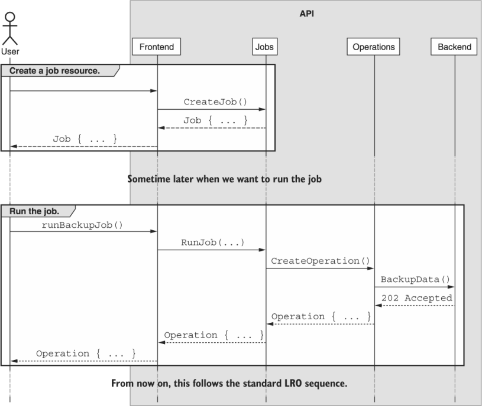
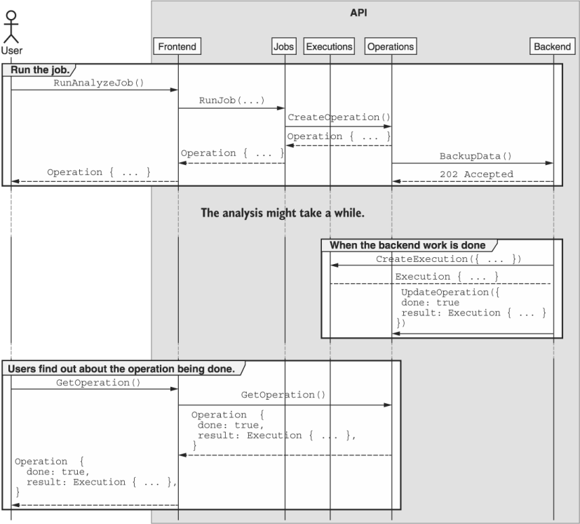

本章涵盖内容

- 什么是可重新运行的作业
- 可重新运行的作业与长时间运行的操作有何不同
- 如何将可重新运行的作业表示为资源
- 与返回 LRO 的自定义方法相比，支持可重新运行的作业的好处
- 如何用作业执行资源表示作业结果

很多情况下，API 需要公开一些重复运行的可定制功能； 但是，我们并不总是希望每次需要运行该功能时都需要提供该功能的所有详细信息。 此外，我们可能希望能够按由 API 服务器拥有和维护而不是由客户端调用的时间表来执行这块可配置的工作。 在这种模式中，我们探索了一个标准，用于定义可配置和可重新运行的特定工作单元，可能由在 API 中具有不同访问级别的用户使用。 我们还提供了一种模式来存储每个执行的输出。

## 11.1 动机
正如我们在第 10 章中学到的，有时我们会遇到 API 中的方法不能或不应该立即返回。拥有处理异步执行的能力显然非常有价值；但是，它仍然需要客户端通过调用 API 方法在某处触发调用。这对于那些只打算按需运行的方法很有效，但是有三种情况值得考虑，仅仅通过一个返回 LRO 的方法并不能完全解决。

首先，对于异步运行的典型自定义方法，每次调用都需要调用者提供该方法所需的所有相关配置。当该方法不需要太多配置时，这可能简单明了，但是随着配置参数的数量随着时间的推移而增加，每次调用都会提供相当多的信息。这使得源代码控制变得更加重要，因为追查存储在 Jim 笔记本电脑某处的配置参数中的错误可能会带来各种挑战。能够在 API 本身中存储这些配置参数可能是一个非常有用的功能。

其次，通过调用方法的按需模型，我们将两组权限混为一谈：运行方法的能力和选择调用该方法的参数的能力。通常这不是什么大问题，但同样，随着配置参数的复杂性随着时间的推移越来越复杂，我们可能希望将职责分为两组：那些可以配置方法应该如何调用的，以及那些可以配置方法的可以调用方法。当 API 用户开始将开发人员和运营人员区分为具有不同职责和权限的不同团队时，这一点变得尤为重要。正如你可能猜到的那样，强制执行诸如"用户 A 只能使用这些确切的配置参数调用此方法"之类的权限是很困难的。

最后，虽然按需运行方法已经让我们走了很长一段路，但很有可能最终我们希望能够以某种重复的时间表自动调用方法。并且即使设置客户端设备以按特定时间表进行这些各种 API 调用当然是可能的（例如: 使用基于 crontab 中的定义运行脚本的服务器），这引入了一个新的、可能有故障的子系统，负责这项工作的成功。相反，如果我们可以在 API 本身中配置调度，以便服务可以在没有外部参与的情况下为我们调用方法，那就简单多了。

我们可能应该为可配置作业定义一个标准，该标准可以存储各种配置参数并根据需要（可能按计划）重新运行。

## 11.2 概述
为了解决这三种情况，我们可以依靠一个简单但强大的概念：工作。 作业是一种特殊类型的资源，它将 API 方法的按需版本分为两部分。 当我们调用典型的 API 方法时，我们为要完成的工作提供配置，然后该方法使用该配置立即执行工作。 有了工作，这些就变成了两个不同的功能位。 首先，我们使用应该完成的工作的配置创建一个作业。 然后，稍后，我们可以通过调用 Job 资源上的自定义方法（称为"run"）来执行实际工作。 图 11.1 显示了一个 API 调用序列示例，概述了我们可能如何使用作业。



通过将工作分成两个独立的组件，我们为解决 11.1 节中描述的所有三个用例奠定了基础。首先，随着配置参数数量的增加，无需担心，因为我们只需要管理它们一次：当我们创建作业资源时。从那以后，我们不带任何参数调用 run 方法。其次，由于这是两种不同的 API 方法，我们可以控制谁可以访问哪些方法。很简单地说，特定用户可能有权执行预配置的作业，但不允许创建或修改作业。最后，这提供了一种简单的方法来处理未来作为 API 一部分的调度。与接受大量参数的复杂调度系统不同，我们可以简单地请求在特定调度中调用一个完全没有参数的 API 方法。

描述我们想要从工作中得到什么要容易得多，而要深入了解这些神奇工作的工作原理要复杂得多。在下一节中，我们将深入研究作业的细节以及使它们按预期运行所涉及的各种标准和自定义方法。

## 11.3 实现
为了为这些可重新运行的作业提供支持，我们需要实现两个关键组件：作业资源定义（具有所有相关的标准方法）和实际执行作业预期工作的自定义运行方法。让我们从定义 Job 资源的样子开始。

### 11.3.1 工作资源

作业基本上就像我们在 API 中处理的任何其他资源一样。就像其他资源一样，唯一真正需要的字段是唯一标识符，正如我们在第 6 章中学到的，理想情况下应该由 API 服务选择。然而，这种类型资源的基本目标是存储一堆配置参数，否则这些参数最终会作为返回 LRO 的方法的请求消息。

以我们聊天室 API 中备份方法的想法为例。支持此功能的按需方式是定义一个自定义方法来触发 ```ChatRoom``` 资源及其所有消息的备份。所有与如何创建备份相关的参数（例如: 数据应该在哪里结束以及它应该如何压缩或加密）都将在请求消息中。

清单 11.1 按需自定义备份方法

```typescript
abstract class ChatRoomApi {
  @post("/{id=chatRooms/*}:backup")
  BackupChatRoom(req: BackupChatRoomRequest):
    ➥ Operation<BackupChatRoomResponse,
                 BackupChatRoomMetadata>;       // ❶
}
 
interface BackupChatRoomRequest {
  id: string;                                   // ❷
  destination: string;                          // ❸
  compressionFormat: string;
  encryptionKey: string;
}
 
interface BackupChatRoomResponse {
  destination: string;                          // ❹
}
 
interface BackupChatRoomMetadata {
  messagesCounted: number;
  messagesProcessed: number;
  bytesWritten: number;
}
```

❶ 作为按需异步方法，我们返回一个带有标准响应接口结果类型的 LRO。
❷ 此标识符指的是正在备份的 ```ChatRoom``` 资源。
❸ 这些代表备份操作的不同配置参数。
❹ 响应只是指出备份数据在外部存储系统中的位置。
正如我们将在第 23 章中了解到的，这种方法肯定会奏效，并且会响应生成的备份位置。然而，正如我们在 11.1 节中所讨论的，这可能会带来各种问题。也许我们希望管理员能够触发备份操作，但我们不希望他们在时间之外以任何重要的方式选择加密密钥或配置操作的详细信息。或者，也许我们希望有一个调度服务负责触发备份，但我们希望能够单独配置重复行为，这意味着调度服务应该只触发备份并将所有配置方面留给其他人。

我们可以很容易地将这种按需 API 方法转换为可重新运行的作业资源：只需移动请求消息中提供的任何内容，并将这些字段视为 ```BackupChatRoomJob``` 资源上的可配置字段。

清单 11.2 用于备份聊天数据的作业资源

```typescript
interface BackupChatRoomJob {
  id: string;                  // ❶    
  chatRoom: string;            // ❶    
  destination: string;         // ❷
  compressionFormat: string;
}
```

❶ 请注意，这个新资源有一个标识符，我们将请求的标识符字段重命名为 ```chatRoom```，作为对将要备份的资源的引用。
❷ 请求消息中的所有其他字段也应位于 ```BackupChatRoomJob``` 资源中。
由于我们现在处理的是资源而不是返回 LRO 的按需 API 方法，因此我们需要支持标准方法的典型集合。 我们将在最终的 API 定义中详细介绍这些内容（请参阅第 11.3.4 节），但表 11.1 总结了我们应该实现的标准方法以及这样做的基本原理。

表 11.1 标准方法和每种方法的基本原理

|        标准方法         |               基本原理               |
| :---------------------: | :----------------------------------: |
|  GetBackupChatRoomJob   |   查看有关备份作业的配置详细信息。   |
| CreateBackupChatRoomJob |  创建一个新的可重新运行的备份作业。  |
| UpdateBackupChatRoomJob |   更新现有的可重新运行的备份作业。   |
| DeleteBackupChatRoomJob |   删除现有的可重新运行的备份作业。   |
| ListBackupChatRoomJobs  | 查看可用的可重新运行备份作业的列表。 |

正如我们在第 7 章中看到的，在某些情况下，API 服务可能会省略某些方法。在这种情况下，这些 ```BackupChatRoomJob``` 资源有可能被认为是不可变的。换句话说，这些资源被创建然后从不修改的情况并不少见。相反，用户可能会删除现有资源并创建一个新资源，以避免任何潜在的并发问题（例如: 如果我们更新作业时作业正在运行）。在这种情况下，省略标准更新方法当然是可以接受的。

此外，虽然按需方法返回了一个长时间运行的操作（因为它可能有大量工作要执行），但这些标准方法应该是即时和同步的。这是因为我们已经从这些方法中取出了实际工作，让它们专注于配置。在下一节中，我们将看看如何实际触发作业资源本身来完成我们使用这些标准方法配置的工作。

### 11.3.2 自定义运行方法
假设我们已经创建并预配置了一个 Job 资源，下一个难题是实际执行 Job 以便执行我们配置的工作。 为此，每个 Job 资源都应该有一个自定义的 run 方法来负责执行底层工作。 这个 run 方法不应该接受任何其他参数（毕竟，我们希望确保所有相关配置都作为 Job 资源的一部分持久化）并且应该返回一个 LRO，如第 10 章所示，最终解析为类似响应消息的内容 我们的按需定制方法。

清单 11.3 可重新运行的备份作业的自定义运行方法

```typescript
abstract class ChatRoomApi {
  @post("/{id=backupChatRoomJobs/*}:run")                   // ❶
  RunBackupChatRoomJob(req: RunBackupChatRoomJobRequest):
    Operation<RunBackupChatRoomJobResponse,
              RunBackupChatRoomJobMetadata>;                // ❷
}
 
interface RunBackupChatRoomJobRequest {
  id: string;                                               // ❸
}
 
interface RunBackupChatRoomJobResponse {                    // ❹
  destination: string;
}
 
interface RunBackupChatRoomJobMetadata {                    // ❹
  messagesCounted: number;
  messagesProcessed: number;
  bytesWritten: number;
}
```

❶ 自定义运行方法遵循第 9 章中讨论的标准。
❷ 由于工作量很大，我们可以立即返回一个 LRO。
❸ 在运行时不传入额外的配置是很重要的。
❹ 这些已重命名，但使用与按需自定义方法相同的字段。
如你所见，虽然大多数字段保持不变，但一些消息名称略有更改以适应这种新结构。例如: 我们有一个 ```RunBackupChatRoomJobResponse```，而不是 ```BackupChatRoomResponse``` 消息。同样重要的是要指出 ```RunBackupChatRoomJobRequest``` 只接受一个输入：要运行的作业资源的标识符。与作业本身的执行相关的任何其他信息都应存储在资源中，永远不要在执行时提供。

同样重要的是要注意，虽然这个例子有一个明确的输出，以响应的形式说明备份数据的目的地（可能是 ```s3:///backup-2020-01-01.bz2```），但许多其他可重新运行的作业可能不要遵循同样的模式。有些人可能通过修改其他预先存在的资源（例如: ```BatchArchiveChatRoomsJob```）或创建新资源（例如: 我们将在第 23 章中看到的 ```ImportChatRoomsJob```）来执行他们的工作。其他人可能仍然具有完全短暂的输出，产生某种并非旨在永久存储的分析。不幸的是，这些案例可能会因为一个重要原因而出现问题：LRO 资源的保留并非一成不变（参见第 13.3.10 节）。所以，我们能做些什么？

### 1.3.3 作业执行资源
在某些情况下，可重新运行的作业的结果不会对 API 产生任何持久影响。这意味着除了创建 LRO 资源外，调用作业的自定义 run 方法不会向 API 写入任何实际数据；不更新现有资源，不创建新资源，不向外部数据存储系统写入数据，什么都没有！

虽然这没有什么本质上的错误，但它导致我们有一个重要的依赖。突然间，无论 API 对 LRO 的持久性的政策如何，这项工作所完成的工作的持久性都受到了影响。而且，正如我们在 13.3.10 节中提到的，这个政策非常广泛。虽然它鼓励永久持久化并且从不删除任何记录，但没有什么可以阻止 API 使操作资源在一段时间后过期并消失。

由于我们可能希望为这些作业的输出制定一个与系统中所有 LRO 的持久性策略不同的持久性策略，因此我们有两个选择。首先是改变我们保留 LRO 资源多长时间的政策，以符合我们对这种特定类型工作的期望。第二个是让不同的操作在不同的时间到期（例如: 大多数操作会在 30 天后到期，但特定类型作业的操作会永远持续下去）。虽然第一个是合理的，虽然可能过度，但第二个会导致不一致和不可预测，最终意味着我们的 API 将更加混乱，可用性更低。那我们还能做什么呢？

第三种选择是依赖资源的子集合，它的行为有点像操作资源，称为执行。每个 ```Execution``` 资源将代表可以在这些不同作业资源上调用的自定义 run 方法的输出，并且与 LRO 不同，它们可以拥有自己的（通常是永久的）持久化策略。

例如: 让我们考虑一种分析方法，该方法查看聊天室并得出句子复杂性、消息的整体情绪以及聊天中是否存在辱骂性语言的评级。由于我们希望在循环的基础上运行它，我们希望此功能可用作可重新运行的作业实例，但显然此分析作业的结果不是现有资源或外部数据源。相反，我们必须定义一个执行资源来表示分析作业的单次运行的输出。

清单 11.4 用于分析聊天数据的示例执行资源

```typescript
interface AnalyzeChatRoomJobExecution {
  id: string;                           // ❶
  job: AnalyzeChatRoomJob;              // ❷
  sentenceComplexity: number;           // ❸
  sentiment: number;
  abuseScore: number;
}
```

❶ 由于这是一个适当的资源，它需要自己的唯一标识符。
❷ 为确保我们知道产生此执行的配置是什么，我们存储了 ```AnalyzeChatRoomJob``` 资源的快照。
❸ 所有得到的分析信息都存储在执行资源中。
现在，对自定义 run 方法的调用仍然会创建一个 ```Operation``` 资源来跟踪正在执行的作业的工作，但是一旦完成，而不是返回一个临时输出接口以供立即使用（例如: 带有情绪字段的东西）， API 将创建一个 ```AnalyzeChatRoomJobExecution``` 资源，LRO 将返回对该资源的引用。 这有点像异步标准创建方法最终返回 LRO 解析时创建的资源的方式。

清单 11.5 带有执行资源的自定义 run 方法的定义。

```typescript
abstract class ChatRoomApi {
  @post("/analyzeChatRoomJobs")                                // ❶
  CreateAnalyzeChatRoomJob(req: CreateAnalyzeChatRoomJob):
    AnalyzeChatRoomJob;
 
  @post("/{id=analyzeChatRoomJobs/*}:run")                     // ❷
  RunAnalyzeChatRoomJob(req: RunAnalyzeChatRoomJobRequest):
    Operation<AnalyzeChatRoomJobExecution, RunAnalyzeChatRoomJobMetadata>;
}
```

❶ 分析作业的标准创建方法
❷ 请注意，我们返回一个 ```Operation``` 资源，其结果类型为 ```Execution``` 资源。
如你所见，自定义运行方法与我们之前的备份示例几乎相同，但结果是执行资源而不是临时响应接口。 为了更清楚地看到这一点，图 11.2 显示了运行作业的过程以及 API 中应该发生的事情。



最后，由于这些执行是真正的资源，我们必须实现一些标准方法才能使它们有用。 在这种情况下，这些资源是不可变的，所以我们不需要实现标准的更新方法； 但是，它们也仅由内部流程创建（绝非由最终用户创建）。 因此，我们也不应该实现标准的 create 方法。 表 11.2 总结了我们执行所需的标准方法以及它们背后的基本原理。

表 11.2 标准方法的总结和每种方法的原理

|             标准方法              |         基本原理         |
| :-------------------------------: | :----------------------: |
|  GetAnalyzeChatRoomJobExecution   | 查看特定执行的详细信息。 |
| ListAnalyzeChatRoomJobExecutions  |    列出已发生的结果。    |
| DeleteAnalyzeChatRoomJobExecution |  （可选）删除特定执行。  |

最后一个问题是关于资源布局：这些执行应该位于资源层次结构中的哪个位置？ 与处理来自整个 API 的资源的 LRO 不同，执行被设计并限定为单一作业类型。 此外，由于我们想要问的最常见问题之一是"此特定作业发生了哪些执行？"，因此在该作业的上下文中确定执行范围是很有意义的。 换句话说，我们在执行之外寻找的行为表明这些资源的最佳位置是作为作业资源本身的子级。

### 11.3.4 API 最终定义

对于最终的 API 定义，清单 11.6 显示了用于分析聊天室消息的所有 API 方法和接口。 在这种情况下，输出依赖于执行资源来永久存储结果。

清单 11.6 最终 API 定义

```typescript
abstract class ChatRoomApi {
  @post("/analyzeChatRoomJobs")
  CreateAnalyzeChatRoomJob(req: CreateAnalyzeChatRoomJobRequest):
    AnalyzeChatRoomJob;
 
  @get("/analyzeChatRoomJobs")
  ListAnalyzeChatRoomJobs(req: ListAnalyzeChatRoomJobsRequest):
    ListAnalyzeChatRoomJobsResponse;
 
  @get("/{id=analyzeChatRoomJobs/*}")
  GetAnalyzeChatRoomJob(req: GetAnalyzeChatRoomJobRequest):
    AnalyzeChatRoomJob;
 
  @patch("/{resource.id=analyzeChatRoomJobs/*}")
  UpdateAnalyzeChatRoomJob(req: UpdateAnalyzeChatRoomJobRequest):
    AnalyzeChatRoomJob;
 
  @post("/{id=analyzeChatRoomJobs/*}:run")
  RunAnalyzeChatRoomJob(req: RunAnalyzeChatRoomJobRequest):
    Operation<AnalyzeChatRoomJobExecution, RunAnalyzeChatRoomJobMetadata>;
 
  @get("/{parent=analyzeChatRoomJobs/*}/executions")
  ListAnalyzeChatRoomJobExecutions(req
    ListAnalyzeChatRoomJobExecutionsRequest):
    ListAnalyzeChatRoomJobExecutionsResponse;
 
  @get("/{id=analyzeChatRoomJobs/*/executions/*}")
  GetAnalyzeChatRoomExecution(req: GetAnalyzeChatRoomExecutionRequest):
    AnalyzeChatRoomExecution;
}
 
interface AnalyzeChatRoomJob {
  id: string;
  chatRoom: string;
  destination: string;
  compressionFormat: string;
}
 
interface AnalyzeChatRoomJobExecution {
  id: string;
  job: AnalyzeChatRoomJob;
  sentenceComplexity: number;
  sentiment: number;
  abuseScore: number;
}
 
interface CreateAnalyzeChatRoomJobRequest {
  resource: AnalyzeChatRoomJob;
}
 
interface ListAnalyzeChatRoomJobsRequest {
  filter: string;
}
 
interface ListAnalyzeChatRoomJobsResponse {
  results: AnalyzeChatRoomJob[];
}
 
interface GetAnalyzeChatRoomJobRequest {
  id: string;
}
 
interface UpdateAnalyzeChatRoomJobRequest {
  resource: AnalyzeChatRoomJob;
  fieldMask: string;
}
 
interface RunAnalyzeChatRoomJobRequest {
  id: string;
}
 
interface RunAnalyzeChatRoomJobMetadata {
  messagesProcessed: number;
  messagesCounted: number;
}
 
interface ListAnalyzeChatRoomJobExecutionsRequest {
  parent: string;
  filter: string;
}
 
interface ListAnalyzeChatRoomJobExecutionsResponse {
  results: AnalyzeChatRoomJobExecution[];
}
 
interface GetAnalyzeChatRoomJobRequest {
  id: string;
}
```

## 11.4 权衡
正如我们所见，可重新运行的作业是一个非常有用的概念，但它们是解决问题集的众多解决方案之一。 例如: 如果我们关心配置与执行自定义方法的权限，我们可以实现一个更高级的权限系统，检查请求并验证给定用户不仅可以调用特定的 API 方法，而且可以使用 特定的参数集或范围。 这对于所有参与的人来说肯定是更多的工作，但与将方法分成两部分（配置和运行）相比，这是一个更精细的选择。

当涉及到执行资源时，我们当然有另一种选择，可以简单地将操作资源永久保留为输出的参考。 唯一的缺点是需要过滤操作资源列表以检索与感兴趣的作业资源相关的资源，但这绝对是一种替代方法。

## 11.5 练习

1. 可重新运行的作业如何区分执行操作的权限和配置该操作的权限？
2. 如果运行作业导致创建新资源，结果应该是执行还是新创建的资源？
3. 为什么不应该显式创建执行资源？

## 总结

- 可重新运行的作业是将能够配置任务的用户与能够执行相同任务的用户隔离开的好方法。
- 作业是首先创建和配置的资源。 稍后，可以使用自定义运行方法执行这些作业。
- 当作业不操作或创建现有资源时，正在运行的作业资源的结果通常是执行资源。
- 执行资源就像只读资源，可以列出和检索但不能显式更新或创建