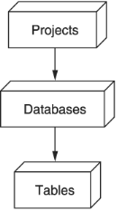
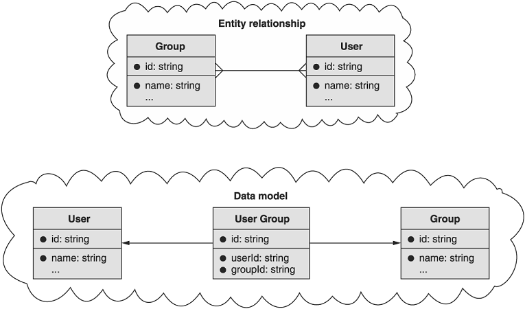

本章涵盖内容

- 如何处理关联资源的多对多关系
- 为关联资源选择什么名称
- 如何支持关联资源的标准方法
- 处理参照完整性的策略

在本章中，我们将探索一种模式，用于对两个资源之间的多对多关系进行建模，使用单独的关联资源来表示两者之间的联系。 这种模式允许消费者明确处理两个资源之间的单独关系，以及存储和管理关于该关系的额外元数据。

## 14.1 动机
大多数情况下，我们将在 API 中定义的资源之间的关系简单明了，因为它们本质上往往是单向的，充当从一个资源到另一个资源的指针或引用（例如: 数据库 1 属于项目 1 )，如图 14.1 所示。 当一种资源类型以这种方式引用另一种资源类型时，我们说它们具有一对多关系。 虽然这些类型的关系在设计 API 时通常很容易管理（通常只是一个引用其他资源的属性），但有时所需的关系更复杂，因此更难以用简单的方式表达 - 使用 API。



这些更复杂的关系中最常见的一种类型是多对多关系，其中资源类型彼此关联，而不仅仅是指向另一个。例如: 让我们想象一个场景，我们需要跟踪人员（用户）和他们所属的各个组（组）。这些用户可能是许多不同组的成员，显然，组由许多不同的用户组成。此外，可能有一些关于我们想要跟踪的关系本身的特定信息。例如: 也许我们想要存储用户加入群组的确切时间或他们在群组中可能担任的特定角色。

虽然这些多对多关系在大多数关系数据库中都有标准的规范表示（依赖于连接表或链接表，其中包含负责跟踪两种类型实例之间关联的行），但并不总是清楚如何我们在 API 中公开了这个概念。此模式的目标是概述一种特定方式，我们可以通过这种方式将这些连接表中的行公开为单独的资源，这些资源代表 API 中两个资源之间的关联。

## 14.2 概述
如前所述，存储多对多关系的最常用方法，尤其是在关系数据库中，是使用带有表示两个资源之间关系的行的连接表。 例如: 我们可能有一个 ```User``` 资源表，另一个 ```Group``` 资源表，然后是一个将这两个资源映射在一起的表（例如 ```UserGroup``` 资源），如图 14.2 所示。 因此，通过 API 呈现这些资源及其关系的一种明显方法是将所有表公开为资源。 在这种情况下，数据库模式实际上与 API 表面一一对应，因此我们将定义一个由三个资源组成的 API：```User```、```Group``` 和 ```UserGroup```（映射或关联资源）。



这引出了一个显而易见的问题：这是如何工作的？在高层次上，我们可以依靠关联资源来完成大部分繁重的工作。由于关系由实际资源表示，因此它的创建和删除与其他任何资源一样。在这个例子中，创建一个 ```UserGroup``` 资源代表某人加入一个组，删除一个代表某人离开一个组。此外，我们始终可以通过使用其标识符（例如 ```GetUserGroup```）检索特定关联来查看特定关联，并且我们可以通过基于其父项（例如 ```ListUserGroups```）检索集合来列出所有关联。要仅查看特定关联（例如: 属于单个组或单个用户的关联），我们可以在列出时应用过滤器。

最后，使用关联资源最强大的方面是能够存储有关关系本身的元数据。例如: 我们可以存储额外的信息，例如他们何时加入或他们可能拥有什么角色（例如: 管理员），而不是简单地存储用户已加入特定组的信息。这是检索 ```UserGroup``` 资源有意义的主要原因：我们可能想了解有关关系本身的更多详细信息。

### 14.2.1 关联别名方法

有时，关联资源对一个或两个关联资源具有所有权。换句话说，将组视为包含用户列表似乎很自然。同样，将用户视为许多不同组的成员似乎很自然。此外，在这两种情况下，很自然地要问我们 API 的这两个问题，例如: "这个用户属于哪些组？"和"这个组中有哪些用户？"

虽然我们已经注意到我们可以简单地使用适当的过滤器请求列出关联，通常在面向资源的 API 中，消费者希望能够以更直接的方式思考关系，因此，有时它是有意义的为这些类型的常见问题提供方便的别名。为了表达关联资源的这种自然对齐，我们可以选择在每个关联资源下为一个子集合添加别名，以便我们可以使用单个未过滤的请求来询问这些问题。稍后我们将更详细地探讨这一点，但现在可以说这里的策略是依靠别名来提供询问有关多对多关系的常见问题的便利。

## 14.3 实现

现在我们了解了这种模式的高级策略，让我们更仔细地看看它是如何工作的以及我们如何实现它的细节。让我们从命名开始。

### 14.3.1 命名关联资源

在我们可以做任何其他事情之前，我们首先必须为关联资源选择一个名称。在某些情况下，根据应用程序本身的上下文，这可能是显而易见的。例如: 在允许学生注册课程的学校的 API 中，关联资源可能称为 ```CourseRegistration``` 或 ```CourseEnrollment```。

其他时候，这个名字可能更难找到。例如: 在同一个 API 中，存储教师列表（以及助理、实验室助理等）之间的关联在技术上不是注册或注册，因此我们一直在寻找替代方案。处理这个问题的一个常见选择是使用诸如 ```Membership``` 或 ```Association``` 之类的东西和一些修饰符来阐明被加入的两个资源中的至少一个（例如: ```CourseMembership```）。在某些情况下，例如用户加入群组或俱乐部时，我们可能只是将关联称为 ```Membership```，而没有额外的修饰符，但这在上下文中总是有意义的。

一旦我们有了资源的名称，我们就可以开始研究如何实现与其交互的各种方式。

### 14.3.2 标准方法行为

对于每个关联资源，我们至少需要实现一些标准方法。正如我们在表 14.1 中看到的，我们当然需要 ```create``` 和 ```delete``` 标准方法，并且在关联资源保存元数据的常见场景中（即，当我们关心有关关系的额外信息时），我们需要 get并更新标准方法。最后，我们需要 list 方法来浏览各种成员资格。所有这些方法都应该完全符合标准方法，考虑到成员资格像任何其他资源一样表示，这应该很容易。

表 14.1 关联资源的标准方法总结

| 标准方法 |         行为         |    必需的？    |
| :------: | :------------------: | :------------: |
|  Create  |     加入两个资源     |      Yes       |
|   Get    | 显示有关关系的元数据 | 仅当有元数据时 |
|   List   |  列出资源之间的关联  |      Yes       |
|  Update  | 更新有关关系的元数据 | 仅当有元数据时 |
|  Delete  |  移除资源之间的关联  |      Yes       |

在我们继续之前，重要的是要注意其他资源的标准方法实现中可能不存在的一项额外要求：唯一性约束。

### 14.3.3 唯一性

与大多数资源不同，关联资源往往有一个我们必须应用的非常重要的唯一性约束：应该只有一个关联资源代表被关联的两个资源。换句话说，我们通常希望确定一个用户只是一个组的成员一次。为了实现这一点，在创建关联资源时对 API 有一个新的验证要求。

通常，当有问题的资源是使用已存在的标识符创建时，我们只会返回资源冲突错误（HTTP 代码 409 冲突）。然而，在这种情况下，如果被关联的两个资源不同，则关联资源仅从根本上区别于另一个。简而言之，清单 14.1 中的示例，我们尝试将用户添加到同一个组两次，应该会失败，因为它创建了一个冲突资源。

清单 14.1 关联导致冲突错误的相同数据

```typescript
let membershipData = { userId: "Jimmy", groupId: "2" };
let membership1 = CreateMembership(membershipData);       // ❶
let membership2 = CreateMembership(membershipData);       // ❷
```

❶ 首先，我们将 Jimmy 添加到第 2 组。这应该会成功。
❷ Jimmy 已经是组 2 的成员，所以这个请求应该会失败并返回 ```409 Conflict HTTP``` 错误。
接下来，让我们看看更新关联资源可能与我们过去看到的略有不同。

### 14.3.4 只读字段

虽然有关关系的元数据可能会不时更改，但关联的资源在资源的生命周期内不应更改。换句话说，当我们有一个资源代表一个用户加入一个组时，我们不应该能够改变它来使这个相同的资源代表一个不同的用户加入这个组（或同一个用户加入一个不同的组）。相反，在这种情况下，我们应该简单地删除旧的关联资源并创建一个单独的资源来表示新的用户组关联。

这就引出了一个问题，当消费者尝试进行这种类型的更改时，它是否应该导致错误或无声失败。在这种情况下，两个交叉引用字段（用户和组字段）应仅被视为输出，因此无论何时在更新请求期间指定，都应被忽略。

清单 14.2 在更新时忽略只读字段

```typescript
let membership1 = CreateMembership({    // ❶
  userId: "Jimmy",
  groupId: "2",
  role: "admin" });
 
UpdateMembership({                      // ❷
  id: membership1.id,
  userId: "Sally",
  role: "user"
};
```

❶ 在这里，我们将 Jimmy 添加到第 2 组的管理角色中。
❷ 当我们尝试将用户更改为 Sally 并将角色更改为普通用户时，只会更新角色。这个请求只会让 Jimmy 成为第 2 组的普通用户，而对 Sally 没有任何帮助。
现在我们已经了解了标准方法以及它们应该如何处理关联资源，让我们来看看我们可能实现的一些可选的便利方法来覆盖常见的消费者场景。

### 14.3.5 关联别名方法

正如我们之前所讨论的，我们可能想问的最常见问题之一是哪些资源与哪些其他资源相关联。例如: 我们想快速询问，"Jimmy 是哪些组的成员？"或"第 2 组中有哪些成员？"虽然使用应用于 ```ListMembershipsRequest``` 的特定过滤器完全可以做到这一点，但我们可以通过提供回答这两个特定问题的别名方法来简化这些常见查询。

清单 14.3 使用过滤器列出关联

```typescript
memberships = ListMemberships({ filter: "groupId: 2" });   // ❶
usersInGroup2 = memberships.map(                           // ❷
  (membership) => membership.user );
 
memberships = ListMemberships({                            // ❸
  filter: "userId: Jimmy" });
jimmysGroups = memberships.map(                            // ❹
  (membership) => membership.groupId );
```

❶ 这里我们构造了一个 ```ListMembershipsRequest```，它只返回第 2 组的那些。
❷ 要获取属于组 2 成员的用户，我们只需从每个成员中获取用户字段。
❸ 这里我们构造了一个 ```ListMembershipsRequest```，它只返回那些以 Jimmy 为用户的人。
❹ 要查看 Jimmy 所属的组，我们只需从每个成员中获取组字段。
虽然这确实有效，但制定专门针对这些用例的方法可能是有意义的。 我们可以通过为我们想要执行的查询创建具有隐含（和必需）过滤器参数的别名方法来做到这一点。 在成员关联资源加入的用户和组资源的示例中，我们可能有两个别名，如表 14.2 所示。

表14.2 关联资源常见查询别名

| 问题                | 带过滤器的列表                                         | 自定义方法                                    |
| :------------------ | ------------------------------------------------------ | :-------------------------------------------- |
| 吉米在哪些组？      | ListMemberships({<br/>  filter: "userId: Jimmy"<br/>}) | ListUserGroups({<br/>  userId: "Jimmy"<br/>}) |
| 组 2 中有哪些用户？ | ListMemberships( {<br/>  filter: "groupId: 2"<br/>})   | ListGroupUsers({<br/>  groupId: 2<br/>})      |

命名可能有点混乱，所以请记住名称的第一个（单数）部分是拥有资源，第二个（复数）部分是列出的内容。因此，在列出 ```UserGroups``` 时，我们正在查看给定用户的组，而在列出 ```GroupUsers``` 时，我们正在查看给定组的用户。

### 14.3.6 参照完整性

正如我们在第 13 章中看到的，API 中的引用完整性是指当我们引用另一个资源时，我们需要考虑该引用是否有效。例如: 如果我们删除一个仍然被其他资源指向的资源会发生什么？更具体地说，如果我们有一个将两个资源联系在一起的关联资源，我们如何处理会删除关联资源之一的请求？

在这样的场景中，我们有一些不同的选项，由大多数现代关系数据库提供和标准化，并在表 14.3 中进行了总结。

表 14.3 参照完整性行为总结

| 选项       | 行为                                       |
| ---------- | ------------------------------------------ |
| 级联       | 删除指向已删除资源的所有其他资源。         |
| 严格       | 防止删除其他人仍然指向的任何资源。         |
| 设置为空   | 任何指向被删除资源的指针都设置为空。       |
| 什么都不做 | 删除资源对指针没有任何作用，并使它们无效。 |

虽然选择这些选项的原因有很多，但在处理关联资源的情况下，API 通常应该选择限制删除，而其他资源仍然指向该资源，或者干脆什么都不做，让关联资源的引用变为无效.如果我们改为选择级联或将指针设置为空，则有可能触发写入的狂潮以将值设置为空（例如: 有 100 亿个资源指向正在删除的资源）或雪崩删除（例如: 如果一个删除触发另一个，则触发另一个，然后继续）。简而言之，这意味着如果我们要尝试删除一个有关联资源引用的资源，我们要么返回前提失败错误（HTTP 代码 412），要么简单地删除该资源并将关联资源保留为悬空指针稍后由消费者处理。

### 14.3.7 API 最终定义

最后，是时候看一个完整的示例，为 ```User```、```Group``` 和 ```Membership``` 资源的关联资源定义 API。

清单 14.4 使用关联资源的最终 API 定义

```typescript
abstract class GroupApi {
  static version = "v1";
  static title = "Group API";
 
  // ... Other methods left out for brevity.
 
  @post("/memberships")
  CreateMembership(req: CreateMembershipRequest): Membership;
 
  @get("/{id=memberships/*}")
  GetMembership(req: GetMembershipRequest): Membership;
 
  @patch("/{resource.id=memberships/*}")
  UpdateMembership(req: UpdateMembershipRequest): Membership;
 
  @delete("/{id=memberships/*}")
  DeleteMembership(req: DeleteMembershipRequest): void;
 
  @get("/memberships")
  ListMemberships(req: ListMembershipsRequest): ListMembershipsResponse;
 
  @get("/{groupId=groups/*}/users")                                    // ❶
  ListGroupUsers(req: ListGroupUsersRequest): ListGroupUsersResponse;
 
  @get("/{userId=users/*}/groups")                                     // ❷
  ListUserGroups(req: ListUserGroupsRequest): ListUserGroupsResponse;
}
 
interface Group {
  id: string;
  userCount: number;
  // ...                                                               // ❸
}
 
interface User {
  id: string;
  emailAddress: string;
  // ...                                                               // ❹
}
interface Membership {                                                 // ❺
  id: string;
  groupId: string;                                                     // ❻
  userId: string;
  role: string;                                                        // ❼
  expireTime: DateTime;
}
 
interface ListMembershipsRequest {
  parent: string;
  maxPageSize: number;
  pageToken: string;
}
 
interface ListMembershipsResponse {
  results: Membership[];
  nextPageToken: string;
}
 
interface CreateMembershipRequest {
  resource: Membership;                                                // ❽
}
 
interface GetMembershipRequest {
  id: string;
}
 
interface UpdateMembershipRequest {
  resource: Membership;
  fieldMask: FieldMask;
}
 
interface DeleteMembershipRequest {
  id: string;
}
 
// Optional from here on.
 
interface ListUserGroupsRequest {
  userId: string;
  maxPageSize: number;
  pageToken: string;
}
 
interface ListUserGroupsResponse {
  results: Group[];
  nextPageToken: string;
}
 
interface ListGroupUsersRequest {
  groupId: string;
  maxPageSize: number;
  pageToken: string;
}
 
interface ListGroupUsersResponse {
  results: User[];
  nextPageToken: string;
}
```

❶ 可选别名，用于列出组中的用户
❷ 可选别名，用于列出用户所属的组
❸ 请注意，我们没有在此处内联用户列表。要查看组的成员，我们只需列出带有单个组过滤器的成员资格或依赖别名子集合 (```ListGroupUsers```)。
❹ 请注意，我们没有在此处内联组。要查看用户所属的组，我们只需列出带有单个用户过滤器的成员资格或依赖别名子集合 (```ListUserGroups```)。
❺ 注意这里我们选择的名称是```Membership```，作为用户到群组的关联资源。
❻ 在这里，我们存储对用户和相关组的引用，而不是资源的完整副本。
❼ 其余字段是关于关联的额外元数据。
❽ 请注意，这里没有父资源，因为会员资源是顶级资源。
现在我们已经了解了这三个选项中的每一个是如何工作的，让我们停下来看看我们在使用这种模式时会丢失的一些东西。

## 14.4 权衡
当使用关联资源来表示多对多关系时，你可以最自由地设计有关该关系如何工作的所有细节，但它有一些缺点。

### 14.4.1 复杂性

为了换取极高的灵活性，我们付出了稍微复杂的界面的代价，有时可能会感觉不直观。例如: 当我们希望用户加入一个组时，我们使用标准的 ```create``` 方法来创建新成员，而不是调用 ```JoinGroup``` 方法。

此外，我们有一个额外的关联资源需要考虑，这意味着更大的 API 表面，因为 API 现在每个关联都有一个额外的资源和多达七个额外的方法需要考虑（五个用于标准方法和两个可选的别名方法）。通常，这些方法易于学习和理解，因此值得额外的认知负担；然而，值得指出的是，还有更多的东西需要学习。

### 14.4.2 协会分离

在使用关联资源时，即使我们可以提供别名方法来更容易地询问有关资源关系的问题，但我们仍然将两个资源之间的关联与每个资源的信息分开处理。例如: 一个组的描述和一个组的成员列表都被认为是关于该组的信息；然而，我们以两种截然不同的方式检索它们。获取组描述将使用 ```GetGroup()``` 方法，而查找组的所有成员可能使用 ```ListGroupUsers()``` 别名方法。

正如我们所了解到的，这是有充分理由的（用户列表可能会变得非常大），但这确实意味着这两件事是分开的，尽管两者都与相关组的性质密切相关。

## 14.5 练习
1. 设计一个 API，用于将用户与他们可能已加入的聊天室相关联，并存储他们加入的角色和时间。
2. 在聊天应用程序中，用户可能会多次离开和加入同一个房间。 你将如何对 API 进行建模，以便在保持该历史记录的同时确保用户不能在同一聊天室中同时出现多个状态？

## 总结

- 多对多关系是指两个资源各自拥有多个其他资源。 例如: 一个用户可能是许多组的成员，而一个组有许多用户作为成员。
- 我们可以使用关联资源作为建模 API 中资源之间多对多关系的一种方式。
- 关联资源是表示两个资源之间关系的最灵活的方式。
- 我们可以使用这些关联资源来存储关于两个资源之间关系的额外元数据。