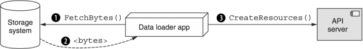
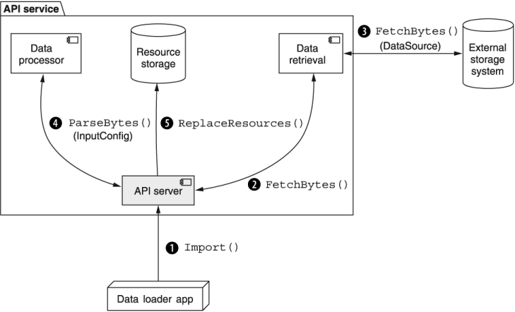

本章涵盖内容

- 导入导出的具体定义
- 直接与远程存储系统交互
- 将序列化字节转换为 API 资源
- 处理导出易失性数据集的一致性
- 导入和导出时应如何处理唯一标识符
- 相关资源被导入或导出怎么办
- 处理导入或导出操作期间的故障
- 导入和导出与备份和还原有何不同
- 过滤输入和输出数据上的数据

在此模式中，我们将探索如何通过自定义导入和导出方法安全灵活地将资源移入和移出 API。更重要的是，这种模式依赖于 API 直接与外部存储系统通信，而不是通过中间客户端。我们将通过定义几个松散耦合的配置结构来完成所有这些工作，以涵盖这些资源在 API 和底层存储系统之间的旅程的各个方面，最大限度地提高灵活性和可重用性。

## 23.1 动机
在管理用户提供的数据的任何 API（几乎是所有 API）中，我们已经定义了几种方法来获取和获取系统资源。其中一些工作在单个资源上（例如: 全套标准方法），而另一些则在它们的组上运行（例如: 批处理方法组），但所有这些都有一个重要的共同点：数据总是直接从 API 服务传输回客户端。

让我们考虑一下我们想要加载到 API 中的一些序列化数据的情况，例如要在 ```ChatRoom``` 资源中创建的一堆 ```Message``` 资源。一种方法是编写一个应用服务器，从存储系统中检索数据，将序列化的字节解析为实际资源，然后使用传统方法在 API 中创建新资源。虽然这可能不方便，但它肯定会完成工作。

该计划的一个关键方面可能会成为问题：数据需要采用的路线。在这种情况下，数据必须走很长的路，从存储系统到执行加载的应用程序代码，最后到 API，如图 23.1 所示。



如果数据恰好与应用服务器在同一台机器上（甚至附近），这并不是一个可怕的提议。但如果基础设施安排不那么友好呢？例如: 如果数据和 API 住在附近，但不允许应用服务器住在附近怎么办？这意味着加载数据的自定义函数会将整个数据集一直传输到应用程序服务器，然后一直传输回 API 服务器。这有点像每次你需要一杯牛奶时去商店，而不是买一个纸箱并把它放在冰箱里：两者都消耗能量，但一个效率更高。

这个问题也适用于在另一个方向流动的数据。如果我们不想将新资源加载到系统中，而是希望将现有资源从系统中取出，那么使用自定义代码来执行此操作需要通过此中间应用程序服务器的数据流。随着两种情况下数据量的增长（正如如今的数据趋势），这个问题只会变得更糟。

因此，在 API 和远程存储系统之间直接进行数据流是很有必要的。它不仅可以最大限度地减少用户需要编写的自定义代码量，还可以减少浪费的带宽和将数据从一个地方获取到另一个地方所需的用户管理的计算资源。在下一节中，我们将概述这种低效流程的解决方案。

## 23.2 概述
在这种模式中，我们将依赖两种特殊的自定义方法来将资源移入和移出 API：导入和导出，如图 23.2 所示。 由于总体目标是允许 API 直接与外部存储系统交互，因此这些方法中的每一种都将承担在 API 服务和存储系统之间传输所有数据的责任。 此外，由于任何外部存储系统不太可能以与任何 API 服务完全相同的方式存储数据，因此这些方法还需要承担将 API 资源转换为存储系统理解的原始字节（反之亦然）的责任。



问题出现在这两个配置方面的多样性上。那里有大量的存储系统，因此我们必须以这样一种方式构建这些自定义方法的请求消息，以便我们可以在 API 用户需要时轻松引入新的请求消息。此外，还有大量不同的序列化格式可用，可用于将 API 资源转换为原始字节，因此请求结构足够灵活以支持当今存在的任何一种格式很重要，而且还可以扩展以支持任何未来可能会出现的新的。

如果这还不够复杂，在将数据序列化为一堆字节后，可能需要执行进一步的转换。例如: 数据在存储到磁盘之前被压缩或加密并不罕见。由于这些自定义方法必须直接与外部存储系统通信，因此它们还负责允许 API 服务的用户配置这些附加参数。

为了使所有这些工作，我们将依赖一个总体配置界面作为导入和导出自定义方法的主要输入。这些配置接口（用于导入的 ```InputConfig``` 和用于导出的 ```OutputConfig```）负责存储所有相关信息，用于在资源和字节之间转换数据以及将这些字节传输到外部存储系统或从外部存储系统传输这些字节。

由于存储系统的数量巨大，变化很大，并且不断变化，我们将依赖于结构，使我们能够将数据传输的配置与数据转换的配置分开并独立。换句话说，我们将如何访问外部存储的配置与如何序列化 API 资源或反序列化原始字节的配置分开。为此，我们将使用通用的 ```DataSource``` 和 ```DataDestination``` 接口，这样每个扩展接口都将包含将字节传输到预期源或目标或从预期源或目标传输出所需的所有配置。

一旦我们解决了结构问题并决定如何安排所有这些配置细节，我们就需要回答一些复杂的问题来回答每个自定义方法的行为。例如: 我们如何处理失败并决定重试请求是否安全？数据的底层一致性如何？当我们导出数据时，我们是否对数据进行完整快照并导出，还是允许它是涂抹？同样，当我们导入数据时，新资源如何与现有资源交互？我们如何处理标识符冲突？在导出数据之前应该剥离这些吗？

在下一节中，我们将更详细地探讨这些行为问题以及所有结构性问题。

## 23.3 实现

现在我们已经概述了高级问题，是时候开始深入研究细节了。我们先来看看自定义的导入和导出方法本身，然后我们将探索它们各自的请求接口是如何构建的。

### 23.3.1 导入导出方法

由于我们的目标是直接从外部存储系统导入和导出数据，因此我们需要做的第一件事是定义自定义导入和导出方法，以管理这些操作的所有复杂性。尽管我们一直在笼统地讨论这些方法，但重要的是要注意这些自定义方法，就像我们在第 9 章中看到的那样，将锚定到 API 中的特定资源。换句话说，每个自定义导入或导出方法将负责单个资源类型（例如: ```ImportMessages``` 或 ```ExportMessages```）。

关于这些方法的下一个（可能很明显）值得强调的属性是返回类型。正如我们在第 10 章中了解到的，当 API 方法不是即时的或可能需要一段时间时，最好让这些返回一个承诺以完成实际工作。虽然这些自定义方法可能会相对较快地完成，但它们冒着花费大量时间的风险，因此，绝对符合返回 LRO 和最终结果而不是同步结果的准则。

通过将这两个部分放在一起并遵循第 9 章的其他指导，我们可以很容易地想出两个示例方法来将 ```Message``` 资源导入给定的 ```ChatRoom``` 资源。

清单 23.1 自定义导入和导出方法的示例

```typescript
abstract class ChatRoomApi {
  @post("/{parent=chatRooms/*}/messages:export")   // ❶
  ExportMessages(req: ExportMessagesRequest):
    Operation<ExportMessagesResponse, ExportMessagesMetadata>;
 
  @post("/{parent=chatRooms/*}/messages:import")   // ❶    
  ImportMessages(req: ImportMessagesRequest):
    Operation<ImportMessagesResponse, ImportMessagesMetadata>;
}
```

❶ 我们将许多资源导入到属于父资源的集合中。
同样重要的是要注意，这两个自定义方法专注于将多个资源导入到一个集合中，但这并不是唯一可用的选项。 我们可能还想导入不是由一组 API 资源表示的数据，而是许多数据点，这些数据点在导入后可以单独寻址。 例如: 如果我们的聊天 API 包含一个用奇特的机器学习算法训练的虚拟助手，我们可能有办法将训练数据点导入单个 ```VirtualAssistant``` 资源，从而生成自定义方法。

清单 23.2 将不可寻址数据点导入资源的示例

```typescript
abstract class ChatRoomApi {
  @post("/{id=virtualAssistants/*}:importTrainingData")   // ❶
  ImportTrainingData(req: ImportTrainingDataRequest):
    Operation<ImportTrainingDataResponse, ImportTrainingDataMetadata>;
}
```

❶我们可能将不可寻址的数据导入到特定资源中，而不是导入到集合中。
正如我们所见，这些是非常普通的自定义方法，它们返回最终会解析为标准响应的 LRO。正如我们将在下一节中学到的，困难的部分是我们应该如何构建请求方法。

### 23.3.2 与存储系统交互
由于连接到外部存储系统是我们导入和导出数据设计的关键组成部分，因此我们需要一个地方来放置每个这些存储系统的所有可能的配置选项才有意义。通常，将所有不同的配置选项简单地放在一起可能很诱人，这样你就有一个能够与所有存储系统进行通信的单一配置模式。然后，当我们需要添加对新的支持时，我们可能只是在此配置界面中添加一些新字段并收工。

除了相当混乱之外，这种设计还有问题，因为它会导致相当多的混乱。首先，当我们有一个单一的界面，并且有大量的选项并排在一起时，决定在什么情况下需要哪些选项会变得很有挑战性。这导致 API 服务器由于缺少数据源或目标的配置而拒绝各种导入或导出请求，从而导致不必要的来回切换。

其次，当我们继续向扁平结构添加越来越多的配置选项时，我们的下一个诱惑是重用接口上的现有字段，以便它们可能适用于多个不同的存储系统。换句话说，我们可能只有一个密码字段，而不是将 ```sambaPassword``` 字段与 ```s3secretKey``` 字段一起使用，并尝试将其用于 Amazon Web Services 发布的 S3 密钥以及特定用户的密码Samba 网络共享。这起初看起来是个好主意，但当一个字段用于多个目的时会导致更多的混乱，仅仅因为它碰巧有一个相似的名字。

一个更直接的解决方案是拥有一个单一的多态字段，然后为每个不同的存储系统提供特定的接口。换句话说，我们可能有一个 ```S3DataSource``` 用于从 Amazon 的 Simple Storage Service 加载数据以及一个 ```SambaDataSource```，它能够与 Samba 网络共享进行交互。

清单 23.3 使用 S3 作为数据源的示例

```typescript
interface DataSource {
  type: string;                               // ❶
}
 
interface S3DataSource extends DataSource {   // ❷
  type: 's3';                                 // ❶    
  bucket: string; 
  glob: string;                               // ❸
}
```

❶ 类型是最终接口的静态字符串，带有存储系统的标识符。
❷ 特定的 ```DataSource``` 接口扩展了基础。
❸ 在这里，我们存储匹配对象的 glob 表达式（例如: ```archive-*.gzip```）作为数据源。
同样的模式适用于作为数据流出 API 的目的地的存储服务，从而为 API 带来模块化、可重用的概念，以便在导入或导出各种资源时可以重用与外部存储系统的连接。但这引出了一个有趣的问题：如果这些接口只是关于如何连接到存储系统，为什么我们需要单独的数据读取接口而不是数据写入接口？

虽然这两个概念密切相关（毕竟，它们都是关于与外部存储系统交互和传输数据），但它们并不完全相同。例如: 当我们使用 Amazon 的 S3 作为数据源时，我们希望应用一种模式（在本例中为 [glob 表达式](https://en.wikipedia.org/wiki/Glob)）来选择哪些 S3 对象（就像磁盘上的文件一样）来检索。另一方面，在导出数据时，我们更有可能拥有单个输出文件或多个不同的文件，但它们都放置在同一目录中（在 S3 中，通过使用文件名的前缀来表示，例如 ```export/2020/```）。

清单 23.4 使用 S3 作为数据目的地的示例

```typescript
interface DataDestination {
  type: string;
}
 
interface S3DataDestination extends DataDestination {
  type: 's3';
  bucket: string;
  prefix: string;     // ❶
}
```

❶ 在这种情况下，我们有一个前缀来确定写入对象的命名方式，而不是 glob 表达式。
换句话说，虽然这两个概念非常相似，但它们并不相同，也不代表相同的事物。可能有许多重叠的字段，但这是设计使两个接口独立更改。这种松散耦合是一种即使在面临巨大波动的情况下也能保持灵活性的设计类型。

现在我们有一种方法来配置 API 应该从外部存储系统检索字节（或发送字节到）外部存储系统的方式，我们可以进入下一部分：弄清楚如何在 API 资源和这些字节之间进行转换。

### 23.3.3 资源和字节之间的转换
有趣的是，根据构建 Web API 的本质，我们已经有一种机制可以将底层 API 资源转换为序列化的字节块。通常这依赖于像 JSON 这样的格式；但是，每个 API 都需要一种通过 Internet 发送数据的方法，因此必须有一种为用户序列化数据的方法。虽然这种预先存在的机制会派上用场，但序列化大量资源以进行导出（或反序列化以进行导入）并不完全相同。例如: 我们可能使用 JSON 来序列化单个资源，但在导出数据时，我们可能依赖于修改后的格式（例如: 以新行分隔的 JSON 而不是资源的 JSON 数组）或完全不同的格式（例如: CSV 或 TSV带有标题行）。我们不会详细介绍资源序列化的所有细节，但是清单 23.5 中显示了将一些 Message 资源序列化为 CSV 的示例。 （如果你想知道为什么缺少标识符，请查看第 23.3.5 节。）

清单 23.5 示例 CSV 序列化消息资源

```csv
sender, type, content           // ❶
"users/1", "text", "hi"         // ❷
"users/2", "text", "hi back"
```

❶ 在导出为 CSV 的数据中，第一行通常是定义列的标题行。
❷ 每行存储要导入的字段。
此外，即使在我们序列化了数据之后，我们可能还希望在将其存储以进行导出之前执行进一步的转换（在另一个方向上也类似）。这可能像使用用户提供的密钥压缩或加密数据一样简单，也可能比这更复杂一些，例如将数据分成几个不同的文件以存储在外部存储服务上。

不管我们想对数据做什么，我们当然需要一个地方来放置所有这些配置，为此我们将使用 ```InputConfig``` 接口（或用于导出数据的 ```OutputConfig``` 接口）。就像自定义的导入和导出方法一样，这些接口将基于每个资源，导致类似 ```MessageInputConfig``` 的接口。

清单 23.6 Message 资源的示例输入和输出配置

```typescript
interface MessageInputConfig {           // ❶    
  // The content type of the input.
  // Choices: "json", "csv", undefined (auto-detected)
  contentType?: string;
 
  // Choices: "zip", "bz2", undefined (not compressed)
  compressionFormat?: string;
}
 
interface MessageOutputConfig {          // ❶
  // The content type for serialization.
  // Choices: "json", "csv", undefined for default.
  contentType?: string;
 
  // Use ${number} for a zero-padded file ID number.
  // Content type will be appended with file extension (e.g., ".json").
  // Default: "messages-part-${number}"
  filenameTemplate?: string;
 
  maxFileSizeMb?: number;
 
  // Choices: "zip", "bz2", undefined (not compressed)
  compressionFormat?: string;
}
```

❶ 这两者非常相似但不完全相同，因为它们具有不同的职责。
希望这一切看起来都很无聊和无害。真正的价值不在于用于导入和导出数据的特定配置参数，而在于检索原始数据与处理该数据的关注点分离。这种松散耦合确保我们可以重用数据源和目的地，以跨 API 导入和导出各种资源类型。

现在我们已经涵盖了结构方面，让我们换个角度开始深入研究这种模式的行为细微差别，从我们应该如何解决 API 中的底层资源一致性开始。

### 23.3.4 一致性

在导出数据时，我们显然需要阅读用于导出的整个资源集合。尽管我们希望我们可以立即读取任意数量的资源，但通常只有在资源数量足够少的情况下才会如此。对于可能更大的集合，读取所有数据显然需要一些非零时间。这本身不一定有问题，但不能保证此导出操作将具有对系统的独占访问权限。这就引出了一个重要的问题：对于在出口操作过程中可能发生变化的资源，我们应该怎么做？

有两个简单的选项可以解决这个问题。一种是依赖底层资源存储系统提供的快照或事务能力。例如: 我们可能会在特定时间点读取所有资源，以确保我们对要导出的资源集合有一致的了解。如果我们这样做，在导出操作运行时同时进行的任何更改都不会反映在导出的数据中。

不幸的是，并非所有存储系统都支持这种类型的快照功能。更糟糕的是，能够处理超大数据集的系统往往不太可能这样做。我们可以做什么？

对于导出操作来说，另一个完全可以接受的选项是承认我们对我们拥有的存储系统所能做的最好的事情是提供正在导出的数据的涂抹。这意味着我们导出的资源可能不是任何单个时间点数据的精确表示，而是在导出操作运行期间 API 中资源集合的最大努力尝试。虽然这当然不理想，但在许多情况下，这将是唯一可用的选择，因此是我们能做的最好的选择。

如果这种涂抹数据的想法有点不清楚，让我们考虑一个例子。在表 23.1 中，前两列显示了导出操作以及用户在系统中同时操作数据的操作。最后两列显示数据的当前状态（存在哪些资源）以及已导出的数据。

由于双方行为（用户和导出操作）的独特交错，我们实际上最终得到了一组看起来有点奇怪的资源。这组特定的资源（A、B 和 D）从未一起存在（检查存储数据列以查看此资源组合从未同时存在）。这种类型的涂抹肯定是不寻常的，但是当我们没有能力对数据的一致快照进行操作时，这是一种必要的恶作剧。

表 23.1 带有涂抹数据的导出场景

| 用户操作       | 导出操作 | 存储数据 | 导出的数据 |
| -------------- | -------- | -------- | ---------- |
| Create A, B, C |          | A, B, C  |            |
|                | Export A | A, B, C  | A          |
| Delete A       |          | B, C     | A          |
|                | Export B | B, C     | A, B       |
| Create D       |          | B, C, D  | A, B       |
| Create C       |          | B, D     | A, B       |
|                | Export D | B, D     | A, B, D    |

如果 API 的存储系统不支持读取数据的一致性快照，但这种不一致的导出数据是完全不可接受的，另一种可以考虑的选择是在导出过程中禁用修改 API 中的资源。虽然这肯定会带来不便（并且在导出期间涉及系统范围的操作停机），但有时它是唯一可用的安全选项（实际上，这也是 ```Google Cloud Datastore``` 建议消费者导出存储在该存储系统中的数据的一致视图的方式） ）。

如果本节有一个关键要点，那么导出数据与备份数据不同的关键思想应该是。备份意味着数据的快照，包括各种唯一标识信息，而数据的导出实际上是通过传统方式检索数据，将数据直接路由到外部存储服务。在下一节中，我们将看看我们应该如何处理导出的资源中的唯一标识信息，因为它比看起来要复杂一些。

### 23.3.5 标识符和冲突
到目前为止，我们一直在假设当我们序列化给定资源时，它应该包括该资源的所有字段，包括标识符。尽管这似乎是一个很小的细节，但事实证明，这个单一领域将我们引向了很多有趣的问题。例如: 在将资源导入到集合中时，如果在源数据中遇到某个资源的 ID 已在 API 中使用，我们该怎么办？

当我们导出具有特定标识符的资源，然后尝试将这些相同的资源重新导入 API 但导入不同的父资源时，会出现另一个有趣的情况。换句话说，如果我们导出 ID 设置为 ```chatRooms/1234/messages/2``` 的 Message 资源，并且我们想将该资源导入 ChatRoom #5678 怎么办？它应该被创建为 ```chatRooms/5678/messages/2``` 还是被赋予一个完全不同的标识符？

最后，我们不得不考虑 API 不允许在资源中使用用户指定标识符的情况。我们应该如何处理我们尝试导入的资源的标识符？别理他们？正如我们将在 23.3.7 节中看到的，当我们开始探索当我们需要重试之前失败的导入时会发生什么时，这变得非常重要。

幸运的是，我们可以回到我们对导入和导出的原始定义来回答这个问题。自定义导入和导出方法旨在提供一种方式来弥合 API 和外部存储系统之间的差距，从而在将数据从一个地方混洗到另一个地方时切断应用程序代码作为中间人。这意味着该功能应该等同于从外部存储位置获取数据并使用批量创建方法根据提供的数据创建一堆新资源。坦率地说，超出这个简单（和天真的）功能的任何东西都超出了范围。

这个定义的结果非常强大：如果不支持用户指定的标识符（通常应该是这种情况，正如我们在第 6 章中学到的），那么自定义导入方法应该忽略提供的任何标识符（例如: id 字段）在 API 中创建新资源时。也就是说，在我们稍后需要确定数据来源的场景中，在导出数据时保留标识符是有意义的。

但这是否意味着如果我们两次导入相同的数据，我们可能会创建大量重复的资源？绝对可以，但这是设计使然。

导入和导出方法显然不是一种将数据备份和恢复到 API 的机制。这种特殊功能需要对数据进行更严格的保证，例如备份数据时快照的一致性（如我们在第 23.3.4 节中看到的），以及导入数据时完全替换集合。而这些自定义方法并没有做出这样的保证。

### 23.3.6 处理相关资源
到目前为止，自定义导入和导出方法都一次只关注一个资源，但这有点过于简单化了。毕竟，考虑到我们对资源布局和层次结构的讨论（参见第 4 章），我们很可能希望导入或导出也有子资源或其他相关资源的资源。举个很简单的例子，如果我们想导出一组 ```ChatRoom``` 资源怎么办？这是否也应该包括所有子消息资源？显然聊天信息本身很重要，但是当我们考虑导入或导出聊天室时，可能不是我们想到的空聊天室。

虽然我们可能急于尝试扭转这种模式以适应在单个 API 调用中对多种不同资源类型的操作，但很简单，这不是这种模式的意义所在。正如我们在 23.1 节中了解到的，这种模式的目标是弥合 API 服务和外部存储系统之间的差距，避免中间人在两者之间打乱数据。它无意引入关于如何从 API 本身检索数据或将数据加载到 API 本身的新的、更高级的功能。因此，正如我们将其他 API 方法限制为单一资源类型（例如: 标准列表或批量创建方法）一样，自定义导入和导出方法也应受到类似限制。

这意味着导入和导出数据几乎总是限于没有子项的资源，并且在没有任何其他相关资源的情况下可能很有用。例如: 虽然导入或导出 ```ChatRoom``` 资源可能没有意义，但能够导入或导出包含在给定 ```ChatRoom``` 资源中的消息资源仍然非常有用。

换句话说，当我们导入或导出 ```Message``` 资源时，重点是将有用的、半独立的数据移入和移出 API。当我们对 ```ChatRoom``` 资源做同样的事情时，我们的重点似乎已经从简单的数据改组和路由转移到备份和恢复功能的世界，在那里我们希望保留数据的特定状态并可能恢复数据系统在稍后的时间点恢复到该状态。虽然这个保存和修复的想法固然是一个重要的想法，它恰好与进口和出口的想法有相当多的重叠，但这两者肯定不是一回事。

让我们换个话题，考虑一下我们如何处理意外，因为它不可避免地出现在任何 API 中。

### 23.3.7 失败和重试
正如任何系统都可能不时遇到问题一样，那些涉及两个系统传输潜在大量数据的系统几乎可以保证这样做。此外，由于自定义导入和导出方法预期的行为本质上是在一个地方或另一个地方写入数据，我们有一个更复杂的场景：如果在读取或写入数据（API 中的资源或外部存储系统中的字节数），故障几乎肯定会更难以恢复。

这些方法中的任何一种的失败都可以有两种形式，围绕数据流动的方式。导入数据时，如果存储系统无法向API服务提供原始字节或API服务无法创建新资源，则可能会出现故障。导出数据时，故障类似，但方向相反，是由于无法从 API 读取资源或无法传输原始字节并将其写入外部存储系统。我们如何解决这些故障？更重要的是，如果操作失败，我们如何知道重试操作是否安全？让我们先解决两者中较容易的一个。

#### 导出失败

虽然任何类型的失败都会带来不便，但关于导出失败的好消息是重试通常是安全的。原因是从 API 导出数据的另一次尝试完全独立于早期（可能失败）的尝试。但这并不意味着这种类型的失败没有并发症。有几个潜在问题需要解决。

第一个是最明显的：不能保证一次导出尝试的数据与以后尝试的数据相同。特别是在具有许多并发用户与系统交互的易变数据集中，这两种尝试不太可能产生相似的结果。幸运的是，export 方法的目标是将数据传输出 API，它可能已经无法保证导出数据的一致性。相反，正如我们在 23.3.4 节中了解到的，数据很可能是资源的污点，而不是单个一致的快照，因此重复导出尝试不应导致结果数据出现任何有意义的问题。

接下来，我们必须想知道如何处理先前失败的导出尝试中的数据。我们应该尝试删除它还是留待以后手动清理它？尽管看起来很浪费，但最佳实践通常是不理会数据，无论故障发生在流程中的哪个位置。

原因有两个。首先，无法保证 API 甚至有权从外部存储系统中删除数据（在这种情况下，最好拒绝该权限）。其次，我们不知道实际导出的数据对于请求导出的用户是否有价值。

这似乎违反直觉，但最重要的是，我们无法判断导出的数据量足以满足用户的目的。显然 100% 是有用的，0% 不是，但介于两者之间的一切都是一个完整的灰色区域。例如: 假设我们要导出一个非常大的 10 TB 数据集。需要导出多少数据才能判断它从无价值到有价值的界限？如果导出操作在最后一个资源上失败，是否真的值得完全删除？也许这种资源在宏伟的计划中并不是那么重要。归根结底，删除导出数据不在导出数据的范围内，应该由存储系统的所有者决定如何处理数据。

鉴于此，我们遇到了一个新问题：如果存储系统空间不足怎么办？不幸的是，鉴于之前关于将决定权留给用户的讨论，这是一个我们无法解决的问题。更糟糕的是，这可能会导致级联故障，在这种情况下，由于存储空间不足，重复导出操作将失败。也就是说，鉴于我们迄今为止建立的约束和原则，这只是我们别无选择只能忍受的情况，因为对于 API 用户来说，替代方案从根本上来说更糟。

既然我们已经讨论了导出数据时的故障，让我们换个方向，看看当数据以其他方式流动时如何处理故障。

#### 导入失败
与导出失败不同，导入数据失败不是我们可以简单地重试并假设一切正常的事情。首先，失败可能是由于验证错误而不是暂时的网络或数据传输错误引起的。如果是这种情况，再多的重试都无法解决问题，我们应该在 LRO 结果中报告验证失败的条目。

即使失败是暂时性的结果，我们也必须意识到之前失败的数据导入尝试可能仍然创建了一些资源。这是一个大问题，因为除非导入立即失败，否则将来重试导入操作的尝试实际上肯定会导致创建重复的资源。我们可以做什么？

一个明显的解决方案是在事务内执行导入操作，在出现任何类型的失败迹象时回滚事务。虽然这是解决问题的快速而简单的方法，但不幸的是，并非每个存储系统都支持完整的事务语义。甚至那些这样做的人也可能在处理大量数据时遇到问题，从而导致在单个事务中创建数量惊人的资源。

对于我们不能简单地依赖一个有价值的数据库功能的情况，我们显然需要另一种解决方案。为此，我们可以从第 26 章中抽出一页来保护我们的 API 免受重复 API 请求的危害。

虽然关于请求重复数据删除有很多内容需要阅读和理解，但简单的概述是，对于将要导入的每条记录，我们可以分配一个全局唯一标识符，称为导入请求标识符。这个 importRequestId 将分配给将在导入操作期间创建的每个单独的资源，并且 API 服务可以在第一次创建标识符时缓存该标识符，从而丢弃任何未来导入相同记录的尝试。

清单 23.7 一些带有用于重复数据删除的导入请求 ID 的示例 JSON 资源

```typescript
{ importRequestId: "abc", sender: "users/1", content: "hi" }        // ❶
{ importRequestId: "def", sender: "users/2", content: "hi back" }
```

❶ API 使用导入请求 ID 来消除歧义并避免为给定数据条目创建重复资源。
为了让那些可能希望在导出后重新导入数据的人更友好，我们甚至可以考虑在 ```MessageOutputConfig``` 接口中添加一个配置选项，以支持是否应该在导出操作期间将这些 ```importRequestId``` 值注入到序列化数据中。不管我们是否这样做，关键是如果我们想确保在重试失败的导入操作时不会导入重复的资源，必须有一种方法来区分我们之前看到的资源条目和我们没有看到的资源条目之间的区别'不。正如我们在 23.3.5 节中了解到的，由于一些非常好的原因资源 ID 已经被忽略，这导致我们为此引入一些新的东西。这意味着，如果输入中不存在此特殊字段，则在不支持底层存储系统中的事务的系统中重试失败的导入请求将最终导致重试的导入操作创建重复资源。

### 23.3.8 过滤和字段掩码
正如我们在第 22 章中看到的，过滤资源集合的能力是一项有价值的功能，它使我们能够更有效地与存储在 API 中的数据进行交互。但是这种过滤资源的想法是否同样适用于自定义导入和导出方法，就像它适用于标准列表方法一样？在这种情况下，答案是肯定的和否定的。

#### 过滤输出
当谈到导出数据时，回想一下，目标无非是提供一种将存储系统直接连接到 API 的方法。换句话说，导出方法应该与标准列表方法没有什么不同。因此，自定义导出方法当然应该在导出项目之前支持过滤项目是理所当然的。而且，正如你所期望的，API 定义并不比在导出请求接口上添加过滤器字段更复杂。

清单 23.8 向导出请求添加过滤器的示例

```typescript
interface ExportMessagesRequest {
  parent: string;
  outputConfig: MessageOutputConfig;
  dataDestination: DataDestination;
  filter: string;                     // ❶
}
```

❶ 我们可以使用过滤字符串字段来过滤导出的资源。
你可能想知道为什么过滤器放在 ```OutputConfig``` 接口旁边（而不是里面）。答案很简单，输出配置只关注我们获取一堆资源并将它们转换成一堆字节的方式。另一方面，过滤是在此阶段之前发生的事情，重点是选择哪些资源将被序列化、压缩等。虽然将此配置放在 ```OutputConfig``` 中可能很诱人，但此处的关注点分离至关重要，以确保每个部分负责一件事（且仅负责一件事）。

过滤输入
与导出数据不同，我们对 API 选择的数据应用过滤器，在进门的路上过滤数据有点不寻常。它涉及将字节从外部存储系统传输到 API 服务，然后 API 服务将 ```InputConfig``` 中存储的详细信息应用于序列化的字节（例如: 解压缩、解密和反序列化），然后才应用过滤器来决定是否丢弃资源或在 API 中创建它。

更重要的是，还可能有一些关于正在导入的资源的派生数据，这些数据只有在加载到 API 后才可用于过滤。例如: 我们将如何根据仅输出字段（如 ```createTime``` 或任何其他服务计算属性）过滤传入数据？为了有效地做到这一点，我们需要通过 API 本身的业务逻辑来运行数据，这会导致更多的复杂性和潜在的工作浪费。

正如你可能猜到的，虽然在导入操作期间支持过滤入口数据当然不是不可能的，但这是我们通常不应该在 API 中做的事情之一。即使 API 没有遇到当前列出的问题，也不能保证这个事实在未来仍然适用。如果我们确实做出了导致这种情况的更改，我们现在就会陷入困境，想知道如何在一些潜在的棘手情况下继续支持对导入的过滤器。相反，用户应该在执行导入操作之前负责任何数据转换（包括过滤）。

### 23.3.9 最终 API 定义
以下 API 定义涵盖了我们如何在聊天 API 中导入和导出消息资源。有两个示例源和目标涵盖 [Samba](https://en.wikipedia.org/wiki/Samba) 存储系统和 Amazon 的 [S3](https://aws.amazon.com/s3/)。

清单 23.9 最终 API 定义

```typescript
abstract class ChatRoomApi {
  @post("/{parent=chatRooms/*}/messages:export")
  ExportMessages(req: ExportMessagesRequest):
    Operation<ExportMessagesResponse, ExportMessagesMetadata>;
 
  @post("/{parent=chatRooms/*}/messages:import")
  ImportMessages(req: ImportMessagesRequest):
    Operation<ImportMessagesResponse, ImportMessagesMetadata>;
}
 
interface ExportMessagesRequest {
  parent: string;
  outputConfig: MessageOutputConfig;
  dataDestination: DataDestination;
  filter: string;
}
 
interface ExportMessagesResponse {
  chatRoom: string;
  messagesExported: number;
  // ...
}
 
interface ExportMessagesMetadata {
  chatRoom: string;
  messagesExported: number;
  // ...
}
 
interface MessageOutputConfig {
  // The content type for serialization.
  // Choices: "json", "csv", undefined for default.
  contentType?: string;
 
  // Use ${number} for a zero-padded file ID number.
  // Content type will be appended with file extension (e.g., ".json").
  // Default: "messages-part-${number}"
  filenameTemplate?: string;
 
  // Undefined for no maximum file size.
  maxFileSizeMb?: number;
 
  // Choices: "zip", "bz2", undefined (not compressed)
  compressionFormat?: string;
}
 
interface DataDestination {
  // A unique identifier of the destination type (e.g., "s3" or "samba")
  type: string;
}
 
interface SambaDestination extends DataDestination {
  // The location of the Samba share (e.g., "smb://1.1.1.1:1234/path")
  type: 'samba';
  uri: string;
}
 
interface S3Destination extends DataDestination {
  type: 's3';
  bucketId: string;
  objectPrefix?: string;
}
 
interface ImportMessagesRequest {
  parent: string;
  inputConfig: MessageInputConfig;
  dataSource: DataSource;
}
 
interface ImportMessagesResponse {
  chatRoom: string;
  messagesImported: number;
}
 
interface ImportMessagesMetadata {
  chatRoom: string;
  messagesImported: number;
}
 
interface MessageInputConfig {
  // The content type of the input.
  // Choices: "json", "csv", undefined (auto-detected)
  contentType?: string;
 
  // Choices: "zip", "bz2", undefined (not compressed)
  compressionFormat?: string;
}
interface DataSource {
  type: string;
}
 
interface SambaSource extends DataSource {
  type: 'samba';
  uri: string;
}
 
interface S3Source extends DataSource {
  type: 's3';
  bucketId: string;
  // One or more masks in glob format (e.g., "folder/messages.*.csv")
  mask: string | string[];
}
```

## 23.4 权衡
尽管这种模式可能看起来有点像将数据输入和输出 API 相关的所有内容，但也许最令人困惑的是它实际上是一个非常具体且专注的设计，涵盖了移动数据的独特方式并试图解决一个简单的目标：弥合 API 服务和外部存储系统之间的差距。这种特殊性和狭窄的焦点导致我们面临两个主要缺点。

首先，该模式并非旨在处理多个资源类型。这意味着它不能帮助你导出大量相关资源、父子资源或任何导致多资源关系的一般资源。非常简单，这种模式是关于获取大量自包含数据点并帮助它们在 API 服务和外部存储系统之间进行混洗，而无需应用服务器充当中间人。如果你确实需要将多个资源连接在一起并以任何有意义的方式操纵这些资源的能力，那么这个中间人就不再只是一个中间人；它已成为业务逻辑的重要组成部分。自定义导入和导出方法无意包含或实现任何特殊的业务逻辑；它们被设计为简单的数据移动器。

这导致我们面临下一个主要缺点：很容易将导入和导出与备份和恢复功能混淆（毕竟，它们通常都涉及在 API 和存储系统之间混洗数据）。正如我们在 23.3.4 节中看到的，这些自定义方法根本不是为了解决数据的原子保存或从先前快照中完全恢复数据的任务而设计的。相反，它们在没有一致性保证的情况下运行，如果没有完全理解，可能会导致一些非常混乱的结果。

## 23.5 练习
1. 为什么使用两个单独的接口来配置导入或导出方法很重要？为什么不将这些组合成一个单一的界面？
2. 有哪些选项可以避免导入（或导出）涂抹数据？最佳做法是什么？
3. 当资源被导出时，标识符是否应该与数据一起存储？导入相同的数据时会怎样？新资源是否应该具有相同的 ID？
4. 如果导出操作失败，是否应该删除目前已传输的数据？为什么或者为什么不？
5. 如果一个服务想要支持导入和导出，包括子资源和其他相关资源，它会怎么做呢？在这种情况下应该如何处理标识符？

## 总结

- 自定义导入和导出操作允许我们直接在 API 服务和外部存储系统之间移动数据。
- 这些方法并非旨在充当备份和恢复功能，并且会因这一关键差异而产生多种后果。
- API 定义侧重于两个正交的配置接口：一个用于将字节移入和移出外部存储系统，另一个用于将这些字节与 API 资源表示形式相互转换。
- 除非系统支持时间点数据加载，否则自定义的导入导出方式很可能会导致系统存储的数据出现污点。
- 导入和导出数据通常一次仅限于一种资源类型，依靠备份和恢复功能来处理子资源和其他引用资源。