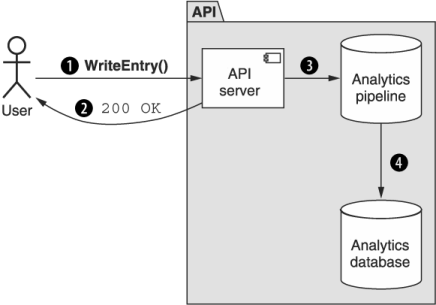

本章涵盖内容

- 我们所说的匿名数据是什么意思
- 如何在不依赖创建资源的情况下将数据摄取到 API 中
- 如何解决摄取数据的一致性问题

到目前为止，将任何新数据写入 API 都涉及创建资源，以及它们的唯一标识符和模式。 不幸的是，尽管我们可能希望这是创建数据的唯一方式，但它有时并不完全符合世界的现实。 事实上，有些场景需要写入数据但事后没有唯一标识，例如日志文件中的条目或要聚合到统计信息中的时间序列数据点。 在这种模式中，我们解决了写入数据而不是创建资源的想法，以及这个新概念如何仍然符合我们现有的面向资源的设计原则。

## 20.1 动机
到目前为止，在我们将数据写入 API（添加新数据或更新现有数据）的所有讨论中，我们都在资源方面进行了思考和工作。即使在我们可能会改变关于什么构成资源的规则的情况下，例如在第 12 章中，基础始终是资源的概念。这些资源一直作为单一的、可寻址的、唯一可识别的数据块，我们可以使它们存在、操作、读取，然后在我们处理完它们后恢复存在，它们为我们提供了很好的服务远的。然而不幸的是，它们不一定足以涵盖现实世界中可能出现的所有方面和场景，因此需要在 API 设计世界中加以考虑。

例如: 考虑收集时间序列统计数据等情况。像这样存储统计数据的一种明显方法是拥有一个 DataPoint 资源并依靠标准的 create 方法来记录传入的数据点。但这有点像将每一粒大米单独包装并贴上标签，而不是购买一个 5 磅重的袋子。一般来说，对于这样的系统，用户对聚合比对单个数据点更感兴趣。换句话说，我们更有可能要求获取当月数据点的平均值，而不是请求使用唯一标识符查看特定的单个数据点。这非常普遍，以至于许多分析数据处理系统、时间序列数据库或数据仓库（例如: Google 的 [BigQuery](https://cloud.google.com/bigquery) 或 InfluxData 的 [InfluxDB](https://www.influxdata.com/products/influxdb/)) 甚至不支持存储数据点的唯一标识符！

这引出了一个显而易见的问题：如果我们使用这些系统中的一个来存储我们的分析数据，那么首先我们应该如何将数据输入 API？我们是否应该假装拥有唯一标识符（在数据库中存储一个特殊字段）并像往常一样依赖标准的 ```create``` 方法？我们是否应该修改标准的 ```create``` 方法，使其向数据库中插入数据但不返回可寻址资源，也许将 id 字段留空？还是我们应该完全尝试其他的东西？此模式探索了一种替代方案，旨在标准化如何最好地在我们通常面向资源的 API 中处理此类非面向资源的数据。

## 20.2 概述

此模式通过提供一种称为 ```write``` 的特殊自定义方法来工作。与标准的 ```create``` 方法类似，自定义 ```write``` 方法的工作是将新数据插入 API；但是，它这样做的方式是生成的数据条目是匿名的（即，数据没有唯一标识符）。通常，这是因为生成的数据不可寻址，并且在事后无法检索、更新或删除。

相反，不应检索单个记录，而应仅在汇总的基础上探索此类数据。这意味着与允许用户像使用典型资源那样请求单个数据点不同，他们可以请求基于这些数据点的聚合值，例如条目总数或这些条目的平均值。正如你可能猜到的那样，这种交互方式对于提供大量系统统计信息的仪表板风格的 API 很重要。

由于这些数据点与我们已经习惯的资源具有如此不同的访问模式，因此使用不同的术语来描述正在写入的数据几乎肯定是个好主意。在这种情况下，我们将使用术语条目来表示通过这种新的写入方法插入 API 中的数据点，而不是指资源。

总而言之，写入条目和读取聚合数据（例如: 计数）的示例如图 20.1 中的序列图所示。


在下一节中，我们将探讨 write 方法的更细微的细节以及我们如何实现它。
## 20.3 实现

虽然 write 方法在本质上与标准 ```create``` 方法非常相似，但肯定存在一些值得探索的差异。首先，让我们看一下方法的返回类型。虽然标准的 ```create``` 方法返回一个新创建的资源，但 ```write``` 方法并没有完全返回一个资源。实际上，写入方法涉及将数据添加到集合（作为另一个匿名成员加入组）或以流方式使用以增加计数器或更新聚合（例如移动平均线）。这种行为使该方法变得特别，但这也意味着除了成功的结果或出现问题的错误之外，我们可以返回任何有用的东西。因此，```write``` 方法不应返回任何内容或无效。

下一个要回答的问题是我们如何准确地传输数据的有效载荷。标准的 ```create``` 方法依赖于接受要创建的资源值的单个字段（资源）。同样，与标准的 ```create``` 方法不同，```write``` 方法不处理资源，而是使用条目的概念。幸运的是，这让我们得出一个明显而简单的结论：将写入请求视为创建请求，但将字段从资源重命名为条目。

清单 20.1 写请求示例

```typescript
interface WriteChatRoomStatEntryRequest {
  parent: string;
  entry: ChatRoomStatEntry;    // ❶
}
```

❶ 在这里，我们使用输入字段而不是资源字段。
最后，我们必须想知道 ```write``` 方法的正确 ```HTTP URL``` 绑定是什么。例如: 假设我们正在尝试编写有关 ```ChatRoom``` 资源的一些统计信息。正如我们在第 9 章，特别是第 9.3.2 节中学到的，通常最好以集合而不是父资源为目标，这意味着 ```write``` 方法应该避免像 ```/chatRooms/1:writeStatEntry``` 这样的 URL，而应该支持一个URL 看起来像 ```/chatRooms/1/statEntries:write```。虽然这可能是一个有争议的选择（因为 ```statEntries``` 并不是真正的资源集合），但事实仍然是我们将来可以通过其他几种方式与条目集合进行交互。例如: 我们可以使用批量写入方法（第 18 章）一次添加多个条目或使用清除方法（第 19 章）删除所有条目。

现在我们已经很好地掌握了基础知识，还有一个更复杂的主题需要讨论：一致性。

### 20.3.1 一致性

通常，当我们向 API 插入数据时（例如通过标准的 ```create``` 方法），我们希望能够立即看到该操作的结果。换句话说，如果 API 表明我们创建某些数据的请求成功，我们应该能够立即从 API 读取该数据。事实上，这非常重要，以至于当我们遇到操作可能需要一段时间才能完成的情况时，我们依靠诸如长时间运行的操作（第 10 章）之类的东西来帮助更深入地了解数据何时可用系统。

由于 ```write``` 方法的行为有点像标准的 ```create``` 方法，我们有一些重要的问题需要回答：它是否应该以相同的方式保持一致，在操作完成后立即读取数据？如果不是，我们是否应该依靠长期运行的操作来跟踪进度？如果没有，我们应该怎么做？

要回答这些问题，我们首先必须提醒自己，```write``` 方法的目标是允许将不可寻址的数据添加到系统中。这意味着我们读取数据的方法与我们读取由标准 ```create``` 方法添加的数据的方式非常不同。事实上，由于我们几乎总是通过聚合读取这种类型的数据，因此很难（如果不是不可能的话）知道我们实际上是在读取我们自己添加的数据，而不是其他人调用 ```write``` 方法添加的数据独立。简而言之，这意味着让我们自己遵守一个标准没有任何意义，即在方法完成时所有数据都必须是可读的。换句话说，即使在数据对任何使用 API 的人可见之前，```write``` 方法也可以立即返回（如图 20.2 所示）。



这恰好适合涉及大规模分析系统的大多数用例，因为这些用例往往依赖于最终的一致性和数据处理管道中潜在的长时间延迟。如果我们必须在返回结果之前等待所有计算完成，我们可能会遇到一些非常严重的请求延迟问题，从而使该方法变得不那么有用。

然而，这导致了一个有趣的选择：如果我们想在数据可见之前做出响应，但我们不能轻松地同步进行，那么使用 LRO（参见第 10 章）立即返回并允许用户等待怎么办？结果变得可见？不幸的是，这个想法有两个问题。首先，通常不可能知道单个数据何时作为聚合统计信息的一部分被持久化。这主要是因为单个条目不应包含唯一标识符，因此无法通过分析管道一直跟踪单个数据点。

其次，即使我们可以通过系统跟踪每个数据点，依赖 ```write``` 方法而不是标准 ```create``` 方法的要点之一是我们不想单独存储所有条目。相反，我们希望通过聚合数据来节省空间和计算时间。如果我们决定每次调用 ```write``` 方法都应该创建一个新的 ```Operation``` 资源，我们基本上已经将问题从一个地方转移到另一个地方，而没有真正节省任何空间或精力。

基于此，作为 ```write``` 方法的结果返回 LRO 几乎肯定是一个坏主意。如果向用户传达他们的数据已被接受到管道中很重要，但他们不应该期望它在很长一段时间内可见，那么一个好的替代方法是简单地返回 ```HTTP 202 Accepted``` 响应代码而不是典型的 ```HTTP 200 OK```响应代码。此外，如果担心向 ```write``` 方法提供重复条目，请求重复数据删除模式（第 26 章）应该非常适合帮助避免这个问题。

有了这个，让我们看看我们如何应用这个模式并定义一个支持 ```write``` 方法的 API。

### 20.3.2 最终 API 定义

假设我们想要开始一些关于聊天室的任意统计。这可能包括用户打开特定聊天室的频率等内容，但我们希望为将来添加的数据点保持一定的灵活性。为此，我们可能会制作一个 ```ChatRoomStatEntry``` 接口，它是一个简单的字符串键值对和一个标量值，我们可以稍后对其进行聚合和分析。

此外，我们可能希望支持一次写入多个 ```ChatRoomStatEntry``` 资源。为此，我们可以依靠批量写入方法（有关批量方法的更多信息，请参阅第 18 章）。

清单 20.2 最终 API 定义

```typescript
abstract class ChatRoomApi {
  @post("/{parent=chatRooms/*}/statEntries:write")         // ❶
  WriteChatRoomStatEntry(req:
    ➥ WriteChatRoomStatEntryRequest): void;               // ❷
 
  @post("/{parent=chatRooms/*}/statEntries:batchWrite")    // ❶    
  BatchWriteChatRoomStatEntry(req: 
    ➥ BatchWriteChatRoomStatEntryRequest): void;          // ❷❸
}
 
interface ChatRoomStatEntry {       
  name: string;
  value: number | string | boolean | null;
}
 
interface WriteChatRoomStatEntryRequest {
  parent: string;
  entry: ChatRoomStatEntry;
}
 
interface BatchWriteChatRoomStatEntryRequest {
  parent: string;
  requests: WriteChatRoomStatEntryRequest[];
}
```

❶ 正如我们在 20.3.1 节中了解到的，这些自定义方法针对的是集合，而不是父资源。
❷ 这里我们不返回任何资源，而不是返回资源。
❸ 同样，即使是批处理方法也不会返回任何结果。
## 20.4 权衡

与我们目前看到的许多设计模式不同，这个模式与众不同，因为用例非常独特。事实上，这个用例几乎专门用于涉及分析数据的案例，而我们考虑的几乎所有数据本质上都是事务性的。因此，将这种类型的分析数据安全地添加到 API 的替代方案并不多。

正如我们所了解到的，当然可以依赖标准的 ```create``` 方法并将单个数据点视为完整资源，每个数据点都有自己的唯一标识符；然而，这种类型的设计不太可能与大多数分析存储和数据处理系统一起工作。此外，存储的数据几乎肯定会增长得非常快并且变得难以管理。因此，在 API 需要支持分析数据摄取以及更传统的面向资源的设计的情况下，这可能是最佳选择。

## 20.5 练习
1. 如果我们担心通过 ```write``` 方法摄取重复数据，那么避免这种情况的最佳策略是什么？
2. 为什么 ```write``` 方法不返回响应体？为什么写方法返回 LRO 资源是个坏主意？
3. 如果我们想传达数据已收到但尚未处理，有哪些选项可用？哪个可能是大多数 API 的最佳选择？

## 总结

- 当需要将数据摄取到系统中时（例如: 分析数据条目），我们应该依赖自定义写入方法，而不是创建永远不会单独处理的资源。
- 通过写入方法加载到 API 中的数据是一条单行道，以后无法从 API 中删除。
- 除了结果状态代码之外，写方法（及其批处理版本）不应返回任何响应。除非在特殊情况下，否则它们根本不应该返回资源——即使是 LRO 资源。
- ```write``` 方法处理的不是资源，而是条目，这些条目类似于资源但不可寻址，并且在许多情况下是短暂的。