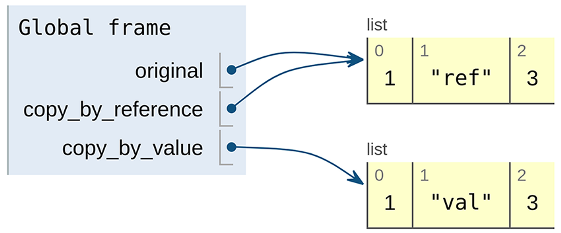

本章涵盖内容

- 如何使用复制和移动自定义方法重新排列 API 中的资源
- 为复制和移动操作选择正确的标识符（或标识符策略）
- 复制或移动父资源时如何处理子资源和其他资源
- 处理复制或移动资源的外部数据引用
- 这些新的自定义方法应该达到什么级别的原子性

虽然很少有资源被认为是不可变的，但我们通常可以安全地假设资源的某些属性不会从我们手中改变。特别是，资源的唯一标识符就是这些属性之一。但是如果我们想重命名一个资源呢？我们怎样才能安全地这样做？此外，如果我们想将资源从属于一个父资源移动到另一个父资源怎么办？或者复制一个资源？我们将为这些操作探索一种安全稳定的方法，涵盖 API 中资源的复制（复制）和移动（更改唯一标识符或更改父项）。

## 17.1 动机
在理想的世界中，我们资源之间的等级关系设计完美且永远不变。更重要的是，在这个神奇的世界中，API 的用户永远不会犯错误或在错误的位置创建资源。他们当然永远不会太晚意识到他们犯了一个错误。在这个世界中，永远不需要重命名或重新定位 API 中的资源，因为作为 API 设计者的我们和作为 API 使用者的客户永远不会在我们的资源布局和层次结构中犯任何错误。

这就是我们在第 6 章中探索并在 6.3.6 节中详细讨论的世界。不幸的是，这个世界不是我们目前所处的世界，因此我们必须考虑这样一种可能性，即 API 的用户需要能够将资源移动到层次结构中的另一个父级或更改 ID的一个资源。

更复杂的是，在某些情况下，用户可能需要复制资源，可能会复制到层次结构中的其他位置。虽然这两种情况乍一看都非常简单，但就像 API 设计中的大多数主题一样，它们将我们带入了一个充满需要回答的问题的兔子洞。此模式的目标是确保 API 使用者能够以安全、稳定和（大部分）简单的方式重命名和复制整个资源层次结构中的资源。

## 17.2 概述
由于我们不能使用标准的更新方法来移动或复制资源，我们显然还有下一个最佳选择：自定义方法。 幸运的是，这些复制和移动自定义方法如何工作的高级概念很简单。 与大多数 API 设计问题一样，问题在于细节，例如复制 ```ChatRoom``` 资源以及在不同的 ```ChatRoom``` 父资源之间移动 ```Message``` 资源。

清单 17.1 使用自定义方法的移动和复制示例

```typescript
abstract class ChatRoomApi {
  @post("/{id=chatRooms/*/messages/*}:move")         // ❶
  MoveMessage(req: MoveMessageRequest): Message;     // ❷
 
  @post("/{id=chatRooms/*}:copy")                    // ❶    
  CopyChatRoom(req: CopyChatRoomRequest): ChatRoom;  // ❷
}
```

❶ 对于这两种自定义方法，我们使用 ```POST HTTP``` 动词并以我们想要复制或移动的特定资源为目标。
❷ 对于这两种自定义方法，响应始终是新移动或复制的资源。

这里没有显示一些重要而微妙的问题。首先，当你复制或移动资源时，你是选择唯一标识符还是服务好像正在创建新资源一样？跨父资源工作（你可能想要与以前相同的标识符，只是属于不同的父资源）与在同一个父资源内（你可能只想更改标识符的能力）有区别吗？

接下来，当你复制 ```ChatRoom``` 资源时，是否也复制了属于该 ```ChatRoom``` 的所有消息资源？如果有大附件怎么办？这些额外的数据会被复制吗？问题还不止于此。我们仍然需要弄清楚如何确保正在移动（或复制）的资源当前没有与其他用户交互，如何处理旧标识符以及任何继承的元数据，例如访问控制策略。

简而言之，虽然此模式仅依赖于特定的自定义方法，但我们远不是简单地定义方法并将其称为完成。在下一节中，我们将深入研究所有这些问题，以便在 API 表面上确保安全和稳定的资源复制（和移动）。

## 17.3 实现
正如我们在 17.2 节中看到的，我们可以依靠自定义方法在 API 的层次结构中复制和移动资源。我们还没有看到关于这些自定义方法的一些重要细微差别以及它们应该如何实际工作。让我们从显而易见的开始：我们应该如何确定新移动或复制的资源的标识符？

### 17.3.1 标识符
正如我们在第 6 章中了解到的，通常最好允许 API 服务本身为资源选择唯一标识符。这意味着当我们创建新资源时，我们可能会指定父资源标识符，但新创建的资源最终会得到一个完全不受我们控制的标识符。这是有充分理由的：当我们选择如何识别我们自己的资源时，我们往往做得很差。在复制和移动资源时会出现相同的情况。从某种意义上说，这两者都类似于创建一个与现有资源完全一样的新资源，然后（在移动的情况下）删除原始资源。

但即使新创建的资源有一个由 API 服务选择的标识符，那应该是什么？事实证明，最方便的选择取决于我们的意图。如果我们试图重命名一个资源，使其具有新的标识符，但在资源层次结构中的位置相同，那么选择新标识符对我们来说可能非常重要。如果 API 允许用户指定的标识符，则尤其如此，因为我们可能会将资源从某个有意义的名称重命名为另一个有意义的名称（例如: ```database/database-prod``` 之类的东西到 ```databases/database-prod-old``` ）。另一方面，如果我们试图将某物从层次结构中的一个位置移动到另一个位置，那么如果新资源具有相同的标识符但属于新的父资源（例如: 从```chatRooms/1234/messages/abcd``` 到 ```chatRooms/5678/messages/abcd``` 的现有标识符，注意消息```/abcd``` 的共性）。由于场景差异很大，让我们分别看一下每个场景。

#### 复制
为重复资源选择标识符非常简单。无论你是将资源复制到相同还是不同的父级，复制方法的行为都应与标准的 ```create``` 方法相同。这意味着，如果你的 API 选择了用户指定的标识符，则复制方法还应允许用户为新创建的资源指定目标标识符。如果它仅支持服务生成的标识符，则不应例外并允许用户指定的标识符仅用于资源复制。 （如果确实如此，这将是一个漏洞，任何人都可以通过该漏洞通过简单地创建资源然后将资源复制到实际预期目的地来选择自己的标识符。）

这样做的结果是，复制资源的请求将接受目标父级（如果资源类型有父级），如果允许用户指定的标识符，则还将接受目标 ID。

清单 17.2 复制请求接口

```typescript
interface CopyChatRoomRequest {
  id: string;                     // ❶
  destinationId: string;          // ❷
}
 
interface CopyMessageRequest {
  id: string;                     // ❶
  destinationParent: string;      // ❸
  destinationId: string;          // ❷
}
```

❶ 我们总是需要知道要复制的资源的 ID。
❷ 此字段是可选的。仅当 API 支持用户指定的标识符时才应存在。
❸ 当资源在层次结构中有父资源时，我们应该指定新复制的资源应该在哪里结束。
这可能会导致一些令人惊讶的结果。例如: 如果 API 不支持用户选择的标识符，则复制任何顶级资源的请求只需要一个参数：要复制的资源的 ID。在另一种情况下，我们可能希望将资源复制到同一个父级中。在这种情况下，```destinationParent``` 字段将与 id 字段中指向的资源的父级相同。

此外，即使 API 支持用户选择的标识符，我们也可能希望在复制资源时依赖自动生成的 ID。为此，我们只需将 ```destinationId``` 字段留空，并允许我们以这种方式向服务表达"我希望你为我选择目的地标识符"。

最后，当支持用户指定的标识符时，目标父级中的目标 ID 可能已经被采用。在这种情况下，为了确保成功复制资源，可能很想恢复到服务器生成的标识符。然而，这应该避免，因为它打破了用户对新资源目的地的假设。相反，该服务应返回相当于 ```409 Conflict HTTP``` 错误的信息并中止复制操作。

#### 移动
当谈到移动资源时，我们实际上有两种微妙不同的场景。一方面，用户可能最关心将资源重定位到资源层次结构中的另一个父级，例如将消息资源从一个聊天室移动到另一个。另一方面，用户可能想要重命名资源，在技术上将资源移动到具有不同目标 ID 的同一父级。我们也有可能希望同时执行这两项操作（重定位和重命名）。更复杂的是，我们必须记住重命名资源只有在 API 支持用户选择的标识符时才有意义。

为了处理这些场景，再次使用两个单独的字段可能很诱人，如清单 17.2 所示，其中有一个目标父级和一个目标标识符。但是，在这种情况下，无论如何我们总是知道最终标识符（与我们可能依赖服务器生成的标识符的复制方法相比）。除了不同的父资源或我们选择的全新资源外，ID 要么与原始资源相同。因此，我们可以使用单个 ```destinationId``` 字段并根据是否支持用户选择的标识符对该字段的值实现一些约束。如果是，那么任何完整的标识符都是可以接受的。如果不是，那么唯一有效的新标识符是那些专门更改 ID 的父部分并保持其余部分不变的标识符。

所有这些导致我们得到一个只接受两个字段的移动请求结构：被移动资源的标识符和重定位完成后资源的预期目的地。

清单 17.3 移动请求接口

```typescript
interface MoveChatRoomRequest {   // ❶    
  id: string;                     // ❷
  destinationId: string;
}
 
interface MoveMessageRequest {
  id: string;                     // ❷
  destinationId: string;          // ❸
}
```

❶ 由于 ChatRoom 资源没有分层的父资源，因此此方法仅在 API 支持用户指定的标识符时才有意义。
❷ 我们总是需要知道要复制的资源的ID。
❸ 由于```Message```资源有```parent```，我们可以通过改变```destination ID```将资源移动到不同的```parent```。
如你所见，对于顶级资源（没有父资源的资源），只有 API 支持用户指定的标识符时，整个 ```move``` 方法才有意义。这与复制方法形成鲜明对比，在这种情况下仍然有意义。问题主要在于移动实现了两个目标：将资源重定位到不同的父资源和重命名资源。后者只有在支持用户指定的标识符的情况下才有意义。前者只有在资源有父资源时才有意义。在这些都不适用的情况下，移动方法变得完全无关紧要，根本不应该实现。

现在我们已经了解了复制和移动资源的请求的形状和结构，让我们继续前进，看看我们如何处理更复杂的场景。

### 17.3.2 子资源
到目前为止，我们的工作条件是我们打算移动或复制的每个资源都是完全独立的。本质上，我们的主要假设是资源本身没有需要在单个记录之外复制的附加信息。这个假设确实让我们的工作更容易一些，但不幸的是，这不一定是一个安全的假设。相反，我们必须假设还有与需要移动或复制的资源相关联的额外数据。我们如何处理？我们是否应该为这些额外的数据而烦恼？

简短的回答是肯定的。简而言之，外部数据和相关资源（例如: 子资源）很少是没有目的的。因此，在不包含此关联数据的情况下复制或移动资源可能会导致令人惊讶的结果：新目标资源的行为与源资源不同。由于一个好的 API 的主要目标之一是可预测性，因此确保新复制或移动的资源在尽可能多的方面与源资源相同变得尤为重要。我们如何做到这一点？

首先，无论是复制还是移动，都必须包括所有子资源。例如: 这意味着如果我们复制或移动 ```ChatRoom``` 资源，则所有 ```Message``` 子资源也必须使用新的父 ID 复制或移动。显然，这比更新单行要多得多。此外，更新的数量取决于子资源的数量，这意味着，正如你所期望的，复制具有少量子资源的资源将比具有大量子资源的类似资源花费的时间少得多。表 17.1 显示了移动或复制操作前后资源标识符的示例。

表 17.1 移动（或复制）聊天室资源后的新旧标识符

| 资源类型 |        原始标识符        |         新标识符         |
| :------: | :----------------------: | :----------------------: |
| ChatRoom |      chatRooms/old       |      chatRooms/new       |
| Message  | chatRooms/old/messages/2 | chatRooms/new/messages/2 |
| Message  | chatRooms/old/messages/3 | chatRooms/new/messages/3 |
| Message  | chatRooms/old/messages/4 | chatRooms/new/messages/4 |

虽然我们的复制问题在这里已经完成，但不幸的是，当资源被移动时，情况并非如此。相反，在我们完成所有 ID 的更新后，我们实际上创造了一个全新的问题：之前指向这些资源的任何其他地方现在都有一个死链接，尽管资源仍然存在！在下一节中，我们将探讨如何处理这些内部和外部引用。

### 17.3.3 相关资源
虽然我们已经决定所有子资源都必须与目标资源一起复制或移动，但到目前为止我们还没有提及相关资源。例如: 假设我们的聊天 API 支持报告或标记可能不适用于 ```MessageReviewReport``` 资源的消息。此资源有点像已标记为不适当的消息的支持案例，应由支持团队审查。此资源不一定是 ```Message``` 资源（甚至是 ```ChatRoom``` 资源）的子资源，但它确实引用了它所针对的 ```Message``` 资源。

清单 17.4 引用 ```Message``` 资源的 ```MessageReviewReport``` 资源

```typescript
interface MessageReviewReport {
  id: string;
  messageId: string;     // ❶
  reason: string;
}
```

❶ 该字段包含消息资源的 ID，作为参考。
这个资源的存在（事实上它是一个 ```messageId``` 字段是对 ```Message``` 资源的引用）导致了几个明显的问题。首先，当你复制一条消息时，它是否也应该复制所有引用原始消息的 ```MessageReviewReport``` 资源？其次，如果 ```Message``` 资源被移动，所有引用新移动资源的 ```MessageReviewReport``` 资源是否也应该更新？当我们记住复制和移动 ```Message``` 资源可能不是特定于针对 ```Message``` 资源的最终用户请求，而是针对父 ```ChatRoom``` 资源的请求的级联结果时，这些问题变得更加复杂！

毫不奇怪，对于所有这些场景中什么是最好的，没有单一的正确答案，但让我们从简单的开始，例如相关资源应如何响应移动的资源。

#### 参照完整性
在许多关系数据库系统中，有一种方法可以配置系统，以便当某些数据库行发生更改时，这些更改可以级联并更新数据库中其他位置的行。这是一个非常有价值但资源密集型的特性，它通过尝试取消引用一个新的无效指针来确保你永远不会遇到与分段错误等效的数据库。当谈到在 API 内移动资源时，我们理想情况下希望争取相同的结果。

不幸的是，这只是需要移动自定义方法的那些非常困难的事情之一。我们不仅需要跟踪引用正在移动的目标的所有资源，还需要跟踪与父级一起移动的子资源，并确保引用这些子级的任何其他资源也得到更新。可以想象，这是非常复杂的，并且不鼓励重命名或重新定位资源的众多原因之一！

例如: 遵循此准则意味着如果我们要移动具有 ```MessageReviewReport``` 引用的 ```Message``` 资源，我们还需要更新该 ```MessageReviewReport```。此外，如果我们使用 ```MessageReviewReport``` 将作为父级的 ```ChatRoom``` 资源移动到此消息，我们将不得不做同样的事情，因为消息将由于是 ```ChatRoom``` 的子资源而被移动。

下面我们就来简单的了解一下，当涉及到copy自定义方法的时候，我们应该如何处理相关的资源。

#### 相关资源重复
虽然移动资源肯定会给相关资源带来相当大的麻烦，但复制资源也是如此吗？事实证明，它也会引起头痛，但它完全是另一种类型的头痛。我们没有处理困难的技术问题，而是有一个艰难的设计决策。原因很简单：是否将相关资源与目标资源一起复制在很大程度上取决于具体情况。

例如: ```MessageReviewReport``` 资源当然很重要，但如果我们复制 ```Message``` 资源，我们就不想完全复制报告。相反，也许允许 ```MessageReviewReport``` 引用多个 ```Message``` 资源更有意义，而不是复制报告，我们可以简单地将新复制的 ```Message``` 资源添加到被引用的列表中。

其他资源绝对不应该被复制。例如: 当我们复制 ```ChatRoom``` 资源时，我们不应复制在该资源中列为成员的用户资源。归根结底，关键是某些资源与目标一起复制是有意义的，而其他资源则根本不会。这是一个远没有那么复杂的技术问题，而是在很大程度上取决于 API 的预期行为。

既然我们已经讨论了在面对这些新的自定义方法时保持参照完整性的细节，让我们探索当我们扩展它以包含我们无法控制的引用时的情况。

#### 外部参考
虽然对 API 中资源的大多数引用都存在于同一 API 中的其他资源中，但情况并非总是如此。有许多场景会从整个 Internet 上引用资源，特别是与存储文件或其他非结构化数据相关的任何内容。考虑到这一整章都是关于移动资源和从各个地方打破这些外部引用，这提出了一个非常明显的问题。例如: 假设我们有一个跟踪文件的存储系统。这些文件资源显然可以在整个互联网上共享，这意味着我们将在所有地方对这些资源进行大量引用！我们可以做什么？

清单 17.5 文件资源可能在 API 之外被引用

```typescript
abstract class FileApi {
  @post("/files")
  CreateFile(req: CreateFileRequest): File;
 
  @get("/{id=files/*}")                 // ❶
  GetFile(req: GetFileRequest): File;
}
 
interface File {
  id: string;
  content: Uint8Array;
}
```

❶ 这些 URI 可用于从 API 外部引用给定的文件资源。
重要的是要记住，互联网并不是参照完整性的完美代表。我们大多数人都会遇到 ```HTTP 404 Not Found``` 错误，因此将 API 内部的参照完整性要求扩展到整个互联网是不公平的。当我们向全世界提供网络资源时，很少会真正打算签署终身合同，以在永恒的剩余时间内继续以完全相同的字节和完全相同的名称提供相同的资源。相反，我们经常提供资源，直到它不再有意义。关键是提供给开放互联网的资源通常是尽力而为，很少有终身保证。

在这种情况下，我们的示例文件资源可能最好按照同一组准则进行分类：它会一直存在，直到它碰巧被移动。由于美国司法部的紧急要求，这可能是明天，也可能是明年，因为存储文件的成本不再有意义。关键是我们应该预先承认外部参照完整性不是 API 的关键目标，而应关注手头更重要的问题。

### 17.3.4 外部数据
到目前为止，我们复制或移动的所有资源都是存储在关系数据库或控制平面数据中的资源。如果我们想要复制或移动恰好指向原始字节块的资源，例如清单 17.5 中的 File 资源，情况如何？我们还应该在底层存储中复制这些字节吗？

这实际上是计算机科学中一个经过充分研究的问题，并且在许多编程语言中都表现为按值复制与按变量引用复制的问题。当一个变量按值复制时，所有底层数据都被复制，新复制的变量与旧变量完全分开。通过引用复制变量时，底层数据保留在同一位置，并且会创建一个恰好指向原始数据的新变量。在这种情况下，改变一个变量的数据也会导致另一个变量的数据被更新。

清单 17.6 按引用复制与按值复制的伪代码

```typescript
let original = [1, 2, 3];
let copy_by_reference = copyByReference(original);   // ❶    
let copy_by_value = copyByValue(original);
 
copy_by_reference[1] = 'ref';                        // ❷
copy_by_value[1] = 'val';
```

❶ 首先，我们将原始列表复制两次，一次按值，一次按引用。
❷ 然后我们更新每个副本（结果如图 17.1 所示）。
代码清单 17.6 展示了一些伪代码的例子，它执行两次复制（一个按值，另一个按引用），然后更新结果数据。 最终值如图 17.1 所示。 可以看到，尽管有三个变量，但只有两个列表，并且在原始列表中也可以看到对 ```copy_by_reference``` 变量的更改。



在移动指向此类外部数据的资源时，答案很简单：不要理会底层数据。这意味着虽然我们可能会重新定位资源记录本身，但数据应该保持不变。例如: 重命名文件资源应更改该资源的主页，但不应将底层字节移至其他任何位置。

复制资源时，答案很明确，但恰好有点复杂。通常，此类外部数据的最佳解决方案是仅通过引用复制开始。之后，如果数据碰巧发生更改，我们应该复制所有底层数据并应用更改，因为当我们可以通过引用复制时复制一大堆字节可能会很浪费。但是，我们当然不能将重复资源的更改显示为原始资源的更改，因此一旦将要进行更改，我们必须制作完整副本。

这种称为写时复制的策略在存储系统中很常见，其中许多会在幕后为你完成繁重的工作。换句话说，你可能可以避免调用存储系统的 ```copy()``` 函数，它会正确处理所有语义，仅在数据稍后更改时按值进行真正的复制。

### 17.3.5 继承的元数据
在许多 API 中，有一些策略或元数据集由子资源继承到父资源。例如: 让我们想象一个我们想要控制不同聊天室消息长度的世界。此长度限制可能因房间而异，因此它是在 ```ChatRoom``` 资源上设置的属性，最终应用于 ```Message``` 子资源。

清单 17.7 具有子级继承条件的 ```ChatRoom``` 资源

```typescript
interface ChatRoom {
  id: string;
  // ...
  messageLengthLimit: number;    // ❶
}
```

❶ 该设置由子```Message```资源继承，用于限制消息内容的长度。
这一切都很好，但是当 ```Message``` 资源从一个 ```ChatRoom``` 资源复制到另一个时会变得更加混乱。最常见的潜在问题是当这些不同的继承限制发生冲突时，例如恰好满足其当前 ```ChatRoom``` 资源长度要求的 Message 被复制到另一个具有更严格要求的 ```ChatRoom``` 中，而当前存在的资源不满足.换句话说，如果我们想将一个有 140 个字符的 ```Message``` 资源复制到一个只允许 100 个字符的聊天室中，会发生什么？

一种选择是简单地允许资源违反规则，可以这么说，并且存在于聊天室资源中，尽管超出了长度限制。虽然这在技术上可行，但它引入了进一步的复杂性，因为该资源的标准更新方法可能会开始失败，直到该资源被修改以符合父级的规则。通常，这会使目标资源有效地不可变，从而导致那些有兴趣在不修改内容长度的情况下更改资源其他方面的人感到困惑和沮丧。

另一种选择是截断或以其他方式修改传入资源，使其符合目标父级的规则。虽然这在技术上也是可以接受的，但对于不了解目标资源要求的用户来说可能会感到惊讶。特别是，在你永久销毁数据的情况下，这种"强制使其适合"解决方案由于不可预测而破坏了良好 API 的最佳实践。此类解决方案的不可逆转性质是应避免使用的另一个原因。

更好的选择是简单地拒绝传入资源并由于违反这些规则而中止复制或移动操作。这确保用户能够决定如何使操作成功，无论是更改 ```ChatRoom``` 资源中存储的长度要求，还是在尝试复制或移动数据之前截断或删除任何有问题的消息资源。

这也适用于由于资源是实际目标的子资源或相关资源而触发复制的情况。在这些情况下，任何类型的验证检查失败或由于从新目标父项继承的元数据而导致的任何问题都应该导致整个操作失败，并且所有阻碍操作的失败都有明确的原因。然后，用户可以检查结果并决定是放弃手头的任务还是在修复报告的问题后重试操作。

### 17.3.6 原子性
正如我们在本章中看到的，复制和移动方法的关键点应该是它们可能比它们看起来更复杂和资源密集。虽然在某些情况下它们可能非常无害（例如: 复制没有相关或子资源的资源），但其他情况可能涉及复制和更新 API 中的数百或数千个其他资源。这是一个相当大的问题，因为当没有其他人使用 API 并修改底层资源时，很少会发生这些复制或移动操作。面对不稳定的数据集，我们如何确保这些操作成功完成？此外，重要的是，如果在此过程中遇到错误，我们能够撤消已完成的工作。简而言之，我们要确保我们的移动和复制操作都发生在事务的上下文中。

有趣的是，当涉及到数据存储层时，复制和移动操作往往以完全不同的方式工作。在复制操作的情况下，我们将主要查询读取数据，然后根据这些条目在存储系统中创建新条目。另一方面，在移动操作的情况下，我们将主要更新存储系统中的现有条目，修改适当的标识符以将资源从一个位置移动到另一个位置，并更新可能引用新的现有资源修改的资源。虽然两者的理想解决方案是相同的，但遇到的问题略有不同，因此，我们将这两者分开解决更有意义。

#### 复制
在复制资源（及其子资源和相关资源）的情况下，我们在原子性方面的重点是数据一致性。换句话说，我们希望确保我们最终在新目标中的数据与我们启动复制操作时存在的数据完全相同，通常称为数据的快照。如果你的 API 建立在支持时间点快照或此类事务的存储系统之上，那么这个问题就简单多了。在将源数据复制到新位置或在单个数据库事务中执行整个操作之前，你可以在读取源数据时简单地指定快照时间戳或修订标识符。然后，如果在此期间发生任何变化，那是完全可以接受的。

如果你没有这种奢侈，还有其他两种选择。首先，你可以简单地承认这是不可能的，并且复制的任何数据将更多地是一段时间内的数据涂抹，而不是来自单个时间点的一致快照。这当然很不方便，并且可能会造成混淆，尤其是对于极不稳定的数据集；然而，鉴于技术限制和正常运行时间要求，它可能是唯一可用的选择。

接下来，我们可以在 API 级别（通过禁用所有修改数据的 API 调用）或在数据库级别（阻止对数据的所有更新）锁定数据以进行写入。虽然并非总是可行，但这种方法是确保这些操作期间一致性的"大锤"选项，因为它将确保数据与复制操作时出现的完全相同，特别是因为数据被锁定并且禁止在操作期间进行任何更改。

一般来说，这个选项当然是不推荐的，因为它基本上提供了一种简单的方法来攻击你的 API 服务：简单地发送大量的复制操作。因此，如果你的存储系统不支持时间点快照或事务语义，这是不鼓励支持围绕 API 复制资源的另一个原因。

#### 移动
与复制数据不同，移动数据更多地依赖于更新资源，因此我们的关注点略有不同。乍一看，我们似乎真的没有什么大问题，但事实证明，数据一致性仍然是一个问题。为了了解原因，让我们假设我们有一个 ```MessageReviewReport``` 指向我们刚刚移动的 ```Message```。在这种情况下，我们需要更新 ```MessageReviewReport``` 以指向 ```Message``` 资源的新位置。但是，如果有人同时更新 ```MessageReviewReport``` 以指向不同的消息怎么办？一般来说，我们需要确保相关资源自我们上次评估是否需要更新以指向新移动的资源后没有更改。

为此，我们有与复制操作类似的选项。首先，最好的选择是使用一致的快照或数据库事务来确保正在完成的工作发生在一致的数据视图上。如果这不可能，那么我们可以锁定数据库或用于写入的 API，以确保数据在移动操作期间保持一致。正如我们之前提到的，这通常是一种危险的策略，但它可能是一种必要的邪恶。

最后，我们可以简单地忽略问题并希望最好。与复制操作不同，通过移动忽略问题会导致比随着时间的推移简单涂抹数据更糟糕的结果。如果我们不尝试在移动过程中获得一致的数据视图，我们实际上会冒撤消先前由其他更新提交的更改的风险。例如: 如果 MessageReviewReport 被标记为由于移动而需要更新，并且在此期间有人修改了该资源的目标，则移动操作很可能会覆盖该更新，就好像它从未收到过一样.虽然这对所有 API 来说可能不是灾难性的，但它肯定是不好的做法，应该尽可能避免。

### 17.3.7 最终 API 定义
正如我们所见，API 定义本身并不像该 API 的行为那么复杂，尤其是在处理继承的元数据、子资源、相关资源以及与引用完整性相关的其他方面时。然而，总结我们迄今为止所探索的一切，清单 17.8 显示了一个最终的 API 定义，它支持复制 ```ChatRoom``` 资源（支持用户指定的标识符）和在父级之间移动 ```Message``` 资源。

清单 17.8 最终 API 定义

```typescript
abstract class ChatRoomApi {
  @post("/{id=chatRooms/*}:copy")
  CopyChatRoom(req: CopyChatRoomRequest): ChatRoom;
 
  @post("/{id=chatRooms/*/messages/*}:move")
  MoveMessage(req: MoveMessageRequest): Message;
}
 
interface ChatRoom {
  id: string;
  title: string;
  // ...
}
 
interface Message {
  id: string;
  content: string;
  // ...
}
 
interface CopyChatRoomRequest {
  id: string;
  destinationParent: string;
}
 
interface MoveMessage {
  id: string;
  destinationId: string;
}
```

## 17.4 权衡
希望在看到支持移动和复制操作是多么复杂之后，你的第一个想法是应该尽可能避免这两种操作。虽然这些操作起初看起来很简单，但事实证明，行为要求和限制可能特别难以正确实现。更糟糕的是，后果可能非常可怕，导致数据丢失或损坏。

也就是说，复制和移动并不同样复杂，并且在 API 中的地位也不相同。在许多情况下，复制资源实际上可能是一项关键功能。另一方面，移动资源通常只是由于错误或资源布局不当而变得必要。因此，虽然即使是布局最好的 API 也可能在支持 ```copy``` 方法方面发现很大的价值，但最好在决定实现 ```move``` 方法之前重新评估资源布局。通常情况下，需要在父项之间移动资源（或重命名资源）是由于资源标识符选择不当或在本应是引用关系中依赖父子关系引起的。

最后，重要的是要注意，虽然本章中阐述的移动和复制操作行为的复杂性可能是繁重且难以实现的，但在这里偷工减料更有可能在未来导致令人讨厌的后果。

## 17.5 练习
1. 复制资源时，是否也应复制所有子资源？引用被复制资源的资源呢？
2. 我们如何在 API 边界之外保持参照完整性？我们应该做那个保证吗？
3. 在复制或移动数据时，我们如何确保生成的数据是预期的真实副本，而不是被其他人使用 API 修改的数据污点？
4. 想象一下，我们正在将资源从一个父级移动到另一个父级，但父级有不同的安全和访问控制策略。哪个策略应该应用于移动的资源，旧的还是新的？

## 总结

- 尽管我们希望资源具有永久性，但用户很可能需要在 API 中复制或重新定位资源。
- 我们不应该依赖标准方法（更新和创建）来重新定位或复制资源，而是应该使用自定义移动和复制方法。
- 复制和移动操作也应该包括对子资源的相同操作；但是，应根据具体情况考虑这种行为，并且对已移动资源的引用应保持最新。
- 当资源寻址外部数据时，API 方法应阐明复制的资源是按引用复制还是按值复制（或写时复制）。
- 考虑到底层存储系统的限制，复制和移动自定义方法应该尽可能地具有原子性。