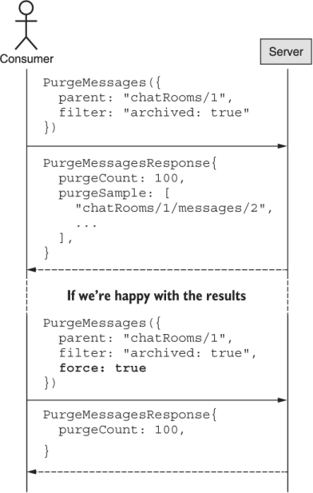

本章涵盖内容

- 如何使用自定义清除方法删除匹配的资源
- 为什么自定义清除方法很危险，应该尽可能避免
- 多种安全预防措施，避免意外删除超出预期的数据
- 如何解决匹配结果集中的一致性问题

虽然我们在第 18 章中学到的批处理操作提供了通过单个 API 调用删除多个资源的能力，但我们必须提前知道一个基本要求：我们要删除的资源的唯一标识符。 但是，在很多情况下，我们对删除特定的资源列表并不是很感兴趣，而是对删除碰巧符合一组特定条件的任何资源更感兴趣。 这种设计模式提供了一种机制，通过它我们可以安全地、原子地删除所有符合特定条件的资源，而不是通过标识符列表。

## 19.1 动机
从第 18 章可以明显看出，一次操作多个资源的情况并不少见。 更具体地说，我们可能想要清除一组特定资源。 但是，与其他批处理操作相比，删除是迄今为止最直接的，不需要其他信息来执行操作：给定 ID，删除资源。

这是一个很棒的功能，但它要求我们已经确切地知道要删除哪些资源。 这意味着如果我们还不知道这些信息，我们首先必须进行调查。 例如: 假设我们要删除所有标记为存档的 ChatRoom 资源。 为了实现这一点，我们需要发现哪些资源具有此特定设置，然后使用这些标识符通过批量删除方法删除资源。

清单 19.1 使用标准列表和批量删除方法的基于标准的删除

```typescript
function deleteArchivedChatRooms(): void {
  const archivedRooms = ListChatRooms({          // ❶
    filter: "archived: true"
  });
  return BatchDeleteChatRooms({                  // ❷
    ids: archivedRooms.map( (room) => room.id )
  });
}
```

❶ 首先，我们必须找到所有存档的资源。
❷ 一旦我们有了标识符，我们就可以将它们全部删除。
不幸的是，这种设计有几个问题。首先，也是最明显的，它至少需要两个单独的 API 调用。更糟糕的是，正如我们将在第 21 章中学到的，列出资源不太可能是一个单一的请求，更有可能涉及一长串重复请求以找到所有匹配的资源。其次，也是最重要的，这两种方法拼接在一起会导致非原子结果。换句话说，当我们收集到所有已归档资源的 ID 时，其中一些可能已被取消归档。这意味着当我们删除这些资源时，我们可能会删除不再归档的资源！

由于这些主要问题，我们有一个替代方法很重要，它提供了一种方法，允许我们根据一组标准而不是完全根据标识符列表来删除资源。

## 19.2 概述
这种模式引入了一种新的自定义方法的想法：清除。清除方法的目的是接受一个可以执行的简单过滤器，并删除与该过滤器条件匹配的任何结果。本质上，它是标准列表方法和批量删除方法的结合。然而，我们可以使用单个 API 调用来实现我们的目标，而不是将一个方法的输出传递到另一个方法的输入中（如清单 19.1 所示）。

虽然该方法及其目的很简单，但我们也必须考虑一个明显的问题：这种方法是危险的。正如我们将在第 25 章中看到的，用户无法避免错误，我们经常担心用户删除了他们后来后悔删除的数据。在这种情况下，我们现在将最大的工具交给用户，而不是为用户提供删除单个资源的工具（标准删除）甚至删除大量资源的工具（批量删除）。清除方法允许用户删除资源，甚至不知道他们正在删除的内容的全部范围。在正确的条件下（例如: 匹配所有资源的过滤器），我们能够完全清除存储在系统中的所有数据！

为了避免这种潜在的灾难性结果，我们将提供两个特定的杠杆，用户可以依靠它们作为防护栏。首先，在实际删除任何内容之前，我们需要在请求（强制）上设置一个明确的布尔标志。其次，如果没有设置这个标志（因此请求不会被执行），我们将提供一个方法来预览如果请求被实际执行会发生什么。这将包括将被删除的项目数量的计数 (```purgeCount```) 以及恰好与结果列表匹配的某些项目的预览 (```purgeSample```)。在某些方面，这有点像在请求上有一个 ```validateOnly``` 字段（参见第 27 章），但具有相反的默认值：除非明确请求，否则请求始终仅用于验证。

## 19.3 实现
要了解此方法的工作原理，让我们首先查看清除方法的典型流程。 如图 19.1 所示，该过程从提供要应用的过滤器的请求开始，但将 ```force``` 标志设置为 ```false```（或未设置）。 因为这等效于验证请求，所以实际上不会删除任何资源，而是用已删除的资源标识符列表填充 ```purgeSample``` 字段。 此外， ```purgeCount``` 字段将提供与过滤器匹配的资源数量的估计值，因此将被请求删除。



使用来自验证请求的这些新信息，我们可以仔细检查 ```purgeSample``` 字段中返回的资源是否确实与过滤器中表达的意图相匹配。然后，如果我们决定继续删除包含的所有资源，我们可以再次发送相同的请求，这次将 ```force``` 标志设置为 ```true```。在响应中，只应使用执行请求删除的资源数填充 ```purgeCount``` 字段。

现在我们已经了解了整体流程，让我们深入了解每个字段的棘手细节，并从过滤器字段开始探索它们如何协同工作。

### 19.3.1 过滤结果
如你所料，过滤器字段的工作方式应该与标准列表方法完全相同，我们将在第 22 章中看到。清除方法的全部要点在于它提供了与标准列表方法几乎相同的功能批量删除方法。这意味着由清除方法指定和执行的过滤器的行为应该与提供给标准列表方法的相同过滤器的行为相同。

这样做的一个不寻常且可怕的后果是，正如标准列表方法上的空过滤器或未设置过滤器返回 API 托管的所有资源一样，因此对于清除方法也有同样的行为。换句话说，我们处于一个非常棘手的情况，如果用户忘记指定过滤器（或编码错误导致过滤器被设置为未定义或空字符串），该方法将匹配所有现有资源并且，如果强制，删除所有资源。虽然肯定很危险，但这就是为什么在这个设计中内置了其他故障保险。

清单 19.2 导致灾难性后果的小错误

```typescript
function deleteMatchingMessages(filter: string): number {   // ❶
  const result = PurgeMessages({
    parent: "chatRooms/1",
    filter: fliter,                                         // ❷
    force: true,
  });
  return result.purgeCount;
}
```

❶ 该方法接受一个过滤器字符串并删除所有匹配过滤器的消息资源。
❷ 不幸的是，这里的拼写错误（过滤器而不是过滤器）将导致过滤器未定义，因此将始终匹配所有资源。
虽然阻止此类请求可能更安全，但不幸的现实是用户确实需要执行此类操作，此外，与标准列表方法的一致性至关重要——否则用户可能会开始认为过滤器有效不同的方法不同。因此，例如: 我们不能简单地拒绝缺少过滤器的请求。也就是说，像这样的场景是这种想法背后的主要驱动因素，默认情况下，清除方法就像我们只要求预览一样。在下一节中，我们将更详细地探讨这一点。

### 19.3.2 仅默认验证
正如我们将在第 27 章中学到的，我们可以依靠一个特殊的 ```validateOnly``` 标志来使 API 方法仅验证传入的请求，而不实际执行请求本身。我们有意选择此字段的名称来推送默认值，以便该方法正常运行，除非明确要求否则（有关该主题的更多讨论，请参阅第 5.2 节）。

虽然这个默认值适用于这些情况，正如我们刚刚在 19.3.1 节中了解到的，但它对于清除方法来说非常危险，因为它允许一个微小的错误导致从 API 中删除大量潜在的数据。如果我们完全依赖请求验证，忘记指定请求仅用于验证将导致删除数据，而不是像我们希望的那样提供某种预览。

清单 19.3 错误默认值的遗漏导致灾难性的结果

```typescript
PurgeMessages({
  parent: "chatRooms/1",
  filter: "...",
  // validateOnly: true      // ❶
});
```

❶ 如果我们依赖```validateOnly``` 标志，完全忽略它会导致意外删除大量数据！
这是我们实际上希望在默认情况下使方法瘫痪而不是相反的少数情况之一。换句话说，如果某个字段被遗忘（可能是用户没有正确阅读文档），默认行为对用户来说应该是安全的，不会导致灾难性后果。

为了实现这一点，我们依赖一个名为 ```force``` 的字段，它与 ```validateOnly``` 字段执行完全相同的操作，但命名为导致不同的默认行为。由于这种差异，忘记设置此字段（或将其设置为 ```false```）会导致完全安全的结果：根本不会删除任何数据。除了没有数据被删除之外，我们实际上可以在请求实际执行的情况下获得有用的结果预览。此预览由两个关键信息组成：匹配资源数量的计数以及这些匹配资源的样本集。在下一节中，我们将首先查看此结果计数的工作原理。

### 19.3.3 结果计数
无论是要执行清除请求还是仅用于验证，要记住的一个非常有用的信息是计算与提供的过滤器匹配的资源数量。为此，清除响应应包含提供此信息的 ```purgeCount``` 字段。

但是有一个问题：虽然该值应该是在实时请求中实际删除的项目的精确计数（强制：```true```），但当请求用于验证时，只有该值可以选择提供合理的估计而不是精确计数，因为在某些情况下，查找和计算所有可能的匹配项可能需要大量计算。而且由于我们没有经历将它们全部删除的过程，并且希望避免浪费计算能力，因此依靠完全准确的计数进行估计并不是什么大问题。也就是说，目标是尽可能现实，因此估计至少在某种程度上反映现实是很重要的。

在依赖此字段的估计值时要考虑的一件事是，低估可能会产生极大的误导，应尽可能避免。要了解原因，请考虑以下场景：响应表明估计有 100 个资源与给定过滤器匹配。这可能会给用户一种错误的信心，即清除方法不会删除那么多资源。事实上，如果匹配资源的数量接近 1,000，当真正的结果出现时，用户首先会感到震惊（与估计的 100 相比，显示 1,000 资源已被删除）但当他们意识到时会异常沮丧如果估计更能反映现实（例如: 750 个匹配资源），他们会回去修改他们的过滤器表达式。

出于这个原因和其他各种原因，查看给定过滤器的匹配资源数量肯定是有用的信息（对于实时请求和验证请求），但是对于仅验证请求，我们可以提供更有用的数据也提供：匹配并因此将被删除的资源样本集。在下一节中，我们将探讨如何最好地做到这一点。

### 19.3.4 结果样本集
正如我们所见，与提供的过滤器匹配的资源数量的预览很有用，但肯定不是完美的。事实上，即使计数是一个精确的数字而不是一个估计值，我们仍然必须接受这是一个单一的指标，它只是对所有匹配的资源进行计数，在许多情况下，这种类型的聚合实际上可能会产生误导。例如: 考虑 100 个项目中的 50 个是否与过滤器匹配。我们怎么知道我们将要删除正确的 50 个项目？也许我们打算删除所有 50 个存档资源，而是要删除所有 50 个未存档资源！匹配项的计数通常有助于发现明显的问题，但在问题更微妙时失败。

为了解决这个问题，除了匹配资源的计数之外，我们还可以依靠验证响应提供将在名为 ```purgeSample``` 的字段中删除的项目的示例子集。该字段应包含匹配资源的标识符列表，然后可以对其准确性进行抽查。例如: 我们可以检查一些返回的资源并验证它们确实被标记为已归档，而不是相反。

尽管这需要一些额外的工作，但它仍然非常有用。例如: 在用户界面中，我们可能会使用批量获取方法检索其中的一些项目，并将它们显示给用户进行验证，以确保预览中列出的资源看起来像他们打算删除的资源。如果用户认为这些资源中没有一个看起来不合适，他们可以通过将 ```force``` 设置为 ```true``` 重新发送来继续执行请求。

但这导致了一个明显的问题：这个预览示例中应该有多少项目？一般来说，由于目标是帮助捕获过滤器表达式中的任何错误，重要的是样本大小要足够大，以便用户能够注意到某些东西是否看起来不合适（例如: 如果不应该匹配的资源碰巧出现在出现在样本集中）。因此，一个好的指导方针是为较大的数据集提供至少 100 个项目，同时为查询成本相对较低的较小数据集提供精确匹配。

### 19.3.5 一致性
最后一个需要担心的问题相当棘手，这里至少值得一提：一致性。如果我们为少数要删除的资源发送仅验证清除请求，但当我们发送实际请求以供稍后执行时，数据已更改，以至于更多资源与过滤器匹配，会发生什么情况？换句话说，有没有办法保证在验证过程中返回的数据与稍后将在执行过程中删除的数据相匹配？不幸的是，简短的回答是否定的。

即使我们有能力在特定时间点对数据的快照执行查询，对过去出现的数据执行清除请求也不太可能导致预期的结果。事实上，如果这种行为真的是意图，那么标准列表请求和批量删除请求的组合已经支持它。

此外，虽然在技术上可能要求清除方法在验证请求和实时请求之间数据发生更改的情况下失败，但该方法对于任何足够大的、并发的、易变的数据实际上将变得无用放。在 API 世界中，这种情况并不少见。

### 19.3.6 最终 API 定义
现在我们已经完全掌握了清除方法的工作原理，让我们看一个简短的示例，该方法提供了一组要在过滤器字符串中指定的条件，以删除所有消息资源。

清单 19.4 最终 API 定义

```typescript
abstract class ChatRoomApi {
  @post("/{parent=chatRooms/*}/messages:purge")
  PurgeMessages(req: PurgeMessagesRequest): PurgeMessagesResponse;
}
 
interface PurgeMessagesRequest {
  parent: string;
  filter: string;
  force?: boolean;
}
 
interface PurgeMessagesResponse {
  purgeCount: number;
  purgeSample: string[];
}
```

## 19.4 权衡
如果你没有注意到，这是一种危险的方法。这有点像将火箭筒交给 API 的用户，让他们能够非常轻松、非常快速地销毁大量数据。虽然设计的方法试图提供尽可能多的安全检查，但它仍然为用户错误地破坏大量（如果不是全部）数据的可能性打开了大门。因此，除非这是绝对必要的，否则避免在 API 中支持此功能通常是个好主意。

## 19.5 练习
1. 为什么自定义清除方法应仅限于绝对必要的情况？
2. 为什么清除方法默认只执行验证？
3. 如果过滤条件为空会发生什么？
4. 如果资源支持软删除，则该资源上的清除方法的预期行为是什么？它应该软删除资源吗？还是清除它们？
5. 返回受影响资源数量的目的是什么？匹配资源的样本集呢？

## 总结

- 自定义清除方法应用于删除与一组特定过滤条件匹配的多个资源，但仅在绝对必要时才支持。
- 默认情况下，清除请求应该专门用于验证而不是实际删除任何资源。
- 所有清除响应都应包括受影响的资源数量的计数（以及一组匹配结果的样本），尽管这可能是针对验证请求进行估计的。
- 清除方法应遵循与标准列表方法相同的一致性准则。