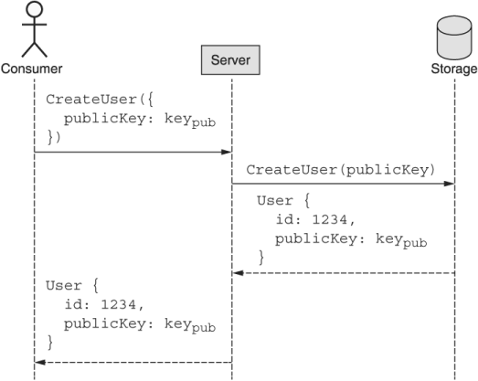

本章涵盖内容

- 请求认证系统的要求
- 数字签名概述
- 凭证生成、注册和签名
- 指纹 HTTP 请求
- 传达签名的详细信息
- 验证签名和验证 HTTP 请求

在此模式中，我们将探讨如何以及为何使用公私密钥交换和[数字签名](https://en.wikipedia.org/wiki/Digital_signature) 来验证所有传入的 API 请求。这确保了所有入站请求都保证了完整性和原始真实性，并且它们以后不能被发送者拒绝。虽然替代方案（例如: 共享秘密和 [HMAC](https://en.wikipedia.org/wiki/HMAC)）在大多数情况下是可以接受的，但在引入需要不可否认性的第三方时，这些方案失败了。

## 30.1 动机
到目前为止，我们只是假设所有 API 请求都保证是真实的，将安全问题留待以后处理。正如你可能猜到的，现在是我们需要探索一个基本问题的时候了：给定一个入站 API 请求，我们如何确定它来自实际的授权用户？

最终，满足给定请求的决定归结为是或否答案，但我们需要考虑几个不同的要求才能做出这个二元决定。首先，我们需要知道请求是否与它声称的来自同一用户。换句话说，如果请求声明它是由用户 1234 发送的，我们需要能够确定它确实来自用户 1234（因为我们定义了用户 1234 意味着什么）。接下来，我们需要确保请求内容没有被损坏或篡改。最后，毫无疑问，无私的第三方能够验证请求无疑来自特定用户，这一点可能变得很重要。换句话说，如果我们发现一个声称是从用户 1234 发送的请求（这是可验证的），那么用户 1234 以后一定不能声称该请求实际上是由其他人伪造的。让我们花点时间更详细地探讨每个方面，从请求的来源开始。

### 30.1.1 起源
我们需要的第一个也是最重要的能力是确定请求的来源。在这种情况下，我们不关心地理来源，而是关心发送请求的用户，这将我们引向了身份的概念。

与现实世界中的身份概念不同，我们对驾照或出生证明不感兴趣。相反，我们真正关心的是，如果一个请求声称来自用户 1234，那么该请求也有某种证明，只能由作为用户 1234 注册我们服务的同一方提供。 有很多方法为了实现这一点，我们将在 30.2 节中讨论，但现在让我们继续讨论我们所说的完整性的含义。

### 30.1.2 完整性
完整性是指确定收到的请求内容与发送时的内容完全相同，这是 API 安全难题的关键部分。没有它，即使我们可以确定请求的来源（例如: 声称来自用户 1234 的请求具有用户 1234 的凭据），我们也无法确定请求的内容从未被篡改过发送后。如果我们不能确定请求与发送时的相同，那么知道它来自哪里并没有多大用处。

虽然不常见，但请求肯定可以在传输过程中改变。这可能从无意的错误（例如: 某些网络基础设施出现故障并弄乱数据）一直到恶意的（例如: 有人拦截了请求并故意篡改了它），但重点仍然是：我们必须'能够确定请求的内容在发送后是否以任何方式被修改，并拒绝任何在传输过程中被修改的请求。

此外，即使我们通常可以依赖网络层安全性（例如 TLS），但这样做意味着以表面价值获取传入请求，而不是验证请求本身，并假设请求以正确的方式传输。虽然如果我们可以假设每个人总是在网络安全方面做正确的事情会很可爱，但事实证明，我们的其他要求导致这方面免费出现。

### 30.1.3 不可否认性
不可否认性是指一旦我们验证了请求的来源，该来源就不能否认它们是来源。在这一点上，你可能会想，"但为什么这甚至是一个问题？要是能查到来源，那这个要求就已经暗示了！"事实证明，这几乎是正确的，但还有更多内容。

真正令人担忧的是，设计一个对称的凭证系统非常容易，其中证明你是用户 1234 所需的凭证与验证请求来自用户 1234 所需的凭证相同，有点像两者之间的共享秘密两党。这种对称凭证的想法直到现在才成为问题，因为 API 请求永远不应该来自 API 服务器的关键假设。但是当其他人（不是用户 1234 和 API 服务器）需要验证用户 1234 是请求的真正来源时会发生什么？该第三方如何区分真实来源为用户 1234 的请求和由 API 服务器伪造的、仅用于验证用户 1234 的共享凭证的请求？

这个要求非常明确地规定，用户证明他们是请求的真正来源的机制也不能与 API 服务器共享。换句话说，用于证明和验证 API 请求来源的凭证必须是非对称的，每一方都有不同的凭证。通过这样做，我们确保用户是唯一可以访问凭证的一方，查看来自用户的请求的第三方可以确保该请求源自该用户并且不是由 API 服务器伪造的。

## 30.2 概述
虽然有许多设计竞争者，但其中一种选择脱颖而出：数字签名。我们将在下一节详细介绍数字签名的工作原理，但重要的是要涵盖它们是什么以及为什么它们适合这些要求的基础知识。

从根本上说，数字签名只不过是一个字节块。也就是说，这些字节代表一个值，毫无疑问，只能使用一对特殊的凭据生成和验证。这意味着使用一个凭证生成的签名实际上不可能在不拥有该凭证的情况下重新创建。

然而，这些加密数字签名最重要的区别属性与凭证的不对称性有关。这种不对称意味着用于生成签名的凭证与用于验证它的凭证不同。换句话说，这对凭证中的每个凭证都有一个角色：一个用于生成签名，另一个用于验证签名。

在对 API 请求进行身份验证时，数字签名恰好非常适合这些要求。首先，它们的加密性质意味着证明签名是由拥有正确凭据的人生成的本质上很简单。其次，签名依赖于被签名的消息这一事实意味着，如果消息以任何方式被更改，则签名无效。最后，因为只有一个方能够生成数字签名，所以该方无法在以后声称签名是伪造的。换言之，该机制符合第 30.1 节中列出的所有三个关键标准。

但是这些签名究竟是如何工作的呢？我们如何将它们集成到 Web API 中？使用数字签名进行请求身份验证的过程涉及三个不同的阶段。首先，用户创建一个公私密钥对。接下来，我们允许用户注册 API 服务，根据对的公共部分与系统建立身份。从那时起，用户可以简单地使用他们的私钥对所有请求进行数字签名，API 服务器可以使用之前关联的公钥验证这些签名。

如果这听起来有点简单，别担心；在下一节中，我们将更详细地介绍这些概念。

## 30.3 实现
正如我们在 30.2 节中了解到的，使用数字签名进行请求身份验证是用户和 API 服务器双方的一个多阶段过程。我们将从整个系统的基础开始我们的旅程：生成正确的非对称凭证。

### 30.3.1 凭证生成
在用户可以做任何事情之前，他们首先需要生成一个密钥对。此密钥对是一种特殊类型的凭证，由两部分组成：私钥和公钥。私钥绝对保密是至关重要的，因为正如我们之前了解到的，拥有正确的凭证是身份的定义。换句话说，拥有正确的凭证就足以证明，凭证上没有照片可以与出示它作为二次检查的人进行比较。

但是为什么用户必须负责生成这对凭据呢？为什么服务器不能生成它们，然后简单地将私钥给用户以供以后使用？正如我们在不可否认性要求中了解到的那样，拥有一对非对称凭据（而不是共享机密）的全部意义在于防止用户否认他们签署了请求。这是有效的，因为用于签署请求的凭据只在用户手中，不会与 API 服务器共享。在这种情况下，如果我们允许 API 服务器生成凭证，我们只能保证他们没有为自己保留该密钥的副本。此外，我们必须担心通过互联网传输的私钥，这会带来被拦截的（虽然很小，但确实存在）风险。因此，如果我们真的要满足不可否认性的要求，私钥永远不会离开用户的手。

我们如何生成这个密钥？有许多工具，例如大多数 Linux 系统上的 ```ssh-keygen```，但以下 TypeScript 代码展示了如何以编程方式执行此操作。

清单 30.1 生成一组凭证

```typescript
const crypto = require('crypto');
 
interface KeyPair {
  publicKey: string;
  privateKey: string;
}
 
function generateCredentials(size = 2048): Promise<KeyPair> {
  return new Promise<KeyPair>( (resolve, reject) => {
    crypto.generateKeyPair('rsa', { modulusLength: size },
      (err, pub, priv) => {
      if (err) { return reject(err); }                             // ❶
      return resolve({
        publicKey: pub.export({ type: 'pkcs1', format: 'pem' }),   // ❷
        privateKey: priv.export({ type: 'pkcs1', format: 'pem' })
      });
    });
  });
}
```

❶ 如果出现任何错误，只需拒绝承诺即可。
❷ 使用字符串序列化数据作为公钥和私钥值。
在客户端执行这样的代码后，他们将留下一个公钥，该公钥序列化为我们可以与他人共享的字符串。现在我们需要以某种方式将这个公钥传输到 API 服务器，以建立我们的身份。

### 30.3.2 注册和凭证交换
正如我们在 30.1.1 节中了解到的，身份是一个重要的概念，但是当涉及到请求身份验证时，这个概念的具体解释与我们在日常工作中所期望的有点不同生活。特别是，识别用户并没有什么绝对的。换句话说，API 服务器永远不会验证用户的内在内容（例如: 他们的指纹），而是将身份定义为持有建立该身份的凭证的任何人。简而言之，证明你拥有分配给某个身份的秘密就足以证明你就是该身份。

这使得注册的想法更简单。在这种情况下，我们可以通过提供公钥凭证来允许新用户注册 API，我们将为该用户生成一个唯一标识符。这一系列事件如图 30.1 所示。



使用这种简单的原子标准创建方法，我们进行了一次 API 调用，现在有了一个唯一标识符，可用于未来的请求（例如: 用户 1234），并且公钥凭证可用于在接受请求之前验证签名。请注意，这也避免了使用更传统的方法（例如用户名和密码）对服务进行身份验证的要求。相反，该方案从一开始就完全依赖于数字签名。

既然我们已经介绍了如何生成凭证并将它们安全地与 API 服务器共享以建立对身份的共同理解，那么我们究竟如何使用这些密钥？

### 30.3.3 生成和验证原始签名
无需详细介绍密码学或数论，关于数字签名要记住的重要一点是，它是一个特殊的数字，可以使用私钥轻松计算，但没有该密钥几乎不可能计算。同样，可以使用公钥快速轻松地验证这个特殊数字，但不能使用相同的公钥生成相同的签名值。从某种意义上说，它有点像一个安全的玻璃盒子：只有拥有钥匙的人才能在里面放东西，但是一旦有了东西，任何人都可以看到该物品并知道它是由拥有钥匙的人放在那里的。

为了计算签名，我们将请求正文与私钥结合起来，我们可以依靠标准库（例如 Node.js 的加密包）来处理生成签名的实际困难数学工作。

代码清单 30.2 对任意字符串进行签名

```typescript
const crypto = require('crypto');
 
function generateSignature(payload: string, privateKey: string): string {
  const signer = crypto.createSign('rsa-sha256');
  signer.update(payload);
  signer.end();
  return signer.sign(privateKey);
}
```

验证签名同样简单。 我们获取签名、我们期望被签名的有效载荷以及相应的公钥，并使用标准库函数将这三者结合起来。 该函数的结果将是一个简单的布尔值，说明签名是否签出。

清单 30.3 验证任意签名

```typescript
const crypto = require('crypto');
 
function verifySignature(
    payload: string, signature: string, publicKey: string): Boolean {
  const verifier = crypto.createVerify('rsa-sha256');
  verifier.update(payload);
  verifier.end();
  return verifier.verify(publicKey, signature);
}
```

这两个示例可能看起来令人惊讶的一件事是有效负载参数是一个字符串，而不是一个对象或 API 请求的其他表示形式。但这实际上给我们带来了一个重要的问题：我们到底应该签署什么？

事实证明，这个问题比听起来要复杂得多。在下一节中，我们将讨论在生成或验证数字签名时如何确定将什么内容放入有效载荷参数中。

### 30.3.4 请求指纹识别
到目前为止，我们已经摆摆手说我们必须签署请求，但并没有真正具体说明这是如何运作的。让我们花点时间探讨在将请求发送到 API 服务器之前决定应该签署什么时需要考虑的一些方面。

尽管只对请求正文进行签名可能很诱人，但事实证明，即使这样也比看起来要复杂一些，因为请求正文要求我们序列化数据（例如: 在 TypeScript 中使用 JSON.stringify()），并且实际上有很多不同的序列化方式，甚至依赖于相同的序列化格式。例如: 有多种字符编码和规范化形式，导致许多字符串在语义上可能相同但仍然具有不同的字节表示。此外，对于包括 JSON 在内的大多数格式，通常没有关于属性在各种类似地图的结构中出现的顺序的规则。例如: 虽然 {"a": 1, "b": 2} 在语义上与 {"b": 2, "a": 1} 相同，但这些值的字节表示完全不同。

由于计算数字签名对原始的、不透明的字节进行操作，这意味着内容的低级字节表示实际上非常重要。例如: 如果验证签名的一方使用相同语义消息的不同字节表示，这将导致签名失败，而实际上内容并没有真正改变。相反，字节表示只是以不同的方式计算。

更复杂的是，我们必须记住，API 请求可能不仅仅涉及请求正文。例如: 当删除使用 HTTP 作为传输机制的资源时，HTTP 请求正文为空（而不是类似 ```{"id": "chatRooms/1"}``` 的内容）。相反，预期的操作在 HTTP 动词 (```DELETE```) 中编码，要删除的目标在 URL (```/chatRooms/1```) 中表示。此外，HTTP 标头中可能还有其他一些对请求的含义和完整性很重要的信息（例如: 发送请求的时间）并且确实应该包括在计算签名中。这些因素中的每一个都使我们拥有某种计算请求指纹的方法变得更加重要，该指纹可以唯一地表示给定的请求，并在使用私钥计算数字签名时最终充当有效负载。

但是我们如何定义这个指纹呢？为了弄清楚这一点，我们需要考虑 HTTP 请求的哪些部分需要包含在签名中。幸运的是，这个问题的答案非常简单。首先，我们需要合并 HTTP 方法、URL（主机和路径）和请求正文。此外，如果存在，我们应该包括请求发送时间的指示；大多数情况下，它出现在名为"Date"的 HTTP 标头中，以支持拒绝可能太旧的请求（这些字段的摘要显示在表 30.1 中）。

表 30.1 对 HTTP 请求进行指纹识别所需的组件

| Field   | Location    | Description    |
| ------- | ----------- | -------------- |
| Method  | 第一行      | 请求的动作     |
| Path    | 第一行      | 请求的目标资源 |
| Host    | HTTP header | 请求的目标主机 |
| Content | HTTP body   | 请求的有效载荷 |
| Date    | HTTP header | 创建请求时     |

正如我们所见，数据来自不同的位置，这让我们的工作变得更加复杂。 为了简化这一点，我们可以做两件事。 首先，我们可以将 HTTP 请求的第一行视为特殊的东西，通常称为请求目标，包括 HTTP 方法（例如 POST）和路径（例如 ```/chatRooms/1```）。 其次，与其依赖可能会变得过大的请求正文签名，我们可以计算正文的哈希值并将其存储在名为"摘要"的单独 HTTP 标头（Base64 格式）中。 通过依赖这个派生字段，我们可以在限制其大小的同时保持指纹的完整性和安全性。

清单 30.4 为摘要头生成哈希值

```typescript
const crypto = require('crypto');
 
function generateDigestHeader(body: string): string {
  return 'SHA-256=' + crypto                          //❶
    .createHash('sha256')
    .update(body)
    .digest()
    .toString('base64');                              //❷
}
```

❶ 我们用所使用的哈希算法规范（在本例中为 SHA-256）作为哈希前缀。
❷ 散列应该是 Base64 编码的。
一旦我们完成了这些事情，我们就需要组装这些部件。 为此，我们可以使用组件的有序列表（例如: 请求目标、主机、日期和摘要），适当地格式化它们（例如: 将标头转换为小写字符），并将每个组件放在一个带有换行符的字符串中 每个字符之间。

清单 30.5 给定 HTTP 请求生成指纹

```typescript
const HEADERS = ['(request-target)', 'host', 'date', 'digest'];
 
function generateRequestFingerprint(
    request: HttpRequest, headers = HEADERS): string {
  return headers.map((header) => {
    let value;
    if (header === '(request-target)') {                          // ❶
      value = `${request.method.toLowerCase()} ${request.path}`;
    } else if (header === 'digest') {                             // ❷
      value = generateDigestHeader(request.body);
    } else {                                                      // ❸
      value = request.headers[header];
    }
    return `${header.toLowerCase()}: ${value}`;                   // ❹
  }).join('\n');
}
```

❶ "(request-target)"字段应该包括小写的HTTP方法和路径。
❷ "digest"字段应生成请求正文的哈希值。
❸ 所有其他值都应该与请求头中指定的一样。
❹ 最后，返回一组键值对，用冒号分隔（就像标题一样）。

清单 30.6 用于签署 HTTP 请求的指纹示例

```typescript
(request-target): patch /chatRooms/1                           // ❶
host: example.org
date: Tue, 27 Oct 2020 20:51:35 GMT
digest: SHA-256=HV9PltG0QPRNsl1FB7ebQA8XPasvPyRg6hhU0QF2l4M=   // ❷
```

❶ 特殊的"```(request-target)```"字段被视为任何其他标头。
❷ 我们还包括额外的摘要标题。
这种键值对的规范格式足以作为请求的指纹，更重要的是，我们最终可以将其用作计算数字签名的有效载荷。它包含有关请求的目标资源 (```/chatRooms/1```)、操作 (PATCH)、目的地 (example.org)、时间（10 月 27 日）和正文（以 SHA-256 哈希摘要的形式）的所有信息) 以便稍后唯一标识请求。

下一个问题是我们需要以某种方式通知 API 服务器我们是如何计算这个指纹的。在下一节中，我们将探讨如何与服务器通信这些参数，以确保它能够正确地为请求提供相同的指纹。

### 30.3.5 包括签名
在我们计算了请求指纹之后，我们不能只是签署它并称它为一天。为了确保 API 服务器能够正确验证签名，它必须能够计算给定入站请求的相同指纹值。为此，我们需要包含一些关于指纹和签名的元数据。

首先，我们需要清楚指纹中包含哪些标头，关键是按什么顺序。只有头列表是不够的，因为以不同的顺序呈现它们会导致不同的指纹。接下来，我们需要以某种方式告诉 API 服务器应该使用哪个公钥来验证签名。此 ID 可以等同于注册期间创建的用户 ID，因为每个用户都只有一个公钥。最后，我们还应该包括用于生成签名的算法，以便 API 服务器可以使用相同的算法对其进行验证。这些字段的摘要显示在表 30.2 中。

表 30.2 定义签名所需的组件

| Field     | Description                      |
| --------- | -------------------------------- |
| headers   | 用于生成请求指纹的标头的有序列表 |
| keyId     | 用于选择公钥进行验证的唯一 ID    |
| signature | 待验证的数字签名内容             |
| algorithm | 用于生成签名的算法               |

一旦我们获得了所有这些信息，我们就可以将其组装起来，并将生成的值与请求一起传递到一个特殊的签名标头中。

清单 30.7 给定指纹和其他组件生成签名头

```typescript
const HEADERS = ['(request-target)', 'host', 'date', 'digest'];
 
interface SignatureMetadata {
  keyId: string;
  algorithm: string;
  headers: string;
  signature: string;
}
 
function generateSignatureHeader(
    fingerprint: string, userId: string,
    privateKey: string, headers = HEADERS): string {
  const signatureParts: SignatureMetadata = {               // ❶
    keyId: userId,
    algorithm: 'rsa-sha256',
    headers: headers.map((h) => h.toLowerCase()).join(' '),
    signature: generateSignature(fingerprint, privateKey)
  };
 
  return Object.entries(signatureParts).map(([k, v]) => {   // ❷
    return `${k}="${v}"`;
  }).join(',');
}
```

❶ 指定不同签名组件的列表。
❷ 将部分组合成逗号分隔的带引号的键值对。
此函数的输出最终应该是我们需要充分定义签名的每个不同字段的逗号分隔字符串。

清单 30.8 签名头的值示例

```typescript
keyId="1234",algorithm="rsa-sha256",headers="(request-target)
➥ host date digest",signature="mgBAQEsEsoBCgIOBiNfum37y..."
```

现在我们有了所有的部分，剩下的就是组装所有东西。 这意味着我们需要接受一个 HTTP 请求并附加两个新标头：摘要标头和签名标头。 我们可以使用我们之前定义的辅助方法来完成繁重的工作。

代码清单 30.9 签署请求的函数（分配相关标头）

```typescript
const HEADERS = ['(request-target)', 'host', 'date', 'digest'];
 
function signRequest(
  request: HttpRequest, userId: string,
    privateKey: string, headers = HEADERS): HttpRequest {
  request.headers['digest'] = 
    generateDigestHeader(request.body);                    // ❶
  const fingerprint = 
    generateRequestFingerprint(request, headers);          // ❷
  request.headers['signature'] = generateSignatureHeader(
    fingerprint, userId, privateKey, headers);             // ❸
  return request;                                          // ❹
}
```

❶ 更新摘要标题。
❷ 生成签名所需的请求指纹。
❸ 更新签名头。
❹ 返回增加的请求。
此函数的输出是一个请求，该请求应包含设置为请求正文散列的摘要标头以及签名标头，该标头不仅包含数字签名，还包含 API 服务器验证请求所需的所有信息 签名值本身。

清单 30.10 完整签名的 HTTP 请求示例

```typescript
PATCH /chatRooms/1
Host: example.org
Digest: SHA-256=HV9PltG0QPRNsl1FB7ebQA8XPasvPyRg6hhU0QF2l4M=
Signature: keyId="1234",algorithm="rsa-sha256",headers="
           (request-target) host date digest",
           signature="mgBAQEsEsoBCgIOBiNfum37y..."
Date: Tue, 27 Oct 2020 20:51:35 GMT
 
{"title":"New title"}
```

请注意，实际请求中标头的顺序并不重要。这是因为我们已经指定了在验证签名时应该使用头来生成指纹的顺序。接下来我们需要考虑的是 API 服务器究竟如何验证签名并最终验证请求。让我们在下一节中看看这个。

### 30.3.6 验证请求
如你所料，我们可以依靠相同的算法来验证签名，从而验证请求。但是我们究竟需要验证什么？

首先，我们需要确保摘要标头实际上是请求正文中内容的真实表示。如果不是，这意味着自计算散列以来请求正文已更改，应拒绝该请求。接下来，我们需要使用签名标头中提供的模式重新计算请求的指纹。之后，我们需要使用该标头中提供的密钥标识符来查找应该用于验证签名的公钥。最后，我们应该使用公钥和指纹来验证签名是否正确。

虽然这听起来很多，但我们已经编写了大部分代码来完成繁重的工作。

清单 30.11 验证给定请求对象的签名

```typescript
function parseSignatureHeader(signatureHeader: string):      // ❶
    SignatureMetadata {               
  const data = Object.fromEntries(
    signatureHeader
    .split(',')                                              // ❷
    .map((pair) => pair.split('='))                          // ❸
    .map(([k, v]) => [k, v.substring(1, v.length-1)]));      // ❹
  data.headers = data.headers.split(' ');                    // ❺
  return metadata;
}
 
async function verifyRequestSignature(request: HttpRequest):
    Promise<Boolean> {
  if (generateDigestHeader(request.body) !==
      request.headers['digest']) {                           // ❻
    return false;
  }
  const metadata = parseSignatureHeader(
    request.headers['signature']);                           // ❼
  const fingerprint = generateRequestFingerprint(
    request, metadata.headers);                              // ❽
  const publicKey = (await database.getUser(
    metadata.keyId)).publicKey;                              // ❾
  return verifySignature( 
    fingerprint, metadata.signature, publicKey);             // ❿
}
```

❶ 首先，我们需要一个函数来将签名标头解析为单独的组件。
❷ 拆分 k="v",k="v" 对。
❸ 拆分 k="v" 对。
❹ 删除引号。
❺ 只拆分标题。
❻ 验证请求正文是否与摘要标头匹配。
❼ 将签名头解析成一堆片段。
❽ 确定基于标头签名的有效负载。
❾ 找出所提供 ID 的公钥（存储在数据库中的某处）。
❿ 使用公钥根据指纹验证签名。
有了这个，我们现在能够生成一些凭据并将其注册到 API 服务器，对出站请求进行数字签名，并对来自用户的入站请求进行身份验证。

### 30.3.7 最终 API 定义
此模式的最终 API 定义非常简单，仅涉及使用关联的公钥创建新用户并稍后通过其 ID 检索这些用户的方法。前面已经探讨了如何签署请求和验证签名的实现，因此本节不会重现相同的代码。

清单 30.12 最终 API 定义

```typescript
abstract class ChatRoomApi {
  @post("/users")
  CreateUser(req: CreateUserRequest): User;
 
  @get("{id=users/*}")
  GetUser(req: GetUserRequest): User;
}
 
interface CreateUserRequest {
  resource: User;
}
 
interface GetUserRequest {
  id: string;
}
 
interface User {
  id: string;
  publicKey: string;
  // ...
}
```

## 30.4 权衡
由于有许多不同的身份验证方法可用，因此在选择其中一种方法时显然需要权衡取舍。尽管数字签名请求几乎可以肯定是最安全的选项，但这并不能使其成为所有情况下的正确选择。事实上，对这种类型的设计最常见的反对意见是它对场景来说太过分了。

例如: 在许多情况下，不可否认性与其说是真正的要求，不如说是"很高兴拥有"。坚持不可否认的论点是当你可能会提供签名的请求供其他人稍后执行（涉及可能或可能不完全信任的第三方），或者当 API 请求本身特别敏感时（例如: 更新健康或财务记录） .在这些情况下，不可否认性对于 API 服务器保护自己免受在未来历史日志审计期间可能出现的不当指控（例如: 用户声称他们从未提出这些请求）很重要。

虽然这些事情并非不可能，但它们肯定不是非常普遍。毕竟，当我们在 Facebook 或 Twitter 上更新我们的数据时，我们并不是真的打算事后拒绝 API 请求。因此，其他系统（例如使用具有共享秘密的 HMAC）当然值得探索。虽然我们不会详细介绍使用 HMAC 或其他使用短期访问令牌的标准身份验证机制（例如: [OAuth 2.0](https://oauth.net/2/)），但对于任何 API 来说，这些几乎肯定是有效的选项具有稍微不那么严格的要求，并且可以期望依赖于在传输层实现的适当的安全协议。

但是，当你可以使用最安全的选项时，为什么不直接依赖它呢？一个常见的答案是，这种类型的密码学计算量更大，最终由 API 服务器本身处理，而不是在堆栈中的较低级别处理。事实上，即使在公共密钥密码学的常见用法中，例如 SSL，系统也只是预先使用非对称系统来交换临时对称密钥，此后依赖于强度较低的对称算法。因此，关注可用计算资源的系统可能会选择更高效的替代方案。

## 30.5 练习
1. 证明请求的来源和防止未来否认之间有什么区别？为什么前者不能支配后者？
2. 客户端和服务器之间的共享秘密不满足哪个要求？
3. 为什么请求指纹包含 HTTP 方法、主机和路径属性很重要？
4. 以这种模式布置的数字签名是否容易受到重放攻击？如果是这样，如何解决这个问题？

## 总结

- 成功的请求认证有三个要求：来源证明、完整性证明和防止否认。
- 来源是请求来自已知来源的证据，没有任何不确定性。
- 完整性的重点是确保从已知来源发送请求时，请求本身没有被篡改。
- 不可否认性是指请求者无法在以后声称该请求实际上是从其他人发送的。
- 与现实世界的身份不同，身份验证依赖于被定义为拥有密钥的身份，有点像不记名债券。
- 签名请求时，签名的实际内容应该是请求的指纹，包括HTTP方法、路径、主机和HTTP正文中的一组内容。