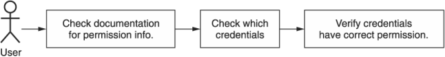
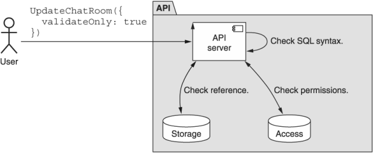
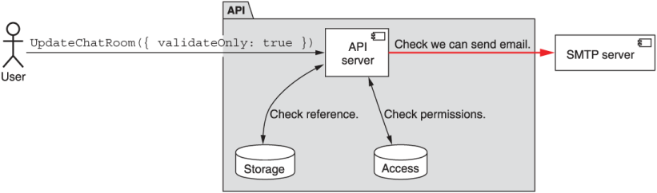
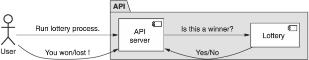

本章涵盖内容

- 为什么某些 API 方法应该支持请求前验证
- 如何管理与验证请求的外部依赖项的交互
- 解决验证请求中方法的特殊副作用

API 可能会令人困惑。有时，它们可能会令人困惑，以至于不清楚给定 API 调用的结果是什么。对于安全的方法，我们有一个简单的解决方案来计算结果：试一试。但是，对于不安全的方法，该解决方案显然不起作用。在这个模式中，我们将探索一个可以添加到请求接口的特殊 ```validateOnly``` 字段，它将作为一种机制，通过它我们可以看到如果执行请求会发生什么，而无需实际执行请求。

## 27.1 动机
即使是最直接的 API 也可能有些混乱——毕竟 API 很复杂（否则就不会有这样的书）。无论我们阅读文档多少次，仔细检查我们的源代码，调查授予我们的权限，并查看我们将要发送到 API 的出站请求，我们很少在第一次尝试时就做对了.也许在下一次尝试中。或者之后的那个。关键是会有很多次尝试，有的不成功也没关系，或者确实成功了，但是方法不对。

当我们刚开始时，这种查看并查看发生了什么的方法非常有效，但当涉及到生产系统时，它可能会导致严重的问题。这与大多数人在出现问题时将他们的汽车带到机械师那里的原因相同：他们可以戳它，但这有破坏它的风险。它不是玩具车，而是上下班、上学或去杂货店的重要工具。

起初，我们可以通过只研究不会改变任何数据或有任何可怕副作用的安全方法来规避这种危险，但其他方法呢？例如: 我们可能不想试验名为 ```DeleteAllDataAndExplode()``` 的方法。并不是说我们不需要尝试这些方法；我们根本没有这样做的好方法。

当我们意识到在检查像我们是否有权执行给定的 API 方法这样简单的事情时会涉及多少人为错误时，这一点至关重要。例如: 考虑我们要验证是否可以调用 ```DeleteAllDataAndExplode()``` 方法的情况。如图 27.1 所示，我们可以查看文档以了解需要哪些权限，然后检查我们使用哪些凭据发送 API 调用，然后在系统中检查这些凭据是否具有文档中列出的权限。但是，如果依赖链的任何地方出现错误怎么办？



归根结底，人类会犯错，而计算机只是按照他们的指示去做（即使我们可能打算以不同的方式指导他们）。因此，虽然我们可能 99% 地确定一切都会顺利进行，但在我们尝试之前，我们无法确定。必须有更好的方法来试验所有 API 方法——即使是危险的方法。

## 27.2 概述
由于我们的目标是允许用户获得对其 API 调用的预览响应，因此我们可以使用单个字段来实现此目的，指定请求应仅用于验证目的。当 API 方法看到请求将被验证而不执行时，它可以执行尽可能多的实际工作，而不会导致底层系统发生任何真正的变化。在某种程度上，指定为只需要验证的请求应该有点像在自动回滚且永不提交的事务中执行工作。

清单 27.1 支持验证请求的标准创建方法示例

```typescript
interface CreateChatRoomRequest {
  resource: ChatRoom;
  validateOnly?: boolean;      // ❶
}
```

❶ 我们依靠一个简单的布尔标志来指示请求是否仅用于验证。
这样做的原因很简单，用户应该获得尽可能多的验证。这意味着应该检查请求是否允许执行操作、是否与现有数据冲突（例如: 可能不满足唯一字段要求）、参照完整性（例如: 请求可能引用另一个不符合要求的资源）存在），以及对请求的任何其他服务器端验证形式。一般来说，如果请求在实际执行时抛出错误，则在验证时应该抛出相同的错误。

虽然勇敢，但这并不总是可能的。这可能是由于许多不同的原因（例如: 连接到外部服务或其他依赖项，如第 27.3.1 节所述），但目标保持不变：尝试使验证响应尽可能接近真实事物。在下一节中，我们将探讨如何处理仅验证请求的所有细节以及需要解决的各种棘手场景。

## 27.3 实现
正如我们在清单 27.1 中看到的，我们可以允许用户通过将 ```validateOnly``` 字段设置为显式布尔值 true 来指定请求仅用于验证。否则，默认情况下，该请求只不过是一个常规请求。这个默认值很重要，因为如果我们选择相反的方式（默认总是只验证请求），我们会在默认情况下无意中削弱所有请求的实际工作。在这种情况下，为了获得类似于正常行为的任何东西，我们总是需要设置一个标志，这对于任何 API 来说都可能是一个大错误。

由于目标是提供对请求的响应的真实预览，因此验证请求应努力验证请求的尽可能多的方面，这可能涉及与其他远程服务交谈（只是实际上不修改任何数据）。例如（如图 27.2 所示），我们可能会与访问控制服务对话以确定用户是否有权执行请求的操作。如果存在需要担心的参照完整性问题，我们可能会检查资源是否存在。我们可能会验证一些参数的正确性，例如确保字符串 SQL 查询的格式有效。



此外，对请求的响应应该代表对常规（非验证）请求的响应。这意味着如果请求会因任何原因导致错误，我们应该完全按照其他方式返回该错误。例如: 如果我们无权执行请求，我们可能会收到 ```403 Forbidden HTTP``` 错误。

另一方面，如果请求成功，则响应应尽可能接近真实响应。这意味着应该填充可以为响应类型合理填写的任何字段。某些字段根本无法填写（例如: 服务器生成的标识符），应留空或填写逼真（但肯定无效）的值。但最终，结果字段主要用于确认请求将成功执行，因此在响应中返回所有信息不应该是硬性要求。为此，用户应该执行真正的请求而不是验证请求。不用说，支持对某些方法的验证请求而不是其他方法是完全合理的——毕竟，在某些方法上它可能根本没有意义。

所有这一切中最重要的是，任何验证请求都应该产生一个完全安全和幂等的方法。这意味着不应更改任何数据，不应以任何方式显示任何副作用，并且任何标记为"仅验证"的请求都应每次重新运行并获得相同的结果（假设系统中没有发生其他更改） .

当 API 方法是只读的但不一定免费时，这可能会令人困惑。例如: 考虑一个查询大型数据仓库的 API 方法。从技术上讲，对大量数据运行 SQL 查询不会改变任何数据，但它肯定会花费很多钱。在某些情况下，成本与恰好与查询本身匹配的数据量有关。在这种情况下，尽管 validateOnly 参数看起来可能是不必要的，但它实际上非常关键。否则，用户如何确定他们的 SQL 查询是否只包含有效的语法？虽然我们可能无法验证查询的所有方面，但我们至少可以在查询无效的情况下返回错误结果。

尽管如此，不幸的事实是，请求的某些方面会导致我们违反这些关于始终完全安全和幂等的规则，所以我们有一个大问题要回答：在提供完全保真行为时我们该怎么做的方法导致违规，例如非幂等方法？在下一节中，我们将查看外部依赖项以及如何在验证请求的上下文中使用它们。

### 27.3.1 外部依赖
验证请求存在问题的一个明显地方是对外部服务或库的依赖。原因很简单：由于我们无法控制这些外部性，我们无法解释我们只是为了验证目的而与它们进行通信。例如: 如果我们的 API 在 ChatRoom 资源更新时发送电子邮件消息，我们可以通过向特定收件人发送测试电子邮件来验证我们是否可以向他们发送电子邮件（如图 27.3 所示），但这对于验证请求。因此，我们必须做出选择：避免验证某些方面或违反我们关于副作用、安全性和幂等性的规则。



幸运的是，选择很简单：遵守规则。如果外部依赖支持这样的验证请求，那么我们可以很高兴地依赖它们为我们提供对下游服务进行真正验证所需的信息；但是，如果这不可用，我们应该完全跳过它。拥有安全、幂等且无副作用的验证过程的重要性远比验证每个小问题重要。

这可能意味着当很明显外部资源不支持必要的用例时，需要花一些额外的时间来执行其他相关的验证。例如: 虽然我们可能无法测试使用外部服务发送电子邮件，但我们可能会执行某种电子邮件地址格式验证以至少捕获明显的无效数据（例如: 不存在"@"符号的电子邮件） .它当然不是一个完美的替代品，但总比不进行验证要好。

### 27.3.2 特殊副作用
即使我们控制整个系统并且不维护任何外部依赖项，仍然有可能为验证请求提供有用的预览响应可能会造成混淆。 考虑一个特殊的聊天室彩票功能的例子，它的方法随机返回一个特殊的中奖响应（如图 27.4 所示）。 假设请求是有效的，那么当我们向这个方法发送验证请求时，响应应该是什么？ 或者，如果我们有一些更具确定性而不是纯粹随机的东西，但仍然依赖于聊天室中其他人的行为怎么办？ 例如: 如果不是随机选择的获胜者，它更像是一场广播节目竞赛，其中每 100 次调用 API 方法都会产生一个特殊响应，该怎么办？ 这是否会改变我们对可能的反应的看法？



由于不可避免地会出现我们不能省略信息而必须做出选择的情况（例如: 一个布尔字段表示我们是否中了彩票），因此记住这种验证方法的目标很重要。首先，我们需要验证请求并返回可能出现的任何潜在错误。其次，假设请求确实有效，我们应该返回一个似是而非的结果，该结果不一定是真实的，而是代表现实的。

如果我们遵循这些指导方针，我们之前问题的答案就会简单得多：我们应该在某些时候随意返回中奖结果，而在其他时候返回中奖结果。这些中奖的百分比不一定需要反映真实的彩票赔率，只要结果是如果结果是真实的就可以合理地返回。对于更具确定性的无线电竞赛风格也是如此：有时我们可能会获胜，而其他人可能不会，因此响应值可以是其中之一；两者都代表现实。简而言之，任何可以作为真实响应通过的东西都应该被视为验证请求的可接受响应。

### 27.3.3 最终 API 定义
在这种情况下，API 定义本身相当简单：一个简单的（可选）布尔字段，允许用户指定请求仅用于验证，从而使请求完全安全和幂等。

清单 27.2 最终 API 定义

```typescript
abstract class ChatRoomApi {
  @post("/chatRooms")
  CreateChatRoom(req: CreateChatRoomRequest): ChatRoom;
}
 
interface CreateChatRoomRequest {
  resource: ChatRoom;
  validateOnly?: boolean;
}
```

## 27.4 权衡
通常，验证请求是对烦人问题的简单回答。通过提供一个简单的标志，这些用户可以在面对 API 中所有细节带来的大量复杂性时获得一定程度的确定性。也就是说，它们很少是必需品，而更多的是方便，主要是为了用户。

虽然用户是获得最大价值的人，但 API 本身仍然有好处。例如: 在 API 方法昂贵（无论是金钱上、计算上还是两者上）的情况下，如果该费用没有转嫁给用户，那么支持验证请求肯定会最大限度地减少浪费，原因很简单，因为用户可以表达他们的意图来简单地验证一个请求，从不执行它。

## 27.5 练习
1. 为什么我们应该依靠标志来使请求"仅验证"而不是单独的方法来验证请求？
2. 想象一个从远程服务获取数据的 API 方法。验证请求是否仍应与远程服务通信？为什么或者为什么不？
3. 支持对从不写入任何数据的方法的验证请求是否有意义？
4. 为什么 ```validateOnly``` 标志的默认值为 false 很重要？反转默认值是否有意义？

## 总结

- 一些 API 请求非常危险，它们值得支持用户在实际执行请求之前验证请求的方法。
- 支持此功能的 API 方法应提供一个简单的布尔字段 (```validateOnly```)，指示仅验证请求而不实际执行请求。这些请求应该被认为是安全的，并且不应该对底层系统产生任何影响。
- 通常会出现支持验证请求的 API 方法与外部服务交互的场景。在这些情况下，这些方法应尽其所能验证这些外部性，承认无法验证某些方面的安全性。