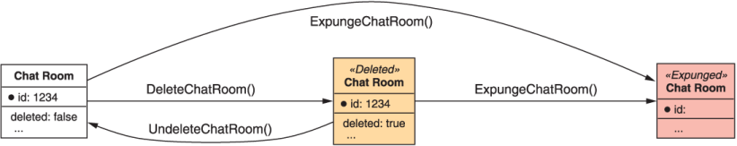
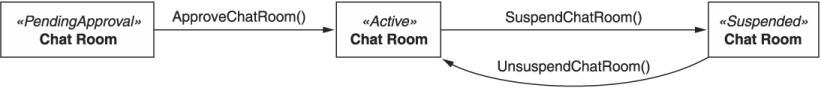
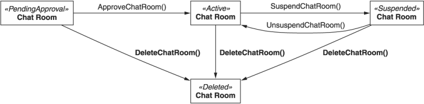
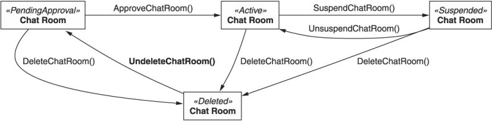

本章涵盖内容

- 软删除以及何时有用
- 如何指示资源被标记为已删除但未实际删除
- 支持软删除的资源的标准方法所需的修改
- 如何取消删除软删除的资源
- 如何永久删除（清除）软删除的资源
- 管理参照完整性

正如我们在第 7 章中了解到的，标准的 delete 方法有一个目标：从 API 中删除资源。但是，在许多情况下，这种从 API 中永久删除数据（所谓的硬删除）有点过于极端。对于我们想要相当于我们计算机的"回收站"的情况，其中资源被标记为"已删除"但在出现错误时仍然可以恢复，我们需要一个替代方案。在这种模式中，我们探索软删除，其中资源隐藏在视图中，并且在许多方面表现得好像它们已被删除，同时仍然提供取消删除和恢复到完整视图的能力。

## 25.1 动机
从 Windows 95 开始，Microsoft 引入了回收站，这是一个临时存储区域，用于存储用户请求删除但尚未从系统中永久删除的文件。问题很简单：太多人从他们的计算机中删除了文件，然后意识到他们不应该这样做。这可能是一个意外（点击了错误的文件），或者是一个精神错误（认为这是正确的文件，但意识到它不是），或者甚至只是后来改变了主意（认为他们已经完成了一个文件但后来意识到他们确实需要它），但重点仍然相同：他们需要一个可恢复的删除操作，并且与永久删除分开。同样的问题经常出现在 API 中。

我们可能会编写删除具有一组特定属性的所有资源的代码，但可能我们做了错误的比较并最终删除了一堆不应该符合条件的资源。我们可能有一个删除数据的脚本，并意识到我们在不应该删除数据时意外运行了它，或者在我们认为可以删除某些资源但后来意识到我们确实需要它们时运行了它。对于大型数据集，情况变得更糟。你能想象不小心从存储系统中删除了 PB 的用户数据吗？ （因此，你无法删除 Google Cloud Storage 服务中的整个存储分区。）

在这种情况下，如果我们的删除（即使仅针对某些资源类型）可以是部分的或软的，那就太好了，这样数据不一定会从地球表面删除，而只会在以下情况下隐藏起来我们正在探索我们的数据（例如: 使用标准列表方法）。为了使这种软删除形式真正有用，我们需要一种方法来像删除资源一样轻松地取消删除资源。最后，我们需要一种对资源执行原始永久删除的方法。

## 25.2 概述

幸运的是，实现我们软删除资源目标的机制非常简单：通过简单的已删除布尔标志或如果资源使用状态枚举，则将已删除状态存储在资源本身上。此字段将在资源的整个生命周期中用作标记，以指示我们应该将其与其他未删除的资源区别对待。

一旦我们有了这种存储资源已删除状态的新方法，我们就必须修改标准的删除方法来更新此状态，而不是完全删除资源。为了处理完全删除，我们将依靠一种特殊的自定义删除方法来承担此责任。最后，我们需要一种方法来恢复软删除的资源，从而使我们采用自定义的取消删除方法。支持软删除的资源的新生命周期可能类似于图 25.1。



在下一节中，我们将探讨此模式的详细信息以及支持软删除所需的所有更改和边缘情况。

## 25.3 实现
与 API 设计中的大多数主题一样，此模式的细节构成了我们为我们所做的大部分工作。在这种情况下，所有工作都源于我们一个简单的选择，即依赖附加字段来指示资源是否被删除。一旦我们决定了这个额外字段的外观，我们还有很多东西要介绍。

首先，我们需要调整几个标准方法，使其行为与第 7 章中定义的方式略有不同。例如: 标准删除方法现在需要更像一个标准，而不是完全删除资源update 方法，修改资源以将其标记为已删除。此外，标准列表方法将需要忽略已删除的资源。毕竟，如果它自动包含已删除的资源，那么首先就违背了将资源标记为已删除的目的！最后，我们需要新的自定义方法来涵盖每一个新的特殊行为：一个用于取消删除我们软删除的资源，另一个用于永久删除资源（就像过去的标准删除方法一样）。

像往常一样，这些新的方法和行为将导致其他复杂的问题需要回答。例如: 如果我们尝试软删除已标记为已删除的资源会发生什么？当其他资源引用标记为已删除的资源时，我们是否需要强制执行任何引用完整性规则？与标准删除方法类似的其他方法如何，例如批量删除方法？这些类型的方法是应该采用这种新行为还是继续保持目前的行为？

要解压的东西太多了，所以让我们首先介绍如何在资源上存储新的已删除状态。

### 25.3.1 删除指定
为了在资源类型上启用此模式，我们需要一种方法来指示资源应被系统的其余部分视为删除。在这种情况下，有两个明显的竞争者：一个简单的布尔标志字段和一个更复杂的状态字段。让我们从更简单的选项开始。

####布尔标志
在大多数情况下，指示资源已被软删除的最佳方法是在资源上定义一个简单的布尔字段。显然，该字段默认为 false，因为新创建的资源不应以已删除的方式开始其生命周期。

清单 25.1 带有布尔标志的软删除资源

```typescript
interface ChatRoom {
  id: string;
  // ...
  deleted: boolean;    // ❶
}
```

❶ 此标志定义是否应将资源视为软删除。
该字段更有趣的方面是它应该仅被视为输出。 这意味着如果有人尝试设置此字段（例如: 使用标准更新方法），则应忽略该值本身。 相反，正如我们稍后将看到的，修改此字段的唯一方法是使用标准删除方法（从 false 更改为 true）或自定义取消删除方法（以相反的方向进行）。 这意味着尝试仅更新资源上已删除字段的代码仍然会成功，但资源将保持不变。

清单 25.2 与仅输出字段交互的示例

```typescript
let chatRoom = GetChatRoom({ id: "1234" });  // ❶
assert chatRoom.deleted == false;
chatRoom.deleted = true;                     // ❷
chatRoom = UpdateChatRoom({                  // ❸
  resource: chatRoom,
  fieldMask: ['deleted']
});
assert chatRoom.deleted == false;            // ❹
```

❶ 我们首先使用标准的 get 方法检索资源。
❷ 这里我们手动将资源的删除字段设置为true。
❸ 请注意，这不会返回错误结果，而是简单地忽略仅输出字段（例如已删除）。
❹ 尽管结果成功，但资源仍然没有被删除！
使用这个简单的 yes-or-no 布尔字段，我们可以启用我们将在第 25.3.2 节及以后探讨的所有其他复杂行为。然而，在我们这样做之前，让我们看看另一种选择：状态字段。

#### 状态字段
在某些情况下，资源可以处于具有明确定义的生命周期的几种状态之一，可以由适当的状态机表示。考虑这样一个世界，新聊天室需要系统管理员批准，如果参与者不遵守规则，稍后可能仍会被暂停。在这种情况下，我们可能有一个类似于图 25.2 的状态图，具有三种状态：待批准、活动和暂停。



如果我们已经有一个状态字段来跟踪给定资源的状态，而不是添加布尔标志来存储资源是否已被软删除，我们可以选择通过引入新的已删除状态来重用状态字段 . 这导致状态图类似于图 25.3。



虽然一开始看起来很干净，但事实证明它存在一个大问题：当我们去取消删除一个资源时，我们如何知道目标状态是什么？ 在这种情况下，我们可以假设已恢复的 ChatRoom 资源应始终返回到需要批准状态，将其视为刚刚重新创建（见图 25.4）。 但是，这种假设可能并不适用于所有情况。 换句话说，最好使用状态字段来跟踪资源的状态，然后依靠布尔字段来跟踪资源的这个单一正交方面（无论是否被软删除）。



现在我们已经介绍了指示资源是否被删除的不同方法，我们必须看看这个新指标对现有方法的影响。 让我们从需要调整的标准方法集合开始。

### 25.3.2 修改标准方法
现在我们有了一个新位置来跟踪资源是否被删除（一个布尔字段或可能是一个状态字段），我们需要对这个指定做一些事情。 特别是，我们需要使具有此特殊属性的资源看起来被删除，但只是在一定程度上。 在某些情况下，方法根本不需要改变。 例如: 由于删除的指标只是输出，不能手动设置，标准的创建和更新方法都没有有意义的变化。 让我们开始查看那些确实需要修改的内容。

#### GET
当涉及到软删除的资源时，标准 get 方法的行为应该与处理任何其他资源的行为完全相同：按请求返回资源。这意味着在删除资源后立即检索它不会返回 404 Not Found HTTP 错误，而是会返回资源，就好像它根本没有被删除一样。正如我们将看到的，在其他情况下，访问软删除资源需要额外的工作是有意义的，但是当我们知道资源的标识符时，使用该标识符检索它是一个明确的迹象，表明我们可能想要确定它是否是软删除；并不是说我们确定它已被删除并且无论如何都想查看数据。

#### LIST
标准列表方法是需要更改以在面对软删除资源时仍然有用的方法之一。在这种情况下，我们希望提供一种机制来仅查看未删除的资源，而且如果用户明确请求，还可以在结果集中包含软删除的资源。

为了使这项工作，我们需要做两件事。首先，标准列表方法应该自动从结果集中排除任何软删除的资源。其次，我们需要扩充请求接口以包含一个新字段，该字段允许用户表达对包含软删除资源的兴趣。

清单 25.3 在标准列表方法中包含删除的结果

```typescript
abstract class ChatRoomApi {
  @get("/chatRooms")
  ListChatRooms(req: ListChatRoomsRequest): ListChatRoomsResponse;
}
 
interface ListChatRoomsRequest {
  pageToken?: string;
  maxPageSize?: number;
  includeDeleted?: boolean;   // ❶
  filter?: string;
}
 
interface ListChatRoomsResponse {
  resources: ChatRoom[];
  nextPageToken: string;
}
```

❶ 如果设置为true，软删除的资源将包含在结果集中。
这个定义提出了一个明显的问题：为什么不使用过滤器字段来包含软删除的资源？这有几个原因。首先，不能保证所有标准列表方法都支持过滤。如果他们不这样做，我们仍然需要一种机制来支持在结果集中包含软删除资源，在这种情况下，我们必须在所示的布尔标志或仅支持的过滤器之间进行选择只关心软删除资源的非常有限的语法。

其次，虽然这两个概念密切相关，但它们实际上是相互正交的。 filter 字段负责获取一组可能的结果并将这些结果缩减为仅匹配一组特定条件的结果。 includeDeleted 字段负责做相反的事情：在应用过滤器之前扩大潜在的结果集。

这种组合确实意味着我们只显示软删除资源的方式有点混乱，但这也意味着 API 在每个不同字段的目的上保持一致和清晰。

清单 25.4 查看所有软删除资源的示例

```typescript
softDeletedChatRooms = ListChatRooms({
  filter: "deleted: true",                // ❶
  includeDeleted: true,                   // ❷
});
```

❶ 为了只显示软删除的资源，我们需要使用过滤器来限制结果。
❷ 为确保软删除的资源包含在结果集中（然后过滤），我们首先需要通过显式包含它们来表示。

#### DELETE

正如我们已经了解到的，标准的删除方法需要进行扩充，以便现在，而不是实际删除资源，它应该使用第 25.3.1 节中讨论的指示符将资源标记为已删除。 它还应该返回新修改的资源。

清单 25.5 修改后的标准删除方法的定义

```typescript
abstract class ChatRoomApi {
  @delete("/{id=chatRooms/*}")
  DeleteChatRoom(req: DeleteChatRoomRequest): ChatRoom;   // ❶    
}
 
interface DeleteChatRoomRequest {
  id: string;
}
```

❶ 增强的标准删除方法现在返回资源，而不是像以前那样返回 void。
新问题是当你尝试软删除已被软删除的资源时究竟应该发生什么？也就是说，如果一个资源被标记为已删除，标准的删除方法是否应该保持原样？还是抛出错误？或者完全做其他事情？

答案遵循我们在第 7 章中学到的关于重复删除的相同原则：重要的是能够区分命令式（该请求导致资源被删除）和声明式（资源被删除，无论是否删除）这是这个请求的结果）。因此，新的标准删除方法返回错误结果（例如: 412 Precondition Failed HTTP 错误）以指示资源已被软删除，因此请求无法按预期执行，这一点很重要。

现在我们已经介绍了相关的标准方法，让我们开始看看我们需要实现的新自定义方法，从自定义取消删除方法开始。

### 25.3.3 取消删除

支持软删除的主要好处之一是标准删除方法不会永久删除数据。相反，通过将资源标记为已删除但保留底层数据完好无损，我们在某种程度上与各种可能的错误 API 调用隔离开来。但是，为了使这种隔离真正值得，我们需要一种方法来消除我们的错误。换句话说，如果我们删除了一个资源并且后来决定我们不应该这样做，那么必须有一种方法来恢复或取消删除一个资源。正如你可能猜到的，我们可以使用自定义方法来做到这一点。

清单 25.6 自定义取消删除方法的定义

```typescript
abstract class ChatRoomApi {
  @post("/{id=chatRooms/*}:undelete")
  UndeleteChatRoom(req: UndeleteChatRoomRequest):     // ❶
    ChatRoom;
}
 
interface UndeleteChatRoomRequest {
  id: string;
}
```

❶ 就像标准的更新方法一样，我们返回资源本身。
自定义取消删除方法很简单。给定软删除资源的标识符，取消标记该资源，使其不再显示为已删除。那么问题就变成了另一个关于幂等性和重复的问题：如果我们试图取消删除的资源当前没有被软删除怎么办？在这种情况下，就像我们对标准删除方法所做的更改一样，响应应该是错误结果（例如: 412 Precondition Failed HTTP 错误）。再次，目的是确保用户可以区分导致结果的请求（命令性）或结果真实但不一定由特定请求引起（声明性）。

### 25.3.4 删除
在谈论软删除提供的新功能时，我们掩盖了完全删除的旧功能。但是，仅仅因为我们希望通过 API 回收站避免错误，并不意味着我们永远不想真正清空它。不幸的是，我们已经将标准删除方法重新用于仅执行软删除，那么我们如何处理旧样式的完全删除呢？

为了解决这个差距，我们有两个选择：在标准删除方法上提供一个额外的参数或依赖自定义方法。虽然标准删除请求上的额外参数可能会导致更少的接口和自定义方法，但它有几个缺点。首先是 HTTP DELETE 方法通常不接受请求正文。这意味着必须在查询字符串中提供我们的特殊新参数。最终，这意味着删除资源的典型 HTTP 请求 (DELETE /chatRooms/1234) 的行为将与使用附加查询参数 (DELETE /chatRooms/1234?expunge=true) 的相同请求截然不同。通常，附加参数，尤其是查询字符串中的参数，不应彻底改变请求的行为和结果。否则，为什么有多种方法可以删除而不是创建？为什么不只是一个以 ?action=create 作为参数的请求？

依赖标准删除请求中的参数的另一个缺点是，由于权限和访问控制，一般来说，控制对特定 API 方法的访问比控制具有不同参数集的相同方法更容易。在这种情况下，如果我们想禁止某个用户永久删除资源，同时允许该用户软删除资源，我们必须允许访问标准删除方法，但前提是该方法上的特殊标志已设置为假。虽然可能，但实现起来肯定更复杂。

由于这些原因，最好依靠单独的方法来处理从系统中完全删除资源的责任。

清单 25.7 自定义删除方法的定义

```typescript
abstract class ChatRoomApi {
  @post("/{id=chatRooms/*}:expunge")
  ExpungeChatRoom(req: ExpungeChatRoomRequest): void;   // ❶
}
 
interface ExpungeChatRoomRequest {
  id: string;
}
```

❶ 就像旧的标准删除方法一样，清除应该返回一个空结果。
由于我们不得不担心修改后的标准删除方法和自定义取消删除方法的前提条件和错误结果，因此值得就删除方法提出同样的问题。在这种情况下，由于结果是完全删除的资源，问题略有不同：我们可以对任何资源调用此方法，无论它是否已经被软删除？还是我们需要先软删除一个资源，然后才永久删除它？

虽然进行第一次软删除资源的中间步骤可能有一些原因，但从长远来看，这很可能只是 API 速度的提升。换句话说，这主要是一种不便，将应该是单个 API 请求的内容变成了两个，而实际上并没有做太多其他的事情。因此，几乎总是可以在任何资源上调用自定义删除方法，无论它是否已经被软删除。

### 25.3.5 到期
虽然通常软删除和显式永久删除就足够了，但在某些情况下，我们可能希望每隔一段时间清空回收站。例如: 当我们在 Gmail 中删除一封邮件时，它会进入垃圾箱（即软删除）。但是，在垃圾箱中 30 天后，一条消息将被永久删除。这种模式，我们在第 10 章的 LRO 行为中看到了一点，对于软删除资源来说并不罕见。唯一的问题是确定如何最好地实现它。

就像 LRO 一样，软删除的资源也应该有一个过期时间。这意味着除了单独的指定之外，我们还需要在任何支持软删除的资源上添加一个新字段，如第 25.3.1 节所述。这个新字段应该被称为 expireTime 并且应该在资源被删除时立即设置，根据一些预定义的策略（例如: 在 30 天后到期）计算预期的到期时间。如果资源被标记为除已删除以外的任何内容，则应将到期时间设置为显式空值。这意味着如果我们取消删除一个资源，它的过期时间应该被重置。

清单 25.8 为资源添加一个新的过期时间字段

```typescript
interface ChatRoom {
  id: string;
  // ...
  deleted: boolean;
  expireTime: Date;    // ❶
}
```

❶ 此字段记录资源何时到期并被永久删除。
这将确定事物何时到期的负担放在执行到期的方法上（在本例中为标准删除方法），但也有一个很好的副作用，即允许任何策略更改默认仅影响新软删除的资源。例如: 如果我们将策略从 30 天更改为 45 天，则所有已软删除的资源仍将在其软删除日期后 30 天被删除，但任何新软删除的资源都将归入新策略。

此策略还确保用于处理此资源到期的代码简单明了。本质上，我们可以依赖两个简单的条件：如果资源被标记为已删除（例如: ```resource.deleted == true```）并且过期时间晚于或等于现在（例如: ```resource.expireTime >= Date.now( )```)，我们应该简单地完全删除资源。

### 25.3.6 参照完整性
另一个值得用软删除解决的主题是参照完整性。简而言之，我们必须决定软删除的资源是否仍然可以被其他资源引用。我们在第 13 章中详细讨论了这些类型的问题，主要结论是不同的 API 在引用完整性方面具有不同的模式。其中一些可能会限制破坏引用的能力。其他人可能只是简单地级联更改（例如: 如果删除了相关资源，它可能会删除其他相关资源）。其他人仍然可能不理会参考文献，就像将来任何试图使用参考文献的人的定时炸弹一样。

在软删除的情况下，场景非常相似。因此，规则应该保持不变。这意味着无论正常标准删除方法强制执行的任何模式，更改为启用软删除都不应改变该部分行为。因此，如果过去为了维护引用完整性而阻止删除，则软删除应该具有相同的限制，无论从技术上讲引用不会被破坏。

虽然当谈到我们能够撤消错误删除的最初目标时，这确实带来了一些复杂性（因为现在在某些情况下我们不能完全恢复以前的资源），但改变行为的额外复杂性，仅在资源过期或删除时更改它是不值得的。

### 25.3.7 对其他方法的影响
尽管我们已经涵盖了现有标准方法所需的各种更改，但我们并未提及其他相关方法。例如: 如果我们支持批处理方法，那么批处理删除方法就会出现一些问题。该方法是否应该继续像往常一样运行，永久批量删除资源？还是应该默认修改为软删除？而且如果要修改，是否也应该有批量删除的方法？

简单的答案是它应该被修改，如果需要这种类型的行为，应该有一个批量清除方法。一般来说，当我们改变标准方法行为（在这种情况下，标准删除方法）时，我们应该考虑其他相关的方法，就像它们使用那些新改变的方法一样。

清单 25.9 批量删除方法的示例实现

```typescript
abstract class ChatRoomApi {
  @post("/chatRooms:batchDelete")
  BatchDeleteMessages(req: BatchDeleteMessagesRequest): void {
    for (let id of req.ids) {
      ChatRoomApi.DeleteMessage({ id: id });    // ❶
    }
  }
}
```

❶ 批量删除方法的软删除行为将被继承。
因此，批量删除方法应定义为标准删除但批量删除，因此将从修改后的标准删除方法继承新行为以支持软删除。

### 25.3.8 添加跨版本软删除
最后，由于我们很少在第一次尝试时就把事情做好，我们应该解决如何安全地向以前没有的 API 添加软删除支持的问题。正如我们在第 24 章中了解到的，制定关于什么构成向后兼容更改的策略至关重要，并且在以前仅支持硬删除的 API 中实现软删除当然是我们需要检查的更改。

与几乎所有与版本控制相关的问题一样，答案很不吸引人：这取决于。通常，更改方法的行为不太可能是安全的更改，但在许多情况下，这种对软删除的更改可能完全没问题。例如: 如果我们对资源实现24小时过期窗口的软删除，那么资源不是立即删除而是24小时后删除，真的是一件大事吗？如果被删除的信息不是特别重要（例如: 没有管理此类数据的处理的法律），则尤其如此。

因此，是否可以以非破坏性的方式将软删除功能添加到现有 API 中，确实有待解释。这几乎肯定取决于最终结果（例如: 是否也实现了到期），但最肯定的是需要对数据的目的以及与该数据的隐私和安全相关的期望和法规有充分的了解.为了安全起见，假设它在某种意义上可能被认为是向后不兼容的，这通常是一个好主意。因此，在实现软删除时增加主版本号（或等效版本）是完全可以接受的。

### 25.3.9 最终 API 定义
将所有内容放在一起，清单 25.10 展示了我们如何在聊天 API 中定义支持软删除的接口。

清单 25.10 最终 API 定义

```typescript
abstract class ChatRoomApi {
  @delete("/{id=chatRooms/*}")
  DeleteChatRoom(req: DeleteChatRoomRequest): ChatRoom;
 
  @get("/chatRooms")
  ListChatRooms(req: ListChatRoomsRequest): ListChatRoomsResponse;
 
  @post("/{id=chatRooms/*}:expunge")
  ExpungeChatRoom(req: ExpungeChatRoomRequest): void;
}
 
interface ChatRoom {
  id: string;
  // ...
  deleted: boolean;
  expireTime: Date;
}
 
interface ListChatRoomsRequest {
  pageToken?: string;
  maxPageSize: number;
  filter?: string;
  includeDeleted?: boolean;
}
 
interface ListChatRoomsResponse {
  resources: ChatRoom[];
  nextPageToken: string;
}
 
interface ExpungeChatRoomRequest {
  id: string;
}
```

## 25.4 权衡
一般而言，软删除是在允许用户从 API 中永久删除特定信息和防止他们用脚射击自己之间的权衡。因此，决定软删除是否是一个好主意实际上取决于你的 API 的情况。

例如: 如果存储的数据以某种方式受到监管，那么标准方法完全按预期执行，在需要时永久准确地删除信息可能更为重要。在这种情况下，制定更彻底的数据备份策略作为防止意外数据丢失的一种方式可能是有意义的。通过这种方式，请求删除数据的用户会得到他们想要的东西，但数据仍会按照任何相关法规可能可接受的策略进行保留。

这也朝着另一个方向发展。一些法规可能侧重于确保数据永远不会被永久删除。在这种情况下，我们可能希望避免实现资源过期或自定义清除方法，以避免违反这些规定。

## 25.5 练习
1. 什么时候使用布尔标志而不是状态字段来表示资源已被软删除？在同一资源上拥有两个字段是否有意义？为什么或者为什么不？
2. 用户应该如何使用标准列表方法表明他们只希望看到软删除的资源？
3. 如果在尚未软删除的资源上调用自定义删除方法会发生什么？在同一资源上调用自定义取消删除方法怎么样？
4. 软删除的资源何时过期才有意义？应如何指明到期期限？
5. 在什么情况下我们可以考虑添加对软删除的支持作为向后兼容的更改？向后不兼容的更改呢？

## 总结

- 软删除是指将资源标记为已删除而不实际将其从 API 服务的存储系统中删除的能力。
- 通常，使用称为已删除的布尔标志字段将资源标记为已删除，但它们也可能在已存在的状态字段中添加新的已删除状态。
- 支持软删除的资源的标准方法行为需要一些小的更改（例如: 当请求软删除资源时，标准 get 方法不应返回 404 Not Found 错误）。
- 软删除的资源可以使用自定义取消删除方法恢复，并使用自定义删除方法永久删除。
- 标准删除方法（例如: 引用资源的级联删除）的任何参照完整性指南都应同样适用于软删除资源。