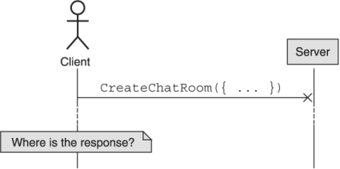
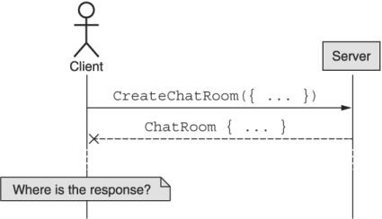
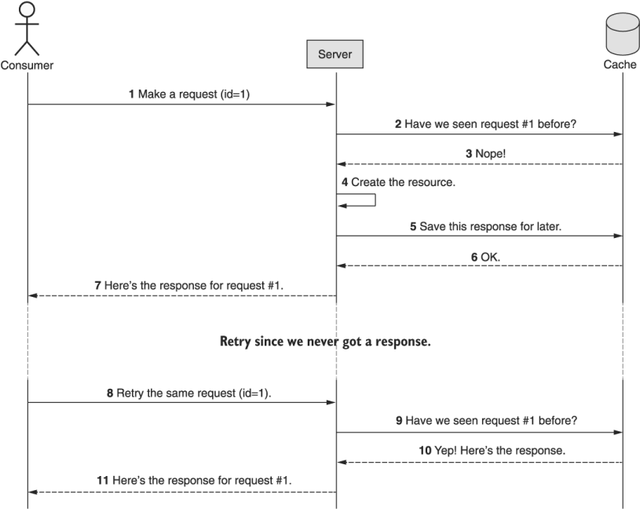
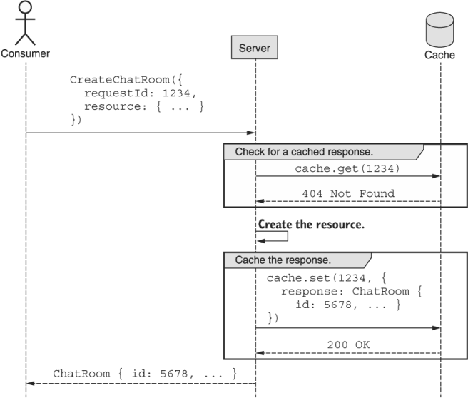
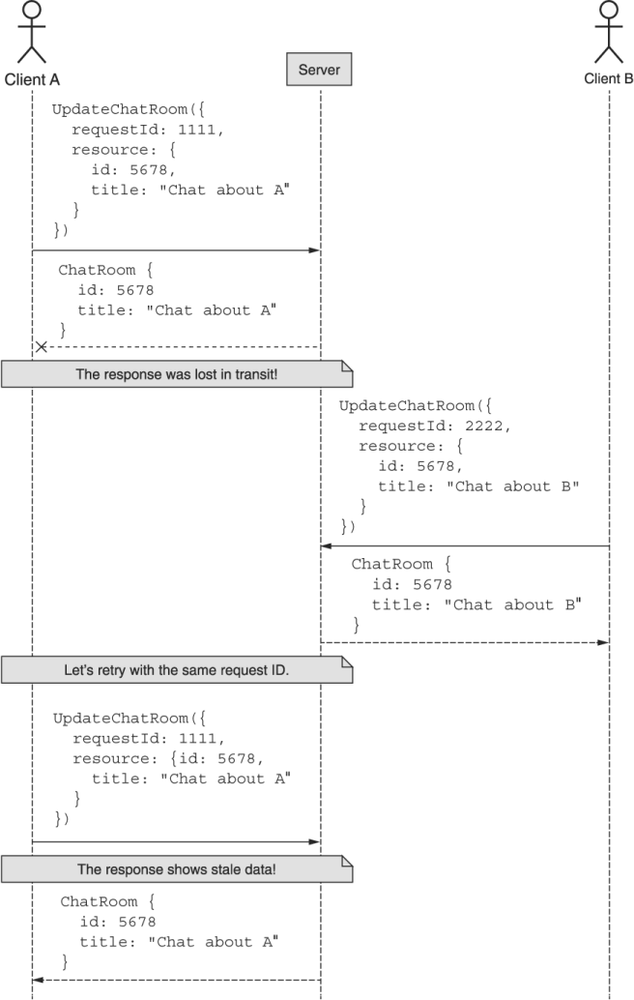
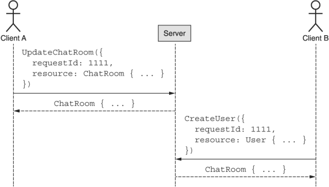
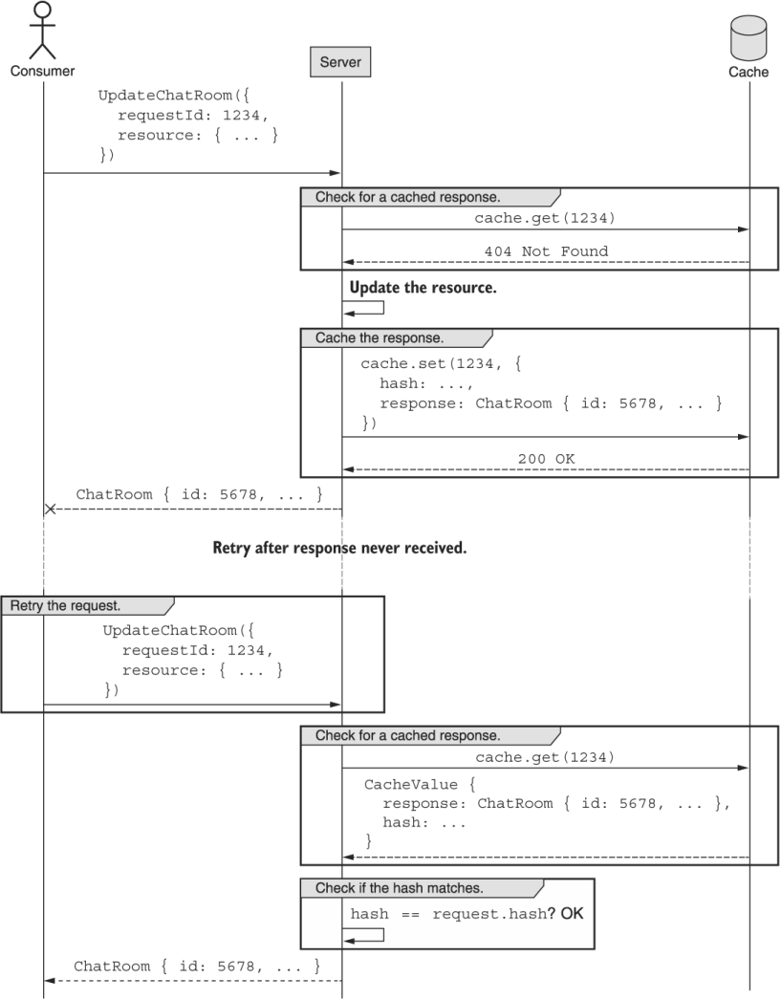

本章涵盖内容

- 如何使用请求标识符来防止重复请求
- 如何管理与请求标识符的冲突以避免混淆结果
- 平衡请求和响应的缓存和一致性

在我们无法保证所有请求和响应都按预期完成其旅程的世界中，我们将不可避免地需要在发生故障时重试请求。对于幂等的 API 方法来说，这不是问题；然而，我们需要一种安全重试请求而不导致重复工作的方法这种模式提供了一种机制，可以在 Web API 失败时安全地重试请求，而不管该方法的幂等性。

## 26.1 动机
不幸的是，我们生活在一个非常不确定的世界中，尤其是在涉及远程网络的任何事情中。鉴于现代网络的绝对复杂性和当今可用的各种传输系统，我们能够可靠地传输消息简直是一个奇迹！遗憾的是，这种可靠性问题在 Web API 中同样普遍。此外，由于 API 在越来越小的设备上越来越频繁地通过无线网络使用，因此在越来越远的距离上发送请求和接收响应意味着我们实际上必须比在小型有线本地设备上更关心可靠性网络。

这种网络固有的不可靠性的必然结论是客户端发送的请求可能并不总是到达服务器的情况。即使这样做，服务器发送的响应也可能并不总是到达客户端。当这种情况发生在幂等方法上时（例如: 不改变任何东西的方法，比如标准的 get 方法），这真的没什么大不了的。如果我们没有得到回应，我们总是可以再试一次。但是如果请求不是幂等的呢？要回答这个问题，我们需要仔细看看情况。

一般来说，当我们提出请求但没有得到响应时，有两种可能。在一种情况下（如图 26.1 所示），API 服务器从未收到请求，所以我们当然没有收到回复。在另一个中（如图 26.2 所示），请求被接收但响应从未返回给客户端。





虽然这两种情况都很不幸，但第一种情况（API 服务器甚至从未收到请求）是完全可以恢复的情况。 在这种情况下，我们可以重试请求。 由于从未收到过，因此基本上就好像该请求根本没有发生过一样。 第二种情况更可怕。 在这种情况下，请求被 API 服务器接收、处理并发送响应——它只是从未到达。

但最大的问题是我们无法区分这两种情况。无论问题是在发送请求时还是在接收响应时发生，客户端都知道有一个预期的响应并且它从未出现。因此，我们必须为最坏的情况做好准备：请求提出了，但我们没有被告知结果。我们可以做什么？

这是该模式的主要目标：定义一种机制，通过该机制我们可以防止跨 API 的重复请求，特别是针对非幂等方法的请求。换句话说，我们应该能够在不知道是否收到请求的情况下安全地重试方法（即使是发射导弹的方法），也不必担心由于重试而导致方法执行两次。

## 26.2 概述
此模式探索了为我们希望确保一次且仅一次服务的每个请求提供唯一标识符的想法。使用这个标识符，我们可以清楚地看到当前传入的请求是否已经被 API 服务处理，如果是，可以避免再次对其进行操作。

这就引出了一个棘手的问题：当捕获到重复请求时，我们应该返回什么结果？虽然返回一个错误表明这个请求已经被处理当然是足够的，但它在实际中并不是那么有用。例如: 如果我们发送一个创建新资源的请求但从未得到响应，当我们发出另一个请求时，我们希望得到一些有用的东西，特别是创建的资源的唯一 ID。错误确实可以防止重复，但这并不是我们在结果中寻找的。

为了解决这个问题，我们可以缓存与请求 ID 一起出现的响应消息，前提是当发现重复时，我们可以返回响应，就像第一次发出请求时返回的那样。使用请求 ID 的此流程的示例如图 26.3 所示。



现在我们已经了解了这个简单模式在高层次上是如何工作的，让我们进入实现细节。

## 26.3 实现
使该模式起作用的第一件事是定义请求标识符字段，以便我们可以在确定请求是否已被 API 接收和处理时使用它。该字段将出现在客户端为需要重复数据删除的任何方法发送的任何请求接口上（在这种情况下，通常只是非幂等的方法）。让我们首先更仔细地查看此字段以及最终将存储在其中的值。

### 26.3.1 请求标识符
请求标识符只不过是一个标准的 ID 字段；然而，这个字段不是存在于资源接口上，而是存在于某些请求接口上（见清单 26.1）。正如资源上的 ID 字段在整个 API 中唯一标识资源一样，请求标识符旨在实现相同的目标。这里的问题是，虽然资源标识符几乎总是永久的（第 6 章），但请求标识符更像是一次性值。而且因为它们是客户端用来识别其传出请求的东西，所以它们由客户端本身选择是绝对关键的。

清单 26.1 带有标识符字段的请求的定义

```typescript
interface CreateChatRoomRequest {
  requestId?: string;               // ❶
  resource: ChatRoom;
}
```

❶ 将请求标识符定义为请求接口上的可选字符串字段
不幸的是，正如我们在第 6 章中了解到的，让客户选择标识符通常是一个坏主意，因为他们往往选择不当。但是，由于这是必要的，我们能做的最好的事情就是指定一种格式，建议随机选择标识符，并强制执行指定的格式（例如: 我们真的不希望有人发送 ID 设置为 1 或"A B C D"）。相反，请求标识符应该遵循相同的资源标识符标准（在第 6 章中讨论）。

尽管请求标识符不像资源标识符那样永久，但这并没有使它们变得不那么重要。因此，如果 API 服务器收到带有无效请求 ID 的传入请求，它应该拒绝该请求并抛出错误（例如: 400 Bad Request HTTP 错误）。请注意，这与将请求标识符留空或丢失不同。在这种情况下，我们应该继续处理，就好像请求永远不会被重试一样，绕过第 26.2 节中讨论的所有缓存，并像任何其他 API 方法一样表现。

#### 避免派生标识符
经常出现的一个问题是，"为什么不从请求本身派生一个标识符？"乍一看，这似乎是一个非常优雅的解决方案：对请求正文执行某种散列，然后确保无论何时我们再次看到它，我们都知道不应再次处理它。

这种方法的问题是我们不能保证我们实际上不需要两次执行相同的请求。而不是来自客户端的显式声明（"我绝对希望确保此请求只处理一次"），我们隐式地确定了预期的行为，而没有提供明确的方法来选择退出这种重复数据删除。显然，用户可以提供一些额外的标头或无意义的查询字符串参数来使请求看起来不同，但这交换了默认值。

默认情况下，不应对请求进行重复数据删除，因为我们无法确定用户的意图。允许用户明确表达其请求意图的一种安全方式是接受用户选择的标识符，而不是从请求内容中隐式派生。

最后，考虑到我们将在第 26.3.5 节中学到的内容，这最终不会成为永不重复工作的真实案例。由于缓存值几乎肯定会在某个时刻到期，因此这更像是一种速率限制机制，确保同一请求不会在某个时间段内执行两次。

在讨论缓存如何工作的主题时，让我们简要讨论将缓存的内容以及这些选择背后的基本原理。

### 26.3.2 响应缓存
在图 26.4 中，我们可以看到每个具有请求标识符的请求都会将结果存储在某个缓存中。 该过程首先检查提供的请求 ID 的缓存，如果存在一个值，我们将返回服务器实际处理请求时第一次缓存的结果。 如果在缓存中找不到请求 ID，我们会处理请求，然后使用结果值更新缓存，然后根据请求将响应发送回用户。



这种模式可能看起来令人担忧的一件事是整个响应值都存储在缓存中。在这种情况下，存储需求可能会很快失控。毕竟，我们在技术上缓存了每个非幂等 API 调用的结果。如果这些响应本身就很大怎么办？例如: 想象一个提供 100 个资源的批量创建方法。如果我们收到该请求并使用此模式进行请求重复数据删除，我们将需要缓存相当多的数据，而这只是一个请求。

对于所有聪明的工程师来说，最重要的是，即使我们可以设计一个更复杂的系统来避免缓存所有这些数据，而是尝试重新计算响应而不再次处理请求，但这仍然不是一个好主意。归根结底，工程师调试和管理复杂系统的小时费率远远超过云中更多 RAM 或更大缓存集群的成本。因此，从长远来看，缓存响应只是一个安全的赌注，因为你总是可以很快地将更多的硬件投入到一个问题中，但投入更多的脑力并不那么容易。

### 26.3.3 一致性
隐藏在缓存来自已处理请求的响应的这个要求中是一个关键的一致性问题。换句话说，随着数据随着时间的推移而更新，缓存值很容易变得陈旧或过时，并且这些更新不会反映在缓存值中。那么，问题是在请求重复数据删除时这是否重要。

为了更清楚地说明问题，让我们假设两个客户端（A 和 B）都在对一个资源执行更新，如图 26.5 所示。在这种情况下，让我们假设没有需要担心的冲突。相反，让我们担心这样一个事实，即客户端 A 的连接很差，可能需要每隔一段时间重试一次请求。



在这个例子中，虽然 A 和 B 都在更新资源并且在这些更新中没有冲突，但来自 A 更新的响应在传输过程中丢失并且从未收到。因此，A 只是决定使用与之前相同的请求标识符重试请求，以确保修改重复两次。在第二次尝试时，服务器使用资源的缓存值进行响应，显示 A 最初在请求中设置的标题。但有一个问题：现在的数据确实不是这样！

一般来说，像这样的陈旧或不一致的数据可能是一个巨大的问题，但回想这种模式的目的至关重要。主要目标是允许客户端重试请求而不会造成潜在危险的重复工作。该目标的一个关键部分是确保客户端收到与第一次一切正常时相同的响应结果。因此，虽然这一系列事件（图 26.5）可能看起来有点奇怪，但它是完全合理和正确的。事实上，除了这个结果之外，返回任何其他内容可能会更加混乱和不可预测。换句话说，缓存绝对不应该随着底层数据的变化而保持最新，因为它会导致比我们在这种情况下看到的陈旧数据更多的混乱。

### 26.3.4 请求 ID 冲突
允许用户为请求选择自己的标识符的一个不可避免的后果是他们通常不擅长。选择不当的请求标识符最常见的结果之一是冲突：请求 ID 并不是那么随机，最终会被多次使用。在我们的设计中，这可能会导致一些棘手的情况。

例如: 让我们想象两个用户（A 和 B）与我们的 API 交互，连接非常好，但他们在选择请求 ID 方面都很糟糕。正如我们在图 26.6 中看到的那样，他们最终都选择了相同的请求 ID，结果是灾难性的（而且非常奇怪）。



不知何故，客户端 B 似乎试图创建一个用户资源，而是取回了一个 ```ChatRoom``` 资源。原因很简单：由于请求 ID 发生冲突，API 服务器注意到它并返回先前缓存的响应。在这种情况下，结果证明响应完全是无意义的，与客户端 B 试图做的事情无关。这显然是一个糟糕的场景，那么我们能做什么呢？

正确的做法是确保自上次我们看到相同的标识符以来，请求本身没有改变。换句话说，客户端 B 的请求也应该有相同的请求体——否则，我们应该抛出一个错误，让客户端 B 知道他们显然犯了一个错误。为了使这个工作，我们需要解决两件事，都在清单 26.2 中显示。

首先，当我们在执行一个还没有缓存值的请求后缓存响应值时，我们还需要存储请求正文本身的唯一指纹（例如: 请求的 SHA-256 哈希）。其次，当我们查找请求并找到匹配项时，我们需要验证此（潜在）重复项上的请求正文是否与前一个匹配。如果它们匹配，那么我们可以安全地返回缓存的响应。如果他们不这样做，我们需要返回一个错误，最好是类似于 ```409 Conflict HTTP``` 错误的内容。

清单 26.2 使用请求标识符更新资源的示例方法

```typescript
function UpdateChatRoom(req: UpdateChatRoomRequest): ChatRoom {
  if (req.requestId === undefined) {                            // ❶
    return ChatRoom.update(...);
  }
  const hash = crypto.createHash('sha256')
    .update(JSON.stringify(req))
    .digest('hex');
  const cachedResult = cache.get(req.requestId);
  if (!cachedResult) {                                          // ❷
    const response = ChatRoom.update(...);
    cache.set(req.requestId, { response, hash });               // ❸
    return response;
  }
 
  if (hash == cachedResult.hash) {                              // ❹
    return cachedResult.response;
  } else {
    throw new Error('409 Conflict');                            // ❺
  }
}
```

❶ 如果没有提供请求 ID，只需执行更新并返回结果。
❷ 如果给定的请求 ID 没有缓存值，则实际更新资源。
❸ 使用响应和哈希值更新缓存。
❹ 如果哈希匹配，我们可以安全地返回响应。
❺ 如果哈希不匹配，则抛出错误。
通过使用这个简单的算法，每当我们看到一个已经被服务的请求 ID 时，我们可以仔细检查它是否真的是同一个请求的副本而不是冲突。这使我们能够在遇到不幸的常见场景时安全地返回响应，即用户在选择真正唯一的请求标识符方面做得很差。

### 26.3.5 缓存过期

现在我们已经涵盖了这个模式的大部分复杂部分，我们可以进入最后一个主题：数据在缓存中保留多长时间。显然，在一个完美的世界中，我们可以永远保留所有数据，并确保任何时候用户必须重试请求，即使是在请求发出几年后，我们也可以完全按照我们本来的方式返回缓存的结果当我们第一次回应时。不幸的是，数据存储需要花钱，因此在我们的 API 中是一种有限的商品。最终，这意味着我们必须决定将内容保留在请求缓存中的时间。

通常，请求会在失败发生后相对较快地重试，通常在原始请求后几秒钟。因此，缓存过期策略的一个好的起点是将数据挂起大约五分钟，但每次访问缓存值时都重新启动该计时器，因为如果我们有缓存命中，则意味着请求被重试。如果还有进一步的失败，我们希望为后续重试提供与第一次尝试相同的过期策略。

为了让这个决定更容易，有一些好消息。由于缓存本质上会导致数据在一段时间后过期，因此无论我们决定什么，都可以在以后根据容量与流量的比较进行微调。换句话说，虽然五分钟是一个很好的起点，但根据用户行为、可用内存容量和成本，这个决定非常容易重新评估和调整。

### 26.3.6 最终 API 定义
这种模式的最终 API 定义非常简单：只需添加一个字段。为了再次阐明模式的细节，图 26.7 显示了一个完整的示例序列。

清单 26.3 最终 API 定义

```typescript
abstract class ChatRoomApi {
  @post("/chatRooms")
  CreateChatRoom(req: CreateChatRoomRequest): ChatRoom;
}
 
interface CreateChatRoomRequest {
  resource: ChatRoom;
  requestId?:string
}
```



## 26.4 权衡
在这种模式中，我们使用一个简单的唯一标识符来避免在我们的 API 中重复工作。这最终是在允许安全重试非幂等请求和 API 方法复杂性（以及我们的缓存要求的一些额外内存要求）之间进行权衡。虽然某些 API 可能并不完全关心重复请求场景，但在其他情况下它可能很关键——事实上，请求标识符可能是必需的，而不是可选的。

归根结底，是否使用这种请求重复数据删除机制使某些方法复杂化的决定确实取决于场景。因此，根据需要添加它可能是有意义的，从一些特别敏感的 API 方法开始，并随着时间的推移扩展到其他方法。

## 26.5 练习
1. 为什么使用请求的指纹（例如哈希）来确定它是否重复是一个坏主意？
2. 为什么尝试保持请求-响应缓存是最新的会是一个坏主意？随着底层资源的变化，缓存的响应是否应该失效或更新？
3. 如果负责检查重复项的缓存系统出现故障会发生什么？失败的场景是什么？这应该如何防范？
4. 如果你已经有请求 ID，为什么使用请求的指纹很重要？请求 ID 生成的什么属性导致了这个要求？

## 总结

- 请求可能随时失败，因此除非我们从 API 得到确认的响应，否则无法确定请求是否被处理。
- 请求标识符由 API 客户端生成，用作对 API 服务看到的单个请求进行重复数据删除的一种方式。
- 对于大多数请求，可以缓存给定请求标识符的响应，但必须慎重选择到期和失效参数。
- API 服务还应检查请求内容的指纹以及请求 ID，以避免在请求 ID 冲突的情况下出现异常行为。