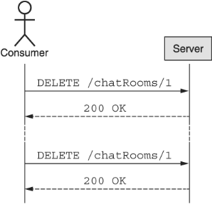
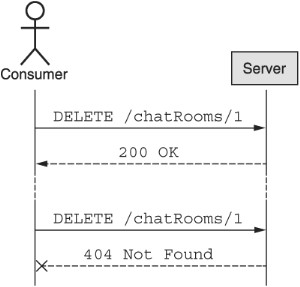
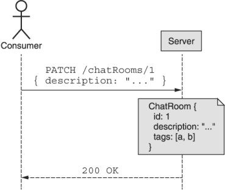
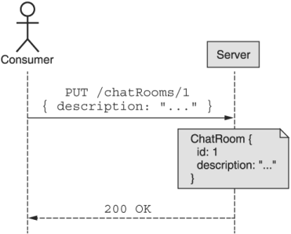

本章涵盖内容

- 什么是幂等性及其副作用
- 浏览所有标准方法（获取、列出、创建、更新、删除）
- 一种额外的半标准方法：替换
- 依赖标准方法的优缺点

正如我们在第 1 章中了解到的，好的 API 的特征之一是可预测性。构建可预测 API 的一个好方法是仅改变可用资源，同时保持一组一致的特定操作（通常称为方法），每个人都可以对这些资源执行这些操作。这意味着这些方法中的每一个都必须在外观和行为上保持一致，直到最后的细节；否则，当应用于多个资源时相同的动作不相同时，可预测性将完全丧失。此模式探索在 API 中的资源中实现这些标准方法时应遵循的特定规则。

## 7.1 动机

精心设计的 API 最有价值的方面之一是用户能够应用他们已知的知识，以便更快地了解 API 的工作原理。换句话说，用户对 API 了解得越少，他们就可以越快开始使用它来实现自己的目标。执行此操作的一种方法（通常在 RESTful API 中表达）是对 API 定义的各种资源使用一组标准操作（或方法）。用户仍然需要了解 API 中的资源，但是一旦他们建立了对这些资源的理解，他们就已经熟悉了可以对这些资源执行的一组标准方法。

不幸的是，这只有在每个标准方法都真正标准化的情况下才有效，无论是在整个 API 中，还是在大多数 Web API 中。幸运的是，REST 标准已经存在了很长一段时间，并为这种级别的 Web API 标准化奠定了基础。在此基础上，该模式概述了所有标准方法和应应用于每个方法的各种规则，并从 REST 规范中汲取了大量灵感。

## 7.2 概述
由于我们的目标是提高一致性并最终获得更可预测的 API，让我们首先查看提议的标准方法列表及其总体目标，如表 7.1 所示。

表 7.1 标准方法概述

|  名字   |     行为     |        案例         |
| :-----: | :----------: | :-----------------: |
|   Get   | 检索现有资源 |    GetChatRoom()    |
|  List   | 列出资源集合 |   ListChatRooms()   |
| Create  |  创建新资源  |   CreateMessage()   |
| Update  | 更新现有资源 | UpdateUserProfile() |
| Delete  | 删除现有资源 |  DeleteChatRoom()   |
| Replace | 替换整个资源 |  ReplaceChatRoom()  |

虽然这些方法及其描述看起来很简单，但实际上缺少大量信息。当信息缺失时，这会导致歧义。这种歧义最终导致对每个方法应该如何操作的广泛解释，导致相同的“标准”方法在不同的 API 甚至同一 API 中的不同资源中表现完全不同。

让我们仔细看看一个例子：delete。表 7.1 中的行为描述说明此方法删除现有资源。换句话说，我们可能期望如果一个资源被创建而用户删除它，我们应该得到一个相当于 200 OK 的 HTTP 响应代码，然后继续我们的快乐。但是如果资源还不存在呢？响应应该还可以吗？还是应该返回 404 Not Found HTTP 错误？

有些人可能会争辩说该方法的目的是删除资源，因此如果资源不再存在，那么它已经完成了它的工作并且应该返回一个 OK 结果。其他人认为区分结果（执行方法时资源不再存在）和行为（执行此方法时专门删除的资源）很重要，因此尝试删除不存在的资源应该返回 Not Found 错误，表示该资源现在不存在，但在执行此方法时也不存在。

此外，如果资源确实存在但尝试执行该方法的用户无权访问该资源怎么办？结果应该是 404 Not Found HTTP 错误吗？还是 403 Forbidden HTTP 错误？这些错误代码是否应该根据资源是否实际存在而有所不同？最终，这种微妙的设计选择旨在防止出现重要的安全问题。在这种情况下，如果未经授权的用户尝试检索资源，他们可以确定该资源是否确实不存在（通过接收 404 Not Found 响应）或该资源是否确实存在，但他们只是无权访问它（通过接收 403 Forbidden 响应）。通过这样做，没有任何访问权限的人有可能探测系统中存在的资源，并可能在以后针对它们进行攻击。

每个 API 设计人员都没有理由一遍又一遍地重新回答这些问题。相反，本章中的指南提供了一些标准答案，以随着 API 的扩展而优雅地增长，以确保跨标准方法的一致性（并防止安全泄漏或其他问题）。但是，与其只是陈述一堆规则，不如让我们在下一节中探讨这些类型的细微差别。

## 7.3 实施
在我们深入了解每个标准方法的细节之前，让我们首先探索适用于所有标准方法的跨领域方面，从一个明显的问题开始：所有资源都必须支持所有标准方法是一个硬性要求吗？换句话说，如果我的资源之一是不可变的，该资源是否仍然支持更新标准方法？或者如果它是永久的，它是否仍然支持删除标准方法？

### 7.3.1 应该支持哪些方法？

由于标准化一组方法的目标完全是为了推动一致性，因此这个问题甚至值得讨论似乎有点奇怪。换句话说，有一整章关于以完全相同的方式实现一组标准行为，只是为了允许一些资源简单地选择不实现这些方法，这似乎是虚伪的。这是一个公平的观点，但归根结底，实用性仍然是 API 设计的一个关键组成部分，而且在现实生活中，某些资源可能不想支持所有标准方法，这根本无法避免。简而言之，并非每种资源类型都需要每种标准方法。

但是，有些情况与其他情况不同，区分不应该完全支持方法的情况（例如，返回等效于 405 Method Not Allowed HTTP 错误的情况）和根本不支持方法的情况将变得很重要在此特定实例上允许（返回等效于 403 Forbidden HTTP 错误）。但是，永远不应该发生的情况是，API 简单地忽略特定路由（例如，更新方法）并在有人尝试在资源上使用该方法时返回 404 Not Found HTTP 错误。如果 API 这样做，则意味着资源不存在，这不是真的：技术上不存在该资源类型的方法。

决定是否支持每种标准方法的规则是什么？虽然没有明确的要求，但一般准则是每个资源都应该存在每个标准方法，除非有充分的理由不这样做（并且应该记录和解释该原因）。例如，如果一个资源实际上是一个单例子资源（参见第 12 章），则该资源是一个单例资源，并且仅由于其父资源存在而存在。因此，只有 get 和 update 标准方法才有意义；其余的可以完全忽略。这也是该方法从根本上没有意义的情况的示例，因此应返回相当于 405 Method Not Allowed HTTP 错误的等效项。

在其他情况下，某些方法可能对资源的特定实例没有意义，但对于资源类型仍然具有概念意义。例如，如果存储系统在特定目录上具有“写保护”标志，以防止对该目录中的资源进行修改，则 API 仍应支持标准方法（例如，更新和删除），但在有人尝试时返回错误如果当前不允许，则对资源执行这些操作。此场景还涵盖可能被视为永久（即，不应删除）或不可变（即，不应被修改）的资源类型。仅仅因为它们现在是永久和不可变的，并不意味着它们将来永远不会存在。因此，实现完整的标准方法集并在任何人试图修改或删除它们时简单地返回 403 Forbidden 错误代码是最有意义的。

现在我们对何时定义哪些方法有了一些指导，让我们来看看标准方法的核心假设之一：没有副作用。

### 7.3.2 幂等性和副作用

由于标准方法的一个关键部分是它们的可预测性，因此标准方法应该完全按照他们所说的去做，仅此而已。简而言之，标准方法不应该有任何副作用或意外行为。此外，某些方法具有称为幂等性的特定属性，它表示多次重复相同的请求（具有相同的参数）是否与单个请求具有相同的效果。在特定方法上打破关于此属性的普遍假设可能会导致灾难性后果，例如数据丢失或损坏。

确定什么是可接受的并且不违反无副作用规则可能很复杂，因为许多 API 都有需要额外行为的场景，而不仅仅是简单的标准方法所指示的，而且通常看起来好像标准方法是适合这种行为的地方。当额外的行为很微妙或没有真正改变任何有意义的状态时，这可能会导致更多的混乱，以至于我们可能仍然认为该方法是幂等的。

什么是副作用？有些是显而易见的，例如在电子邮件 API 中，创建电子邮件并将信息存储在数据库中不会被视为副作用。但是，如果该标准创建方法也通过 SMTP 连接到服务器以发送该电子邮件，则这将被视为副作用（因此作为标准创建方法的一部分而避免）。

请求计数器呢？每次检索资源时，它都会增加一个计数器，以跟踪通过标准 get 方法检索了多少次资源？从技术上讲，这意味着该方法不再是幂等的，因为状态在幕后发生变化，但这真的是一个大问题吗？复杂的答案是视情况而定。计数器更新是否对性能有影响，即请求将比其他情况下显着变慢或变化更大？如果由于任何原因更新计数器失败会发生什么？仅因为计数器存在阻止其更新的技术问题，资源检索失败时是否可能有错误响应？

最终，正如我们将在第 24 章定义版本控制策略中学到的那样，你对什么构成副作用的判断有点容易解释。虽然应该不惜一切代价避免明显的副作用（例如连接到第三方或外部服务或触发可能导致标准方法失败或导致部分执行的请求的额外工作），但一些更微妙的情况可能给定消费者期望的 API 是有意义的。

现在我们已经涵盖了标准方法的一般方面，让我们深入研究每种方法并探索我们需要为每种方法考虑的一些内容，首先从只读方法开始，然后继续其余方法。

### 7.3.3 获取
标准 get 方法的目标非常简单：服务在某处存储了一个资源记录，该方法返回存储在该记录中的数据。 为了实现这一点，该方法只接受一个输入：相关资源的标识符。 换句话说，这严格来说是存储数据的键值查找。

清单 7.1 标准 get 方法的示例

```typescript
abstract class ChatRoomApi {
  @get("/{id=chatRooms/*}")                          // ❶
  GetChatRoom(req: GetChatRoomRequest): ChatRoom;    // ❷
}
interface GetChatRoomRequest {
  id: string;
}
```

❶ 标准的 get 方法总是通过资源的唯一标识符来检索资源。
❷ 标准 get 方法的结果应该始终是资源本身。
与大多数不主动更改底层数据的方法一样，此方法应该是幂等的，这意味着您应该可以自由地多次运行它，并且假设没有其他更改同时发生，则每次的结果都应该相同。 这也意味着该方法与所有标准方法一样，不应有任何明显的副作用。

虽然关于标准 get 方法还有很多要讨论的内容，例如检索特定的资源修订，但我们将把这些主题留待以后在特定的未来设计模式中讨论。现在，让我们转到下一个只读标准方法：list。

### 7.3.4 列表

由于标准 get 方法只是一个键值查找，我们显然需要另一种机制来浏览可用资源，而列表标准方法就是这样。在列表方法中，您提供需要浏览的特定集合，结果是属于该集合的所有资源的列表。

需要注意的是，标准列表方法与其目标中的标准 get 方法不同：我们不是请求特定资源，而是请求属于特定集合的资源列表。这个集合本身可能属于另一个特定的资源，但情况并非总是如此。例如，考虑我们可能有一组 ChatRoom 资源的情况，每个资源都包含一组 Message 资源。列出 ChatRoom 资源需要针对 chatRooms 集合，而列出给定 ChatRoom 的 Message 资源将针对属于特定 ChatRoom 的消息集合。

清单 7.2 标准列表方法的一个例子

```typescript
abstract class ChatRoomApi {
  @get("/chatRooms")                                                // ❶
  ListChatRooms(req: ListChatRoomsRequest): ListChatRoomsResponse;
 
  @get("/{parent=chatRooms/*}/messages")                            // ❷
  ListMessages(req: ListMessagesRequest): ListMessagesResponse;
}
 
interface ListChatRoomsRequest {
  filter: string;
}
 
interface ListChatRoomsResponse {
  results: ChatRoom[];
}
 
interface ListMessagesRequest {
  parent: string;
  filter: string;
}
 
interface ListMessagesResponse {
  results: Message[];
}
```

❶ 列出属于顶级集合的资源时，没有目标！
❷ 当列出属于资源子集合的资源时，目标是父资源（在本例中为 ChatRoom 资源）。
虽然列出一组资源的概念可能看起来和标准的 get 方法一样简单，但它实际上包含的内容远比我们所看到的要多得多。虽然我们不会讨论有关此方法的所有内容（例如，某些方面将在未来的设计模式中涵盖，例如第 21 章），但这里有一些值得讨论的主题，从访问控制开始。

#### 访问控制

虽然讨论太多细节没有意义，但有一个重要方面值得介绍：当不同的请求者可以访问不同的资源时，list 方法应该如何表现？换句话说，如果您想在 API 中列出所有可用的 ChatRoom 资源，但您只能访问其中一些资源，该怎么办？ API 应该做什么？

API 方法的行为一致显然很重要，但这是否意味着每个请求对每个响应都必须相同？在这种情况下，答案是否定的。响应应仅包含请求者有权访问的资源。这意味着，如您所料，列出相同资源的不同人将获得不同的数据视图。

如果可能，可以布置资源以尽量减少此类情况（例如，确保单用户资源具有单独的父资源），从而在列出从请求者保护的资源时导致简单的 403 Forbidden 错误响应；然而，无法避免这样一个事实，即有时用户可以访问集合中的某些项目，但不是全部。

#### 结果计数

接下来，通常会倾向于在列表中包含项目计数。虽然这对于用户界面消费者显示匹配结果的总数可能很好，但随着时间的推移，它通常会增加更多的麻烦，并且列表中的项目数量超出了最初的预测。对于并非旨在提供对匹配特定查询的计数的快速访问的分布式存储系统，这尤其复杂。简而言之，在对标准列表方法的响应中包含项目计数通常是一个坏主意。

如果某种结果计数是绝对必要的，或者保证收集中涉及的数据保持足够小以处理计数结果而没有任何极端的计算负担，那么使用某种估计并依靠它来指示几乎总是更有效结果的总数而不是确切的计数。如果计数是估计值而不是精确计数，那么根据它的名称命名字段（例如 resultCountEstimate）也很重要，以避免对值的准确性造成潜在的混淆。为了给意外留出喘息的空间，如果您认为结果计数既重要又可行，则将该字段命名为估计值仍然是一个好主意（即使该值是精确计数）。这意味着，如果您将来需要更改估计以减轻存储系统上的负载，您可以自由地这样做，而不会给任何人造成任何混淆或困难。毕竟，精确计数在技术上只是一个非常准确的估计。

#### 排序

出于类似的原因，通常也不鼓励对项目列表应用排序。就像显示结果计数一样，对结果进行排序的能力是一个常见的不错的功能，特别是对于呈现用户界面的消费者。不幸的是，允许在标准列表方法中对结果进行排序可能比显示结果计数更困难。

虽然在 API 生命周期的早期允许排序可能很容易，但随着数据量相对较少，随着时间的推移，它几乎肯定会变得越来越复杂。列表中返回的更多项目需要更多的服务器处理时间来处理排序，但最重要的是，很难将全局排序顺序应用于从多个不同存储后端组装的列表（分布式存储就是这种情况）系统）。例如，考虑尝试整合和排序分布在 100 个不同存储后端的 10 亿个项目。这是一个在离线处理作业中使用静态数据解决的复杂问题（即使每个数据源首先对其较小部分的数据进行排序），但对于像实时 API 这样快速变化的数据集来说则更加复杂。此外，每次用户想要查看他们的资源列表时按需执行这种类型的排序很容易导致 API 服务器过载。

总而言之，这个微小的特性在未来往往会增加大量的复杂性，而对 API 使用者的价值相对较小。因此，就像总结果计数一样，这通常是一个坏主意。

#### 过滤
虽然不鼓励对标准列表方法中涉及的项目进行排序和计数，但过滤该方法的结果以使其更有用是一个常见的，因此受到鼓励的功能。这是因为应用过滤器的替代方案（例如，请求所有项目并在事后过滤结果）特别浪费处理时间和网络带宽。

在实施过滤时，有一个重要的警告。虽然设计一个严格类型的过滤结构来支持过滤是很诱人的（例如，使用针对各种条件的模式，以及“and”和“or”评估条件），但这种类型的设计通常不会很好地老化.毕竟，SQL 仍然接受作为简单字符串的查询是有充分理由的。就像枚举一样，如第 5 章中所见，随着我们扩展可用于过滤的功能或不同类型，客户端需要升级其本地模式以利用这些更改。因此，虽然鼓励过滤，但用于传达过滤器本身的最佳数据类型选择是字符串，然后可以由服务器解析并在返回结果之前应用，如果可能，通过将解析的过滤器传递给存储系统，或直接通过 API 服务。第 22 章更详细地讨论了这个主题。

到目前为止，我们一直专注于从 API 中读取数据。让我们换个角度看看如何使用标准的 create 方法将数据导入 API。

### 7.3.5 创建
除非 API 中有一些数据，否则标准 get 方法（第 7.3.3 节）和标准列表方法（第 7.3.4 节）都没有任何用处。 将数据导入任何 API 的主要机制是使用标准的 create 方法。 标准 create 方法的目标很简单：给定有关资源的一些信息，在 API 中创建该新资源，以便可以通过其标识符检索或通过列出资源发现它。 为了看看这可能是什么样子，清单 7.3 中显示了创建 ChatRoom 和 Message 资源的示例。 如您所见，请求（通过 HTTP POST 方法发送）包含有关资源的相关信息，结果响应始终是新创建的资源。 此外，目标是父资源（如果可用），或者只是顶级集合（例如，“/chatRooms”）。

清单 7.3 标准 create 方法的一个例子

```typescript
abstract class ChatRoomApi {
  @post("/chatRooms")                                     // ❶
  CreateChatRoom(req: CreateChatRoomRequest): ChatRoom;   // ❷
 
  @post("/{parent=chatRooms/*}/messages")                 // ❶    
  CreateMessage(req: CreateMessageRequest): Message;      // ❷
}
 
interface CreateChatRoomRequest {
  resource: ChatRoom;
}
 
interface CreateMessageRequest {
  parent: string;
  resource: Message;
}
```

❶ 在这两种情况下，标准的 create 方法都使用 POST HTTP 动词。
❷ 标准的create 方法总是返回新创建的资源。
虽然创建资源背后的概念很简单，但很少有值得深入探索的领域，因为它们比表面看起来要复杂一些。让我们首先简要介绍一下我们如何识别这些新创建的资源。

#### 身份标识

正如我们在第 6 章中学到的，对于新创建的资源，通常最好依赖服务器生成的标识符。换句话说，我们应该让 API 自己选择资源的标识符，而不是试图自己选择一个。也就是说，在很多情况下，让 API 的使用者选择标识符更有意义（例如，如果该 API 正被打算同步本地和远程资源集的移动设备使用）。在这些类型的场景中，允许消费者选择 ID 是完全可以接受的；但是，他们应该遵循第 6 章中提供的指导方针。

如果您必须在创建时提供资源标识符，则应通过在资源接口本身中设置 ID 字段来完成。例如，要创建具有特定标识符的 ChatRoom 资源，我们将发出类似于 POST /chatRooms { id: 1234, ... } 的 HTTP 请求。正如我们稍后将看到的，半标准替换方法有一个替代方法，但由于并非所有 API 都预期支持该方法，因此最好将标识符设置为标准创建方法的一部分。

#### 一致性
多年前，几乎可以保证您创建的每一位数据都会存储在某个地方的单个数据库中，通常是像 MySQL 或 PostgreSQL 这样的关系数据库服务。然而，现在有更多的存储选项可以水平扩展而不会随着数据集的增长而倒下。换句话说，当您配置的数据库有太多数据时，您可以简单地打开更多的存储节点，系统会在更大的数据量下表现得更好。

这些系统已经奇迹般地治愈了巨大数据集和异常大量请求的瘟疫（和礼物），但它们通常有自己的一套权衡。最常见的一个与一致性有关，最终一致性是看似无限可扩展性的常见副作用。在最终一致的存储系统中，随着时间的推移，数据会在系统周围复制，但通常需要一段时间才能到达所有可用节点，从而导致数据更新但并未立即复制到任何地方。这意味着您可以创建一个资源，但它可能在很长一段时间内都不会出现在列表请求中。更糟糕的是，根据路由的配置方式，当您尝试通过标准 get 方法检索同一资源时，您可能会创建一个资源，但随后会收到 HTTP 404 Not Found 错误。

虽然这可能是不可避免的，这取决于所使用的技术，但如果可能的话，绝对应该避免。 API 最重要的方面之一是其事务行为，其中的关键方面之一是强一致性。简而言之，这意味着您应该始终能够立即读取您的写入。换句话说，这意味着一旦你的 API 说你已经创建了一个资源，它应该在任何意义上都被创建并且可用于所有其他标准方法。这意味着您应该能够在标准列表方法中查看它，使用标准 get 方法检索它，使用标准更新方法修改它，甚至使用标准删除方法将其从系统中删除。

如果您发现自己的某些数据无法通过这种方式进行管理，您应该认真考虑使用自定义方法（参见第 9 章）来加载有问题的数据。原因很简单：API 对标准方法的一致性有期望，但正如我们将在第 9 章中看到的，自定义方法没有这些期望。因此，与其使用最终一致的 CreateLogEntry 方法，不如考虑使用自定义导入方法，例如 ImportLogEntries，这将向任何潜在用户解释结果在整个系统中最终是一致的。另一种选择，如果您可以确定跨系统的数据复制何时完成，将依赖于长时间运行的操作，我们将在第 10 章中更详细地探讨。

现在我们对创建新资源所涉及的微妙之处有了一些了解，让我们看看我们如何使用标准更新方法修改现有资源。

### 7.3.6 更新
一旦将新资源加载到 API 中，除非资源本身是不可变的并且打算永远不会更改，否则我们需要一种直接的方法来修改资源，这将导致我们采用标准的更新方法。此方法的目标是更改有关单个资源的一些现有信息，因此应避免副作用，如第 7.3.2 节所述。

更新资源的推荐方法依赖于 HTTP PATCH 方法，使用其唯一标识符指向特定资源并返回新修改的资源。 PATCH 方法的一个关键方面是它对资源进行部分修改而不是完全替换。我们将更详细地探讨这一点，因为关于该主题有很多要讨论的内容（例如，您如何区分“不更新此字段”与“将此字段设置为空白”的用户意图），但是现在的关键是标准更新方法应该只更新 API 使用者明确请求的资源的各个方面。

清单 7.4 标准更新方法示例

```typescript
abstract class ChatRoomApi {
  @patch("/{resource.id=chatRooms/*}")                   ❶
  UpdateChatRoom(req: UpdateChatRoomRequest): ChatRoom;
}
 
interface UpdateChatRoomRequest {
  resource: ChatRoom;
  // ...                                                 ❷
}
```

❶ 标准更新方法使用 HTTP PATCH 动词只修改资源的特定部分。
❷ 我们将在第 8 章中学习如何安全地处理资源的部分更新。
标准更新方法是修改现有资源的理想场所，但仍有一些场景最好在其他地方进行更新。像从一种状态转换到另一种状态这样的场景很可能通过一些替代操作来完成。例如，与其将 ChatRoom 资源的状态设置为已归档，更有可能使用 ArchiveChatRoom() 自定义方法（参见第 9 章）来完成此操作。简而言之，虽然更新方法是修改现有资源的标准机制，但它远不是实现此目的的唯一方法。

### 7.3.7 删除

一旦资源在 API 中超出其用途，我们就需要一种方法来删除它。这正是标准删除方法的目的。清单 7.5 展示了该方法如何寻找删除 API 中的 ChatRoom 资源。如您所料，该方法依赖于 HTTP DELETE 方法，并通过其唯一标识符定位有问题的资源。此外，与大多数其他标准方法不同，这里的返回值类型是一个空消息，在我们的 API 定义中表示为 void。这是因为标准删除方法的成功结果是使资源完全消失。

清单 7.5 标准的删除方法

```typescript
abstract class ChatRoomApi {
  @delete("/{id=chatRooms/*}")                       // ❶
  DeleteChatRoom(req: DeleteChatRoomRequest): void;  // ❷
}
 
interface DeleteChatRoomRequest {
  id: string;
}
```

❶ 标准的删除方法使用 HTTP DELETE 动词来删除资源。
❷ 结果是一个空的响应消息，而不是一个实际的响应接口。
幂等性
虽然这种方法的目的也非常简单，但对于这是否被认为是幂等的以及如何处理删除已删除资源的请求存在一些潜在的混淆。最终，这归结为一个问题，即标准删除方法是更注重结果（声明式）还是更注重操作（命令式）。一方面，可以将删除资源想象成只是请求声明您的意图是使相关资源不再存在。在这种情况下，删除已经被删除的资源应该被认为是成功的，因为在请求完成处理后资源就消失了。换句话说，使用相同的参数连续两次执行标准的删除方法将获得相同的成功结果，因此使该方法具有幂等性，如图 7.1 所示。



在命令式方面，可以将标准删除方法描绘为请求采取行动，即删除资源的行动。 因此，如果在收到请求时资源不存在，则服务将无法执行预期的操作，请求将导致失败。 换句话说，尝试连续两次删除同一资源可能会导致第一次成功但第二次失败，如图 7.2 所示。 因此，以这种方式运行的删除方法不会被认为是幂等的。 但哪个选项是正确的？



虽然有很多声明式 API（例如 Kubernetes），但面向资源的 API 在本质上通常是必不可少的。因此，标准删除方法应该以非幂等方式运行。换句话说，尝试删除不存在的资源应该会导致失败。当您担心网络连接被抢断和响应丢失时，这可能会导致很多复杂情况，但我们将在第 26 章中更多地探讨 API 请求的可重复性。

最后，让我们看一下与我们的标准更新方法的实现相关的半标准方法，称为标准替换方法。

### 7.3.8 替换
正如我们在 7.3.6 节中了解到的，标准更新方法负责修改有关现有资源的数据。我们还注意到它完全依赖于 HTTP PATCH 方法来只允许更新资源的一部分（我们将在第 8 章中详细了解）。但是如果你真的想更新整个资源呢？标准更新方法可以轻松设置特定字段并控制在资源上设置哪些字段，但这意味着如果您不熟悉某个字段（例如，它是在未来的次要版本中添加的，我们将看到在第 24 章中），资源可能具有您不打算存在的值。

例如，在图 7.3 中，我们可以看到消费者更新 ChatRoom 资源，尝试使用 HTTP PATCH 方法设置描述字段。在这种情况下，如果消费者想清除 ChatRoom 资源上的所有标签，但客户端不知道标签字段，则客户端无法完成此操作！那么你如何处理呢？



半标准替换方法的目标正是：用此请求中提供的信息替换整个资源。 这意味着即使服务有客户端还不知道的额外字段，这些字段也将被删除，因为它们不是由替换资源的请求提供的，如图 7.4 所示。



为了实现这一点，replace 方法使用 HTTP PUT 动词而不是针对资源本身的 PATCH 动词，并准确地（并且专门地）提供要存储在资源中的信息。 与标准更新方法提供的特定目标修改相比，这种完全替换可确保资源的远程副本看起来与所表达的完全一致，这意味着客户无需担心是否存在他们不知道的其他字段。

清单 7.6 标准替换方法的定义

```typescript
abstract class ChatRoomApi {
  @put("/{resource.id=chatRooms/*}")             // ❶
  ReplaceChatRoom(req: ReplaceChatRoomRequest):
      ChatRoom;                                  // ❷
}
 
interface ReplaceChatRoomRequest {
  resource: ChatRoom;
}
```

❶ 与标准更新方法不同，replace 方法依赖于 HTTP PUT 动词。
❷ 与标准更新方法类似，replace 方法返回新更新（或创建）的资源。
这导致了一个潜在的令人困惑的问题：如果我们可以用我们想要的完全替换资源的内容，我们不能使用相同的机制来替换不存在的资源吗？换句话说，这种神奇的替换标准方法，真的可以成为创造新资源的工具吗？

简短的回答是肯定的：这个替换工具可用于创建新资源，但它本身不应该替代标准的 create 方法，因为在某些情况下，API 使用者可能想要创建资源，如果（且仅当）资源不存在。类似地，当（且仅当）资源已经存在时，他们可能想要更新资源。使用标准的替换方法，尽管该方法最终取得了成功，但无法知道您是替换（更新）现有资源还是创建新资源。相反，您只知道曾经存储在特定资源位置的内容现在设置为发出替换请求时提供的内容。

此外，您可能会猜到，使用标准的替换方法来创建资源意味着 API 必须支持用户选择的标识符。正如我们在第 6 章中了解到的，在某些情况下这当然是可能的和可接受的，但由于各种原因通常应该避免（参见第 6.4.2 节）。

有了这个，我们探索了关键的标准方法，这些方法将构成大多数面向资源的 API 交互的最大份额。在下一节中，我们将简要回顾一下将它们放在一起时的样子。

### 7.3.9 API 最终定义
清单 7.7 中显示了迄今为止我们讨论过的所有标准方法的集合：create、get、list、update、delete 甚至替换。 该示例遵循之前的示例，包括 ChatRoom 资源和子 Message 资源。

清单 7.7 最终 API 定义

```typescript
abstract class ChatRoomApi {
  @post("/chatRooms")
  CreateChatRoom(req: CreateChatRoomRequest): ChatRoom;
 
  @get("/{id=chatRooms/*}")
  GetChatRoom(req: GetChatRoomRequest): ChatRoom;
 
  @get("/chatRooms")
  ListChatRooms(req: ListChatRoomsRequest): ListChatRoomsResponse;
 
  @patch("/{resource.id=chatRooms/*}")
  UpdateChatRoom(req: UpdateChatRoomRequest): ChatRoom;
 
  @put("/{resource.id=chatRooms/*}")
  ReplaceChatRoom(req: ReplaceChatRoomRequest): ChatRoom;
 
  @delete("/{id=chatRooms/*}")
  DeleteChatRoom(req: DeleteChatRoomRequest): void;
 
  @post("/{parent=chatRooms/*}/messages")
  CreateMessage(req: CreateMessageRequest): Message;
 
  @get("/{parent=chatRooms/*}/messages")
  ListMessages(req: ListMessagesRequest): ListMessagesResponse;
}
 
interface CreateChatRoomRequest {
  resource: ChatRoom;
}
 
interface GetChatRoomRequest {
  id: string;
}
 
interface ListChatRoomsRequest {
  parent: string;
  filter: string;
}
 
interface ListChatRoomsResponse {
  results: ChatRoom[];
}
 
interface UpdateChatRoomRequest {
  resource: ChatRoom;
}
 
interface ReplaceChatRoomRequest {
  resource: ChatRoom;
}
 
interface DeleteChatRoomRequest {
  id: string;
}
 
interface CreateMessageRequest {
  parent: string;
  resource: Message; 
}
 
interface ListMessagesRequest {
  parent: string;
  filter: string;
}
 
interface ListMessagesResponse {
  results: Message[];
}
```

## 7.4 权衡
每当您依赖标准而不是完全定制设计的工具时，您就放弃了一些灵活性。不幸的是，除非您的场景恰好与标准设计的完全匹配，否则这种权衡有时会很痛苦。但是，作为这些不匹配的交换，您几乎总能获得不少好处。

在某些方面，这有点像买衣服。那件中号的新衬衫可能有点太大了，但小号绝对是太小了，你会觉得你的选择要么是减肥，要么是一件宽松的衬衫。但好处是这件衬衫的成本约为 10 美元，而不是 100 美元，因为它可以批量生产。这就是我们发现自己使用面向资源的 API 和标准方法的场景。

这些标准方法并不适用于所有情况。它们不时会出现一些不匹配的情况，例如，事物不是真正被创造出来的，而是更多地被创造出来的。你完全可以设计一个自定义方法来处理这些独特的场景（见第 9 章）。但是，作为依赖标准方法而不是完全自定义的基于 RPC 的 API 的交换，您可以获得使用 API 的人的好处，他们能够快速学习和理解不同的方法，而无需做太多工作。更好的是，一旦他们了解了这些方法的工作原理（以防他们在过去使用 RESTful API 时还不知道这一点），他们就会知道这些方法如何跨 API 中的所有资源工作，从而有效地乘以他们的知识一滴一滴。

简而言之，标准方法应该（并且可能会）获得 API 的 90%。对于其余的场景，您可以在下一章中探索自定义方法。但是使用一组通用构建块的标准化非常有用，以至于尝试使用标准方法构建 API 几乎总是最好的选择，并且只有在某些不可预见的场景使它们绝对必要时才扩展到自定义选项。

## 7.5 练习
- 跳过标准的创建和更新方法而只依赖替换方法是否可以接受？
- 如果您的存储系统无法对新创建的数据进行强一致性怎么办？在不违反标准创建方法的准则的情况下，您可以使用哪些选项来创建数据？
- 为什么标准更新方法依赖于 HTTP PATCH 动词而不是 PUT？
- 想象一个标准的 get 方法，它也更新一个命中计数器。它是幂等的吗？标准的删除方法呢？那是幂等的吗？
- 为什么要避免在标准列表方法中包含结果计数或支持自定义排序？

## 总结

- 标准方法是提高一致性和可预测性的工具。
- 重要的是所有标准方法都遵循相同的行为原则（例如，所有标准创建方法的行为方式都应该相同）。
- 幂等性是一种特性，通过该特性，可以在所有后续调用中以相同的结果重复调用方法。
- 并非所有标准方法都必须是幂等的，但它们不应有副作用，即调用该方法会导致 API 系统中其他地方发生变化。
- 虽然这似乎违反直觉，但标准的删除方法不应该是幂等的。
- 标准方法确实强制与一组非常狭窄的行为和特征紧密配合，但这换来了一个更容易学习的 API，它允许用户从他们现有的关于面向资源的 API 的知识中受益。