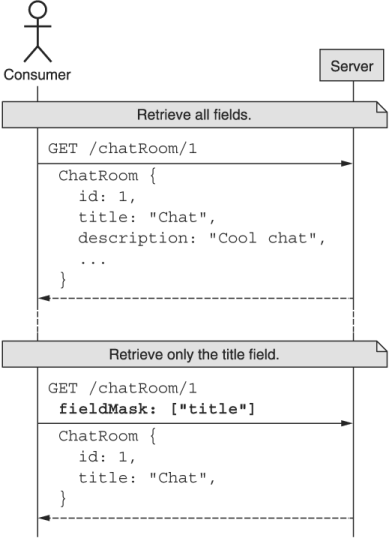
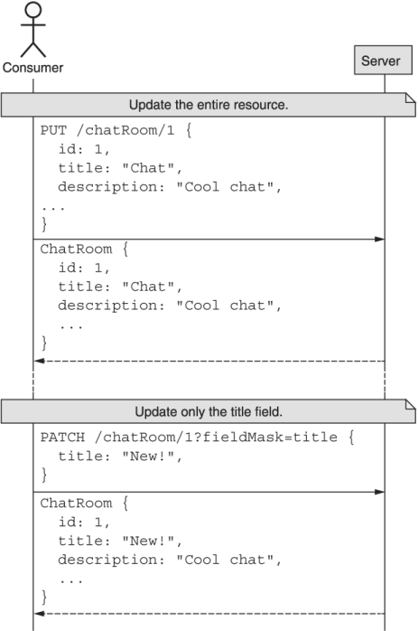
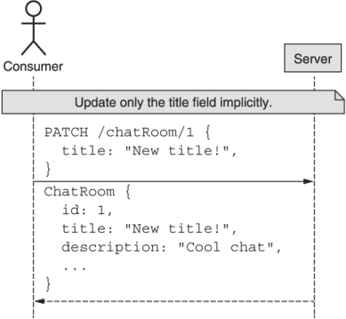

本章涵盖内容

- 为什么我们可能只想更新或检索资源的特定部分
- 如何最好地将感兴趣的领域传达给 API 服务
- 如何处理复杂领域中的单个项目，例如地图和界面
- 是否支持对重复字段（例如数组）中的单个项目进行寻址
- 定义默认值并处理隐式字段掩码
- 如何处理无效的字段规范

正如我们在第 7 章中了解到的，重要的是我们有能力以零碎的方式更新资源，而不是总是依赖完全替换。在这种模式中，我们探索使用字段掩码作为工具来仅更新我们对给定资源感兴趣的特定字段。此外，我们还介绍了如何将字段掩码应用于相反方向的同一问题：仅检索资源上的特定字段。虽然不太常见，但检索资源的一部分而不是整个事物的能力在内存敏感的应用程序中尤为重要，例如使用 API 输出的物联网设备。

## 8.1 动机
在这种设计模式中，我们实际上将探索同一枚硬币的两个方面，这两个方面都与资源的不同视图相关。到目前为止，在我们讨论的任何 API 中，我们都只将资源称为独立的原子单元。换句话说，我们从未考虑过将资源分解为其组成属性并在更细粒度的级别上进行操作的可能性。尽管这使得一些编程范式变得更加简单（例如，您永远不必担心管理资源的一部分），但当您想在与 API 交互时更具体和表达您的意图时，这可能会成为问题.让我们看一下此限制禁止的新功能的两个具体实例。

### 8.1.1 部分检索

在大多数 API 中，当您检索资源时，您要么得到整个资源，要么得到一个错误，要么全部要么全无。对于我们中的许多人来说，这并不是真正的问题。毕竟，我们还能想要什么？但是如果这个 API 中的资源变得非常大，有数百个不同的字段和子字段怎么办？或者，如果发出请求的设备可用的计算资源非常有限，例如在非常小的 IoT 设备上，该怎么办？或者如果连接速度有限或非常昂贵怎么办？在这些场景中，控制从 API 返回多少信息突然变得非常重要。

虽然这似乎只是在巨大资源或非常严格的条件下才需要的东西，但请记住，虽然单个新字段可能只占用一点点空间（因此设备上的成本、带宽和内存更多） ，当列出许多这些资源时，一点点空间乘以项目数。正如您可能想象的那样，随着资源数量的增加和时间的推移，曾经的小数字突然变得非常大。归根结底，为 API 用户提供仅检索他们真正感兴趣的资源片段（或资源列表）的能力是非常有价值的。

### 8.1.2 部分更新
支持部分更新背后的逻辑有点复杂——并且不太关注性能因素和硬件限制等问题。与其担心读取资源的特定部分，我们更关心的是能够对特定字段进行细粒度定位和修改。那么我们究竟为什么要关心这种更具体的更新呢？确保资源看起来与我们想要的完全一样，而不是许多小变化的集合，这不是很重要吗？

首先，存在对数据一致性的担忧。作为 API 的用户，当我们只有一个标准的替换方法（见第 7 章）来绘制时，我们被迫更新资源上的所有字段，而不仅仅是我们感兴趣的字段. 覆盖对我们来说并不重要的字段，没有可用的适当一致性检查，可能会导致数据丢失，这显然根本不是一件好事。要了解这可能如何发生，请想象以下代码片段（如表 8.1 所示）由两个不同的客户端针对同一资源运行。

表 8.1 可能出现问题的两个用户运行的示例代码序列

| User 1 API call                                              | User 2 API call                                              |
| :----------------------------------------------------------- | :----------------------------------------------------------- |
| let chatRoom = GetChatRoom({<br/>  id: '1'<br/>});<br/>chatRoom.title = "My Chat!";<br/><br/>chatRoom = ReplaceChatRoom({<br/>  chatRoom: chatRoom,<br/>}); | chatRoom.title = "My Chat!";<br />let desc = fetchRandomQuote();<br />chatRoom.description = desc;<br />chatRoom = ReplaceChatRoom({<br/>  chatRoom: chatRoom,<br/>}); |

如果这两个序列在没有任何一致性检查或锁定的情况下执行，最终结果是只有最终的标准替换方法才重要。由用户 1 执行的第一个可能根本就没有发生过！从这一点来看，这两个更新根本没有冲突的充分理由。用户 1 想要更新 ChatRoom 资源的标题，而用户 2 只想更新完全独立的描述字段。即使我们添加了一些一致性检查，第二个标准替换方法也会失败并需要重试以确保更新确实被提交。

但是这个问题还有更多，导致数据丢失的方法也更多。正如我们将在第 24 章中更详细地看到的，API 很少保持不变。相反，它们往往会随着时间的推移而发展，以支持新功能并修复现有功能中的错误。我们最终依赖的最常见场景之一是能够向资源添加新字段，同时仍考虑向后兼容新版本。但是，如果您更新资源的唯一机制是完全替换它们，并且您的本地接口没有与资源上的完整（新）字段列表保持同步，那么这可能会带来相当大的问题。

例如，假设我们想要更新 ChatRoom 资源的标题，但在我们上次更新客户端库后的时间（当我们存储在 ChatRoom 资源中的唯一字段是标题字段和管理员时），服务添加了一个新的描述字段。在这个世界中，如果有人之前为资源设置了描述，那么我们的标准替换方法可能最终会破坏该数据，而我们最终会再次丢失数据。为了看看这是什么样子，清单 8.1 显示了两个不同的客户端更新 ChatRoom 资源。首先，代码是最新的，并且非常了解新的描述字段。在后者中，代码有一段时间没有更新，也从未听说过这个描述字段。

清单 8.1 两个不同的客户端更新单个资源

```typescript
> let chatRoom = latestClient.GetChatRoom({ id: '1' });  // ❶
> chatRoom.description = 'Description!';
> ReplaceChatRoom({ chatRoom: chatRoom });
> console.log(chatRoom);
{
  id: '1',
  title: 'Old title',
  description: 'description'
}
 
> chatRoom = oldClient.GetChatRoom({ id: '1' });         // ❷
> console.log(chatRoom);
{
  id: '1',
  title: 'Old title',
}
> chatRoom.title = 'New title';                          // ❸
> ReplaceChatRoom({ chatRoom: chatRoom });
 
> chatRoom = latestClient.GetChatRoom({ id: '1' });      // ❹
> console.log(chatRoom);
{
  id: '1',
  title: 'New title',
  description: null
}
```

❶ 首先，我们使用“最新客户端”来更新房间的描述。
❷ 如果我们使用旧客户端来获取资源，则描述字段完全丢失。
❸ 然后我们用旧客户端更新标题，没有任何问题。
❹ 但是，现在我们再次使用新客户端时，描述字段已经被删除了！
虽然这看起来很吓人，好像出了什么问题，但事实是标准的替换方法正在做它应该做的事情。回想一下，此方法专门设计用于使远程资源看起来与请求中指定的资源完全相同。这意味着从任何缺失的字段中删除数据，无论这是否是我们的意图。

简而言之，部分更新的目标是让 API 使用者更明确地了解他们的意图。如果他们打算替换整个资源，他们可以使用标准的替换方法。如果他们打算只更新单个字段，则应该有一种更细粒度的机制，通过该机制他们可以表达更新资源的意图。在这种情况下，部分更新是一个很好的解决方案。

## 8.2 概述
为了实现这两个目标（启用部分检索和部分更新），我们实际上可以依赖一个工具：字段掩码。 从根本上说，字段掩码只是字符串的集合，但这些字符串表示我们对给定资源感兴趣的字段列表。 当需要检索资源并且我们想要更具体地说明我们想要检索哪些字段时，我们可以简单地提供字段掩码来表示应该返回哪些字段，如图 8.1 所示。



正如我们可以使用字段掩码来控制我们对检索哪些字段感兴趣，我们也可以依靠相同的工具来控制服务应该更新资源的哪些字段。在这种情况下，当更新资源时，我们可以提供我们打算更新的字段列表，并确保只修改那些特定字段，如图 8.2 所示。



此外，由于 JSON 恰好是一个动态数据结构，如果 PATCH 请求中缺少字段掩码本身，我们可以从 JSON 对象中存在的属性推断字段掩码（如图 8.3 所示）。虽然在我们的 API 中处理动态数据结构时，这可能会变得更加复杂，但在大多数情况下，此字段掩码推断提供了最预期的结果。



这可能看起来很简单，但有很多边缘情况和棘手的场景比它们看起来要复杂得多。在下一节中，我们将探讨如何在 API 中实现对字段掩码的支持。

## 8.3 实施
现在我们已经掌握了场掩码的高级概念，我们需要更详细地了解它们是如何工作的。换句话说，我们知道我们应该能够在 GET 或 PATCH 请求上发送这个任意字段列表，结果是更具体的更新或检索。但是我们如何发送这些字段呢？毕竟，GET 请求不接受正文，而 PATCH 请求应该将资源本身作为请求正文。让我们深入探讨如何在不对第 7 章中定义的标准请求造成任何重大干扰的情况下传输字段掩码。

### 8.3.1 运输

虽然字段掩码看起来非常强大，但它们导致了一个重要的问题：我们如何在我们的请求中将它们传输到 API 服务器？考虑到我们与 HTTP 的密切关系，我们如何在遵守 HTTP 和面向资源的 API 设计规则的同时做到这一点？由于 GET 和 PATCH 请求的两个重要限制，这变得特别复杂。

首先，对于 GET 请求，请求没有正文被允许（如果提供，许多 HTTP 服务器将把它去掉）。这意味着我们绝对不能使用 HTTP 请求正文来指示我们有兴趣检索的字段。接下来，对于 PATCH 请求，即使明显允许主体（这就是我们更新资源本身的方式），面向资源的设计规定 PATCH 请求的主体必须是正在更新的资源表示。换句话说，虽然我们在技术上可以在单个 JSON 表示中同时提供字段和资源，但这会打破标准更新方法的许多基本假设，并导致各种不一致。

清单 8.2 破坏 HTTP PATCH 方法规则导致的部分更新混乱

```typescript
PATCH /chatRooms/1 HTTP/1.1
Content-Type: application/json
 
{
  "chatRoom": {            // ❶
    "id": 1,
    "title": "Cool Chat"
  },
  "fieldMask": ["title"]   // ❷
}
```

❶ 这种情况下的 ChatRoom 资源不是请求的主体，这违反了标准更新方法的准则。
❷ FieldMask 本身与 ChatRoom 资源并存。
我们可以做什么？除了用于我们的字段掩码的 HTTP 请求正文之外，还有两个潜在的位置：标头和查询字符串。虽然这两种技术在技术上都有效，但事实证明查询参数更易于访问，特别是考虑到我们甚至可以在浏览器请求中修改这些参数，而标头在 HTTP 的管道中隐藏得更深，使它们更难访问.因此，查询参数可能是更好的选择。

不幸的是，似乎没有重复查询参数的规范，这意味着如何解释重复的查询字符串参数将取决于使用的 HTTP 服务器。例如，考虑表 8.2 中的示例。如您所见，不同的服务器以不同的方式处理这些输入，因此依赖于与多次使用同一字段的最常见标准一致的库非常重要，例如 ?fieldMask=title&fieldMask=description。尽管其中一种替代方法 (fieldMask=a,b) 看起来更简洁，但当我们需要表 8.2 来探索映射或嵌套接口时，这可能会出现问题（参见第 8.3.5 节）。

表 8.2 不同系统如何处理多值查询参数的示例

|       框架        |           预期格式           |               标注               |
| :---------------: | :--------------------------: | :------------------------------: |
|        PHP        | ?fieldMask[]=a&fieldMask[]=b |                                  |
|  Flask (Python)   |   ?fieldMask=a&fieldMask=b   | request.args.to_dict(flat=False) |
|   Spring (Java)   |   ?fieldMask=a&fieldMask=b   |                                  |
|                   |        ?fieldMask=a,b        |                                  |
| Express (Node.js) |   ?fieldMask=a&fieldMask=b   |                                  |

这意味着我们必须增加标准更新方法和标准获取方法的请求消息。 如您所见，这只是在请求消息上添加新的 fieldMask 属性的问题。

清单 8.3 包含字段掩码的标准获取和更新请求示例

```typescript
type FieldMask = string[];     // ❶
 
interface GetChatRoomRequest {
  id: string;
  fieldMask: FieldMask;        // ❷
}
 
interface UpdateChatRoomRequest {
  resource: ChatRoom;
  fieldMask: FieldMask;        // ❷
}
```

❶ FieldMask 类型只不过是一个路径数组。
❷ 我们可以简单地向更新和获取请求接口添加一个 fieldMask 属性。
现在我们知道如何在我们的 API 中传输这些字段掩码值（同时仍然遵守 HTTP 和面向资源的 API 标准），让我们更仔细地查看每个字段掩码条目包含的值，从映射和嵌套接口开始。

### 8.3.2 映射和嵌套接口

到目前为止，我们实际上只考虑了平面资源数据结构——即那些没有任何嵌套值类型的数据结构。尽管我们可能喜欢那个世界的简单性，但它不一定反映现实，我们对资源的价值本身就是其他接口类型。此外，我们可能会发现自己处于资源包含一个映射类型字段的场景中，该字段只是键值对的集合。这给我们带来了一个有趣的难题：部分更新和检索的想法是否扩展到嵌套结构内部？或者它只适用于最顶层，有效地将资源视为完全扁平的结构？

好消息是，绝对有一种方法可以允许指向带有字段掩码的嵌套字段（在嵌套静态接口和类似动态映射的值中）。坏消息是，这需要字段掩码条目本身具有相当多的特异性和特殊转义字符。为了了解它是如何工作的，让我们从一个简单的规则列表开始，我们可以将这些规则组合成一个强大的工具箱来处理大多数情况。别担心，我们稍后会查看示例。

字段规范的分隔部分必须使用点字符 (.) 作为分隔符。
可以使用星号字符 (*) 引用嵌套消息的所有字段。
映射键应该始终是字符串。
不能表示为不带引号的字符串文字的字段规范的所有部分（字段名称或映射键）必须使用反引号字符 (`) 引用。
可以使用两个反引号字符 (``) 来转义文字反引号字符。
如果这些规则让你感到害怕，那就坚持下去。这些例子会让它变得更清晰。为了探索这个独特的问题空间，让我们从一个例子开始，如清单 8.4 所示。在这种情况下，假设我们的 ChatRoom 资源既有 LoggingConfig 字段，也有可能包含任意键值样式数据的设置映射字段。让我们看看我们如何处理各个领域。

清单 8.4 添加嵌套接口字段和动态地图字段

```typescript
interface ChatRoom {
  id: string;
  title: string;
  description: string;
  loggingConfig: LoggingConfig;     // ❶
  settings: Object;                 // ❷
}
 
interface LoggingConfig {
  maxSizeMb: number;
  maxMessageCount: number;
}
```

❶ 这里我们有一个嵌套字段，尽管它是一个具有明确定义字段的静态结构。
❷ settings 字段是一个任意的键值映射，具有不同类型的值。
为了可视化我们如何应用这些规则中的每一个，表 8.3 显示了 ChatRoom 资源中数据的示例表示，以及我们如何将单个字段作为字段掩码中的条目进行寻址的示例。

表 8.3 具有每个字段对应字段掩码条目的资源表示

|      |      |      |
| ---- | ---- | ---- |
|      |      |      |
|      |      |      |
|      |      |      |
|      |      |      |
|      |      |      |

如您所见，有一种方法可以使用规则来处理资源中的每个单独字段。虽然大多数都非常简单（例如，“描述”和“设置 .test.value”，但其他的特别难看，乍一看可能会令人困惑。例如，在映射键可能被解释为数值的情况下，我们需要在反引号中引用这些。对于点字符可能被误解为分隔符文字字符的情况也是如此（例如“settings.test .value”和“settings.`test.value`”的情况，很容易混淆). 最后，如果需要将反引号用作文字字符，则应将它们加倍（无论您需要`，就使用``）。

通过遵循这五个定义字段掩码格式的规则，我们应该能够处理数据结构中的任何嵌套字段，即使它具有奇怪的字符文字（如点、星号或反引号）。

然而，这确实遗漏了资源中字段类型的一个重要类别：重复字段或数组。在下一节中，我们将探讨如何使用字段掩码处理资源中的重复字段。

### 8.3.3 重复字段
我们有一种清晰而简单的方法来处理嵌套接口和映射字段中的字段，但是对于重复的字段（例如字符串列表）呢？如果重复字段本身是嵌套接口怎么办？我们如何处理给定书籍的所有作者的姓氏？幸运的是，有一种明确的方法可以做到这一点。但在我们开始之前，必须首先讨论一个重要的限制：通过索引来寻址重复字段中的项目。

我们都熟悉如何在我们选择的编程语言中处理数组中的单个项目。几乎总是，这类似于 item[0] 来获取名为 item 的数组中的第一项。虽然这显然是编程语言中的一个关键功能，但它在 Web API 中真的有意义吗？

如果我们碰巧是该 API 的唯一用户，或者我们正在处理的资源是完全不可变的，并且索引是唯一标识符或排序，那么可能。但在几乎所有其他场景中，Web API 中的此功能可能会以多种方式产生误导。

首先，通过索引访问项目意味着该索引是唯一标识符，但在大多数情况下实际上并非如此。索引现在是一个标识符，但它不是一个稳定的标识符，因为它很容易随着时间的推移而改变，无论是通过在有问题的项目之前插入一个项目还是通过替换整个数组值。接下来，通过使用索引作为任何类型的标识符，这个特定列表的稳定排序有明确的含义。这意味着列表中项目的顺序可以保证随着时间的推移保持一致，即使新项目被附加到列表的末尾。这些可能看起来是很小的影响，但随着时间的推移维持它们可能会成为一个相当大的负担，并没有太大的好处。

由于所有这些问题，能够通过 Web API 中的索引单独处理列表项确实没有多大意义。如果确实需要此类功能，那么依赖地图字段（其项目具有稳定、真实、本地唯一标识符）或子资源集合（每个子资源都有自己的全局唯一标识符）会更有用。因此，重要的是 API 不支持根据索引检索或更新重复字段中的单个项目的能力。换句话说，消费者永远不应该有能力指示 API 更新或检索资源重复字段中的“索引 0 处的项目”。第一项的想法是完全没有意义的，除非 API 保证各种额外的功能，随着时间的推移，这些功能维护起来非常繁重。

幸运的是，这并不意味着我们可以与重复字段中的项目完全没有交互。相反，我们可能想对这些字段做一件非常有用的事情，为了实现这一点，我们当然需要一种表达该意图的方法。

假设我们的 ChatRoom 资源包含一个 User 类型的管理员字段。我们已经学习了如何仅获取管理员的名称（例如，fieldMask=admin .name），但是如果有多个管理员怎么办？我们怎样才能得到每个管理员的名字？

清单 8.5 具有多个管理员的聊天室的表示

```typescript
interface ChatRoom {
  id: string;
  title: string;
  description: string;
  administrators: User[];   // ❶
}
 
interface User {
  name: string;
  email: string;
  // ...
}
```

❶ 在这种情况下，管理员是用户界面的重复字段。
在这种情况下，我们可以再次依靠星号来表示相当于各种 for-each 循环。换句话说，我们可以对待前缀“administrators.*”。作为一种说法“对于每个管理员，只提供列出的字段。”在这种情况下，要仅检索管理员的姓名，我们可以使用字段掩码值“administrators.*.name”。但是，请记住，此附加功能并不妨碍我们使用（简单）管理员字段掩码询问所有管理员。

不幸的是，虽然此功能确实使我们能够在重复字段中的项目中选择特定字段，但它并不能让我们更新这些字段。原因与“administrators[0]”无法解决的原因相同：重复字段不能保证稳定，因此无法知道列表中的哪个项目打算用哪个值更新.

清单 8.6 尝试通过索引更新重复字段中的项目的（错误）示例

```typescript
PATCH /chatRooms/1?fieldMask=administrators.*.name HTTP/1.1
Content-Type: application/json
 
{
  "administrators": [
    { "name": "New name for Index 0" },   // ❶
    { "name": "New name for Index 1" }
  ]
}
```

❶ 如果没有强一致性和排序保证，就不能保证这将取代我们感兴趣的管理员。
如您所见，如果无法保证订单或添加了新管理员并移动了索引，则无法确定结果是否符合我们的预期。我们不是更新重复字段中的单个项目，而是必须对所有重复字段执行完全替换。

### 8.3.4 默认值

正如我们在第 5 章中了解到的，默认值的目标是为用户做“正确的事”。这是因为留空是 API 用户的表达方式，即他们不一定对 API 的这方面有意见，并且相信 API 会为他们提供最适合大多数其他用户的行为。对于字段掩码，所使用的标准方法（标准获取与标准更新）的默认值仅略有不同。

在标准的 get 方法中，默认值几乎总是资源上可用字段的完整列表。这意味着除非指定了字段掩码，否则应返回资源接口上存在的每个字段。这确保了支持部分检索的标准 get 方法的行为方式与完全不支持部分检索的方式相同（我们在第 8.4.1 节中更详细地探讨了这一点）。

本指南有一个例外。如果资源具有字段，无论出于何种原因，这些字段都会导致 API 使用者的用户体验从根本上变差，则应从未设置字段掩码的默认设置中删除这些字段。例如，假设资源包含非常大的字段，或者需要很长时间来计算，以致标准 get 方法需要几分钟才能返回任何结果。在这种情况下，从返回的默认字段集中排除这些有问题的字段可能更有意义。这意味着对这些字段感兴趣的用户需要通过明确指定字段掩码来表达他们的兴趣。

这种情况应该相对不常见，但至关重要的是，如果某个字段确实属于此异常（即默认情况下不会包含它并且必须明确请求），则字段文档本身必须包含该事实。如果文档中的某处没有该指示，则可能会导致极其混乱的行为，并迫使 API 使用者只有在反复试验后才能发现这一事实，这当然是不理想的。

这导致了最后一个值得考虑的场景：如果我们需要检索所有字段，但我们不想列出这些字段中的每一个怎么办？换句话说，我们不想遵循让 API 决定我们应该猜测哪些字段的默认设置。相反，我们想特别询问每个可用的字段，包括那些可能很大或难以计算的字段。这也可能包括自我们上次更新客户端代码以来添加的字段（参见第 24 章）。我们应该怎么做？

答案其实非常简单明了：我们应该依靠一个特殊的哨兵值来表示“一切”；在这种情况下，该值是一个星号（“*”）。如果此值存在于字段掩码中，则应返回所有字段，而不管是否还存在任何其他字段。

既然我们已经探索了部分检索数据的默认值，我们需要稍微切换一下，以决定通过标准更新方法部分更新数据的默认值应该是什么。不幸的是，在更新资源时，推荐用于检索的所有字段的默认值不太合理；毕竟，如果我们默认提供所有字段，那么它实际上更像是标准的替换方法而不是标准的更新方法。我们应该做什么？

一种方便的选择是尝试根据提供的数据推断字段掩码。换句话说，我们可以遍历输入数据，并且只有在指定了值时才更新字段。在下一节中，我们将更详细地探讨这个想法。