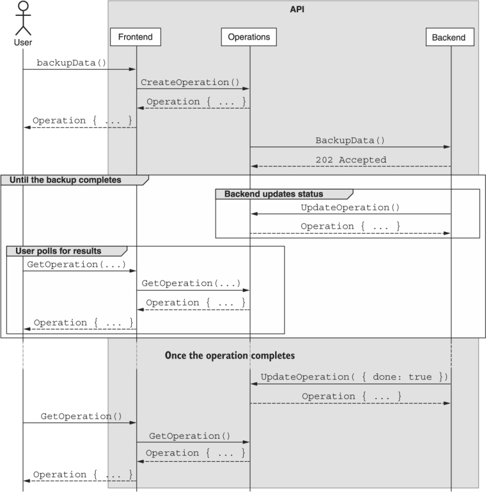

本章涵盖内容

- 如何对非即时 API 调用使用长时间运行的操作
- 存储有关操作进度的元数据
- 操作应该在资源层次结构中的位置
- 通过轮询和阻塞查找操作状态（包括错误结果）
- 与正在运行的操作交互（例如，暂停、恢复和取消）

在大多数情况下，传入的请求可以被快速处理，在收到请求后的几百毫秒内生成响应。 在响应时间明显更长的情况下，使用相同 API 结构并要求用户“等待更长时间”的默认行为并不是一个非常优雅的选择。 在本章中，我们将探讨如何使用长时间运行的操作来允许 API 方法以异步方式运行，并确保较慢的 API 方法（包括我们在第 7 章中看到的标准方法）可以提供快速且一致的 在后台执行实际工作时的反馈。

## 10.1 动机
到目前为止，我们探索的所有 API 方法都是即时和同步的。服务收到请求，立即执行一些工作，然后发回响应。这种特殊的行为方式实际上是硬编码到 API 设计中的，因为返回类型是结果，而不是一些稍后返回结果的承诺。

到目前为止，这是有效的，因为大多数有问题的行为都相对简单，例如查找数据库行并返回结果。但是，当工作变得更加复杂、更加复杂、资源更加密集时，会发生什么呢？这可能是相对较小的事情（例如连接到外部服务），或者可能涉及一些严重的繁重工作（例如处理数 GB 或 TB 的数据）。无论是少量的还是大量的工作，有一点很清楚：依靠相同的 API 设计来实现一致的快速行为和潜在的非常缓慢的行为不太可能很好地工作。

如果我们对 API 不做任何更改，而该方法只需要更长的时间，那么我们最终会陷入非常可怕的境地。通常，当我们编写向 API 发送请求的代码时，我们有一个熟悉的“编写、编译、测试”开发周期。如果 API 请求需要很长时间，那么我们可能会认为我们的代码有问题，终止进程，添加一些打印语句（或启动调试器），然后再次运行代码（参见清单 10.1）。如果我们看到它肯定挂在 API 调用上，我们可能会再次循环，这次调整一些参数以确保我们没有做一些愚蠢的事情。只有在它继续挂在 API 调用上之后，我们才会注意到文档中的一句话说请求可能需要一段时间，我们应该等待它返回。

清单 10.1 添加打印语句以通过代码监控进度

```typescript
function main() {
  let client = ChatRoomApiClient();
  let chatRoomName = generateChatRoomName();
  console.log(`Generated name ${chatRoomName}`);      // ❶
  let chatRoom = client.CreateChatRoom({              // ❷
    name: chatRoomName
  });
  console.log(`Created ChatRoom ${chatRoom.id}`);     // ❶
}
 
main();
```

❶ 我们添加了一些console.log() 语句来确保问题是CreateChatRoom 方法需要很长时间。
❷ 可能由于某种原因，创建聊天室资源需要一段时间。
在这一点上，我们可能对问题出在哪里更有信心（毕竟，现在我们很确定它不在我们的代码中），但是我们应该等待多久的响应？多久才够长？我们如何知道它何时太长并值得更详细地研究问题？我们如何看到这项工作的进展？如果我们想取消正在完成的工作怎么办？我们当前在本地终止正在运行的进程的策略并没有告诉服务器它现在所做的所有工作都将白费。有一种方法让 API 知道它什么时候应该停止做所有这些工作，因为我们不再对结果感兴趣，这是非常有用的。

不幸的是，到目前为止我们所看到的 API 设计根本无法满足我们所需要的任务。期望现有模式来处理这些长时间运行的 API 调用有点不合理。这就引出了一个显而易见的问题：我们要做什么？这种设计模式的目标就是回答这个问题。

## 10.2 概述
这个问题并不是 Web API 独有的。事实上，在程序中本地执行工作更为常见。我们想做一些可能需要一段时间的事情，但是，如果可能的话，我们也希望我们的程序在等待那个缓慢的函数时继续做其他工作。这实际上是一个非常普遍的问题，以至于许多现代编程语言都创建了结构来处理这种异步行为并使其易于在我们的程序中进行管理。它们的名称因一种语言而异（Python 称之为 Futures，JavaScript 称之为 Promises），但目标很简单：开始一些工作，但不必阻止它。相反，返回一个代表它的占位符的对象。然后，执行工作并允许占位符最终解决（结果成功）或拒绝（抛出错误）。为了处理这些不同的场景，用户可以在占位符上注册回调以异步处理结果，或者等待返回的结果，阻止代码执行直到解决或拒绝该占位符（有效地使异步工作同步）。

清单 10.2 等待回调并将回调附加到 Promise

```typescript
async function factor(value: number): Promise<number[]> {
  // ...
}
 
async function waitOnPromise() {
  let factors = await factor(...);                  // ❶
 
  let promise = factor(...);
  let otherFactors = await promise;                 // ❶
}
 
function promiseCallback() {
  let promiseForFactors = factor(...);              // ❷
  promiseForFactors.then( (factors: number[]) => {
    // ...
  }).catch( (err) => {
    // ...
  });
}
```

❶ 这里我们可以等待结果。 这将返回结果或引发错误。
❷ 在这里，我们可以将回调附加到 Promise，处理正在解决的结果和拒绝的错误。
这种模式的目标是为 Web API 设计一个等价的 Promise 或 Futures，我们将其称为长期运行的操作或 LRO。 这些 API 承诺主要侧重于提供一个工具来跟踪 API 在后台所做的工作，并且应该支持类似的交互模式，例如等待（阻塞）结果、检查状态或异步通知结果。 在许多情况下，这些 LRO 还提供暂停、恢复或取消正在进行的操作的能力，但是，正如我们将看到的，这将取决于具体情况。 图 10.1 显示了 LRO 及其如何流经系统的示例。



虽然 LRO 与承诺有很多相似之处，但也会有很多很大的不同。 首先，由于 LRO 负责跟踪由另一个 Web API 方法完成的工作，因此 LRO 只是这些各种方法的新返回类型。 与编程语言中的 promise 不同，promise 可以显式创建以在后台执行任意代码，很少有任何理由显式创建 LRO。

清单 10.3 返回 LRO 的标准 create 方法

```typescript
abstract class ChatRoomApi {
  @post("/chatRooms")
  CreateChatRoom(req: CreateChatRoomRequest):
    Operation<ChatRoom, CreateChatRoomMetadata>;     // ❶
}
```

❶ 标准的 create 方法不是直接返回 ChatRoom 资源，而是返回一个 LRO，最终会产生一个 ChatRoom 资源。
另一个重要区别在于这些 LRO 的持久性。虽然 promise 是短暂的并且仅存在于创建它们的代码的运行过程的上下文中，但根据定义，LRO 是一个远程概念，在 API 服务器的远程执行环境中存在和运行。因此，它们需要被视为适当的 API 资源，并以它们自己的标识符保存在 API 中。换句话说，即使在创建它们的过程早已被丢弃之后，这些 LRO 仍将存在。

此外，与简单地返回特定类型结果的承诺不同，LRO 将用于跟踪有关操作本身的进度和其他元数据。因此，LRO 还必须提供某种模式来存储此操作元数据。这可能是操作的进度、操作开始或完成的时间，或者作为操作的一部分正在执行的当前操作。

最后，由于这些 LRO 可以存活任意长的时间并且不会随着原始进程而消亡，因此很容易失去我们对 Operation 资源的处理。由于我们不能总是确定我们将拥有每个 LRO 标识符的持久记录，因此我们还需要一种方法来发现 API 知道的 LRO。为此，我们将依赖 API 服务和一些标准方法来查找我们创建的 LRO，例如 ListOperations()。

现在我们已经了解了 LRO 应该如何工作的基本思想，让我们更深入地了解 LRO 的外观以及如何将这一概念集成到 Web API 中的细节。

## 10.3 实施
要添加对依赖 LRO 的异步 API 调用的支持，我们需要做两件事。首先，我们必须定义这些操作资源的样子。这将包括允许对 LRO 的结果类型（例如，最终将返回的资源）以及有关我们可能想要存储的操作的任何元数据的接口（例如，进度指示器）进行某种形式的通用参数化以及有关 LRO 本身的其他信息）。

其次，由于 LRO 与创建它们的环境不同（API 服务与客户端代码），我们需要一种在 API 中发现和管理这些 LRO 的方法。这意味着我们需要定义几个 API 方法来与 LRO 交互，主要是标准列表方法、标准 get 方法，甚至可能是用于暂停、恢复和取消操作的自定义方法。让我们从定义 LRO 的样子开始。

### 10.3.1 LRO 是什么样的？

要了解 LRO 接口应该是什么样子，我们需要考虑我们想用这个资源做什么。首先，由于它是一种资源，我们需要与它交互的能力，因此需要一个标识符字段。接下来，这些 LRO 的主要目标是最终返回结果。这意味着我们显然需要一种表示该结果的方法。但是，我们还必须考虑发生错误并且操作未成功完成的情况。此外，我们必须考虑这样一个事实，即可能有一些操作根本不会有结果，而只是通过不存在错误来表示成功。为了处理所有这些情况，我们可以使用一个可选的结果字段，它可以是一个 OperationError 接口（带有代码号、消息文本和其他详细信息）或参数化的结果类型。对于最后一部分，我们可以依赖 TypeScript 的泛型，接受 ResultT 的输入泛型类型。

此外，我们必须考虑 LRO 地位的一些概念。在许多语言中，promise 具有三种可能的状态：pending、resolved（成功完成）或rejected（完成并出现错误结果）。虽然我们可以从不存在的结果字段推断出 LRO 的状态，但当最终结果只是空的时候，这可能容易出错。为了解决这个问题，Operation 资源应该有一个单独的布尔标志来指示 LRO 是否完成。为了避免该字段表示操作成功或失败的任何指示（例如，完成可能表示资源成功完成），我们将简单地将此布尔标志称为完成。

最后，我们必须考虑这样一个事实，即这些 LRO 可能需要在结果可用之前提供有关正在执行的工作的元数据。例如，也许我们想为用户提供进度指示器或估计的剩余时间值。我们不是简单地为这个元数据公开一个无模式的值，而是接受一个接口作为这个值的通用参数，称为 MetadataT。

清单 10.4 Operation 和 OperationError 接口的定义

```typescript
interface Operation<ResultT, MetadataT> {  // ❶
  id: string;
  done: boolean;                           // ❷
  result?: ResultT | OperationError;       // ❶    
  metadata?: MetadataT;                    // ❶    
}
 
interface OperationError {
  code: string;
  message: string;
  details?: any;
}
```

❶ 我们使用 ResultT 和 MetadataT 泛型来定义结果类型的接口以及存储的关于 LRO 的元数据。
❷ 我们依靠 done 字段来指示操作是否仍在工作。
值得一提的是，并不真正要求 ResultT 是 API 资源。在某些情况下，这可能是一个空值，例如当某些工作除了已完成的工作之外没有实际结果要报告时。它也可能是某种临时值，例如 TranslationResult 接口，它可能具有将文本从一种语言翻译成另一种语言的请求结果。此外，如果没有值得存储在 LRO 上的元数据，显然可以将此类型设置为 null，从而有效地完全消除该字段。

现在我们有了这个 LRO 类型，我们必须实际使用它。为此，我们只需将其作为 API 方法的结果返回。例如，正如我们在清单 10.3 中看到的，我们可以通过返回一种 Operation <ChatRoom, CreateChatRoomMetadata> 而不是我们在第 7 章中学到的只是 ChatRoom 的类型来使标准的创建方法异步。然而，在幕后，我们需要创建并存储这个 Operation 资源，这就引出了一个关于 LRO 在资源层次结构中的位置的有趣问题。

### 10.3.2 资源层次
由于异步方法创建的 LRO 必须在某处持久化，这就带来了一个重要而明显的问题：这些 LRO 究竟应该位于资源层次结构中的哪个位置？我们有两个明显的选项可供选择。首先，我们可以将操作集合存储在 LRO 所操作的特定资源下。或者，我们可以将操作存储为顶级集合，与它们可能涉及的资源分开。

在使用 LRO 使标准方法异步的情况下（如清单 10.3 所示），这可能非常有意义。然而，尽管这个选项可能很诱人，但它也存在不少问题。首先，如果操作不一定以资源为中心怎么办？相反，如果操作是更短暂的操作，例如将一些音频转录成文本，该怎么办？其次，如果我们将这些集合拆分到各种资源中（例如，chatRooms/1/operations/2 与 chatRooms/2/operations/3），这会使我们无法轻松查询系统中的整个操作列表。

由于所有这些事情，使用集中的顶级操作资源集合（例如，/operations/1）是一个更好的主意。使用这种类型的集中式资源布局，我们将在后面的部分中看到，除了一次简单地寻址单个 LRO 之外，我们还能够发现整个系统中的其他 LRO。

既然我们已经了解了这些 LRO 资源的位置，让我们看看我们如何在实践中实际使用它们。

### 10.3.3 分辨率

到目前为止，我们已经注意到 API 方法可以通过简单地更改返回类型快速变为异步。这种从即时结果到最终返回结果的 LRO 的转变无疑是处理此类问题的一种快速简便的方法；然而，我们真的没有说我们如何处理返回给我们的这个操作资源。换句话说，一旦我们获得了这个 LRO 资源，我们到底应该用它做什么？我们如何得到最终结果？

在大多数编程语言中，promise 可以以两种状态之一结束：拒绝或已解决。承诺成功完成并以返回最终值结束的这种解决行为可以说是承诺（或者，在我们的例子中，是一个操作）中最重要的部分。那么我们如何得到这个结果呢？事实证明，有很多方法可以做到这一点，正如我们在清单 10.2 中看到的那样。然而，为了将这些在本地解析 promise 的风格适应 Web API 的世界，我们需要做一些调整。

在接下来的几节中，我们将研究确定 LRO 最终结果的两种不同方式，从轮询结果开始。

#### 轮询

确定 LRO 是否仍在运行或已完成的最直接方法是简单地询问有关 LRO 的服务。换句话说，我们可以不断地请求 LRO 资源，直到它的 done 字段设置为 true。事实上，许多依赖于 LRO 之类的客户端库将在后台执行此检查，要么在请求之间使用标准等待时间，要么使用某种形式的指数退避，在每个请求之间增加越来越多的时间。

清单 10.5 轮询 LRO 的更新直到它完成

```typescript
async function createChatRoomAndWait(): Promise<ChatRoom> {
  let operation: Operation<ChatRoom, CreateChatRoomMetadata>;
  operation = CreateChatRoom({                                 // ❶
    resource: { title: "Cool Chat" }
  });
 
  while (!operation.done) {                                    // ❷
    operation = GetOperation<ChatRoom, CreateChatRoomMetadata>({ // ❸
      id: operation.id
    });
    await new Promise( (resolve) => {                          // ❹
      setTimeout(resolve, 1000)
    });
  }
  
  return operation.result as ChatRoom;                         // ❺
}
```

❶ CreateChatRoom 方法返回一个操作，而不是返回一个 ChatRoom，它是一个承诺最终解析为一个 ChatRoom（或一个 OperationError）。
❷ 只要操作的 done 字段仍然为假，我们就继续循环。
❸ 在每次迭代中，我们再次请求操作信息。
❹ 我们等待一段时间过去，让更多的工作发生在 API 服务器上。
❺ 最后，我们返回运算结果。
在这种情况下，我们需要存在的只是在响应中返回操作资源的方法（在本例中为 CreateChatRoom），然后是参数化的 GetOperation 方法来检索 LRO 的状态。

清单 10.6 LRO 标准 get 方法的定义

```typescript
abstract class ChatRoomApi {
  @post("/chatRooms")
  CreateChatRoom(req: CreateChatRoomRequest):
    Operation<ChatRoom, CreateChatRoomMetadata>;
 
  @get("/{id=operations/*}")
  GetOperation<ResultT, MetadataT>(req: GetOperationRequest):
    Operation<ResultT, MetadataT>;                              // ❶
}
 
interface GetOperationRequest {
  id: string;
}
```

❶ 方法被参数化以确保正确的返回类型。此方法将用于所有操作类型，而不仅仅是 CreateChatRoom 方法。
这种行为的明显缺点是，几乎肯定会有一长串请求只会导致我们再次尝试，这可能被认为是浪费精力（客户端和 API 服务器上的网络流量和计算时间）。这显然有点不方便，但它最容易理解，确保我们及时听到结果（根据我们自己对“及时”的定义），并将询问结果的责任留给客户端，谁最了解他们对结果感兴趣的时间范围。

有了这个，让我们继续寻找 LRO 结果的下一个选项：等待。

#### 等待

轮询有关 LRO 的更新会将控制权交给客户端。换句话说，客户端决定检查操作的频率，并且可以出于任何原因决定停止检查，例如不再对操作的结果感兴趣。轮询的一个缺点是我们不太可能立即知道操作的结果。通过减少请求更新操作之间的等待时间，我们总是可以越来越接近立即发现，但这会导致越来越多的请求根本没有更新。本质上，轮询在我们进行更新之前的最大延迟与浪费的时间和资源之间具有内在的权衡。

解决此问题的一种方法是依赖与 API 服务的长期连接，该连接仅在操作完成后关闭。换句话说，我们向 API 服务发出请求，要求保持连接打开，并且仅在操作将其 done 字段设置为 true 时才响应。这种类型的阻塞请求确保 API 服务知道操作完成的那一刻，我们将被告知该操作的结果。尽管服务器端的实现可能实际上依赖于轮询，但 API 服务器内部的轮询比从远程客户端轮询到 API 服务器要简单得多。

此选项的缺点是现在 API 服务器负责管理所有这些连接并确保在操作完成时向请求发出响应（这可能需要相当长的时间）。这可能会变得非常复杂，但最终结果是 API 用户的一种非常简单的交互模式。

为了使这项工作，我们需要添加一个新的自定义方法：等待。此方法看起来与 GetOperation 参数化方法几乎相同，但它不会立即返回状态，而是会等到操作被解析或拒绝。

清单 10.7 LRO 的自定义等待方法的定义

```typescript
abstract class ChatRoomApi {
  @get("/{id=operations/*}:wait")        // ❶
  WaitOperation<ResultT, MetadataT>(req: WaitOperationRequest):
    Operation<ResultT, MetadataT>;
}
 
interface WaitOperationRequest {
  id: string;
}
```

❶ 这里我们使用 HTTP GET 方法，因为这应该是幂等的。
值得注意的是，由于 WaitOperation 和 GetOperation 之间的输入和返回类型是相同的，因此在 GetOperation 方法上添加一个简单的标志来等待或不等待可能会更容易。虽然这无疑是更有效地利用空间，但这意味着单个布尔标志可以有意义地改变 API 方法的底层行为，这通常是一个非常糟糕的主意。此外，通过使用单独的方法，我们可以轻松监控和实施服务级别目标，例如预期响应时间。如果我们使用一个标志来指示我们是否应该等待解决方案，将很难将缓慢的 API 调用与因基础设施问题而缓慢的即时 GetOperation 方法分开。

这在客户端代码中如何工作？简而言之，客户端可以简单地等待 API 调用的响应。换句话说，此方法有效地使任何异步 API 调用都像同步调用一样。使用 WaitOperation 方法，我们的 createChatRoomAndWait() 函数变得更加简单。

清单 10.8 使用 WaitOperation 自定义方法的客户端代码

```typescript
function createChatRoomAndWait(): Promise<ChatRoom> {
  let operation: Operation<ChatRoom, CreateChatRoomMetadata>;
  operation = CreateChatRoom({                                 // ❶
    resource: { title: "Cool Chat" }
  });
 
  operation = WaitOperation({ id: operation.id });             // ❷
  return operation.result as ChatRoom;                          // ❸
}
```

❶ 我们可以使用标准的 create 方法获得创建 ChatRoom 资源的承诺。
❷ 我们可以简单地等待操作的结果，而不是循环。
❸ 假设没有错误，一旦WaitOperation 方法返回结果，结果就可用。
虽然这肯定会导致直接的、同步的客户端代码，但等待响应充满了潜在的问题。如果由于某种原因而丢失连接（例如，客户端可能是一个可能会丢失信号的移动设备），我们又回到了必须轮询的地方（一种由外部环境驱动的不同类型的轮询，而不是而不是计时事件）。

现在我们已经了解了如何检索 LRO 的结果，让我们看看（希望如此）不太常见的情况，即结果不成功而我们需要处理错误。

### 10.3.4 错误处理

在大多数 Web API 中，错误以 HTTP 错误代码和消息的形式表现出来。例如，我们可能会收到 404 Not Found 错误，表明未找到资源，或 403 Forbidden 错误，表明我们无权访问资源。当响应是即时的和同步的时，这很有效，但是我们如何在 LRO 的异步世界中处理这个问题？

虽然在 LRO 失败时简单地传递错误响应肯定很诱人，但这可能会带来一些严重的问题。例如，如果对 GetOperation 的响应产生了底层操作的错误，我们如何区分作为操作结果的 500 Internal Server Error 与实际上只是处理代码的错误的相同错误GetOperation 方法？显然，这意味着我们需要一个替代方案。

正如我们之前看到的，我们将处理这个问题的方式涉及允许结果（指示的 ResultT 类型）或 OperationError 类型，其中包括机器可读的代码、人类消费的友好描述和任意结构存储其他错误详细信息。这意味着 GetOperation 方法应该只在检索 Operation 资源时出现实际错误时才抛出异常（通过返回 HTTP 错误）。如果成功检索到 Operation 资源，则错误响应只是 LRO 结果的一部分。然后由客户端代码决定是抛出客户端异常还是以其他方式处理错误结果。例如，我们可以调整我们的 createChatRoomAndWait() 函数来处理可能的错误结果。

清单 10.9 检查错误或返回结果

```typescript
function isOperationError(result: any):
    result is OperationError {                           // ❶
  const err = result as OperationError;
  return err.code !== undefined && err.message !== undefined;
}
 
function createChatRoomAndWait(): Promise<ChatRoom> {
  let operation: Operation<ChatRoom, CreateChatRoomMetadata>;
  operation = CreateChatRoom( { resource: { title: "Cool Chat" } });
  operation = WaitOperation({ id: operation.id });
  if (isOperationError(operation.result)) {              // ❷
    // ...
  } else {
    return operation.result as ChatRoom;
  }
}
```

❶ 首先我们定义一个类型检查函数来判断结果是否是错误的。
❷ 接下来我们可以检查结果并根据操作是否成功来做不同的事情。
在我们继续之前，值得强调的是错误代码值是唯一的、特定的，并且用于机器而不是人类消费是多么重要。当错误代码未提供（或有重叠，或用于人类而非计算机）时，我们最终会陷入可怕的情况，即 API 用户可能开始依赖消息内容来找出问题所在。这本身不是问题（毕竟，错误消息可以帮助用户找出问题所在）；然而，每当 API 用户觉得需要编写任何依赖于该错误消息内容的代码时，它就会突然成为 API 的一部分。这意味着当我们更改错误消息时（例如，通过修复拼写错误），我们可能会无意中在以前工作的代码中导致错误。正如我们将在第 24 章中学到的那样，应该不惜一切代价避免这种情况，最好的方法是在代码中使用比错误消息本身更有用的错误代码。

在用户不仅需要知道错误类型，还需要了解错误的一些附加信息的情况下，详细信息字段是放置这种结构化的机器可读信息的理想场所。虽然此附加信息并未严格禁止出现在错误消息中，但它在错误详细信息中更为有用，并且肯定是必需的。一般来说，如果错误信息丢失，我们不应该丢失任何在 API 文档中无法查找的信息。

有了这个，让我们深入研究 LRO 的下一个有趣但可选的方面：监控进度。

### 10.3.5 监控进度

到目前为止，我们已经将操作视为完成或未完成，但我们并没有真正关注这两种状态之间的点。那么我们如何才能随时关注 LRO 的进展呢？这正是 Operation 资源的元数据字段发挥作用的地方。

正如我们在清单 10.4 中看到的，Operation 资源接受两个字段的两种类型。第一个是结果的类型，第二个是分配给元数据字段的 MetadataT。正是这个特殊的接口，我们可以用来存储信息，而不是关于结果的信息，而是关于 LRO 本身的信息。这可以是简单的信息，例如工作开始的时间戳，或者在这种情况下，正在完成的工作的进度、完成前的估计时间或处理的字节数。

虽然进度通常意味着“完成的百分比”，但并没有明确的要求就是这种情况。在许多情况下，百分比可能有用，但估计完成时间甚至更有用，或者可能是实际进度的度量，例如处理的记录。此外，不能保证我们会有一个有意义的百分比值——我们都知道完成百分比开始倒退是多么令人沮丧！幸运的是，我们可以为元数据字段使用我们想要的任何接口。代码清单 10.10 展示了一个例子，分析聊天室资源的对话历史以获得一些语言统计数据，使用分析和统计的消息数量作为进度指示器。

清单 10.10 具有元数据类型的 AnalyzeMessages 自定义方法的定义

```typescript
abstract class ChatRoomApi {
  @post("/{parent=chatRooms/*}/messages:analyze")
  AnalyzeMessages(req: AnalyzeMessagesRequest):
    Operation<MessageAnalysis, AnalyzeMessagesMetadata>;
}
 
interface AnalyzeMessagesRequest {
  parent: string;
}
 
interface MessageAnalysis {              // ❶
  chatRoom: string;
  messageCount: number;
  participantCount: number;
  userGradeLevels: map<string, number>;
}
 
interface AnalyzeMessagesMetadata {      // ❷
  chatRoom: string;
  messagesProcessed: number;
  messagesCounted: number;
}
```

❶ 此方法的结果不是资源，而是显示每个用户的写作等级等的分析界面。
❷ 元数据接口使用处理和计数的消息来确定进度。
我们如何实际使用它？ 在 10.3.3 节中，我们看到了如何使用轮询来持续检查 LRO 以希望它完成。 以同样的方式，我们可以使用 GetOperation 方法检索存储在 AnalyzeMessagesMetadata 接口中的进度信息。

清单 10.11 使用元数据接口显示进度

```typescript
async function analyzeMessagesWithProgress(): Promise<MessageAnalysis> {
  let operation: Operation<MessageAnalysis, AnalyzeMessagesMetadata>;
  operation = AnalyzeMessages({ parent: 'chatRooms/1' });
 
  while (!operation.done) {
    operation = GetOperation<MessageAnalysis, AnalyzeMessagesMetadata>({
      id: operation.id
    });
    let metadata = result.metadata as AnalyzeMessagesMetadata; // ❶
    console.log(
      `Processed ${metadata.messagesProcessed} of ` +        // ❷
      `${metadata.messagesCounted} messages counted...`);
    await new Promise( (resolve) => setTimeout(resolve, 1000));
  }
 
  return operation.result as MessageAnalysis;
}
```

❶ 首先，我们从当前状态的操作中检索元数据。
❷ 接下来，我们向控制台打印一行，更新消息在处理和计数时的进度。
现在我们知道如何检查操作的进度，我们可以开始探索与操作交互的其他方式。例如，如果操作的进度比我们预期的慢得多怎么办？也许我们犯了一个错误？我们如何取消操作？

### 10.3.6 取消操作

到目前为止，我们与 LRO 的所有交互都假设，一旦开始，操作就会继续执行它们的工作，直到它们成功解决或因错误而被拒绝。但是如果我们不想等待操作完成怎么办？

我们可能有多种原因想要这样做。错别字和“brain-o”（错字的心理版本）发生的频率远远超过我们可能承认的。像这样的情况导致我们编写代码，为错误的数据创建 LRO，输出的目标错误，有时甚至只是完全错误的方法！如果所有这些情况都是在本地运行 promise，我们只需终止进程并停止执行即可。但是，由于我们正在处理远程执行环境，因此我们需要一种方法来请求与此等效的方法。为此，我们可以使用自定义方法：CancelOperation。

清单 10.12 自定义取消方法的定义

```typescript
abstract class ChatRoomApi {
  @post("/{id=operations/*}:cancel")                                 // ❶
  CancelOperation<ResultT, MetadataT>(req: CancelOperationRequest):
    Operation<ResultT, MetadataT>;
}
 
interface CancelOperationRequest {
  id: string;
}
```

❶ 自定义方法在中止后返回完全取消的操作资源。
就像 GetOperation 方法一样，CancelOperation 方法将返回参数化的 Operation 资源，并且该资源将其 done 字段设置为 true（回想一下，done 是专门选择的，因为它并不意味着操作的真正完成或成功）。为确保结果始终被视为完成，此方法应阻塞，直到操作完全取消，然后才返回结果。在某些情况下，这可能需要一段时间（也许还有其他几个子系统需要联系）；但是，等待响应仍然是合理的，就像10.3.3节中的WaitOperation方法一样。

同样重要的是，如果可能，删除由于 LRO 执行而产生的任何中间工作产品或其他输出。毕竟，取消 LRO 的目标是以一个看起来好像操作从未开始过的系统结束。在取消操作后无法清理的情况下，我们应该确保用户自己进行清理所需的所有信息都存在于操作的元数据字段中。例如，如果操作在存储系统中创建了多个文件，无论出于何种原因，在取消操作之前都无法擦除这些文件，则元数据必须包含对这些中间数据的引用，以便用户可以自行擦除这些文件。

最后，虽然如果所有 LRO 类型都能够被取消肯定会很可爱，但不应该严格要求整个 API 都是这种情况。这样做的原因很简单，因为操作的目的、复杂性以及是否可以取消的天生能力往往不同。通常取消某些操作是有意义的，而其他操作则根本不遵循该模式。我们永远不应该添加对取消对用户没有好处的 LRO 的支持。

有了这个，让我们看看本质上类似于取消的不同类型的交互，只是不那么持久：暂停和恢复。

### 10.3.7 暂停和恢复操作

既然我们已经打开了与操作交互的大门，以有意义地改变他们的行为（例如，取消他们的工作），我们可以开始研究 LRO 的另一个重要方面：暂停正在进行的工作，然后在稍后恢复的能力.虽然我们可以依赖与我们刚刚了解的 CancelOperation 方法类似的自定义方法，但在考虑这种情况时还有一些需要考虑的地方。

最重要的是，如果操作被暂停，我们当然需要一种方法来告诉它已被暂停。不幸的是，Operation 资源上的 done 字段在这里不太适用。暂停的操作没有完成，所以我们不能只是重新利用该字段以供我们使用。这给我们留下了两个选择：向操作界面添加一个新字段（暂停或类似的东西）或依赖元数据进行操作。

向操作界面添加一个新字段会很好也很简单，但这也带来了自己的问题：无法保证每个操作都能够暂停和恢复。在某些情况下，这可能是有道理的，但在其他情况下，这些 LRO 是全有或全无的事务，用户尝试暂停操作并没有获得真正的好处。例如，尝试暂停在火箭升空后发射火箭的 API。简直没道理！

简而言之，这给我们留下了一个不太优雅但更好的解决方案：依靠元数据来处理这种类型的状态。这意味着有一个重要规则：要使操作能够暂停和恢复，元数据类型 (MetadataT) 必须有一个名为“paused”的布尔字段。

清单 10.13 向元数据接口添加暂停字段

```typescript
interface AnalyzeMessagesMetadata {
  chatRoom: string;
  paused: boolean;             // ❶
  messagesProcessed: number;
  messagesCounted: number;
}
```

❶ 为了支持暂停和恢复操作，元数据接口必须有一个暂停的布尔字段。
pause 和 resume 方法（PauseOperation 和 ResumeOperation）与我们之前了解的其他以操作为中心的资源基本相同。 它们接受操作资源的标识符以及将在操作上返回的类型（ResultT 和 MetadataT）的参数。 就像 CancelOperation 方法一样，这些方法应该只在操作成功暂停或恢复后才返回。

清单 10.14 自定义暂停和恢复方法的定义

```typescript
abstract class ChatRoomApi {
  @post("/{id=operations/*}:pause")   
  PauseOperation<ResultT, MetadataT>(req: PauseOperationRequest):
    Operation<ResultT, MetadataT>;                                  // ❶
 
  @post("/{id=operations/*}:resume")  
  ResumeOperation<ResultT, MetadataT>(req: ResumeOperationRequest):
    Operation<ResultT, MetadataT>;                                  // ❶
}
 
interface PauseOperationRequest {
  id: string;
}
 
interface ResumeOperationRequest {
  id: string;
}
```

❶ 自定义方法返回暂停（或恢复）的操作。
暂停或恢复底层工作的实际过程留作 API 的实现细节。尽管探索在各种不同 API 中暂停和恢复工作的所有不同机制会很有趣，但这里要说的最多的只是我们应该只在有意义且可行的情况下支持这些方法。这意味着如果我们想要支持暂停 API 方法，例如，将数据从一个地方复制到另一个地方，我们必须存储一个指向执行复制的进程的指针，并确保我们可以杀死该进程，但也可能会清理复制数据时造成的混乱。不过，其余的细节留给实际的 API 设计者处理。

### 10.3.8 探索操作

LRO 的独特之处之一是创建 API 承诺的代码与执行承诺并完成所有工作的环境是分开的。这意味着如果启动工作的代码不知何故在承诺完成之前崩溃，我们可能会发现自己陷入困境。除非我们保留操作 ID 以便稍后可以恢复轮询循环，否则当进程在本地执行环境中终止时，指向执行我们请求的工作的操作的指针将随所有其他状态一起丢失。

这个场景说明了一个相当大的疏忽：我们可以检索关于单个 Operation 资源给定标识符的信息，但我们无法发现正在进行的工作或检查 API 系统的状态和历史记录。幸运的是，这是一个很容易解决的问题。为了填补这个空白，我们需要做的就是在我们的 API 中为操作资源的集合定义一个标准的列表方法。

此方法的行为应该与其他标准列表方法类似，但至关重要的是我们至少支持某种形式的过滤。否则，在尝试提出诸如“目前哪些运营资源尚未完成？”之类的问题时可能会变得困难。此外，过滤还必须支持查询资源的元数据。否则，我们无法回答诸如“暂停哪些操作？”之类的其他问题。

清单 10.15 LRO 标准列表方法的定义

```typescript
abstract class ChatRoomApi {
  @get("/operations")
  ListOperations<ResultT, MetadataT>(req: ListOperationsRequest):  // ❶
    ListOperationsResponse<ResultT, MetadataT>;
}
 
interface ListOperationsRequest {
  filter: string;   												// ❷
}
 
interface ListOperationsResponse<ResultT, MetadataT> {
  results: Operation<ResultT, MetadataT>[];
}
```

❶ 这遵循标准列表方法，但允许参数化。
❷ 稍后我们将看看如何应用分页。
这种简单的 API 方法使我们能够回答有关操作的所有问题，特别是在我们碰巧没有提前获得标识符的情况下。 请注意，该操作确实接受结果类型和元数据类型的参数，但这不应禁止要求所有操作的能力，无论涉及的类型如何。 我们可以使用 TypeScript any 关键字来做到这一点； 但是，由调用者检查结果以确定特定类型（在大多数情况下，结果的标识符将包括资源类型）。

可以想象，过滤所有这些资源是非常强大的，但是一旦这些操作完成，我们就必须考虑将这些记录保留多长时间。 在下一节中，我们将探讨这些 LRO 记录的持久性标准。

### 10.3.9 持久化

虽然这些 LRO 确实是资源（具体而言，运营资源），但它们与我们自己定义的资源略有不同。首先，它们不是显式创建的，而是通过系统中的其他行为而存在的（例如，请求对数据进行分析可能会导致创建一个操作资源来跟踪正在完成的工作）。这种隐式创建与我们通常使用标准创建方法使资源存在的典型方式有着根本的不同。

更重要的是，这些资源很快就会从一个非常重要的地方变成旧新闻。例如，任何作为标准方法（例如 CreateChatRoom）结果的 LRO 在处理时都非常重要，但一旦完成就变得毫无用处。这样做的原因是结果本身是操作的永久记录输出，因此在此之后跟踪该资源创建的过程并不是特别有价值。

这意味着我们必须解决一个令人困惑的问题：我们是否像对待任何其他资源一样对待 LRO 并永久保存它们？还是它们的持久性策略与其他更传统的资源略有不同？如果他们确实有不同的持久性政策，那么正确的政策是什么？

事实证明，有很多不同的选择，每个都有自己的优点和缺点。最容易管理和最快实施的是像对待任何其他资源一样对待运营资源并永久保留它们。一般来说，大多数 API 都应该依赖这种方法，除非它会给系统带来不必要的负担（通常是当您每天创建数百万个 Operation 资源时）。

如果 API 的交互模式使这种永久存储方法特别浪费，那么下一个最佳选择是依赖滚动窗口，根据在 expireTime 字段中定义的完成时间戳（而不是创建时间戳）清除操作资源在操作资源上设置。简而言之，如果资源存在时间超过 30 天，则应将其永久删除。

代码清单 10.16 在 Operation 接口中添加一个过期字段

```typescript
interface Operation<ResultT, MetadataT> {
  id: string;
  done: boolean;
  expireTime: Date;                   // ❶
  result?: ResultT | OperationError;
  metadata?: MetadataT;
}
```

❶ 我们可以使用过期时间来显示资源何时会从系统中删除。
还有许多更复杂和功能丰富的选项（例如在删除操作时删除它们所关联的资源，或者在一定时间后归档操作，然后在归档另一个时间窗口后删除它们)，但应避免这些。最终，由于混乱和复杂的清除算法，它们会造成更大的困难。取而代之的是，依靠简单的到期时间对每个人来说都很容易理解，并且对最终结果毫不含糊。

要记住的最重要的事情是资源的到期时间不应取决于操作的底层结果类型。换句话说，代表创建资源的工作的操作应该在与代表分析数据的工作的操作相同的时间后到期。如果我们对不同类型的操作使用不同的到期时间，可能会导致更多的混乱，结果似乎以不可预测的方式消失。

### 10.3.10 最终 API 定义

将所有内容放在一起，清单 10.17 显示了与 LRO 相关的所有这些各种方法和接口的完整 API 定义。

清单 10.17 最终 API 定义

```typescript
abstract class ChatRoomApi {
  @post("/{parent=chatRooms/*}/messages:analyze")
  AnalyzeMessages(req: AnalyzeMessagesRequest):
    Operation<MessageAnalysis, AnalyzeMessagesMetadata>;
 
  @get("/{id=operations/*}")
  GetOperation<ResultT, MetadataT>(req: GetOperationRequest):
    Operation<ResultT, MetadataT>;
 
  @get("/operations")
  ListOperations<ResultT, MetadataT>(req: ListOperationsRequest):
    ListOperationsResponse<ResultT, MetadataT>;
 
  @get("/{id=operations/*}:wait")
  WaitOperation<ResultT, MetadataT>(req: WaitOperationRequest):
    Operation<ResultT, MetadataT>;
 
  @post("/{id=operations/*}:cancel")
  CancelOperation<ResultT, MetadataT>(req: CancelOperationRequest):
    Operation<ResultT, MetadataT>;
 
  @post("/{id=operations/*}:pause")
  PauseOperation<ResultT, MetadataT>(req: PauseOperationRequest):
    Operation<ResultT, MetadataT>;
 
  @post("/{id=operations/*}:resume")
  ResumeOperation<ResultT, MetadataT>(req: ResumeOperationRequest):
    Operation<ResultT, MetadataT>;
}
 
interface Operation<ResultT, MetadataT> {
  id: string;
  done: boolean;
  expireTime: Date;
  result?: ResultT | OperationError;
  metadata?: MetadataT;
}
 
interface OperationError {
  code: string;
  message: string;
  details?: any;
}
 
interface GetOperationRequest {
  id: string;
}
 
interface ListOperationsRequest {
  filter: string;
}
 
interface ListOperationsResponse<ResultT, MetadataT> {
  results: Operation<ResultT, MetadataT>[];
}
 
interface WaitOperationRequest {
  id: string;
}
 
interface CancelOperationRequest {
  id: string;
}
 
interface PauseOperationRequest {
  id: string;
}
 
interface ResumeOperationRequest {
  id: string;
}
 
interface AnalyzeMessagesRequest {
  parent: string;
}
 
interface MessageAnalysis {
  chatRoom: string;
  messageCount: number;
  participantCount: number;
  userGradeLevels: map<string, number>;
}
 
interface AnalyzeMessagesMetadata {
  chatRoom: string;
  paused: boolean;
  messagesProcessed: number;
  messagesCounted: number;
}
```

## 10.4 权衡

很明显，有很多方法可以处理可能需要一段时间的 API 调用。例如，最简单的方法之一也恰好是最容易为客户端管理的：只要请求需要的时间就行。这些更简单的选项的权衡是它们不太适合分布式架构（例如，一个微服务启动工作，另一个监控其进度）。

另一个权衡是，实际监视挂起直到完成的 API 调用的进度可能会变得更加复杂。虽然 API 可以随着时间的推移推送数据，但如果连接因任何原因中断（可能是进程崩溃、网络连接中断等），我们将失去继续监控该进度的能力。此外，如果我们决定在网络出现故障后恢复监控进度，那么我们构建的内容很有可能会开始类似于 LRO 的概念。

LRO 一开始也可能有点难以理解。它们是复杂的、通用的、参数化的资源，它们不是明确创建的，而是通过请求的其他工作而存在的。这无疑打破了我们迄今为止所了解的资源创建模式。此外，当谈到“可重新运行的作业”和 LRO 的概念时，经常会出现混淆，我们将在第 11 章中更详细地讨论它们。

简而言之，虽然这种设计模式一开始可能难以理解，但随着时间的推移，API 承诺的概念可以很容易地与 API 用户产生联系。而且模式本身几乎没有任何实际限制——毕竟，如果这是用户需要和期望的，没有什么能阻止我们保持各种 API 方法的同步版本。

## 10.5 练习
1. 什么要操作资源作为顶层资源，而不是嵌套在其操作的资源之下？
2. 为什么 LRO 到期是有意义的？
3. 如果用户正在等待某个操作解析，而该操作通过自定义取消方法中止，结果应该是什么？
4. 在跟踪 LRO 的进度时，使用单个字段来存储完成百分比是否有意义？为什么或者为什么不？

## 总结

- LRO 是 Web API 的承诺或未来，用作跟踪 API 服务在后台完成的工作的工具。
- LRO 是参数化接口，返回特定的结果类型（例如，操作产生的资源）和用于存储有关操作本身的进度信息的元数据类型。
- LRO 在一定时间后解决结果或错误，用户通过定期轮询状态更新或在等待时收到结果通知来发现这一点。
- LRO 可以由 API 自行决定暂停、恢复或取消，并依赖自定义方法来执行此操作。
- LRO 应持久保存，但通常应在某个标准时间段（例如 30 天）后到期。