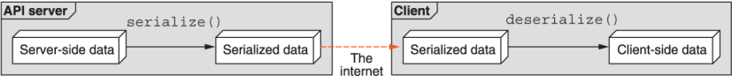

本章涵盖内容

- 我们所说的数据类型是什么意思
- 空值与完全缺失的值有何不同
- 探索各种原始和集体数据类型
- 如何处理各种数据类型的序列化

在设计任何 API 时，我们总是必须考虑我们希望接受、理解和可能存储的数据类型。有时这听起来很简单：名为“name”的字段可能只是一串字符。然而，隐藏在这个问题中的是一个复杂的世界。例如，字符串应该如何表示为字节（事实证明有很多选择）？如果在 API 调用中省略名称会怎样？这与提供空名称有什么不同（例如，{"name"：""}）？在本章中，我们将探讨您在设计或使用 API 时几乎肯定会遇到的各种数据类型，如何最好地理解它们的底层数据表示，以及如何最好地以理智和直接的方式处理各种类型的默认值。

## 5.1 数据类型介绍

数据类型几乎是每种编程语言的一个重要方面，它告诉程序如何处理数据块以及它应该如何与语言或类型本身提供的各种运算符交互。即使在具有动态类型的语言中（其中一个变量可以充当许多不同的数据类型，而不是仅限于一种），单个时间点的类型信息仍然非常重要，它决定了编程语言应该如何对待变量。

但是，在设计 API 时，我们必须打破单一编程语言的思维模式，主要是因为我们 API 的主要目标是让任何人，使用任何语言进行编程，都可以与服务交互。我们这样做的标准方法是依赖一些序列化协议，该协议采用我们选择的编程语言对数据进行结构化表示，并将其转换为与语言无关的序列化字节表示，然后再将其发送给请求它的客户端。在另一端，客户端反序列化这些字节并将它们转换回内存中的表示形式，它们可以从他们使用的语言（可能与我们的语言相同也可能不同）进行交互。有关此过程的概述，请参见图 5.1。



虽然这种序列化过程提供了巨大的好处（基本上允许任何编程语言使用 API），但它并非没有缺点。最大的问题是，由于每种语言的行为略有不同，翻译过程中会丢失一些信息。换句话说，由于不同编程语言在特性和功能上的差异，所有的序列化协议都会以某种方式“有损”。

这让我们回到数据类型的重要性以及如何在 API 中使用它们。简而言之，在考虑那些将使用 Web API 的人时，仅仅依赖我们选择的编程语言提供的数据类型是不够的。相反，我们必须考虑我们选择的序列化格式（最常见的是 JSON）提供的数据类型，以及在它不符合我们的需求的情况下我们如何扩展该格式。这意味着我们需要决定我们要向客户发送和接收的数据类型，并确保它们被记录得足够好，这样客户就不会对他们的行为感到惊讶。

这并不是说 Web API 必须遵循关系数据库系统的严格模式；毕竟，现代开发工具最强大的功能之一是动态无模式结构和数据存储提供的灵活性。但是，重要的是要考虑我们正在交互的数据的类型，并在必要时使用附加注释对其进行澄清。如果没有这个额外的数据上下文，我们可能最终会陷入困境，猜测客户的实际意图。例如，a + b 可能对数值采取一种方式（例如，2 + 4 可能导致 6），但对于文本值可能表现完全不同（例如，“2”+“4”可能导致“24”）。如果没有这种类型上下文，我们将被迫猜测客户端使用 + 运算符时的意图：是加法还是串联？如果一个值是数字而另一个是字符串呢？这可能会导致更多的猜测。但是如果一个值被完全省略怎么办？

### 5.1.1 缺失与空
令人惊讶的是，最令人困惑的方面之一来自数据丢失而不是存在的情况。首先，在许多序列化格式中都有一个空值，它是一个表示非值的标志（例如，字符串可以是值或文字空值）。那么在尝试添加（例如，null 和 2）时，API 应该如何表现？任何使用支持此类空值的序列化格式的 API 都需要决定如何最好地处理这种类型的 API 输入。它应该假装 null 在数学上等于 0 吗？尝试添加 null 和“值”怎么样？在这种情况下，应该将 null 解释为空字符串 ("") 并尝试连接它吗？

更糟糕的是，动态数据结构（例如，JSON 对象）有一个新问题：如果值根本不存在怎么办？换句话说，如果提供的值恰好被显式设置为 null，那么如果存储该值的键完全丢失怎么办？这是否与显式空值相同？要了解这意味着什么，假设您有一个 Fruit 资源，您希望它包含名称和颜色，这两种数据类型都是字符串数据类型。考虑以下示例 JSON 对象以及 API 可能识别资源颜色值的值：

```
fruit1 = { name: "Apple", color: "red" };
fruit2 = { name: "Apple", color: "" };
fruit3 = { name: "Apple", color: null };
fruit4 = { name: "Apple" };
```

如您所见，第一个颜色值很明显（fruit1.color == "red"）。然而，对于其他人，我们该怎么办？空颜色 ("") 是否与显式空颜色相同（fruit2.color 的处理方式与fruit3.color 有何不同）？缺少颜色值的水果怎么办？ Fruit3.color 的处理方式与fruit4.color 有什么不同吗？这些可能看起来像是 JSON 的怪癖；然而，它们确实以许多其他序列化格式存在（例如，Google 的 Protocol Buffers [https://opensource.google/projects/protobuf] 在这方面有一些令人困惑的行为），并且它们提出了每个 API 必须解决或风险的场景对那些使用 API 的人来说非常不一致和混乱。换句话说，您不能简单地假设序列化库会做正确的事情，因为几乎可以肯定每个人都会使用不同的序列化库！

在本章中，我们将介绍所有常见的数据类型，从简单的数据类型（有时称为基元）开始，然后逐步过渡到更复杂的数据类型（例如映射和集合）。您应该已经熟悉其中的大部分概念，因此重点将不再是每种数据类型的基础知识，而是更多关于将它们与 Web API 一起使用的必要注意事项。我们将深入研究每种数据类型的不同“陷阱”，以及如何为任何 API 最好地解决它们。我们还将坚持使用 JSON 作为选择的序列化格式，但大多数建议将适用于支持动态数据结构的任何格式，使用推断和显式类型定义。让我们从最简单的开始：真值和假值。

## 5.2 布尔值
在大多数编程语言中，布尔值是可用的最简单的数据类型，表示两个值之一：真或假。 由于这个有限的值集，我们倾向于依赖布尔值来存储标志或简单的是或否问题。 例如，我们可能会在聊天室中存储一个关于房间是否已存档或聊天机器人是否允许进入聊天室的标志。

清单 5.1 带有布尔标志的 ChatRoom 资源

```typescript
interface ChatRoom {
  id: string;
  // ...                    // ❶
  archived: boolean;        // ❷
  allowChatbots: boolean;   // ❸
}
```

❶ 在这里，我们将为聊天室提供许多其他字段。
❷ 此标志标记聊天室是否已存档。
❸ 这说明了聊天室中是否允许使用聊天机器人。
但是，在未来的情况下，布尔标志可能会非常有限，在这些情况下，是或否问题可能会成为更一般的问题，需要比布尔字段提供的答案更细致入微的答案。例如，未来可能有聊天室允许许多不同类型的参与者，而不仅仅是普通用户和聊天机器人。在这种情况下，我们当前的设计将导致每个允许（或不允许）类型的长列表，例如 allowChatbots、allowModerators、allowChildren、allowAnonymousUsers 等。如果这是可能的，那么避免使用布尔标志的集合，而是依靠不同的数据类型或结构来定义特定聊天室允许或禁止的参与者类别实际上可能更有意义。

假设布尔字段是变量的正确选择，还有一些其他有趣的方面需要考虑。隐藏在布尔字段名称中的是该字段是正数还是负数的声明。在 allowChatbots 示例中，该字段的真值表示允许聊天机器人进入聊天室。但它也可能很容易被 disallowChatbots，而真正的价值是禁止聊天。聊天室里的机器人。为什么选择其中之一？

一般来说，正布尔字段对我们大多数人来说最容易理解，原因很简单：人类必须更仔细地考虑双重否定。负字段的假值就是这样。例如，假设该字段是 disallowChatbots。您如何检查给定聊天室中是否允许使用聊天机器人？

清单 5.2 如果允许的话，一个将聊天机器人添加到房间的函数

```typescript
function addChatbotToRoom(chatbot: Chatbot,
                          roomId: number): void {
  let room = getChatRoomById(roomId);
  if (room.disallowChatbots === false) {    // ❶
    chatbot.join(room.id);
  }
}
```

❶ 在这里我们可以检查聊天机器人是否被禁止。如果为假，我们可以加入房间。
这是不可能的吗？可能不是。它是否比更简单的版本（if (room.allowChatbots) { ... }）有更多的认知负荷？对于我们大多数人来说，可能。仅基于这一点，使用正布尔标志几乎总是一个好主意。但是在某些情况下，依赖否定标志可能是有意义的，主要是当我们考虑字段的默认值或未设置值时。

例如，在某些语言或序列化格式（例如，直到最近，Google 的 Protocol Buffers v3）中，许多原语（例如布尔字段）只能具有零值而不是空值或缺失值。正如您可能猜到的，对于布尔值，这个零值几乎总是等于 false。这意味着当我们在创建聊天室时考虑 allowChatbots 字段的值时，如果没有任何进一步的干预，聊天室不允许聊天机器人（defaultChatRoom .allowChatbots == false）。但是我们无法区分用户说“我没有设置这个值，所以请做你认为最好的”（即空值或缺失值）和“我不想允许聊天机器人”（即，一个显式的假值）。在这两种情况下，该值都是错误的。我们可以做什么？

虽然这个问题有很多解决方案，但一个常见的选择是依靠布尔字段名称的正负方面来确定“正确”的默认值。换句话说，我们可以为布尔字段选择一个名称，以便零值提供我们正在寻找的默认值。例如，如果我们希望默认允许匿名用户，我们可能决定将字段命名为 disallowAnonymousUsers，以便零值 (false) 将导致我们想要的默认值（允许匿名用户）。不幸的是，这种选择将默认值锁定在字段名称中，这会限制未来的灵活性（即，您不能在线更改默认值），但是，正如他们所说，绝望的时代需要绝望的措施。

## 5.3 数值

从简单的是或否问题稍微复杂一点，数值允许我们存储各种有价值的信息，例如计数（例如，viewCount）、大小和距离（例如，itemWeight）或货币值（例如，priceUsd）。通常，我们可能想要对其执行算术计算的任何内容（或者即使这些计算仅具有逻辑意义），数字字段都是数据类型的理想选择。

有一个值得注意的例子实际上并不适合这种数据类型：数字标识符。这可能令人惊讶，因为许多数据库系统（以及几乎所有关系数据库系统）使用自动递增的整数值作为其行的主键标识符。那么为什么我们不对 API 中的标识符做同样的事情呢？

虽然出于各种原因（例如，性能或空间限制），我们可能仍然在幕后使用数字字段，但在 API 表面数字类型最适合用于提供某种形式的算术优势而不是实际数字的值.换句话说，如果 API 公开具有重量值（以克为单位）的物品，我们可以想象将所有这些值相加以确定一组这些物品的组合重量（以克为单位）。另一方面，添加一组数字标识符并使用该值执行某些操作通常没有任何意义。相反，添加一堆数字 ID 可能毫无用处。因此，重要的是依靠数字数据类型来获得数字或算术优势，而不是因为它们碰巧只用数字字符（可能在这里或那里有小数点）。一般来说，那些碰巧看起来像数字但行为更像标记或符号的值可能应该是字符串值（参见第 5.4 节）。

尽管如此，无论何时在 API 中使用数值，都需要考虑一些事项。让我们首先看看我们如何为这些数字字段定义可接受值的边界或范围。

### 5.3.1 边界

在为数字字段定义边界时，无论是整数还是小数（或其他一些数学表示，如分数、虚数等），重要的是要考虑上限或最大值、下限或最小值，和零值。由于这些都相互影响，让我们考虑绝对值界限，然后决定是否利用该范围的负面和正面。

说到边界，我们主要关注的是它们的大小。换句话说，所有数字最终都需要存储在某个地方，这意味着我们需要知道为这些值分配多少空间（以位为单位）。对于小整数，也许 8 位就足够了，有 256 个可能的值（–127 到 127）。对于最常见的数值，32 位通常是可接受的大小，大约有 40 亿个可能值（从负 20 亿到正 20 亿）。对于我们可能关心的大多数事情，64 位是一个安全的大小，大约有 18 个 quintillion 可能的值（从负 9 quintillion 到正 9 quintillion）。当我们引入浮点数时，这个范围会变得有点混乱，因为有很多不同的表示，这些值的存储范围高达 256 位，但重点是通常有一种表示适用于您的范围请记住您的 API。

虽然这些都是很好的可能性，但您可能想知道为什么我们要关心将存在于某个数据库中的数字的大小。毕竟，API 的目的不是抽象出所有这些东西吗？那是正确的;然而，这很重要，因为不同的计算机和不同的编程语言处理数字的方式远非统一。例如，JavaScript 甚至没有合适的整数值，而只有一个数字类型来处理该语言的所有数字值。此外，许多语言以非常不同的方式处理非常大的数字。例如，在 Python 2 中，int 类型能够存储 32 位整数，而 long 类型可以处理任意大数，至少存储 36 位。简而言之，这意味着如果 API 响应要向消费者发送非常大的数字，则接收端的语言可能无法正确解析和理解它。此外，这些潜在巨大数字的接收端的人需要了解分配多少空间来存储它们。简而言之，界限将非常重要。

因此，通常的做法是在内部依赖 64 位整数类型来表示整数，除非有充分的理由不这样做。一般来说，即使您目前可能不需要接近 64 位范围的任何地方，软件中的绝对确定性也很少见，因此设置上下限以及随着时间的推移有增长空间要安全得多。

### 5.3.2 默认值

正如我们在 5.1.1 节中了解到的，对于大多数数据类型，我们还需要考虑额外的场景，特别是空值和缺失值，其中字段被简单地省略，就像布尔值（5.2 节），但在序列化格式中不没有为原语提供一种机制来保存空值，我们将无法区分 0（或 0.0）的真实值和用户说的默认值，“我在这里没有意见所以你可以选择最适合我的。”

虽然可以依赖零值作为默认值的标志，但由于几个原因，这是有问题的。首先，作为 API 的一部分，零值实际上可能是有意义和必要的；但是，如果我们将其用作默认值的指标，我们将无法获得实际的零值。换句话说，如果我们使用 0 来表示“做最好的事情”（在这种情况下可能是值 57），我们无法实际指定一个有意的值 0。 其次，特别是在情况下在零值可能合乎逻辑的情况下，使用此值作为标志可能会造成混淆并导致意想不到的后果，违反了良好 API 的一些关键原则（在这种情况下，可预测性）。为了回答处理数值默认值的问题，我们实际上必须换档并更详细地讨论这些值应该如何序列化。

### 5.3.3 序列化
正如我们在 5.3.1 节中了解到的，一些编程语言处理数值的方式与其他语言不同。 当我们有非常大的数字时，这一点尤其明显，至少超过 32 位数字，但对于超过 64 位限制的数字更是如此。 由于普遍存在的浮点精度问题以及这种格式设计的一个已知缺陷，在处理十进制数时也会出现很多问题。

但最终，我们需要向 API 用户发送数值（并接受来自这些相同用户的传入数值）。 如果我们打算依赖序列化库而不深入挖掘，那么我们可能会非常失望。

清单 5.3 两个不同但被认为相等的数字，因为它们很大

```typescript
const compareJsonNumbers(): boolean {
  const a = JSON.parse('{"value": 9999999999999999999999999}');   // ❶
  const b = JSON.parse('{"value": 9999999999999999999999998}');
  return a['value'] == b['value'];    // ❷
}
```

❶ 这两个数值显然不一样（相差 1）。
❷ 但是，如果我们用它们解析一个 JSON 文档并进行比较，Node.JS 会说它们是相同的！
这个问题不仅限于大整数。 十进制数的浮点运算也是一个问题。

清单 5.4 添加数字会导致浮点运算问题

```typescript
const jsonAddition(): number {
  const a = JSON.parse('{"value": 0.1}');
  const b = JSON.parse('{"value": 0.2}');
  return a['value'] + b['value'];            // ❶
}
```

❶ 不幸的是，这将返回 0.30000000000000004 而不是 0.3。
那么我们该怎么办？ 清单 5.4 中的场景应该足以表明使用数值并假设它们在不同语言中是相同的可能会非常可怕。 简短的回答可能会让一些纯粹主义者感到沮丧，但它恰好工作得很好：使用一串字符。

这种在序列化时将数值表示为字符串值的简单策略只不过是一种避免将这些原始数值解释为实际数值的机制。 相反，这些值本身可以由一个库来解释，该库可能在处理这些类型的场景方面做得更好。 换句话说，我们可以使用像 Decimal.js 这样的库将值解析为任意精度的十进制类型，而不是 JSON 库将 0.2 解析为 JavaScript Number 类型。

清单 5.5 正确添加数字以避免任何浮点问题

```typescript
const Decimal = require('decimal.js');
 
const jsonDecimalAddition(): number {
  const a = JSON.parse('{"value": "0.1"}');               // ❶
  const b = JSON.parse('{"value": "0.2"}');
  return Decimal(a['value']).add(Decimal(b['value']);     // ❷
}
```

❶ 请注意，这些数值是字符串而不是实际数字。
❷ 当我们使用像 Decimal.js 这样的任意精度库来添加这些时，我们得到正确的值 (0.3)。
由于此策略的基础依赖于字符串，让我们花点时间探索字符串字段。

## 5.4 字符串
在几乎所有的编程语言中，字符串往往是我们认为理所当然的东西，而没有真正了解它们在底层是如何工作的。即使是我们这些花时间学习 C 如何处理字符串的人，也往往会避开字符编码和 Unicode 的广阔世界。虽然不一定要成为 Unicode、字符编码或其他字符串相关主题的专家，但在考虑如何在 API 中处理字符串时，有几件事非常重要。由于 API 中的大多数字段往往是字符串，因此这一点尤为重要。

在西方世界，将字符串视为代表文本内容的单个字符的集合是非常安全的。这是一个相当大的概括，但这不是一本关于 Unicode 的书，所以我们必须概括。由于我们希望在 API 中传达的大量内容本质上是文本，因此字符串可能是所有可用数据类型中最有用的。

字符串也可能是构建 API 时可用的最通用的数据类型。他们可以处理简单的字段，如姓名、地址和摘要；他们可以负责处理长文本块；并且，在序列化格式不支持通过网络发送原始字节的情况下，它们可以表示编码的二进制数据（例如，Base64 编码的字节）。字符串也是存储唯一标识符的最佳选择，即使这些标识符碰巧看起来像数字而不是文本。我们可能会将它们作为字节存储在幕后（更多信息请参见第 6 章），但几乎可以肯定，API 中的表示最好使用字符串来表示。

在我们开始讨论字符串如何成为世界的救星之前，让我们花点时间来看看字符串域的一些潜在陷阱，以及我们如何最有效地使用它们，从边界条件开始。

### 5.4.1 边界

正如我们在 5.3.1 节中了解到的，边界条件很重要，因为最终我们必须考虑分配多少空间来存储数据。就像数值一样，我们也需要考虑字符串值的相同方面。如果您曾经为关系数据库定义过架构并以 VARCHAR(128) 结束，其中 128 是一个完全任意的选择，那么您应该熟悉这种有时不受欢迎的必要性。

正如我们从数字中学到的那样，这些大小限制很重要，因为数据接收端的人需要知道分配多少空间来存储这些值。就像数字一样，在 API 生命周期的早期由于低估而增加大小是一种非常不舒服和不幸的情况。因此，在选择字符串字段的最大长度。

下一个值得解决的问题是如何定义最大长度。事实证明，我们最初将字符串定义为字符的集合只在某些有限的情况下有效，因为许多语言并没有像我们希望的那样紧密地遵循这个概念。然而，更大的问题出现了，因为存储空间的度量单位（磁盘上的字节）与字符串长度的度量单位（我们称之为字符）并不保持一对一的关系。我们可以做什么？

为了避免写一整章关于 Unicode，这个问题的最简单答案是继续考虑字符（即使这些实际上是 Unicode 代码点），然后假设最冗长的序列化格式用于存储目的：UTF- 32.这意味着当我们存储字符串数据时，我们为每个字符分配 4 个字节，而不是我们在使用 ASCII 时可能期望的典型单字节。

不管这个存储空间难题如何，我们还需要为每个字符串字段考虑另一个方面：处理过多的输入。对于数值，API 可以安全地拒绝超出范围的数字，并显示友好的错误消息：“请选择 0 到 10 之间的值。”对于字符串值，我们实际上有两种不同的选择。我们总是可以像数字超出范围一样拒绝该值，但是，根据情况和上下文，这可能有点不必要。或者，如果文本超出定义的限制，我们可以选择截断文本。

虽然截断看起来是个好主意，但它可能会产生误导和令人惊讶，正如我们在第 1 章中探讨的那样，这两者都不是一个好的 API 的特征。它还为 API 引入了一组新的选择（如果这个字段应该截断或拒绝？），这会导致进一步的不可预测性，因为不同的领域表现出不同的行为。因此，就像数字一样，拒绝任何超出字段定义限制的输入通常是最有意义的。

### 5.4.2 默认值
与数字和布尔字段类似，许多序列化格式不一定允许与零值 ("") 不同的空值 (null)。 因此，很难确定用户指定字符串应为空字符串与用户明确要求 API 在给定上下文的其余部分“做最好的”字段之间的区别。

幸运的是，有很多可用的选项。 在许多情况下，空字符串根本不是字段的有效值。 结果，空字符串确实可以用作指示应该注入和保存默认值的标志。 在其他情况下，字符串值可能有一组特定的适当值，空字符串是其中一种选择。 在这种情况下，允许选择“默认”作为指示应存储默认值的标志是完全合理的。

### 5.4.3 序列化
由于 Unicode 标准无处不在，几乎所有的序列化框架和语言都以几乎相同的方式处理字符串。这意味着，与我们在 5.3 节中探讨的数值不同，我们的重点不是精确或微妙的溢出错误，而是安全处理可能跨越整个人类语言范围的字符串，而不仅仅是西方世界使用的字符.

在引擎盖下，字符串只不过是一大块字节。然而，我们解释这些字节的方式（编码）告诉我们如何将它们转换成看起来像实际文本的东西——无论我们使用的是什么语言。简而言之，这意味着当需要序列化字符串时我们在 API 服务器上使用，我们不能只是以我们当时碰巧使用的任何编码发回它。相反，我们应该标准化一个单一的编码格式，并在所有请求和响应中一致地使用它。

虽然有很多编码格式（例如，ASCII、UTF-8 [https://tools.ietf .org/html/rfc3629]、UTF-16 [https://tools.ietf.org/html/rfc2781]、等），世界已经被 UTF-8 所吸引，因为它对于大多数常见字符来说非常紧凑，同时仍然足够灵活以编码所有可能的 Unicode 代码点。大多数面向字符串的序列化格式（例如 JSON 和 XML；https://www.w3.org/TR/xml/）已经确定为 UTF-8，而其他（例如，YAML）没有明确说明必须使用哪种编码使用。简而言之，除非有充分的理由不这样做，否则 API 应该对所有字符串内容使用 UTF-8 编码。

如果你认为这是一个我们可以简单地让图书馆完成工作的地方，你几乎是对的，但并不完全正确。事实证明，即使我们指定了一种编码，由于 Unicode 的规范化形式 (https://unicode.org/reports/tr15/#Norm_Forms)，仍有多种方法可以表示相同的字符串内容。这有点像我们可以表示数字 4 的各种方式：4、1+3、2+2、2*2、8/2 等等。在 UTF-8 编码的字符串中，可以对二进制表示做同样的事情。例如，字符“è”可以表示为单个特殊字符（“è”或 0x00e9）或基本字符（“e”或 0x0065）和重音字符（“`”或 0x0301）的组合。这两种表示在视觉上和语义上是相同的，但它们不是由磁盘上的相同字节表示的，因此，对于执行精确匹配的计算机，完全不同的值。

为了解决这个问题，Unicode (http://www.unicode.org/versions/Unicode13.0.0/) 支持不同的规范化形式和一些在特定形式上标准化的序列化格式（例如 XML）（在 XML 的情况下，Normalization形式 C) 以避免混合和匹配这些语义相同的文本表示。虽然这对于表示 API 资源的长格式描述的字符串可能没有那么重要，但当字符串表示标识符时它变得格外重要。如果标识符可以有不同的字节表示，那么相同的语义标识符实际上可能指向不同的资源。因此，API 拒绝不是使用规范化形式 C 编码的 UTF-8 的传入字符串是一个好主意，但对于碰巧代表资源标识符的字符串来说，这是绝对必要的。有关标识符及其格式的更多信息，请查看第 6 章。

## 5.5 枚举
枚举，有点像程序员的下拉选择器，是强类型编程语言世界的主要内容。 虽然这些在 Java 等语言中可能是很棒的东西，但将它们移植到 Web API 世界中往往是一个错误。

虽然枚举可能非常有价值，因为它们都作为一种形式的验证（只有指定的值被认为是有效的）和压缩（每个值通常由一个数字表示，而不是我们在代码中引用的文本表示），当 就 Web API 而言，这两件事通常是好处，但代价是灵活性和清晰度降低。

清单 5.6 枚举作为 API 中的类型

```typescript
enum Color {
  Brown = 1,          // ❶
  Blue,
  Green,              // ❷
}
 
interface Person {
  id: string;
  name: string;
  eyeColor: Color;    // ❸
}
```

❶ 在这里我们可以定义一堆可能的颜色。
❷ 此列表可能会继续包含更多稍后添加的选项。
❸ 我们可以使用这个枚举来处理一个人的眼睛颜色。
例如，让我们考虑清单 5.6 中的枚举。如果我们将它与真正的整数值一起使用，我们最终可能会将 person.eyeColor 设置为 2。显然这比将 person.eyeColor 设置为“blue”要混乱得多，因为前者需要我看数字值的实际含义。在代码中，这通常根本不是问题；然而，在查看请求日志时，它会变得非常繁重。

此外，当在服务器上添加新的枚举值时，客户端将需要更新他们自己的本地映射副本（通常需要客户端库更新），而不是简单地发送不同的值。更可怕的是，如果 API 决定添加一个新的枚举值，而客户端没有被告知该值的含义，那么客户端代码将感到困惑并且不知道该做什么。

例如，考虑 API 添加新的颜色值（例如 Hazel (#4)）的场景。除非客户端代码已经更新以适应这个新值，否则我们最终可能会遇到一个非常混乱的场景。另一方面，如果我们使用不同类型的字段（例如字符串），由于先前未知的值，我们可能最终会出现类似的错误，但我们不会被该值的含义混淆（“榛子”比4）清晰得多。

简而言之，当另一种类型（例如字符串）可以工作时，通常应避免使用枚举。当预计要添加新值时尤其如此，当存在某种关于相关值的标准时更是如此。例如，与其使用有效文件类型（PDF、Word 文档等）的枚举，不如使用允许特定媒体类型（以前称为 MIME 类型）的字符串字段更安全，例如“application /pdf”或“应用程序/msword”。

## 5.6 列表
现在我们已经掌握了各种原始数据类型，我们可以开始深入研究这些数据类型的集合，其中最简单的是列表或数组。简而言之，列表只不过是一组其他数据类型，例如字符串、数字、映射（参见第 5.7 节），甚至其他列表。这些集合通常可以使用方括号表示法（例如，items[2]）通过列表中的索引或位置进行寻址，并且几乎所有序列化格式（例如，JSON）都支持这些集合。

虽然并非所有存储系统都支持本机项目列表，但请记住，API 的目标是提供对远程用户最有用的接口，而不是公开存储在数据库中的确切数据。也就是说，列表是当今 Web API 中最常被误用的结构之一。那么什么时候应该使用列表呢？

一般来说，列表非常适合表示 API 资源固有内容的简单原始集合。例如，如果您有一个 Book 资源，您可能希望显示有关该书的类别或标签列表，最好将其表示为字符串列表。

清单 5.7 在 Book 资源上存储类别列表

```typescript
interface Book {
  id: string;
  title: string;
  categories: string[];    // ❶
}
```

❶ 在这里，书籍附有一个字符串类别列表。

### 5.6.1 原子性

在这个例子中隐藏着一些非常重要的事情要记住：列表字段，尽管包含多个项目，但最好在项目被认为是要修改和完全替换而不是零碎的原子数据时使用。 换句话说，如果我们想要更新 Book 资源的类别，我们应该通过替换整个项目列表来实现。 换句话说，永远不应该有更新列表字段中第二项的方法。 这有很多很好的原因，例如当我们根据项目在列表中的位置来处理项目时，顺序变得格外重要，或者我们可能无法保证在此期间没有插入新项目，从而推动项目 感兴趣的新职位。

此外，就像资源上的任何其他字段一样，允许从两个不同的地方存储和修改数据几乎总是一个坏主意，因此允许使用多种方法更新列表字段中的内容是值得避免的。这是特别诱人的，因为我们在训练中依赖关系数据库的规范化原则。例如，如果我们使用 MySQL 之类的东西将这个类别列表存储在 Book 资源上，我们实际上可能有一个单独的 BookCategories 表，其中包含一个唯一标识符、一个书籍的外键和一个具有唯一性约束的类别字符串。通过提供书籍的唯一 ID 和我们要编辑的类别（因为从技术上讲这足以唯一标识相关行），通过公开 API 来更新这些书籍类别，从而允许对类别进行编辑。

允许这种修改会打开一个非常可怕的与一致性相关的蠕虫罐头：可能有人设置了一个类别列表，而其他人正在使用不同的入口点编辑单个类别。在这种情况下，即使依赖其他机制进行事务隔离（例如，ETags；https://tools.ietf.org/html/rfc7232#section-2.3）也没有多大用处，导致 API 是，简单来说，充满惊喜。

列表值的一个很好的经验法则是将它们几乎视为列表实际上是一个 JSON 编码的项目字符串。换句话说，你没有设置 book.categories = ["history", "science"] 而是更接近 book.categories = "[\"history\", \"science\"]" 的东西。您永远不会期望 API 允许您修改字符串中的单个字符，因此不要期望 API 允许您修改列表字段中的单个条目。

有关资源及其相互关系的这些主题的更多探索，请查看第 4 部分，特别是第 13、14 和 15 章，所有这些都涉及使用列表字段来表示 Web API 中的关系数据的想法。

接下来要考虑的是列表是否应该允许同一列表中的不同数据类型。换句话说，将字符串值与同一列表中的数字值混合和匹配是个好主意吗？虽然这样做肯定不是一场彻底的灾难，但它可能会导致一些混乱，特别是考虑到第 5.3.3 节中关于处理大数和十进制数的指导。这些值可能表示为字符串，因此可能很难弄清楚给定的条目实际上是字符串还是仅表示为字符串的数值。基于此，通常最好坚持使用单一数据类型并保持列表值的一致性。

### 5.6.2 界限

最后，列表值的一个非常常见的场景是关于大小：当列表变得太长以至于无法管理时会发生什么？为了避免这种令人沮丧的情况，所有列表都应该有一些限制，指定它们最多可能有多少个项目以及每个项目可能有多大（有关如何处理数字和字符串的边界，请参阅第 5.3.1 或 5.4.1 节数据类型）。此外，超出这些边界的输入应该被拒绝而不是截断（原因与第 5.4.1 节中解释的相同）。这有助于避免因可能意外增长到笨重大小的超大值列表而引起的意外和混乱。

如果列表的潜在大小难以估计，或者有充分的理由怀疑它可能会在没有硬边界的情况下增长，那么依赖实际资源的子集合而不是资源的内嵌列表可能是个好主意。虽然看起来很麻烦，但当由于无限列表字段而导致资源不是很大时，API 将来会更易于管理。但是，如果您最终陷入困境，请查看分页模式（第 21 章），它可以帮助将大而笨拙的资源变成更小的可管理块。

### 5.6.3 默认值
列表类似于字符串，因为在某些序列化格式和库中，没有简单的方法来区分零值（对于列表，[]）和空值。然而，与字符串不同的是，将空列表作为值几乎总是合理的，这使得 API 不太可能依赖空列表值作为指示使用某些默认值而不是空列表的请求的方式。这给我们留下了一个复杂的问题：在这种情况下，您如何指定您希望该值是任何默认值，而不是一个字面上的空项目列表？

不幸的是，在这样的情况下，似乎没有任何简单优雅的答案。可以在创建时使用默认值（假设空列表对新创建的资源无效），或者列表值根本不是此信息的正确数据类型。如果前一种情况由于某种原因不起作用，则唯一的其他安全选项是完全跳过列表值并切换到将此数据作为与父资源分开管理的适当资源子集合进行管理。显然这不是一个理想的解决方案，但考虑到限制，它肯定是最安全的选择。

## 5.7 映射

最后，我们可以讨论我们可用的最通用和最有趣的数据类型：映射。在本节中，我们实际上将考虑两种相似但不同的基于键值的数据类型：自定义数据类型（我们一直称之为资源或接口）和动态键值映射（通常 JSON 称为对象或映射）。虽然这两者并不相同，但它们之间的差异是有限的，主要区别在于存在预定义的模式。换句话说，映射是键值对的任意集合，而自定义数据类型或子资源可能以相同的方式表示；但是，它们具有一组预定义的键以及对应值的特定类型。让我们先看看那些具有预定义架构的。

随着资源的发展以表示越来越多的信息，一个典型的步骤是将相似的信息组合在一起，而不是保持一切平坦。例如，随着我们添加越来越多关于 ChatRoom 资源的配置，我们可能会决定将这些配置字段中的一些组合在一起。

清单 5.8 将数据直接存储在资源上或单独的结构中

```typescript
interface ChatRoomFlat {
  id: string;
  name: string;
  password: string;                 // ❶
  requirePassword: boolean;         // ❶
  allowAnonymousUsers: boolean;     // ❶    
  allowChatBots: boolean;           // ❶
}
 
interface ChatRoomReGrouped {
  id: string;
  name: string;
  securityConfig: SecurityConfig;   // ❷
}
 
interface SecurityConfig {          // ❷
  password: string;
  requirePassword: boolean;
  allowAnonymousUsers: boolean;
  allowChatBots: boolean;
}
```

❶ 在扁平化选项中，所有字段都直接存储在资源上。
❷ 在这里，我们将与访问聊天室相关的所有信息提取到一个单独的结构中。
在这种情况下，我们只是根据控制安全和访问聊天室的共同主题将几个字段组合在一起。这种抽象级别之所以有意义，只是因为我们真的在考虑将资源的相似字段分组。另一方面，如果这些字段与资源相关，但在资源上下文之外从根本上是不同的和有意义的，那么探索单例子资源可能是值得的，如第 12 章所述。

现在我们已经探索了自定义数据类型及其预定义模式，让我们花点时间看看动态键值映射。虽然它们最终可能以相同的方式呈现，但这两种结构通常以非常不同的方式使用。虽然我们使用自定义数据类型作为将相似字段折叠在一起并将它们隔离在单个字段中的一种方式，但动态键值映射更适合存储没有预期结构的任意动态数据。换句话说，自定义数据类型只是一种重新排列我们已知的字段并希望更好地组织的方式，而映射更适合于在我们定义 API 时具有未知键的动态键值对。此外，虽然跨资源的这些键可能有一些重叠，但绝对不需要所有资源都具有与自定义数据类型字段相同的键。

这种键值对的任意结构非常适合诸如依赖于特定资源实例的详细信息的动态设置或配置之类的事情。要了解这意味着什么，假设我们有一个 API 来管理杂货店商品的产品信息。我们显然需要一种方式来说明每种产品中的成分和数量，例如 3 克糖、5 克蛋白质、7 毫克钙等等。使用列出所有可能成分的预定义模式很难做到这一点，即使我们能够这样做，这些项目的许多值也会为零，因为每个项目都有各种不同的成分。在这种情况下，映射可能最有意义。

清单 5.9 使用映射字段跟踪成分和数量

```typescript
interface GroceryItem {
  id: string;
  name: string;
  calories: number;
  ingredientAmounts: Map<string, string>;    // ❶
}
```

❶我们可以依靠成分图来确定数量。
使用定义的模式，GroceryItem 的 JSON 表示可能类似于清单 5.10。 在这种情况下，成分是动态的，并且可以针对每个不同的项目自由变化。

清单 5.10 成分图的 JSON 表示示例

```json
{
  "id": "514a0119-bc3f-4e3f-9a64-8ad48600c5d8",
  "name": "Pringles",
  "calories": "150",
  "ingredientAmounts": {
    "fat": "9 g",
    "sodium": "150 mg",
    "carbohydrate": "15 g",
    "sugar": "1 g",
    "fiber": "1 g",
    "protein": "1 g"
  }
}
```

重要的是要注意，由于我们可以为映射的键选择数据类型，因此从技术上讲，我们可以自由选择任何东西。键类型的一些选择将是灾难性的（例如，一些不容易序列化的丰富数据类型）。其他人可能看起来可以接受，但仍然是一个坏主意。例如，从技术上讲，允许数字值作为映射的键类型可能是有意义的；然而，正如我们在 5.3.3 节中了解到的，数字会遇到一些非常危险的问题，特别是当它们变大时，但有时甚至只是小十进制值。因此，字符串几乎肯定是映射中键的数据类型的最佳选择。

更重要的是，由于映射键在技术上是唯一的标识符，因此将这些字符串值编码为 UTF-8 格式也很重要，并且正如我们在 5.4.3 节中学到的（并将在第 6 章中了解更多信息）这些字符串使用规范化形式 C 以避免由于字节表示问题导致重复键值。

### 5.7.1 界限

虽然自定义数据类型的模式避免了任何边界问题（相反，模式定义了自己的边界条件），但映射与列表非常相似，因为它们都很容易失控。因此，映射，就像列表一样，应该定义字段中可能包含多少键和值的上限。这可能变得非常重要，因为它设定了对该领域内容可能增长的规模的预期。除此之外，对每个键和每个值可以作为字符串值的大小设置限制也很重要（有关字符串值边界的更多信息，请参阅第 5.4.1 节）。一般来说，这适用于指定一个键最多可以包含 100 个左右的字符，而值最多可以包含 500 个左右的字符。

在极少数情况下，值的大小可能不会均匀分布。因此，一些 API 选择提供要存储在映射字段中的字符总数的上限，允许用户自由决定如何表示这些不同的字符（一些非常小的值和一两个非常大的值）。虽然如果绝对必要，这是一种可接受的策略，但应避免使用，因为它往往会导致越来越多的数据最终存储在映射中，而在其他地方可能会更好地存储它。

### 5.7.2 默认值

与列表不同，在几乎所有序列化格式和语言中，很容易区分空映射值或零值 ({}) 和空值 (null)。在这种情况下，让 null 值指示 API 应该根据 API 请求的其余部分执行它认为最适合该字段的任何操作，这是非常安全的。另一方面，空映射是用户指定映射不应包含任何数据的方式，这本身就是一个有意义的陈述。

## 5.8 练习
- 日本一家针对日语使用者的公司只想对其 API 中的字符串字段使用 UTF-16 编码而不是 UTF-8。在做出这个决定之前，他们应该考虑什么？
- 想象一下 ChatRoom 资源当前存档任何超过 24 小时的消息。如果您想提供一种禁用此行为的方法，您应该为执行此操作的字段命名什么？这是提供这种定制的最佳设计吗？
- 如果您的 API 是用原生支持任意大数的语言（例如 Python 3）编写的，那么将这些作为字符串序列化为 JSON 仍然是最佳实践吗？或者您可以依靠标准的 JSON 数字序列化吗？
- 如果您想代表聊天室的母语，是否可以接受支持语言的枚举值？如果是这样，这个枚举会是什么样子？如果不是，哪种数据类型最好？
- 如果特定映射的值大小分布非常不均匀，那么对各种键和值设置适当大小限制的最佳方法是什么？

## 总结

- 对于每个值，我们还需要同时考虑空值和未定义或缺失值，它们可能具有相同的含义，也可能不同。
- 布尔值最适合用于标志，并且应该命名为真值意味着积极的方面（例如，启用功能而不是禁用功能）。
- 数字值应该具有真正的数字含义，而不仅仅是由数字组成。
- 为避免大数（32 位或 64 位以上）或浮点算术问题，数值应在没有适当本机表示的语言中序列化为字符串。
- 字符串应该是 UTF-8 编码的，对于用作任何类型标识符的任何字符串，都应标准化为规范化形式 C。
- 通常应该避免枚举，而是依赖字符串值，并在服务器端而不是客户端进行验证。
- 列表应该被视为原子集合项，它们只能在客户端单独寻址。
- 列表和映射都应受集合中允许的项目总数的限制；然而，映射应该进一步限制键和值的大小。