本章涵盖内容

- 什么是资源布局
- 各种类型的资源关系（引用、多对多等）
- 实体关系图如何描述资源布局
- 如何选择正确的资源关系
- 要避免的资源布局反模式

正如我们在第 1 章中学到的，将我们的注意力从操作转移到资源上，可以让我们通过利用简单的模式更轻松、更快速地熟悉 API。例如，REST 提供了一组标准动词，我们可以应用于一堆资源，这意味着对于我们了解的每个资源，我们还会选择可以对该资源执行的五种不同操作（创建、获取、列出、删除） ，并更新）。

虽然这很有价值，但这意味着仔细考虑我们定义为 API 一部分的资源变得更加重要。选择正确资源的一个关键部分是了解它们在未来将如何组合在一起。在本章中，我们将探讨如何在 API 中布置各种资源、可用选项以及选择正确方式将资源相互关联的一般指南。此外，在考虑如何在 API 中布置一组资源时，我们将查看一些反模式（不要做的事情）。让我们从头开始看一下资源布局的具体含义。

## 4.1 什么是资源布局？
当我们谈论资源布局时，我们通常指的是 API 中资源（或“事物”）的排列、定义这些资源的字段，以及这些资源如何通过这些字段相互关联。换句话说，资源布局是特定 API 设计的实体（资源）关系模型。例如，如果我们要为聊天室构建 API，资源布局是指我们所做的选择，这些选择可能会导致 ChatRoom 资源以及可能以某种方式与房间关联的用户资源。这种用户和聊天室资源相互关联的方式是我们感兴趣的。如果您曾经设计过一个包含各种表的关系数据库，这应该会感觉很熟悉：您设计的数据库模式通常非常相似API 的表示方式的本质。

虽然可能很容易说关系才是最重要的，但实际上比这更重要。虽然关系本身是对我们最终得到的资源布局有直接影响的唯一因素，但还有许多其他因素会间接影响布局。一个明显的例子是资源选择本身：如果我们选择没有 User 资源，而是坚持一个简单的用户名列表（成员：string[]），那么就没有其他资源可以布局，问题就避免了完全。

顾名思义，当我们将 API 的资源布局视为通过线相互连接的盒子时，它可能最容易理解。例如，图 4.1 显示了我们如何看待我们的聊天室示例，其中有很多用户和很多聊天室相互连接。

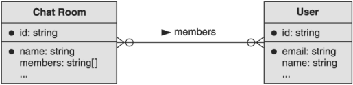

如果我们正在构建一个在线购物 API（例如，像亚马逊这样的东西），我们可能会存储用户资源以及他们的各种地址（用于运送在线购买的物品）和付款方式。 此外，支付方式本身可以引用支付方式的账单地址的地址。 这种布局如图 4.2 所示。

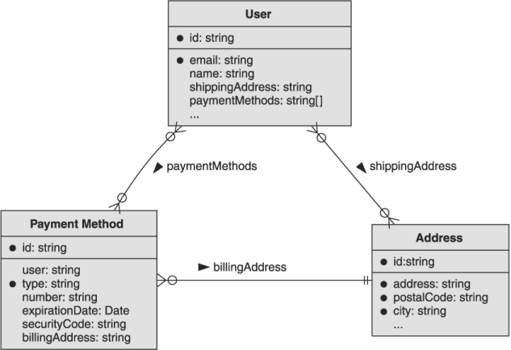

简而言之，重要的是要记住资源布局是一个广泛的概念，它包含我们为 API 选择的资源，最重要的是，这些资源如何交互和相互关联。在下一节中，我们将简要介绍不同类型的关系以及每种类型可能提供的交互（和限制）。

### 4.1.1 关系类型

在考虑资源布局时，我们必须考虑资源相互关联的各种方式。重要的是要考虑到我们将讨论的所有关系本质上都是双向的，这意味着即使关系看起来是片面的（例如，一条消息指向作为作者的单个用户），反向关系仍然存在，即使它是未明确定义（例如，用户能够创作多个不同的消息）。让我们通过查看最常见的关系形式来深入了解：引用。

#### 引用关系

两个资源相互关联的最简单方法是通过简单的引用。在这里，我们的意思是一个资源引用或指向另一个资源。例如，在聊天室 API 中，我们可能拥有构成聊天室内容的消息资源。在这种情况下，每条消息显然由单个用户编写并存储在消息的作者字段中。这将导致消息和用户之间的简单引用关系：消息具有指向特定用户的作者字段，如图 4.3 所示。

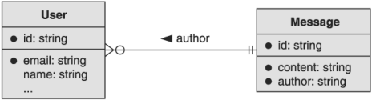

这种引用关系有时被称为外键关系，因为每个 Message 资源都将恰好指向一个作为作者的 User 资源。如前所述，一个用户资源显然能够拥有许多与其相关联的不同消息。因此，这也可以被认为是一种多对一的关系，其中一个用户可能会写很多消息，但一条消息总是有一个用户作为作者。

#### 多对多关系

就像更高级的引用版本一样，多对多关系代表一种场景，其中资源以这样一种方式连接在一起，即每个资源都指向另一个资源的多个实例。例如，如果我们有一个用于群组对话的 ChatRoom 资源，这显然会包含许多个人用户作为成员。但是，每个用户也可以成为多个不同聊天室的成员。在这种情况下，聊天室资源与用户之间存在多对多关系。 ChatRoom 指向许多用户资源作为房间的成员，并且用户能够指向他们可能是其成员的多个聊天室。

这种关系如何运作的机制留待未来探索（我们在第 3 部分中看到这些），但这些多对多关系在 API 中非常常见，并且有几种不同的表示方式，每种都有自己的优点和缺点。

#### 自引用关系

在这一点上，我们可以讨论什么听起来很奇怪，但实际上只是引用的另一个特殊版本：自引用。顾名思义，在这种关系中，一个资源指向另一个完全相同类型的资源，所以 self 指的是类型而不是资源本身。其实这和正常的引用关系完全一样；然而，我们必须将其称为不同的东西，因为它是典型的视觉表示，如图 4.4 所示，其中箭头指向资源本身。

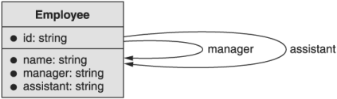

您可能想知道为什么一个资源会指向完全相同类型的另一个资源。这是一个合理的问题，但实际上这种关系出现的频率比你想象的要高得多。自引用最常出现在层次关系中，其中资源是树中的一个节点，或者出现在数据可以表示为有向图（如社交网络）的网络样式 API 中。

例如，想象一个用于存储公司目录的 API。在这种情况下，员工相互指向以跟踪谁向谁报告（例如，员工 1 向员工 2 报告）。这个 API 可能还有其他特殊关系的自引用（例如，员工 1 的助手是员工 2）。在每种情况下，我们都可以使用自引用对资源布局进行建模。

#### 等级关系

最后，我们需要讨论一种非常特殊的关系类型，它是标准引用关系的另一种形式：层次结构。层次关系有点像一个资源有一个指向另一个的指针，但该指针通常指向上方，并暗示不止一个资源指向另一个资源。与典型的引用关系不同，层次结构还倾向于反映资源之间的包含或所有权，最好使用计算机上的文件夹术语进行解释。您计算机上的文件夹（或 Linux 用户的目录）包含一堆文件，从这个意义上说，这些文件归文件夹所有。文件夹还可以包含其他文件夹，然后循环重复，有时会无限重复。

这可能看起来无害，但这种特殊的关系暗示了一些重要的属性和行为。例如，当您删除计算机上的文件夹时，通常其中包含的所有文件（和其他文件夹）同样会被删除。或者，如果您有权访问特定文件夹，这通常意味着可以访问其中的文件（和其他文件夹）。以这种方式运行的资源会出现这些相同的行为。

在我们走得太远之前，让我们看看层级关系是什么样的。我们实际上在前面的章节中一直在使用层次关系的例子，所以它们看起来并不奇怪。例如，我们已经讨论过由一堆 Message 资源组成的 ChatRoom 资源。在这种情况下，聊天室包含或拥有消息的隐含层次结构，如图 4.5 所示。


可以想象，通常意味着访问 ChatRoom 资源也将授予对构成聊天室内容主体的 Message 资源的访问权限。另外，在删除 ChatRoom 资源时，通常假设此操作基于父子层次关系向下级联到 Message 资源。在某些情况下，这种级联效应是一个巨大的好处（例如，能够删除我们计算机上的整个文件夹而无需先删除其中的每个文件就很好）。在其他情况下，级联行为可能会带来很多问题（例如，当我们实际上授予对该文件夹中所有文件（包括子文件夹）的访问权限时，我们可能认为我们授予了对该文件夹的访问权限。

一般来说，层级关系很复杂，会导致很多棘手的问题。例如，资源可以改变父母吗？换句话说，我们可以将 Message 资源从一个 ChatRoom 资源移动到另一个吗？ （一般来说，这是个坏主意。）我们将在第 4.2 节中更多地探讨层次结构及其优缺点。

### 4.1.2 实体关系图

在本章中，您可能已经在连接不同资源的线的末端看到了一些有趣的符号。虽然我们没有时间全面深入研究 UML（统一建模语言；https://en.wikipedia.org/wiki/Unified_Modeling_Language），但我们至少可以看看其中的一些箭头并解释它们如何工作。

简而言之，我们可以让箭头末端传达有关关系的重要信息，而不是从一个资源指向另一个的任意箭头。更具体地说，每个箭头端都可以告诉我们另一端可能有多少资源。例如，图 4.6 显示一所学校有很多学生，但每个学生只上一所学校。此外，每个学生参加许多课程，每个课程包含许多学生。

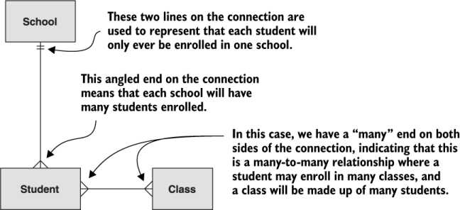

虽然这两个符号肯定是最常见的，但您可能会不时看到其他符号。 这些将涵盖任何相关资源是可选的情况。 例如，从技术上讲，一个班级可能由零个学生组成（反之亦然）。 因此，从技术上讲，该图可能看起来更像图 4.7。

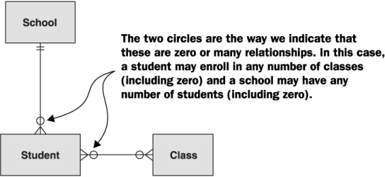

有时很难掌握阅读这种类型的符号的窍门，因此澄清每个连接器应该阅读的方向可能会有所帮助。 阅读这些图表的最佳方式是从一个资源开始，沿着该行，然后查看该行末尾的连接器，然后在另一个资源上结束。 重要的是要记住，您正在跳过接触您开始使用的资源的连接符符号。 为了更清楚地说明这一点，图 4.8 将 School 和 Student 资源之间的连接分解为两个单独的图表，并在线条旁边写入了读取连接的方向。

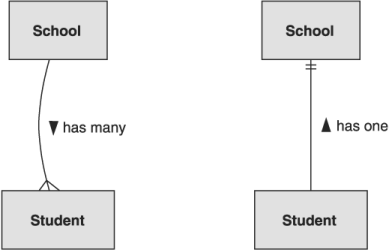

正如我们所看到的，一所学校有很多学生，而学生只有一所学校。 为简单起见，我们将这两个组合成一个图表和一条连接两者的线，正如我们在前面的示例中看到的那样。

现在我们已经很好地掌握了如何阅读这些图表，让我们开始更重要的工作，即通过选择资源之间的正确关系来确定如何为我们的 API 建模。

## 4.2 选择正确的关系
正如我们在 4.1 节中了解到的，选择正确的关系类型通常取决于我们首先选择的资源，因此我们将这两者视为本节的链接。让我们从一个重要的问题开始：我们到底需要一段关系吗？

### 4.2.1 你真的需要关系吗？

在构建 API 时，在我们选择了对我们而言重要的事物或资源列表后，下一步是决定这些资源如何相互关联。有点像规范化数据库模式，通常很容易连接可能需要连接的所有东西，以构建一个丰富的互连资源网络，我们可以轻松地浏览各种指针和引用。虽然这肯定会导致一个非常丰富和描述性的 API，但随着 API 接收越来越多的流量并存储越来越多的数据，它也可能变得站不住脚并严重降低性能。

为了明白我们的意思，让我们想象一个简单的 API，用户可以在其中互相关注（例如，像 Instagram 或 Twitter 这样的东西）。在这种情况下，用户有一个多对多的自我引用，其中一个用户关注了很多其他用户，每个用户可能有很多关注者，如图 4.9 所示。

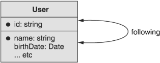

这可能看起来无害，但是当您的用户拥有数百万关注者（以及用户关注数百万其他用户）时，它会变得非常混乱，因为这些类型的关系会导致对一个资源的单个更改可能影响数百万其他相关资源的情况.例如，如果某个名人删除了他们的 Instagram 帐户，则可能需要删除或更新数百万条记录（取决于底层数据库架构）。

这并不是说你应该不惜一切代价避免任何关系。相反，重要的是尽早权衡任何特定关系的长期成本。换句话说，资源布局（和关系）并不总是免费的。就像在签署文件之前了解抵押贷款可能会花费多少很重要一样，在设计过程中而不是在最后阶段识别给定 API 设计的真实成本也很重要。在维护关系确实很重要的场景中（例如，前面的示例，其中存储关注者关系似乎非常重要），有一些方法可以减轻性能下降，但在任何情况下定义引用关系时仍然是明智的选择应用程序接口。

换句话说，参考关系对于期望的行为应该是有目的的和基础的。换句话说，这些关系永远不应该是偶然的、很高兴拥有的，或者你以后可能需要的东西。相反，任何引用关系对于 API 实现其主要目标都应该是重要的。

例如，像 Twitter、Facebook 和 Instagram 这样的服务是围绕着用户之间的关系建立的。用户之间的自我参考关系是这些服务目标的真正基础——毕竟，如果没有这种关系，Instagram 将等同于一个简单的照片存储应用程序。将此与直接消息服务之类的服务进行比较；我们可以看到，尽管这种 API 肯定会以聊天的形式涉及用户之间的关系，但它们对应用程序来说肯定不是以同样的方式至关重要。例如，参与聊天的两个用户之间的关系很重要，但潜在联系人之间的所有关系的完整集合并不那么重要。

### 4.2.2 参考文献或内嵌数据
假设某种关系对 API 的行为和功能至关重要，那么我们必须探索并回答一些重要问题。首先，我们需要探索在 API 中内联数据（即，在资源中存储重复副本）或依赖引用（即仅保留指向官方数据的指针）是否有意义。让我们通过查看依赖于我们的聊天室示例的简单场景来实现这一点。

想象一下，每个聊天室必须有一个管理员用户。我们有两个选择：我们可以通过引用字段（例如 adminUserId）指向管理员用户，或者我们可以内联该用户的数据并将其表示为 ChatRoom 资源的一部分。要了解这是什么样子，请查看显示每个场景的图 4.10 和 4.11。

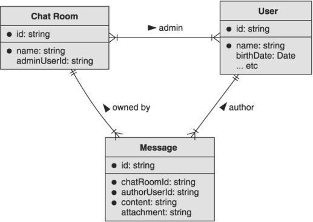

在第一个图表（图 4.10）中，我们可以看到在指定管理员时 ChatRoom 资源指向 User 资源。另一方面，在第二张图（图 4.11）中，我们可以看到 adminUser 字段实际上包含有关管理员的信息。这就引出了一个显而易见的问题：其中哪一个最好？事实证明，答案取决于您提出的问题或您正在执行的操作。

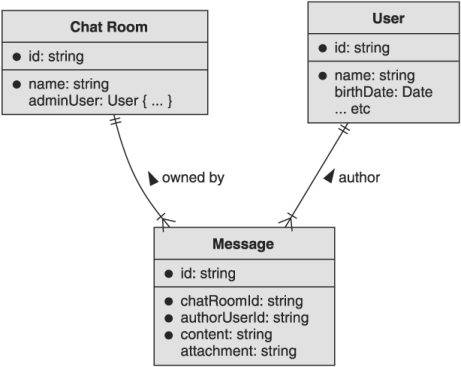

如果您想查看管理员的姓名，则使用内嵌数据要容易得多。 要了解原因，让我们看看我们必须做什么才能为每个场景获取此信息。

清单 4.1 为参考和内嵌示例检索管理员

```typescript
function getAdminUserNameInline(chatRoomId: string): string {
  let chatRoomInline = GetChatRoomInline(chatRoomId);            // ❶    
  return chatRoomInline.adminUser.name;
}
 
function getAdminUserNameReference(chatRoomId: string): string {
  let chatRoomRef = GetChatRoomReference(chatRoomId);            // ❶    
  let adminUser = GetAdminUser(chatRoomRef.adminUserId);         // ❷
  return adminUser.name;
}
```

❶ 在这两种情况下，我们都从检索 ChatRoom 资源开始。
❷ 在引用的情况下，如果我们需要有关管理员的更多信息，我们需要进行第二次查找。
这两个函数最明显的区别是需要网络响应的实际 API 调用的数量。在第一种情况下，数据是在线返回的，我们只需要一个 API 调用即可检索所有相关信息。在第二个中，我们必须首先检索 ChatRoom 资源，然后才能知道我们对哪个用户感兴趣。之后，我们必须检索 User 资源才能找到名称。

这是否意味着内联我们的数据总是更好？不完全的。这是一个示例，我们需要将 API 调用的次数增加一倍才能获取我们感兴趣的信息。但是如果我们不经常对这些信息感兴趣怎么办？如果是这种情况，那么每次有人请求 ChatRoom 资源时，我们都会发送大量字节，而这些字节只是被忽略了。换句话说，每当有人请求 ChatRoom 资源时，我们也会告诉他们作为该房间管理员的用户资源的所有信息。

这可能看起来没什么大不了的，但是如果每个用户也在线存储他们所有的朋友（其他用户资源）呢？在这种情况下，将聊天室返回给管理员实际上可能会导致大量额外数据。此外，在提出所有这些额外的内联数据时，通常会涉及额外的计算工作（通常来自需要在后台连接数据的数据库查询）。它有可能以不可预测的方式快速增长。那么我们该怎么办？

不幸的是，这将取决于您的 API 正在做什么，因此这是一个判断调用。一个好的经验法则是在不影响高级案例可行性的情况下针对常见案例进行优化。这意味着我们需要考虑相关资源是什么、它现在有多大以及它可能有多大，并决定在响应中包含管理员信息的重要性。在这种情况下，典型用户可能不会经常查找聊天室的管理员是谁，而是专注于向他们的朋友发送消息。因此，内联这些数据可能并不是那么重要。另一方面，用户资源可能非常小，因此如果 API 经常使用这些数据，内联这些数据可能不是一个大问题。

尽管如此，我们还没有解决另一种重要的关系类型：层次结构。让我们看看什么时候选择一种层次关系而不是另一种类型是有意义的。

### 4.2.3 层次结构
正如我们之前了解到的，层次关系是父资源和子资源之间的一种非常特殊的引用关系，而不是两个通常相关的资源。这种关系最大的不同在于动作的级联效应以及从父级到子级的行为和属性的继承。例如，删除父资源通常意味着删除子资源。同样，对父资源的访问（或无法访问）通常意味着对子资源的访问级别相同。这种关系的这些独特且具有潜在价值的特征意味着它具有巨大的潜力，无论好坏。

我们如何决定何时以层级关系而不是简单的关系来安排我们的资源是有意义的。假设我们已经决定对这种特定关系进行建模是我们 API 的基础（参见第 4.2.1 节），我们实际上可以将这些行为作为判断这种关系是否合适的重要指标。

例如，当我们删除一个聊天室时，我们几乎肯定也想删除属于该聊天室的消息资源。此外，如果某人被授予对 ChatRoom 资源的访问权限，那么如果他们也无权查看与该聊天室关联的消息资源，那将没有任何意义。这两个指标意味着我们几乎肯定要将此关系建模为适当的层次结构。

还有一些迹象表明你不应该使用层次关系。由于子资源应该只有一个父资源，我们可以很快知道已经有一个父资源的资源不能有另一个。换句话说，如果您考虑的是一对多关系，那么层次结构绝对不适合。例如，消息资源应该只属于一个聊天室。如果我们想将单个消息资源与大量 ChatRoom 资源相关联，层次结构可能不是正确的模型。

这并不是说资源可以指向一个（并且只有一个）资源。毕竟，大多数资源将是另一个资源的子资源，并且仍可能被（或引用）其他资源引用。例如，假设 ChatRoom 资源属于公司（本例的新资源类型）。公司可能有保留政策（由 RetentionPolicy 资源表示），说明消息在被删除之前会停留多长时间。这些保留策略将是单个公司的子项，但可能被公司中的任何 ChatRoom 资源引用。如果这让您感到困惑，请查看图 4.12 中的资源布局图。

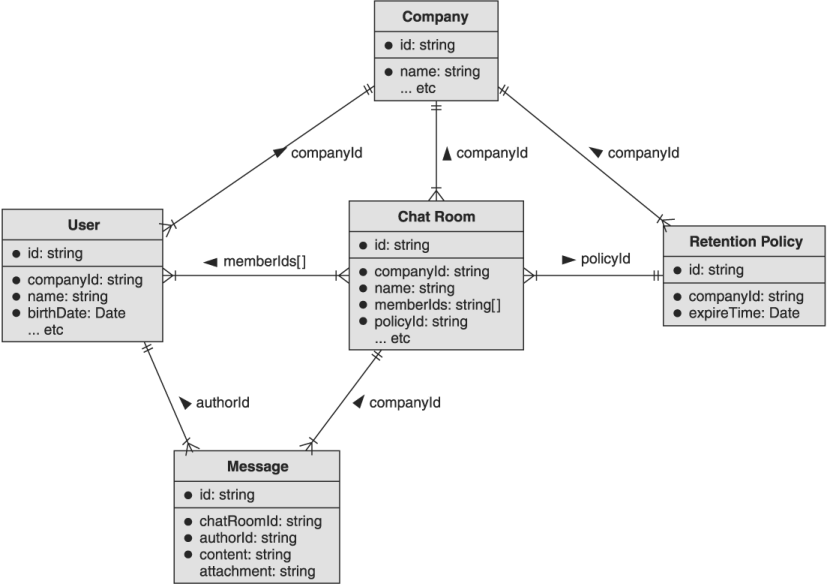

正如您在此处看到的，User、ChatRoom 和 RetentionPolicy 资源都是 Company 资源的子代。 同样，消息资源是 ChatRoom 资源的子项。 但是 RetentionPolicy 是可重复使用的，可以应用于许多不同的房间。

希望此时您对何时依赖引用与层次结构有一个很好的了解（以及何时内联信息而不是使用引用作为指针）。 但是在探索了这些主题之后，我们在设计 API 时往往会陷入一些下意识的反应。 让我们花点时间看看一些资源布局反模式以及如何避免它们。

## 4.3 反模式
与大多数主题一样，有一些在任何情况下都很容易遵循的常见行为，但这些行为往往会让我们误入歧途。毕竟，盲目遵循规则比深入思考 API 设计并决定安排资源的最佳方式以及它们之间的关系要容易得多。

### 4.3.1 万能资源

为您可能想要在 API 中建模的最小概念创建资源通常很诱人。通常，当有人决定成为数据类型的每个概念都必须是适当的资源时，建模过程中就会出现这种情况。例如，假设我们有一个 API，我们可以在其中存储图像上的注释。对于每个注释，我们可能想要存储包含的区域（可能作为某种边界框），以及组成实际注释内容的注释列表。

在这一点上，我们有四个独立的概念需要考虑：图像、注释、边界框和注释。问题变成了，哪些应该是资源，哪些应该在成为唯一的数据类型时结束它们的旅程？一种下意识的反应是，无论如何都要把一切都变成资源。这可能最终看起来类似于图 4.13 中所示的资源布局图。


现在我们有四个完整的资源，它们具有完整的资源生命周期。 换句话说，我们需要为这些资源中的每一个实现五种不同的方法，总共 20 个不同的 API 调用。 它留下了一个问题：这是正确的选择吗？ 毕竟，我们真的需要给每个边界框自己的标识符吗？ 我们真的需要为每个单独的笔记单独的资源吗？

如果我们仔细考虑一下这种布局，我们可能会发现两件重要的事情。 首先，BoundingBox 资源与注解是一对一的，因此将其放入单独的资源中几乎没有任何价值。 其次，Note 资源的列表不太可能变得特别大，所以我们也不会通过将它们表示为资源来获得那么多。 如果我们考虑到这一点，我们的资源布局就会简单得多。

清单 4.2 依赖于行内表示的简化接口

```typescript
interface Image {         // ❶
  id: string;
}
 
interface Annotation {    // ❶
  id: string;
  boundingBox: BoundingBox;
  notes: Note[];
}
 
interface BoundingBox {   // ❷
  bottomLeftPoint: Point;
  topRightPoint: Point;
}
 
interface Point {         // ❷
  x: number;
  y: number;
}
 
interface Note {          // ❷
  content: string;
  createTime: Date;
}
```

❶ 这两个接口是实际资源（注意标识符字段）。
❷ 所有这些都不是资源； 它们只是出现在 Annotation 资源内的 API 中的数据类型。
这意味着我们实际上只有两个资源需要考虑（而不是四个），这更容易理解和构建。 图 4.14 显示了更简化版本的资源布局图。

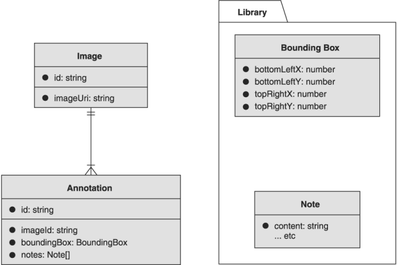

这里的一个好的经验法则是避免两个问题。 首先，如果您不需要与您提议的资源中的一个独立于它所关联的资源进行交互，那么您可能认为它只是一种数据类型。 在这个例子中，不太可能有人需要在图像本身的上下文之外操作边界框，这意味着这作为一种数据类型可能没问题。

其次，如果您想到的概念是您可能想要直接与之交互的东西（在这种情况下，您可能想要删除一个单独的音符或单独创建新的音符），如果它能够内联（请参阅部分 4.2.2) 那么这可能是一个不错的选择。 在这种情况下，Note 资源足够小，预计不会为每个注释增长为一个大集合，这意味着它们可能是安全的内联而不是表示为独立资源。

### 4.3.2 深层次
下一个要避免的常见反模式是关于层次结构的。 通常，等级关系会显得非常强大和有用，以至于我们试图在任何可能的地方使用它们。 但是，对于涉及的每个人来说，过深的层次结构可能会令人困惑且难以管理。

例如，假设我们正在构建一个系统来管理大学的课程目录。 我们需要跟踪不同的大学、开设课程的学校或项目（例如，护士学校或工程学院）、可用的课程、开设课程的学期以及各种课程 文件（例如，教学大纲）。 跟踪所有这些的一种方法是将所有内容放在一个层次结构中，如图 4.15 所示。

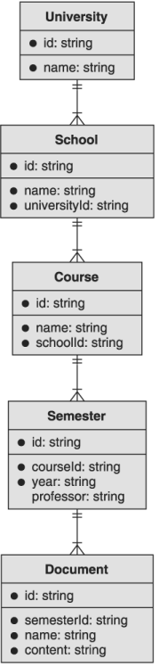

虽然这在技术上会很好地工作，但很难推理并记住所有不同的父母。这也意味着我们现在需要知道相当多的信息才能找到单个文档（有关该主题的更多讨论，请参见第 6.3.6 节），这可能具有存储和回忆的挑战性。但这里更大的问题是，在这里使用层次结构的好处并不是完成工作所必需的。换句话说，我们可能可以创建同样好的 API，而无需如此多的层次结构。

如果我们决定关键部分是大学、课程和文件怎么办？在那个世界中，学校成为课程的领域，学期也是如此。我们通过询问层次结构的学校和学期级别是否真的那么重要来做到这一点。

例如，我们打算将分层行为用于什么？我们是否打算经常删除学校？ （可能不是。）学期呢？ （也可能不是。）最可能的情况是我们希望看到列出了给定课程的所有学期。但是我们可以通过基于课程标识符进行过滤来实现这一点，同样可以通过给定的学校 ID 列出课程。

请记住，这并不是说我们应该完全摆脱这些资源。在一个学期的情况下，我们不太可能出于探索目的需要列出可用的学期，但学校可能值得保留。建议的改变是将学校和课程之间的关系从等级关系转变为参考关系。这个新的（较浅的）层次结构如图 4.16 所示。

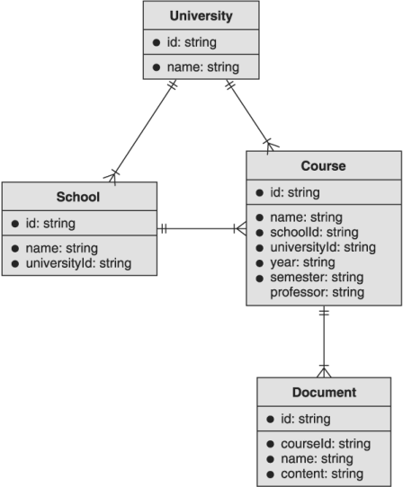

通过以这种方式（即更浅层）安排我们的资源，我们仍然可以做一些事情，例如授予对给定课程实例的所有文档的访问权限或列出给定学期的所有课程，但我们已经将层次结构缩小到 真正从中受益的作品。

### 4.3.3 内联一切

随着非关系数据库的出现，特别是大规模的键值存储系统，通常有一种趋势是对所有数据进行反规范化（或内联），包括过去整齐地组织成的数据 要与花哨的 SQL 查询连接的单个表。 虽然有时将信息折叠到单个资源中而不是将所有内容都作为自己的资源是有意义的（正如我们在第 4.3.2 节中学到的那样），但将过多的信息折叠到单个资源中可能与将每条信息分开一样有害 除了成为它自己的资源。

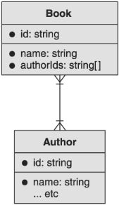

造成这种情况的一个重要原因与数据完整性有关，这也是非关系数据库中非规范化模式的常见问题。例如，假设我们正在构建一个图书馆 API，用于存储不同作者撰写的书籍。一种选择是我们有两个资源，Book 和 Author，其中 Book 资源指向 Author 资源，如图 4.17 所示。如果我们要内联这些信息，我们可能会将作者姓名（和其他信息）直接存储在 Book 资源中，如图 4.18 所示。

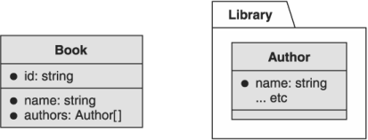

正如我们之前了解到的（见 4.2.2 节），像这样的内联数据可能非常有价值，但它也可能导致一些实际问题。例如，当您更新某本书作者的姓名时，是否会在他们所写的所有书籍中更新该姓名？这个问题的答案可能取决于您的实现，但我们必须提出这个问题的事实意味着它可能会引起混淆。换句话说，当我们内联数据仍将在其他资源之间共享时（例如，写了几本书的作者），我们打开了可怕的蠕虫罐，我们必须决定 API 的用户打算如何更新共享数据（例如，作者姓名）。虽然有解决这些问题的好方法，但这不是我们首先应该担心的问题。

## 4.4 练习

- 想象一下，您正在构建一个书签 API，您可以在其中为特定 URL 在线提供书签，并且可以将它们排列在不同的文件夹中。您是将其建模为两个单独的资源（书签和文件夹）还是单个资源（例如实体），并使用内联类型说明它是作为文件夹还是书签？
- 举个例子，画一个实体关系图，涉及到多对多关系、一对多关系、一对一关系和可选的一对多关系。确保使用正确的连接器符号。

## 总结

- 资源布局是指一个 API 中资源之间的排列和关系。
- 虽然连接 API 中的每个资源可能很诱人，但要抵制这种冲动，只存储为 API 提供重要功能的关系。
- 有时为一个概念存储一个单独的资源是有意义的。其他时候，最好将数据内联并将概念保留为数据类型。决定取决于您是否需要与该概念进行原子交互。
- 避免过深的等级关系，因为它们可能难以理解和管理。