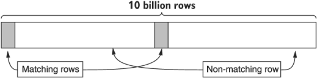

本章涵盖内容

- 分页如何允许用户以一口大小的块使用大型数据集
- 每页数据的具体大小
- API 服务应如何指示分页已完成
- 如何定义页面令牌格式
- 如何在单个资源中跨大块数据分页

在此模式中，我们将探讨当资源数量或单个资源的大小对于单个 API 响应而言太大时如何使用数据。我们不会在单个响应接口中期望所有数据，而是输入一个来回序列，我们一次请求一小块数据，迭代直到没有更多数据可以使用。此功能在许多 Web 界面中很常见，我们将转到下一页结果，并且对于 API 也同样重要。

## 21.1 动机

在典型的 API 中，消费者可能需要检索和浏览他们的资源。随着这些资源在规模和数量上的增长，期望消费者在一个大块中读取他们的数据变得越来越不合理。例如，如果一个 API 使用 100 GB 的存储空间提供对 10 亿个数据条目的访问，那么期望消费者使用单个请求和响应来检索这些数据可能会非常缓慢，甚至在技术上不可行。我们如何最好地公开允许消费者与这些数据交互的接口？换句话说，我们怎样才能避免强迫消费者一口咬下去而不是咀嚼呢？显而易见的答案是将数据拆分为可管理的分区，并允许消费者与这些数据子集进行交互，但这又引出了另一个问题：我们如何以及在哪里拆分数据？

我们可能会选择在任意两条记录之间划一条分界线，但这并不总是足够的，特别是在单个记录本身可能变得笨拙的情况下（例如，单个 100 MB 的对象）。在这种情况下，将数据拆分为合理的块的问题变得更加模糊，特别是如果该块是结构化数据（例如，数据库中的 10 MB 行）。我们应该在哪里拆分单个记录中的数据？我们应该为消费者提供多少对这些分割点的控制权？

另一方面，在某些情况下，消费者实际上希望使用单个请求和响应交付数据库中的所有记录（例如，备份或导出所有数据）；然而，这两种情况并不一定是相互排斥的，所以这并没有改变我们仍然需要一种以合理大小的块与数据交互的方式的事实。对于这种常见情况，有一种模式在许多网站上变得非常普遍，并且很好地延续到 API 中：分页。

## 21.2 概述

术语分页来自这样一种想法，即我们希望对数据进行分页，以块的形式消费数据记录，就像翻阅书中的页面一样。这允许消费者一次请求一个块，API 以相应的块以及指示消费者如何检索下一个块的指针进行响应。图 21.1 是一个流程图，展示了消费者如何从一个 API 请求多页资源，直到没有更多资源。


为了实现这一点，我们的分页模式将依赖于游标的概念，使用不透明的页面标记作为表达松散等效页码的一种方式。鉴于这种不透明度，API 以结果块和下一个令牌进行响应非常重要。在处理大型单个资源时，可以将相同的模式应用于每个资源，其中资源的内容可以在多页数据上构建。

## 21.3 实施

在高层次上，我们真的想要一种从上次中断的地方开始的方法，有效地查看可用数据的特定窗口。为此，我们将依靠三个不同的领域来传达我们的意图：

- pageToken，代表一个不透明的标识符，仅对 API 服务器有意义，即如何继续先前开始的结果迭代
- maxPageSize，它允许消费者在给定的响应中表达不超过一定数量的结果的愿望
- nextPageToken，API 服务器使用它来传达消费者应该如何通过附加请求请求更多结果

为了更清楚地看到这一点，我们可以用这些字段替换图 21.2 中的一些文本。


如果我们将此模式转换为 API 定义，我们最终会得到与标准列表非常相似的内容，将 pageToken 和 maxPageSize 添加到请求中，将 nextPageToken 添加到响应中。

清单 21.1 用于在标准列表方法中进行分页的 API 规范

```typescript
abstract class ChatRoomApi {
  @get("/chatRooms")
  ListChatRooms(req: ListChatRoomsRequest): ListChatRoomsResponse;
}
 
interface ListChatRoomsRequest {
  pageToken: string;             // ❶
  maxPageSize: number;           // ❶    
}
 
interface ListChatRoomsResponse {
  results: ChatRoom[];
  nextPageToken: string;         // ❶    
}
```

❶ 向标准列表方法请求和响应添加三个新字段以支持分页
这个定义本身并不是那么有趣，但事实证明，这些领域中的每一个都有一些有趣的隐藏秘密。让我们首先探索看起来无害的 maxPageSize 字段。

### 21.3.1 页面大小

乍一看，设置你想要的页面的大小（即应该返回的结果数量）似乎很无害，但事实证明它还有很多。让我们从字段本身的名称开始：maxPageSize。

#### 最大 VS。精确的

首先，为什么我们使用最大值而不是仅仅设置确切的大小？换句话说，为什么我们最多返回 10 个结果而不是正好 10 个结果？事实证明，在大多数情况下，API 服务器可能总是能够返回准确数量的结果；然而，在许多更大规模的系统中，如果不支付显着的成本溢价，这是不可能的。

例如，假设一个系统在一个表中存储 100 亿行数据，由于大小限制，该系统没有二级索引（这将使查询这些数据更有效）。我们还假设正好有 11 个匹配行，其中 5 行在开头，然后是 50 亿行，然后是剩下的 6 行，最后是其余的数据，如图 21.3 所示。最后，我们还假设我们的目标是在 200 毫秒内返回大多数响应（例如 99%）。



在这种情况下，当用户要求一个包含 10 个结果的页面时，我们有两个选项可供选择。一方面，我们可以准确返回 10 个结果（因为有足够的结果填满页面），但鉴于它必须扫描大约 50 亿行才能完全填满页面，因此该查询不太可能始终保持快速。另一方面，我们还可以返回在搜索到我们的特定截止时间（这里可能是 180 毫秒）后找到的 5 个匹配行，然后在后续请求更多数据时从我们中断的地方继续。

鉴于这些限制，总是试图填满整个页面将很难区分违反我们的延迟目标和请求复杂性的简单变化之间的区别。换句话说，如果请求很慢（需要超过 200 毫秒），这可能是因为某些东西实际上被破坏了，或者因为请求只是搜索了大量数据——如果不完全，我们将无法区分两者有点工作。如果我们在我们的时间限制内尽可能多地填满一个页面，我们可能经常能够准确返回 10 个结果（也许是因为我们把它们放在一起），但是我们不会在我们的数据集变得非常大。因此，我们的接口契约指定我们将返回最多 maxPageSize 结果而不是确切的数字是最有意义的。

＃＃＃＃ 默认值
为任何可选字段确定合理的默认值很重要，这样消费者在将可选字段留空时不会感到惊讶。在这种情况下，为最大页面大小选择默认值将取决于所返回资源的形状和大小。例如，如果每个项目都很小（例如，以字节而不是千字节为单位），则使用每页 100 个结果的默认值可能是有意义的。如果每个项目都是几千字节，那么使用默认值 10 或 25 个结果可能更有意义。通常，推荐的默认页面大小为 10 个结果。最后，要求消费者指定最大页面大小也是可以接受的；但是，这应该保留用于 API 服务器无法假设合理默认值的情况。

虽然选择默认的最大页面大小很重要，但更重要的是记录此默认值并尽可能在 API 的其余部分保持一致。例如，在没有为每个值提供充分理由的情况下为该字段使用各种默认值通常是一个坏主意。如果消费者了解到您的 API 往往默认为每页 10 个结果，那么如果该 API 的其他地方无缘无故地默认为 50 个结果，那将会非常令人沮丧。

#### 上下限
显然，负页面大小对 API 服务器毫无意义，因此应该被拒绝，并显示请求无效的错误。但是如果请求指定最大页面大小为 30 亿，我们该怎么办？幸运的是，我们之前的设计依赖于最大页面大小而不是精确的页面大小，这意味着我们可以愉快地接受这些值，返回 API 服务器能够在一定时间内生成的合理数量的结果，并保持一致与 API 定义。

换句话说，虽然拒绝超过特定限制的页面大小（例如，页面中超过 1,000 个结果）当然是可以接受的，但认为它们有效是完全可以的，因为我们总是可以返回比指定的更少的结果，同时坚持我们与消费者。现在我们已经讨论了简单的部分，让我们转向更复杂的部分：页面令牌。

### 21.3.2 页面标记
到目前为止，我们已经注意到应该将页面标记用作游标，但是我们还没有阐明该标记的行为。让我们先看看关于页面令牌如何工作的最简单但经常令人困惑的事情之一：我们如何知道我们已经完成了。

#### 终止标准
由于无法强制消费者继续发出后续请求，因此从技术上讲，消费者可以在消费者决定不再对更多结果感兴趣的任何时间点终止分页。但是服务器怎么能指示没有更多的结果呢？在许多系统中，我们倾向于假设，一旦我们得到一页未满的结果，我们就在列表的末尾。不幸的是，该假设不适用于我们的页面大小定义，因为页面大小是最大的而不是精确的。因此，我们不能再依赖部分完整的页面结果来表明分页已完成。相反，我们将依靠一个空页面标记来传达此消息。

这可能会让消费者感到困惑，特别是当我们认为返回空结果列表和非空页面令牌是完全有效的时！毕竟，没有返回结果但仍然被告知有更多结果似乎令人惊讶。正如我们之前在决定跟踪最大页面大小时了解到的那样，当请求达到时间限制而没有找到任何结果并且无法确定不会找到进一步的结果时，就会发生这种类型的响应。换句话说，{results: [], nextPageToken: 'cGFnZTE='} 的响应是 API 的方式，“我尽职尽责地搜索了长达 200 毫秒，但一无所获。你可以使用这个令牌从我离开的地方开始。”

#### 不透明度
到目前为止，我们已经讨论了如何使用页面令牌来传达消费者是否应该继续对资源进行分页，但我们没有提及它的内容。我们到底在这个令牌中放入了什么？

简而言之，令牌本身的内容应该是 API 服务器在迭代结果列表时需要从中断处获取的任何内容。这可能是抽象的东西，比如代码中的序列化对象，或者更具体的东西，比如传递给关系数据库的限制和偏移量。例如，您可以简单地使用像 eyJvZmZzZXQiOiAxMH0= 这样的序列化 JSON 对象，它是 {"offset": 10} Base64 编码的。更重要的是，这个实现细节必须对消费者完全隐藏。这可能看起来没有必要，但它实际上是一个非常重要的细节。

无论您在页面令牌中放入什么，令牌的结构、格式或含义都应该对消费者完全隐藏。这意味着我们应该对内容进行实际加密，而不是 Base64 编码内容，这样令牌本身的内容对消费者来说完全没有意义。原因很简单：如果消费者能够辨别这个令牌的结构或含义，那么它就是 API 表面的一部分，必须被视为 API 本身的一部分。由于使用页面令牌的全部目的是允许我们在不改变消费者的 API 表面的情况下更改引擎盖下的实现，因此公开这一点会阻止我们利用这种灵活性。从本质上讲，如果我们允许消费者查看这些页面令牌的内部，我们就会泄露实现细节，最终可能会导致我们无法在不破坏消费者的情况下更改实现。

#### 格式
既然我们已经了解了令牌可以包含哪些内容，这种保持令牌对消费者不透明的概念引出了一个问题：为什么我们使用字符串类型来表示令牌？为什么不使用数字或原始字节？

鉴于我们需要存储加密数据，很明显，使用像整数这样的数值是行不通的。另一方面，原始字节往往是存储加密值的好方法，但我们使用字符串主要是为了方便。事实证明，这些令牌通常会出现在 URL 中（作为 GET HTTP 请求中的参数）以及 JSON 对象，这两者都不能很好地处理原始字节。因此，最常见的格式是使用 Base64 编码的加密值作为 UTF-8 序列化字符串传递。

#### 一致性
到目前为止，我们关于数据分页的讨论都假设数据本身是静态的。不幸的是，这种情况很少发生。我们不需要假设所涉及的数据是只读的，而是需要一种在数据发生变化的情况下对数据进行分页的方法，添加新结果并删除现有结果。更复杂的是，不同的存储系统提供不同的查询功能，这意味着我们的 API 的行为可能与用于存储我们的数据的系统（例如 MySQL）紧密耦合。


正如您所料，这通常会导致令人沮丧的情况。例如，想象一下对数据一次分页两个结果，而在这种情况发生时，其他人碰巧在列表的开头添加了两个新资源（图 21.4）。如果您使用偏移计数（其中您的下一页标记代表从第 3 项开始的偏移），在列表开头添加的两个新创建的资源将使您看到第 1 页两次。这是因为现在的新页面 2 具有与旧页面 1 开头的偏移量。此外，当将过滤器应用于请求并修改结果以使其加入或离开匹配时，这种情况再次出现团体。在这种情况下，消费者可能对您的 API 无法提供所有匹配结果以及仅提供匹配结果失去信心。我们应该做什么？

不幸的是，这个问题没有简单的答案。如果您的数据库支持数据的时间点快照（例如 Google Cloud Spanner 或 CockroachDB），则将这些信息编码在页面令牌中可能是有意义的，这样您就可以保证分页高度一致。在许多情况下，数据库不允许强一致的结果，在这种情况下，唯一的其他合理选择是在您的 API 文档中注明，随着基础资源的添加、删除或修改，页面可能代表数据的“涂抹”（图 21.5)。如前所述，避免依赖数字偏移量，而是使用上次看到的结果作为游标也是一个好主意，这样您的下一页令牌确实可以从中断的地方找到。


#### 生命周期

当我们考虑使用大量结果时，我们倾向于假设请求发生在某个相对较短的时间窗口内，通常以秒或分钟为单位。 但是如果请求发生得更慢怎么办（如图 21.6 所示）？ 显然，请求一页数据和 10 年后的下一页可能有点荒谬，但 24 小时后就那么疯狂吗？ 60分钟呢？ 不幸的是，我们很少记录页面令牌的生命周期，这可能会导致一些棘手的情况。


通常，API 选择不定义页面令牌可能过期的限制。由于分页数据应该是幂等操作，遇到过期令牌的失败模式只需要重试即可。这意味着这里的失败只是一种不便。

也就是说，我们应该澄清代币应该保持多长时间来设置消费者对其分页操作的期望。在设置低门槛的经典案例中，鉴于您的用例，将令牌到期时间设置为相对较短通常是一个好主意。对于典型的 API，这可能以分钟（或最多几小时）来衡量，大多数消费者认为 60 分钟的到期时间很宽裕。

### 21.3.3 总数

最后，分页结果时的一个常见问题是是否包括结果总数，通常用于显示“184 个结果 10-20”等用户界面元素。当这个总数相对较小时（例如，如图所示的 184），这是一个很容易显示的统计数据。然而，当这个数字变得更大时（例如，4,932,493,534），计算这些结果的简单操作可能会变得非常计算密集，以至于不可能快速返回准确的计数。

在这一点上，我们必须在非常缓慢地提供准确计数或相对较快的最佳猜测的不准确计数之间做出选择。这些选项都不是特别好，所以 API 通常不应该提供总结果计数，除非消费者有明确的需要（即，没有这个计数他们无法完成他们的工作）或者计数永远不会变得足够大以至于它落在这个情况。如果由于某种原因您绝对必须包含总数，则它应该是一个名为 totalResults 的整数字段，附加到响应中。

清单 21.2 包含结果总数的响应接口

```typescript
interface ListChatRoomsResponse {
  results: ChatRoom[];
  nextPageToken: string;
  totalResults: number;      // ❶
}
```

❶ 使用 totalResults 字段来指示完成分页后将包含多少结果。
现在我们已经了解了所有关于页面令牌的信息，让我们看一个相对独特的情况，其中单个资源可能足够大以证明在单个资源内而不是跨资源集合进行分页是合理的。

### 21.3.4 内部资源分页
在某些情况下，单个资源可能会变得非常大，可能到了消费者希望能够分页浏览资源内容的程度，并通过多次请求将其构建为完整资源。 在这些场景中，我们可以将相同的原则应用于单个资源而不是资源集合，方法是将资源分成任意大小的块，并使用连续令牌作为通过块的游标。

清单 21.3 单个大型资源分页的 API 定义

```typescript
abstract class ChatRoomApi {
  @get("/{id=chatRooms/*/messages/*/attachments/*}:read")
  ReadAttachment(req: ReadAttachmentRequest):
    ReadAttachmentResponse;                   // ❶
}
 
interface ReadAttachmentRequest {
  id: string;
  pageToken: string;                          // ❷
  maxBytes: number;                           // ❸
}
 
interface ReadAttachmentResponse {
  chunk: Attachment;                          // ❹
  fieldMask: FieldMask;                       // ❺
  nextPageToken: string;                      // ❻
}
```

❶ 自定义读取方法允许我们以一口大小的小块消耗单个资源。
❷ 上一个响应的继续标记。如果为空，则表示请求资源的第一个块。
❸ 给定块中返回的最大字节数。如果为空，则使用默认值，例如 1,024 字节。
❹ 属于资源的单个数据块
❺ 包含要附加到资源的块中提供的数据的字段列表
❻ 请求下一个资源块时使用的令牌。如果为空，则表示这是最后一个块。
在这个设计中，我们假设对单个资源的读取可以是强一致性的，这意味着如果在我们对数据进行分页时修改了资源，则应该中止请求。它还依赖于在多个请求上构建资源的想法，其中每个响应都包含要附加到迄今为止构建的任何数据的数据的一些子集，如图 21.7 所示。我们还依赖字段掩码来明确传达 ChatRoom 界面的哪些字段在此给定块中具有要使用的数据。


### 21.3.5 API 最终定义
现在我们已经了解了这种模式的所有细微差别，最终的 API 定义如清单 21.4 所示，涵盖了跨资源集合和单个资源内部的分页。

清单 21.4 最终 API 定义

```typescript
abstract class ChatRoomApi {
  @get("/chatRooms")
  ListChatRooms(req: ListChatRoomsRequest): ListChatRoomsResponse;
 
  @get("/{id=chatRooms/*/messages/*/attachments/*}:read")
  ReadAttachment(req: ReadAttachmentRequest): ReadAttachmentResponse;
}
 
interface ListChatRoomsRequest {
  pageToken: string;
  maxPageSize: number;
}
 
interface ListChatRoomsResponse {
  results: ChatRoom[];
  nextPageToken: string;
}
interface ReadAttachmentRequest {
  id: string;
  pageToken: string;
  maxBytes: number;
}
interface ReadAttachmentResponse {
  chunk: Attachment;
  fieldMask: FieldMask;
  nextPageToken: string;
}
```

## 21.4 权衡
现在我们已经看到了这种模式产生的 API，让我们看看我们失去了什么，从分页方向开始。

### 21.4.1 双向分页
这种模式不可能实现的一件显而易见的事情是双向工作的能力。换句话说，此模式不允许您从当前位置向后翻页以查看先前看到的结果。虽然这对于允许浏览结果的面向用户的界面来说可能不方便，但对于程序化交互来说，它不太可能成为真正必要的功能。

如果用户界面确实需要这种能力，一个不错的选择是使用 API 构建结果缓存，然后允许界面在该缓存中任意移动。这具有避免分页一致性问题的额外好处。

### 21.4.2 任意窗口
同样，此模式不提供导航到资源列表中特定位置的能力。换句话说，由于页码的概念不存在这个非常简单的原因，没有办法专门要求第 5 页。消费者不应依赖页码，而应使用过滤器和排序来导航到特定的匹配资源集。同样，这往往是允许浏览的面向用户的界面所需的功能，而不是编程交互的要求。

## 21.5 反模式：偏移和限制
为了完整起见，让我们简要地看一下通常应该避免的这种模式精神的简单（并且非常常见）的实现。鉴于大多数关系数据库都支持 OFFSET 和 LIMIT 关键字，因此在 API 中将其作为一种在资源列表上显示窗口的方式通常很诱人。换句话说，我们不是要求某个块，而是通过要求从某个偏移量开始的数据并将结果的大小限制为某个数字来选择一个特定的块，如图 21.8 所示。


当在 API 表面中打开时，这会导致向请求添加两个额外的字段，这两个字段都是指定起始偏移量和限制的整数。 通过将结果数量添加到先前请求的偏移量（例如，nextOffset = offset + results.length），可以轻松计算下一个偏移量。 此外，我们可以使用不完整的页面作为终止条件（例如，hasMoreResults = (results.length != limit)）。

清单 21.5 API 表面使用偏移和限制

```typescript
abstract class ChatRoomApi {
  @get("/chatRooms")
  ListChatRooms(req: ListChatRoomsRequest): ListChatRoomsResponse;
}
 
interface ListChatRoomsRequest {  // ❶
  offset: number;                 // ❶
  limit: number;                  // ❶
}                                 // ❶
 
interface ListChatRoomsResponse {
  results: ChatRoom[];
}
```

❶ 为了支持资源分页，我们包含了偏移和限制参数。
当我们将其转换为我们的底层数据库时，基本上没有任何工作要做：我们只是采用提供的偏移和限制参数（例如，对 https://example.org/chatRooms/5/messages?offset=30&limit 的 GET 请求 =10) 并将它们与我们的查询一起传递。

清单 21.6 使用 SQL LIMIT 和 OFFSET 进行分页

```typescript
SELECT * FROM messages
  WHERE chatRoomId = 5
  OFFSET 30              // ❶
  LIMIT 10               // ❷
```

❶ OFFSET 修饰符指定页码（在这种情况下，偏移量为 30，每页 10 个结果指向第 4 页）。
❷ LIMIT 修饰符指定页面大小（在这种情况下，每页 10 个结果）。
这种模式的根本问题是它会将实现细节泄露给 API，因此无论底层存储系统如何，该 API 都必须继续支持偏移和限制。现在这似乎不是什么大问题，但随着存储系统变得更加复杂，使用限制和偏移量的实现可能并不总是有效。例如，如果您的数据存储在最终一致的分布式系统中，随着偏移值的增加，查找偏移的起点实际上可能会变得越来越昂贵。

这种模式也存在与一致性相关的问题。在此示例中，如果添加了一些新结果，它们可能会导致响应返回上一页中已经看到的结果。

## 21.6 练习
1. 为什么使用最大页面大小而不是确切的页面大小很重要？
2. 如果请求中的页面大小字段留空，会发生什么情况？如果是阴性怎么办？零呢？一个巨大的数字呢？
3. 用户如何知道分页已完成？
4. 某些资源类型的页面令牌与其他资源类型的页面令牌具有不同的到期时间是否合理？
5. 为什么页面令牌对用户完全不透明很重要？什么是强制执行此操作的好机制？

## 总结

- 分页允许在一系列一口大小的块中使用大量结果（或大型单个资源），而不是使用三个特殊字段作为单个大型 API 响应：maxPageSize、pageToken 和 nextPageToken。
- 如果有更多页面，响应将包含一个 nextPageToken 值，该值可以在后续请求的 pageToken 字段中提供以获取下一页。
- 我们依赖最大页面大小而不是确切的页面大小，因为我们不知道准确填充页面需要多长时间，并且必须保留在结果页面完全填充之前返回的能力。
- 当响应没有下一页标记的值时（而不是结果字段为空时），分页就完成了。