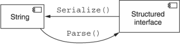

本章涵盖内容

- 为什么标准列表方法应该支持过滤资源
- 如何将过滤器表达式作为标准列表请求的一部分进行通信
- 过滤资源时的行为准则
- 过滤条件中应该和不应该支持的功能

虽然标准列表方法提供了一种机制来遍历 API 中的完整资源集，但到目前为止，我们确实没有办法仅表示对这些资源的一个子集感兴趣。此模式将探索使用标准列表请求中的特殊字段作为过滤完整数据集以仅返回匹配结果集的方法。此外，我们将详细介绍如何为这个特殊的过滤字段构建输入值。

## 22.1 动机

到目前为止，检索大量资源的典型方法非常简单：使用标准列表方法。类似地，如果我们正在寻找一个特定的资源并且碰巧知道它的标识符，我们有一个同样简单的工具可供我们使用：标准的 get 方法。但是，如果我们的目标介于两者之间呢？如果我们想浏览恰好符合一组特定条件的资源怎么办？我们既不寻找单个资源，也不打算浏览所有资源，但我们确实对我们正在搜索的资源有所了解。我们该如何处理？

不幸的是，到目前为止还没有很好的方式来表达这个中间立场。相反，我们在技术上能做的最好的事情是建立在标准列表方法的基础上，并在资源列表返回时应用一组过滤标准。

清单 22.1 客户端过滤资源示例

```typescript
async function ListMatchingChatRooms(title?: string):
    Promise<ChatRoom[]> {
  let results: ChatRoom[] = [];
  let response: ListChatRoomsResponse;
  while (response === undefined ||
         response.nextPageToken) {              // ❶
    response = await ListChatRooms({            // ❷
      pageToken: response.nextPageToken
    });
    for (let chatRoom of response.resources) {  // ❸
      if (title === undefined ||
          chatRoom.title === title) {           // ❸
        results.push(chatRoom);
      }
    }
  }
  return results;
}
```

❶ 循环第一次迭代，只要有下一页资源要查看
❷ 从 API 中获取资源页面。
❸ 遍历每个资源并检查标题字段是否匹配。
正如您想象的那样，这种设计远非理想。最明显的问题是，为了确定我们找到了所有匹配的结果，客户端必须针对 API 中存储的整个资源集获取、迭代和评估过滤条件。这对于没有匹配项的边缘情况尤其令人沮丧，因为我们必须过滤资源才能发现它们都不符合过滤条件。但仅就数据传输消费而言，显然这是过度浪费。我们如何解决这个问题？

## 22.2 概述
幸运的是，这个难题的解决方案非常明显。与其检索所有可用资源并过滤那些我们不感兴趣的资源，不如让我们反过来将这一责任推给 API 服务器本身。换句话说，我们所要做的就是向 API 服务器声明要匹配的标准，然后结果集将只包含匹配的资源。

清单 22.2 标准列表请求上的附加过滤器字段

```typescript
interface ListChatRoomsRequest {
  filter: any;                    // ❶
  maxPageSize: number;            // ❷
  pageToken: string;              // ❷
}
```

❶ 这现在被列为 any，因为我们还没有决定我们将如何实现它。
❷ 这些字段与分页模式有关（第 21 章）。
虽然这个设计概念可能很明显，但实现本身有点复杂。很容易说明在列出资源时我们应该向服务器传达某种过滤条件，但是过滤数据实际上应该是什么样子的？它应该是一个类似于 SQL 查询的简单字符串吗？或者更复杂的匹配字段的结构，比如 MongoDB 查询过滤器文档？

一旦我们选择了一种可接受的格式来传达查询，我们就必须考虑应该支持哪些功能。例如，我们是否应该只允许匹配资源字段（例如，匹配 ChatRoom 资源的确切标题）？或者我们应该使用通配符进一步扩展它（例如，匹配标题中任何位置的关键字）？或者甚至是任意文本搜索，例如搜索查询（例如，出现在任何字段中的关键字）？

查询没有专门存储在资源上的东西呢？例如，我们是否应该允许基于有关字段的元数据进行查询，例如 ChatRoom 的成员数量？这是否为扩展到相关资源的查询打开了大门？例如，过滤器是否应该提供一种方法来将 ChatRoom 的结果限制为只有拥有名为 Joe 的成员的人？还是只有成员名为 Joe 的成员是另一个 ChatRoom 的成员，成员名为 Luca？如果是这样，这种能力能延伸多远？

正如这些示例希望清楚地表明的那样，这可能很快成为一个非常深的洞穴需要探索，有许多不同的曲折，并非所有这些都值得在过滤规范中提供支持。此模式的目标是解决这些关键问题，尤其是如何指定过滤器以及究竟哪些功能值得支持。

## 22.3 实现
我们需要做的第一件事是决定如何最好地将表示用户意图的过滤器传达给 API 服务器以供执行。换句话说，我们可以通过多种不同的方式来表示相同的过滤意图，但重要的是我们必须确定一种在支持过滤的标准列表方法中一致使用的单一方式。什么格式最好？

### 22.3.1 结构
正如我们对 API 中的序列化格式有很多不同的选择（例如 JSON [https://www.json.org/json-en.html] 与协议缓冲区 [https://developers .google.com/ protocol-buffers] 与 YAML [https://yaml.org/]) 相比，我们在列出资源时同样有许多不同的选择来表示过滤器。通常，这些选择分为两个不同的类别：结构化和非结构化。

在频谱的非结构化方面，我们有诸如 SQL 查询之类的东西，其中过滤器表示为字符串值，恰好符合非常特定的语法。该字符串值随后由 API 服务器解析并进行评估，以确保仅将匹配的资源返回给用户。

清单 22.3 用于过滤聊天室资源的 SQL 查询示例

```sql
SELECT * FROM ChatRooms WHERE title = "New Chat!";
```

在非结构化方面，我们将部分责任从 API 服务器推回到客户端，有效地要求客户端提前将查询解析为特殊模式，然后将这个复杂的接口直接发送到 API 服务器进行评估 （需要很少或不需要解析内容）。 虽然不如无处不在的 SQL 样式字符串值那么常见，但仍有许多系统（例如 MongoDB）依赖这些结构化接口进行过滤。

清单 22.4 用于过滤聊天室资源的 MongoDB 结构化查询示例

```typescript
db.chatRooms.find( { title: "New Chat!" } );
```

但这给我们带来了一个基本问题：这两者中哪一个是正确的？ 在我们深入讨论每个选项的优缺点之前，重要的是要记住，这个决定在很多方面都是肤浅的。 换句话说，每个选项的最终结果可能看起来不同，但每个选项都应该能够完成相同的事情。 事实上，从一种格式转换到另一种格式应该是简单而直接的，就像从 JSON 序列化资源转换为 YAML 格式的资源一样容易。 然而，在这种情况下，从结构化表示转换为字符串时的转换依赖于序列化，而在向另一个方向进行解析时则依赖于序列化，有点像 Node.js 中的 JSON.stringify() 和 JSON.parse()，如图所示 图 22.1。



由于这两个选项在功能上是等效的，因此在两者之间进行选择确实成为可用性和未来灵活性的问题。换句话说，既然两种选择都可以满足相同的功能需求，我们不得不问：哪个更容易让客户使用，哪个更能经受住时间的考验？

作为 API 设计人员，我们在这种情况下的第一直觉几乎总是尝试一种可重用、灵活且简单的设计来表示过滤器。虽然这是一个勇敢的目标，但不幸的是，即使是最好的设计，由于输入必须遵守结构化模式，仍然会受到一些关键缺陷的影响。

要考虑的主要问题是，最终，这些过滤器与我们可能用任何编程语言编写的任何其他代码没有什么不同。过滤器本身肯定比一些任意代码更受限制和沙箱化，但如果我们仔细观察我们在这里所做的事情，在基本层面上，我们实际上只是用用户提供的代码填充特定的函数定义。然后可以在资源数组的 filter() 函数中使用此代码来确定要包含哪些内容以及要排除哪些内容。

清单 22.5 应该如何评估过滤器表达式代码的示例

```typescript
function resourceMatchesFilter(resource: Object): boolean {
  if (/* user-provided code here! */) {
    return true;
  } else {
    return false;
  }
}
```

为了了解为什么尝试定义用于过滤的结构化表示不太有意义，让我们想象一下，我们实际上接受了一个可能充当清单 22.5 中 if 语句条件的小过滤器表达式，而不是接受一个要评估的任意函数。在这种情况下，我们正在评估用户提供的代码，为这个任意输入定义一个模式真的是个好主意吗？或者接受一些字节作为输入并像大多数编译器那样做更有意义：对内容应用语法规则以验证它确实是有效代码？我们仍然使用基于文本的文件而不是一些结构化模式来定义函数来表示我们的程序应该做什么是有原因的——过滤器也不例外。但故事并没有就此结束。由于更多原因，字符串过滤器是更好的选择。

首先，当使用字符串值时，语法规则仅由 API 服务器强制执行和验证。这意味着任何更改或改进（例如，新功能）都由 API 服务器本身管理，因此不需要客户端进行更改。正如我们将在第 24 章中学到的，无需客户进行任何更改或工作即可进行改进的能力是一个非常强大的工具。

其次，字符串查询通常为那些将使用 API 的人所熟知和理解，特别是如果他们曾经使用过某种 SQL 风格的关系数据库。这意味着字符串查询可能更容易让用户立即理解，因为它依赖于他们已经熟悉的概念。

最后，这可能会令人惊讶，但随着过滤标准变得更加复杂，即使是设计最好的结构也会变得有点难以遵循。为了在实际示例中了解这一点，表 22.1 显示了与 MongoDB 中的结构化过滤器对象相比，各种不同的过滤条件如何在 SQL 中表示为字符串。

表 22.1 SQL 字符串查询与 MongoDB 过滤器结构

| SQL query                                                    | MongoDB filter                                               |
| ------------------------------------------------------------ | ------------------------------------------------------------ |
| title = "New Chat!"                                          | {title: "New Chat!"}                                         |
| userLimit >= 5                                               | {userLimit: { $gt: 5}}                                       |
| title = "New Chat!" AND admin = "1234"                       | {title: "New Chat!", admin: "1234"}                          |
| title IN ("New Chat!", "Old Chat!")                          | { title: {$in: ["New Chat!","Old Chat!"]}}                   |
| title = "New Chat!" OR title = "Old Chat!"                   | { $or: [{title: "New Chat!"}, { title: "Old Chat!" }]}       |
| (title = "new chat!" AND userLimit >= 5) OR title = "old chat!" | { $or: [ {title: "New Chat!", userLimit: {$gt: 5 }}, {title: "Old Chat!"}] } |

如您所见，虽然这两个选项都能够表达相同的布尔条件，但对于我们中的许多人来说，SQL 样式的字符串往往更容易理解和处理。这可能是因为这些字符串实际上看起来很像我们可能用典型的编程语言编写的布尔表达式。换句话说，我们越来越依赖于用户已经熟悉的东西，而不是期望并要求他们专门为我们的 API 学习一些新的东西。

因此，虽然用于表示过滤条件的结构化接口肯定会起作用，但随着时间的推移，它更有可能导致更脆弱的 API 定义受到影响。此外，自定义结构化接口几乎总是伴随着更陡峭的学习曲线，并且与序列化字符串表示相比没有太多好处。因此，尽管尝试设计一个奇妙的结构来表示这些过滤器可能很诱人，但依赖字符串字段几乎总是更安全，该字段可以随着服务本身的发展和变化而随 API 增长。

既然我们已经说明了为什么非结构化值（例如，字符串）是表示过滤器的更好选择，让我们深入研究我们应该用于该字符串的底层语法。

### 22.3.2 过滤器语法和行为
仅仅因为我们将一个字符串称为非结构化选项，并不意味着这些字符串值没有任何规则。相反，字符串的非结构化性质是指数据类型和模式而不是值本身的格式，它必须符合一组特定的规则才能有效。但这些规则是什么？过滤字符串的正确语法是什么？

尽管设计和指定用于过滤资源的完整语言可能很有趣，但这可能有点超出了本书的范围。事实上，有很多语言规范可以实现这个目标，例如通用表达式语言（CEL；https://github.com/google/cel-spec/blob/master/doc/langdef.md）， JSONQuery (https://www.sitepen.com/blog/jsonquery-data-querying-beyond-jsonpath)、RQL (https://github.com/persvr/rql) 或 Google 的过滤规范 (https://google .aip.dev/160）。在某些（但不是全部）情况下，尝试依赖底层存储系统的查询能力甚至可能是有意义的，例如强制执行查询语法遵循 SQL WHERE 子句等价物的特定子集，对允许的功能的限制很少。

与其从头开始重新发明轮子，甚至规定特定的“正确”语法，不如让我们来看看最有可能导致最佳结果的一些特征和限制，而不管具体的实现和语法。

#### 执行时间处理时间

尽管过滤表达式应该由简单的比较组成（例如，title = "New Chat!"），但事实证明，这些简单的比较实际上会变得非常复杂。如果您拿起一本关于各种数据库的 SQL 语法和功能的书，您会惊讶地发现这些类型的简单语句会变得如此复杂。例如，如果我们将比较的右侧从文字值（例如，像“New Chat!”这样的特定字符串）更改为另一个变量（例如，title = description）会怎样？或者，如果我们更进一步并涉及不同的资源（例如，administrator.employer.name = "Apple" 之类的东西）怎么办？我们如何在简单的过滤条件和对于我们的过滤语言来说太复杂的条件之间划清界限？

在决定支持哪些功能时，我们考虑的第一件事比激动人心的要实用得多：执行评估函数的运行时间。这意味着我们必须回想一下我们作为本科计算机科学专业的学生接受大 O 符号测验并确定运行函数的最坏情况的时代。在这种情况下，我们担心是否存在可能导致评估函数异常缓慢或计算密集的给定过滤器字符串。对于一个荒谬的例子，假设我们提供了一种方法来过滤从月球上的服务器获取的数据或需要对非常大的数据库中的所有行进行全面扫描的数据。显然，这会导致过滤速度极慢，从而导致整体体验不佳。幸运的是，有一个简单的策略可以确保评估函数的运行时间保持合理：限制可用作输入的数据。

要遵循的一般准则是过滤器应该只需要单个资源的上下文来成功评估过滤器条件。这意味着，如果我们考虑过滤器评估函数，它只会将两件事作为输入参数：过滤器字符串本身和可能匹配或不匹配过滤条件的资源。这意味着无法包含任何不属于资源的额外数据（例如，从月球获取的数据）。

清单 22.6 一个只有过滤器和潜在匹配项的评估函数

```typescript
function evaluate(filter: string, resource: ChatRoom): boolean {
  // ...
}
```

相反，如果我们允许不止一个资源进行评估（如清单 22.7 所示），我们将有很多额外的问题需要回答。 例如，我们应该允许无限数量的额外资源进行比较还是将数量限制为其他资源（例如，五个）？ 我们如何将这些信息加载到上下文中？ 我们应该允许不同类型的资源还是将它们限制为与正在评估的资源相同的类型？ 我们还有更复杂的性能影响，例如是否预取或缓存可能用于评估的资源信息，以及与资源新鲜度和数据一致性相关的新问题。

清单 22.7 支持附加上下文的评估函数

```typescript
function evaluate(filter: string, resource: ChatRoom, context: Object[]):
    boolean {
  // ...
}
```

虽然肯定有可能解决所有这些问题，但这样做所获得的价值不太可能值得付出努力。换句话说，虽然扩大过滤器表达式中可用于比较的变量的范围有时可能会派上用场，但如果我们坚持过滤的真正目标，即限制基于结果的结果，这远不是最常见的事情。关于目标资源本身的简单条件。因此，避免回答这些问题几乎总是最好的选择。相反，我们可以简单地要求过滤条件只接受两条信息作为输入：过滤表达式本身和可能匹配也可能不匹配表达式的单个资源。

虽然这是一个好的开始，但它并没有解决所有潜在的问题。尽管我们已经决定过滤器语法应该要求评估中只涉及一个资源，但我们还没有说明过滤器表达式在评估期间可能实际做什么。例如，是什么阻止过滤器表达式使用来自起始资源的关系来引用另一个资源？换一种说法，我们是否应该允许过滤器表达式引用其他资源并从其他地方（例如，数据库）检索这些资源以评估表达式？

答案是否定的。我们将更进一步：过滤器表达式通常根本不应该具有与其他外部系统通信的能力；相反，它应该保持密封并与外界隔绝。这意味着过滤器表达式不应该能够引用相关资源的数据，除非它已经嵌入到该资源中。例如，如果我们要根据 ChatRoom 资源的管理员名称进行过滤，则只有在管理员字段直接嵌入信息的情况下才可以这样做。如果管理员字段是引用另一个资源的字符串标识符，则期望系统取消引用该字符串字段的过滤器应该会失败（例如，administrator.name = "Luca"）。

如果过滤器评估函数不是封闭的并且能够与外界通信（例如，从数据库中请求新的资源数据），我们将打开相当大的蠕虫罐，导致更多的问题，类似于我们刚刚遇到的问题.例如，我们可以在多远的地方导航到相关资源？如果存储在其中一个字段中的数据实际上位于检索信息时正常运行时间短或延迟高的系统中（例如，月球上的服务器）怎么办？最终，保持函数隔离并能够仅依赖作为参数提供的数据可以降低其导致执行时间过长或计算成本高的可能性。因此，保持过滤器评估的封闭性并与其他服务隔离通常是一个好主意，其中所有需要的数据都已经存在于被评估的资源上。

#### 数组索引寻址

在过滤资源时，大多数情况下这些过滤条件基于特定字段（例如，title = "New ChatRoom!"），并且指定相关字段非常简单。但是，在某些情况下，指示应该使用哪个字段进行比较会更复杂一些。一个明显的例子是映射字段中的特定键。这些可能很棘手，主要是因为它们可能具有需要任何过滤器语法来支持某种形式的转义的保留字符，这将在保留字符是可操作的还是按字面意义使用时会变得很清楚。但是还有一个重要的问题不是关于我们指定值的方式，而是关于这样做的含义：数组中的值。

当一个字段存储一组值而不是单个值并且我们打算根据这些单独的值进行过滤时，我们必须决定我们将如何在过滤器表达式中准确地处理这些单独的值。换句话说，我们如何根据匹配特定值的数组字段中的第一项过滤资源？

虽然在许多语言中肯定可以表达这种类型的东西（例如，tags[0] = "new"），但由于隐含要求数组中的项目顺序是静态的，这很少是一个好主意。对数组中的单个项目进行寻址必然要求这些项目以严格的顺序保存。这往往看起来很简单，但在对这些值进行操作时往往会导致相当多的混乱，因为更改数组值中项目的顺序有效地导致完全不同的值，而不是略微增加的值。例如，如果我们强制执行严格的排序规则，这是否意味着新值必须始终附加到数组的末尾？还是一开始就插入？还是根据指定的索引添加？这些问题看似简单，但加起来很快就会变得难以管理。

相反，实际上用户更可能想要测试数组中某个值（在任何位置）的存在，而不是特定索引处的值。因此，提供一种机制来检查字段是否包含测试值（例如，标签：标签中的“新”或“新”）比在数组中的特定位置寻址项目要方便得多。换句话说，通常最好将数组字段视为无序或具有不确定顺序，其中项目永远不会位于任何特定位置，而是存在或不存在于数组中。当需要有序的项目列表时，依靠一个特殊的字段来指示相关项目的优先级或顺序，并基于此执行过滤器（例如，item.position = 1 和 item.title = "new"）。

人们可能会认为过滤器只读取数据，因此处理这个问题并不是什么大事——毕竟，失败的情况是你最终会得到不同的过滤结果；我们不会意外删除 API 中的所有数据。这当然是正确的，但一个好的 API 的主要目标之一是它是一致的和可预测的。导致漏报的微妙排序要求（例如，我们期望资源与过滤器匹配，但由于项目的顺序而不匹配）可能比看起来更令人沮丧。因此，通常最好抵制支持此功能的冲动，而是专注于仅支持测试数组中项目的存在。

#### 严格
与我们可能定义的任何语法一样，自然会出现语法规则到底有多严格的问题。例如，在某些编程语言中，有相当多的灵活性（例如，有时带有可选分号字符的 Javascript），而其他编程语言则非常严格（例如，在许多情况下是 C++）。最终，这归结为解释器在处理某些输入时愿意进行多少猜测。那么显而易见的问题就变成了过滤表达式应该有多严格？当用户意图不清楚时，他们是否应该灵活并做出大量猜测？或者是否应该要求这些表达方式严格并且不对用户可能的意思做任何假设？一般来说，最好的策略是避免进行任何猜测，只有在意图明确无歧义时才允许灵活性。例如，在指定字段掩码时，我们需要对带有特殊字符（如空格或点）的字符串进行转义和反引号字符，但在使用标准字母 A 到 Z 时则不需要。

通常，允许过滤表达式具有很大的灵活性是很诱人的，因为它们主要是读取数据。换句话说，既然错误解释的过滤器表达式的失败场景并没有做任何灾难性的事情，为什么不让更多的猜测进入这个过程呢？虽然这当然是正确的，但这并不一定使它成为正确的选择。

首先，我们有一个明显的清除自定义方法的例子，它接受匹配特定过滤器的项目过滤器（第 19 章）。在这种情况下，失败场景确实是灾难性的，可能会导致资源在不应该删除时被删除（误报匹配），以及资源在应该被删除时被留下（误报不匹配）。这种模式虽然通常不鼓励，但受过滤器表达式语法的严格限制，并且由于缺乏特异性而对用户意图的误解可能会非常成问题。

接下来，值得注意的是，不匹配（误报或漏报）在只读情况下可能不会是灾难性的，但这并不会让它们变得不那么令人沮丧。例如，假设我们尝试根据字段值过滤资源（例如，使用 title = "New" 过滤 ChatRoom 资源）但不小心输入了字段名称（例如，“ttile”而不是“title”）。显然过滤器表达式无法确定我们真正想要的是哪个字段，但我们必须问自己，“过滤器是否会导致错误？”

一方面，我们可能会像我们在字段掩码中看到的那样做，它会尝试检索这个奇怪命名的字段（“ttile”）的值，并返回一个缺失值（例如，在 Javascript 中未定义）。这显然与我们正在测试的值 (New) 不匹配，并且结果将过滤所有可能的资源。换句话说，此检索的值将始终解析为 undefined 并且永远不等于 New，因此我们实际上只是过滤了所有可能的结果。

另一种选择非常简单：当字段引用无效时抛出错误。这将确保 API 服务本身可以准确地指定错别字的位置（例如，错误：位置 0（“ttile”）处的无效字段规范），而不是经历在过滤器表达式中查找错字的挫折。尽管我们都讨厌看到这些类型的错误，但更令人沮丧的是，细微的错误最终会导致下游问题。

同样的策略也适用于其他微妙的场景，例如强制类型之间的值以进行适当的比较（例如，将 1234 作为字符串转换为 1234 作为数值，反之亦然）。虽然松散的解释可能只是简单地为给定条件返回不匹配的结果，但严格并在缺乏清晰度的情况下返回错误对于那些试图过滤资源的人来说更为有用。例如，如果条件将数字字段与字符串值进行比较（例如，userCount = "string"），则该条件显然无法评估为真。然而，过滤系统不是简单地返回 false，而是应该为明显错误的条件返回错误结果。

#### 自定义功能
最后，由于 API 总是有自己的一套独特的要求，几乎可以肯定的是，有时用户需要“打破玻璃”来解决基本过滤语法本身不支持的事情的这些限制。例如，虽然我们通常不希望在过滤器表达式中提供执行资源密集型计算的能力，但可能存在用户真正需要这种能力的独特情况。虽然我们不想为诸如任意复杂计算之类的事情打开闸门，但我们确实需要一种方法来允许在狭窄范围内执行这些类型的操作。这怎么工作？

允许用户在特殊情况下改变或打破规则的常见解决方案是依赖表达式中的特殊函数调用。换句话说，我们不希望允许运行任意代码、连接到外部数据源或通过修改本机语法进行花哨的数据操作，因此我们可以提供辅助函数来以良好控制的方式执行这些操作。

要了解这可能如何工作，请考虑对字符串执行更高级匹配的示例，例如基于前缀或后缀的匹配而不是简单的精确匹配。我们可以增加过滤器语法来处理这个问题，也许通过支持通配符（例如，title = "*(new)"），但这会引入一大堆新问题（例如，现在我们需要转义字符来匹配文字星号字符）。相反，我们可以使用特殊的endsWith 函数调用来执行相同的行为（例如，endsWith(title, "(new)")）。我们甚至可以提供一个更简单的实用函数来操作字符串，例如检索字符串子字符串的方法。这可能会导致前缀过滤看起来像 substring(title, 0, 5) = "(new)"。

而且这些特殊功能不应仅限于简单的字符串操作。如果 API 有办法对数据执行一些高级机器学习分析，我们可能会将其公开为特殊功能。例如，如果用户资源有一个 profilePhoto 字段，并且我们有一个 API 来识别图像中的事物（例如，人脸、地标或常见对象），则可以提供一个函数来检查其中一些是否存在事物（例如， imageContains(profilePhoto, "dog") = true）。

在这种情况下要考虑的重点不是这些函数可能能够做什么，而是它们是一种打破基本语法规则的方法。通过这种方式，过滤资源的语法仍然简单明了，而如果 API 认为它对于相关用例至关重要，那么使用 API 的人仍然可以执行更高级的过滤。

### 22.3.3 最终 API 定义
在这种情况下，过滤资源的 API 定义非常简单，只涉及更新标准列表请求以包含过滤器字段。但是，使该字段采用字符串类型的决定很重要。

清单 22.8 最终 API 定义

```typescript
abstract class ChatRoomApi {
  @get("/chatRooms")
  ListChatRooms(req: ListChatRoomsRequest): ListChatRoomsResponse;
}
 
interface ListChatRoomsRequest {
  filter: string;
  maxPageSize: number;
  pageToken: string;
}
 
interface ListChatRoomsResponse {
  results: ChatRoom[];
  nextPageToken: string;
}
```

## 22.4 权衡
最明显的权衡是支持过滤和不支持过滤。虽然在标准列表请求中提供过滤资源的能力通常需要更多资源，但为用户提供的好处几乎肯定会超过任何额外的短期成本。此外，如果用户被迫通过获取所有资源来进行自己的过滤，那么这些用户不仅是在浪费自己的时间，而且是在浪费 API 的计算资源以检索和传输相当多的信息。已经提前过滤掉了。因此，虽然在某些情况下过滤不是必需的，但大多数资源的标准列表方法应该支持该功能，特别是如果正在获取的资源数量可能增长到足够大（例如，以数百成千）。

此外，也许最大的权衡，如第 22.3.1 节所述，是结构化过滤器和非结构化过滤器字符串之间的选择。虽然它们在技术上代表同一事物，但使用字符串意味着随着时间的推移对结构格式的更改更容易管理，而无需传达任何新的技术 API 规范（例如，开放的 API 规范文档）。取而代之的是，使用字符串可以更新文档并支持新格式，而无需向用户传达更多信息。

## 22.5 练习
1. 对过滤条件使用结构化接口的主要缺点是什么？
2. 为什么允许基于数组字段中值的位置进行过滤是个坏主意？
3. 您如何处理可能存在或不存在的映射键？在与不存在的键进行比较时，您是否应该严格并抛出错误？还是视他们为失踪？
4. 想象一下，用户想要根据字段的后缀过滤资源（例如，查找姓名以“man”结尾的所有人员）。这如何在过滤器字符串中表示？

## 总结

- 提供对标准列表方法的过滤意味着用户不需要为了只找到他们感兴趣的数据而获取所有数据。
- 过滤器规范通常应该是符合特定语法（类似于 SQL 查询）的字符串，而不是传达相同意图的结构化接口。
- 过滤字符串应该只需要一个资源作为评估的上下文，以避免执行时间的无限增长。
- 过滤器不应该提供一种方法来根据它们在重复字段（例如，数组）中的位置或索引来比较资源上的项目。
- 在过滤器评估期间发现的错误应该立即浮出水面，而不是隐藏或忽略。
- 如果基本比较不足以满足用户的意图，过滤器应提供一组可在过滤时解释和执行的文档化功能。