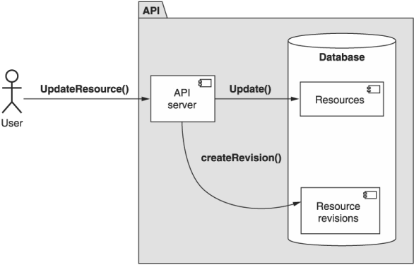
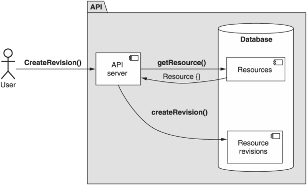

本章涵盖内容

- 随着时间的推移，如何安全地存储单个资源的多个修订版本
- 如何识别个别修订
- 隐式或显式创建修订的策略
- 如何列出可用修订并检索特定修订
- 恢复到以前的修订版的工作原理
- 可修改资源的子资源怎么办

尽管资源会随着时间发生变化，但我们通常会丢弃过去可能发生的任何变化。换句话说，我们只存储资源现在的样子，而完全忽略资源在进行更改之前的样子。这种模式提供了一个框架，通过它我们可以随着时间的推移跟踪单个资源的多个修订，从而保留历史并启用高级功能，例如回滚到以前的修订。

## 28.1 动机
到目前为止，我们在 API 中与资源的所有交互都只关注资源的当前状态，而忽略了之前的状态。虽然我们偶尔会考虑一致性之类的主题（例如，当我们在对列表进行分页时查看资源变化时会发生什么时），但对资源总是有一个很大的假设：它们只存在于一个时间点，那个时间是马上。

到目前为止，这一假设对我们很有帮助，但某些资源一次需要不止一个快照的情况并不少见。例如，我们经常在 Microsoft Word 或 Google 文档中跟踪修订历史。同样，如果我们的 API 涉及代表合同、采购订单、法律文件甚至广告活动的资源，那么用户可能会从随着时间的推移查看资源的历史记录而受益，这并不是一个疯狂的想法。这意味着，如果出现问题，则更容易诊断出原因是哪个更改。

此模式的目标是提供一个框架，该框架能够为单个资源存储多个修订，并允许其他更复杂的功能，例如删除不再需要的修订或将资源回滚到先前的修订，从而有效地撤消先前的更改.

## 28.2 概述
为了解决这些问题，这种模式将依赖于一个称为资源修订的新概念。资源修订只是资源的快照，它标有唯一标识符，并带有创建时间的时间戳。这些修订虽然本质上很简单，但提供了很多有趣的功能。

例如，如果我们可以浏览给定资源的所有修订版本并直接检索单个修订版本，那么从技术上讲，我们已经获得了查看过去并查看资源随时间演变的能力。更重要的是，我们可以通过回滚到特定修订来撤消先前的更改，使资源看起来与先前修订时完全一样。

但是资源修订是什么样的呢？我们是否必须在 API 的整个生命周期内保持两个独立的接口同步？幸运的是，答案是否定的。资源修订根本不是一个单独的界面；相反，它是通过简单地向现有资源添加两个新字段而带来的概念：修订标识符和快照创建此修订时的时间戳。

清单 28.1 添加对消息资源修订的支持

```typescript
interface Message {
  id: string;
  content: string;
  // ...
 
  revisionId: string;         // ❶    
  revisionCreateTime: Date;   // ❶
}
```

❶ 通过添加两个字段，我们现在可以用相同的界面表示资源的多个修订版。
简而言之，这是通过存储具有相同标识符 (id) 的多个记录来实现的；但是，这些记录中的每一个都有不同的修订标识符 (revisionId)，并代表资源在某个时间点的查看情况。现在，当我们通过标识符检索资源时，结果将是一个恰好是最新的资源修订版。从某种意义上说，资源标识符成为最新资源修订版的别名，“最新”定义为修订版创建时间字段具有最新值的修订版。

然而，与往常一样，关于需要回答的细节有很多问题。首先，我们如何决定何时创建新修订？它应该是自动的还是需要特定的用户干预？我们如何实现列出修订或检索特定修订资源的功能？那么回滚到以前的版本呢？在下一节中，我们将详细讨论所有这些问题。

## 28.3 实施
资源修订如何工作？正如我们所见，要使资源可修改需要两个新字段，但仅此而已吗？当然不。我们需要探索一大堆额外的主题。这包括我们需要创建的各种自定义方法和我们需要修改以适应这种模式的现有标准方法。简而言之，我们需要为我们想要支持的每个新行为定义新的 API 方法（例如，检索单个资源修订、列出修订、回滚到以前的修订等）。

在我们可以做任何这些之前，我们需要探索这个新的修订标识符字段究竟会包含什么以及它是如何工作的。在下一节中，我们将通过决定什么是好的修订标识符以及它与我们典型的资源标识符有何不同来开始深入研究这种模式。

### 28.3.1 修订标识符

在选择修订标识符时，有几个选项。首先，我们可以使用一个计数数字，有点像递增的版本号（1、2、3、4……）。另一种选择是使用基于时间的标识符，如简单的时间戳值（例如，1601562420）。还有一种选择是使用完全随机的标识符，这依赖于我们在第 6 章中学到的原则。

前两个选项（计数数字和时间戳）意味着其标识符中修订的时间顺序，与修订创建时间字段分开并分开，这可能会变得有点问题。如果我们使用增量修订号，如果修订被删除（见第 28.3.6 节）可能会令人困惑，因为这会在修订历史中留下一个空白（例如，1、2、4）。由于删除某些内容的目的是删除它的所有痕迹，因此对修订字符串使用增量编号肯定不是理想的，因为它会留下间隙，从而很明显地表明修订已被删除。

另一方面，时间戳不受这个问题的影响，因为它们传达了时间顺序，并且可以容忍数据中的差距。使用时间戳标识符，我们需要担心标识符的冲突。我们不太可能遇到这个问题（通常只有在系统并发访问量极高的情况下才有可能发生），但这并不意味着我们可以完全消除这个问题。换句话说，如果没有更好的选择，那么时间戳是一个很好的折衷方案；然而，有一个更好的选择符合第 6 章中探讨的原则：随机标识符。

与其他两个选项不同，随机标识符只有一个目的：它是一个不透明的字节块，唯一标识单个修订版。但是修订标识符应该与资源标识符完全相同吗？虽然我们应该选择在整个 API 中一致地使用标识符，但在修订的情况下有一个值得探讨的问题：我们需要标识符有多大？

尽管在创建数十亿及更多资源时，Crockford Base32 格式（120 位）中的 25 个字符标识符可能很重要，但问题是我们是否真的需要支持与给定类型的资源一样多的单个资源修订版。通常，我们的修订数量远少于资源，因此我们几乎可以肯定不需要完整的 120 位密钥空间。相反，依赖 13 个字符的标识符（60 位）作为 64 位整数提供的相同密钥空间大小的近似值可能是有意义的。

另一个需要考虑的问题是依赖标识符中的校验和字符是否仍然有意义，如第 6.4.4 节所述。虽然它可能看起来无关紧要，但请记住，校验和字符的目标是区分不存在的东西（即没有基础数据的有效标识符）和不可能存在的东西（即完全无效的标识符） .按理说，正如对资源进行这种区分很重要一样，对于资源的单一修订也同样重要。因此，我们几乎肯定应该保留资源修订标识符的校验和字符部分。

我们可以重用第 6 章中的大部分相同代码来生成标识符，但标识符更短。

清单 28.2 生成随机资源修订标识符的示例代码

```typescript
const crypto = require('crypto');
const base32Decode = require('base32-decode');
 
function generateRandomId(length: number): string {
  const b32Chars = '012345689ABCDEFGHJKMNPQRSTVWXYTZ';      // ❶
  let id = '';
  for (let i = 0; i < length; i++) {
    let rnd = crypto.randomInt(0, b32Chars.length);
    id += b32Chars[rnd];
  }
  return id + getChecksumCharacter(id);                     // ❷
}
 
function getChecksumCharacter(value: string): string {
  const bytes = Buffer.from(
      base32Decode(value, 'Crockford'));                    // ❸
  const intValue = BigInt(`0x${bytes.toString('hex')}`);    // ❹
  const checksumValue = Number(intValue % BigInt(37));      // ❺
 
  const alphabet = '0123456789ABCDEFG' +                    // ❻
                   'HJKMNPQRSTVWXYZ*~$=U';
  return alphabet[Math.abs(checksumValue)];
}
```

❶这里我们通过随机选择Base32字符来生成一个ID。
❷ 最后，我们返回 ID 以及计算出的校验和字符。
❸ 我们首先将 Base32 字符串解码为字节缓冲区。
❹ 然后我们将字节缓冲区转换为一个 BigInt 值。
❺ 通过确定除以 37 后的余数来计算校验和值。
❻ 这里我们依赖 Crockford 的 Base32 校验和字母表
既然我们已经复习了为修订生成唯一标识符，让我们看看这些修订究竟是如何产生的。

### 28.3.2 创建修订
显然，能够识别修订很重要，但除非我们首先知道这些修订是如何创建的，否则它基本上是无用的。在创建新修订时，我们有两种不同的选项可供选择：显式创建修订（用户必须明确要求创建新修订）或隐式创建（无需任何特定干预即可自动创建新修订） .

虽然这些策略中的每一个都是完全可以接受的，但在支持资源修订的所有资源中使用相同的策略很重要，因为如果我们在不同的资源中使用不同的修订策略，通常会导致潜在的混乱，用户期望一种策略并感到惊讶当他们的期望被打破时。因此，应尽可能避免混合和匹配，并在有使用不同策略的关键原因的情况下明确记录。

所有这些都有一个警告。无论我们选择哪种策略，如果资源支持修订，那么在首次创建该资源时，无论如何都必须填充修订 ID 字段。如果没有这个，我们最终可能会得到实际上不是修订版的资源，这会导致我们在以下部分中探索的交互模式出现很多问题。

让我们通过查看隐式创建的工作原理来开始探索创建修订的不同机制。

#### 隐性修订
在支持此功能的任何 API 中创建资源修订的最常见机制是隐式这样做。 这只是意味着，不是用户专门指示 API 创建新修订，而是 API 本身决定何时这样做。 这并不是说用户无法影响创建修订的时间。 例如，创建新修订的最常见机制是每次存储在资源中的数据更改时让 API 自动执行此操作，如图 28.1 所示。 事实上，有许多现实世界的系统依赖于这种机制，例如 Google Docs 的修订历史或 GitHub 的问题跟踪，两者都跟踪相关资源的所有历史记录（文档或问题）。



虽然这是最常见且当然是最安全的选项（保留最多历史记录），但还有许多其他隐式修订跟踪策略可用。例如，不是为每次修改创建一个新修订，服务可能会按计划这样做，只要做了一些更改，就在每天结束时创建一个新修订，或者可能跳过一定数量的更改，在每三次修改后创建一个新修订，而不是每次修改后创建一个新修订。

此外，我们可以根据里程碑而不是时间间隔进行修订。这意味着不是每次更新资源时都创建一个新修订，我们可能会在每次修改单个特定字段或执行特定自定义方法时创建一个修订。例如，也许我们仅在执行自定义 PublishBlogPost() 方法时才为 BlogPost 资源创建新修订。

所有这些都是完全可以接受的，尽管就应该如何创建修订版规定一个通用的答案是多么可爱，但这在这里是不可能的。原因很简单：每个 API 都是不同的，并且针对不同的业务或以产品为中心的约束会带来不同的最佳资源修订策略。

一个好的一般指导方针是保持更多的修订而不是更少的错误（我们在第 28.3.7 节探讨了节省空间的技术），最简单和最可预测的策略之一是在每次获取资源时简单地创建新修订被修改。此策略易于理解和使用，并且对于用户需要依赖资源修订的大多数情况创建了非常有用的结果。

#### 显式修订
然而，在许多情况下，隐式创建修订可能完全没有必要并且过于浪费。这给我们带来了一个明显的替代方案：允许用户使用特殊的自定义方法明确声明他们想要创建新资源修订的确切时间，如图 28.2 所示。这种明确的机制允许用户准确控制何时创建修订，将决定修订创建策略的责任从 API 本身推回到用户身上。



为此，我们可以创建一个新的自定义方法，该方法在很多方面都类似于标准的 create 方法。 与在现有父项下创建新资源不同，此自定义创建修订方法具有单一职责：获取在该时刻存在的修订的快照，并创建一个新修订来表示该快照。 这个新修订应该有一个随机生成的标识符（如第 28.3.1 节所述），修订的创建时间戳应该设置为修订最终保留的时间。

清单 28.3 用于创建资源修订的 API 定义

```typescript
abstract class ChatRoomApi {
  @post("/{id=chatRooms/*/messages/*}:createRevision")
  CreateMessageRevision(req: CreateMessageRevisionRequest):   // ❶    
    Message;
}
 
interface Message {
  id: string;
  content: string;
  // ...
  revisionId: string;                                         // ❷
  revisionCreateTime: Date;                                   // ❷
}
 
interface CreateMessageRevisionRequest {
  id: string;                                                 // ❸
}
```

❶自定义创建修订方法创建一个新修订并返回新创建的修订（这只是设置了特殊字段的资源）。
❷ 我们可以通过添加我们在 28.2 节中学到的两个字段来使 Message 资源可修改。
❸ 该方法只需要知道资源的标识符。
现在我们已经了解了创建新资源修订的方法，让我们看看我们如何与这些修订进行实际交互，首先是我们如何通过检索特定修订来回顾过去。

### 28.3.3 检索特定修订

正如我们在第 28.2 节中了解到的，资源修订提供的最有价值的功能之一是能够回顾过去并读取过去出现的资源数据。但这导致了一个有趣的问题：我们究竟如何要求资源的过去修订？从技术上讲，修订标识符（第 28.3.1 节）作为一个字段存储在资源本身上；那么我们应该依靠带有特殊过滤器的标准列表方法吗？虽然这在技术上是可行的，但使用标准列表方法来检索单个资源（而不是浏览资源的主要目的）肯定非常麻烦并且感觉有点奇怪。幸运的是，有一个更好的方法来解决这个问题，涉及两个部分。

首先，由于检索单个项目是标准 get 方法的明确职责，因此该机制当然应该依赖于扩展该方法以支持这个面向修订的新用例。其次，我们需要一种清晰而简单的方法来在对方法的请求中提供修订标识符。为此，我们可以依靠一个新的特殊分隔符将整个资源标识符分为两部分：资源 ID 和修订 ID。为此，我们将依赖“@”符号作为分隔符，从而产生完整的资源修订标识符，例如 /chatRooms/1/messages/2@1234 来表示给定消息资源的修订版本 1234。

使用这个特殊的分隔符的好处是非常棒的：标准的 get 方法根本不需要改变。由于我们只是发送一个稍微详细的标识符，我们可以依赖标准 get 请求中的相同 id 字段，并允许 API 服务将其解释为给定修订的资源。

这确实导致了一个有趣的问题：当资源以特定的修订版响应时，该资源的 ID 字段中应该包含什么？换句话说，如果我们请求一个修订版为 1234 的资源，该 ID 是否与请求中提供的内容完全匹配（例如，resources/abcd@1234），或者我们是否应该仅使用资源标识符（例如，resources/abcd ) 并将修订版本放入 revisionId 字段？

答案很简单：返回的资源应该有一个与所要求的完全相同的标识符（并且 revisionId 字段应该始终填充返回的修订的标识符）因为重要的是我们可以轻松地断言我们得到了什么我们要求。

清单 28.4 你得到你所要求的不变量

```typescript
assert(GetResource({ id: id }).id == id);     // ❶
```

❶ 通过 ID 检索某物应始终返回具有相同 ID 的结果。
这意味着当我们请求一个资源而不指定修订 ID 时，返回的资源的 id 字段将只有资源 ID（没有“@”符号和修订 ID），但仍应填充修订 ID 字段。 如果我们随后请求相同的资源修订（基于修订 ID 字段），结果将具有相同的数据，但 id 字段也将包含修订 ID。

清单 28.5 显示检索资源的不同标识符的客户端交互

```typescript
> GetMessage({ id: 'chatRooms/1/messages/2' });        // ❶
{ id: 'chatRooms/1/messages/2',                        // ❶
  // ...,
  revisionId: 'abcd' }                                 // ❷
 
> GetMessage({ id: 'chatRooms/1/messages/2@abcde' });  // ❸
{ id: 'chatRooms/1/messages/2@abcd',                   // ❸
  // ...,
  revisionId: 'abcd' }                                 // ❷
```

❶ 当我们请求一个没有修订 ID 的资源时，结果具有相同的 ID（没有修订 ID）。
❷ 总是用正确的值填充revisionId 字段。
❸ 当我们请求相同的资源但还提供了修订 ID 时，修订将包含在结果的 ID 中。
现在我们已经了解了如何检索单个资源修订版，让我们看看如何浏览所有修订版，类似于我们如何浏览给定类型的所有资源。

### 28.3.4 列表修订
对我们来说幸运的是，基于我们对标准列表方法的探索（参见第 7.3.4 节），我们在列出资源方面有相当多的经验。然而，在这种情况下，我们列出了与单个资源相关的修订，而不是不同父资源的子资源。换句话说，虽然我们可以为这个功能借鉴大部分相同的原则，但我们不能简单地复制和粘贴标准列表方法并使其适用于资源修订。

关于标准列表方法，我们必须改变什么？对于初学者来说，我们不会在资源集合上使用 HTTP GET 方法，而是依赖看起来更像自定义方法的东西，映射到 GET /resources/*:listRevisions。此外，由于目标不是父级本身，而是保留修订的实际资源，我们将使用名为 id 的字段而不是名为 parent 的字段。除此之外，该方法应该以相同的方式工作，甚至支持分页，正如我们在第 21 章中看到的那样。

清单 28.6 列出资源修订的 API 定义

```typescript
abstract class ChatRoomApi {
  @get("/{id=chatRooms/*/messages/*}:listRevisions")
  ListMessageRevisions(req: ListMessageRevisionsRequest):
    ListMessageRevisionsResponse;
}
 
interface ListMessageRevisionsRequest {
  id: string;
  maxPageSize: number;
  pageToken: number;            // ❶
}
 
interface ListMessageRevisionsResponse {
  results: Message[];           // ❷
  nextPageToken: string;        // ❶
}
```

❶ 这种自定义列表修订方法也像任何其他列表方法一样支持分页。
❷ 请注意，响应包括具有不同修订标识符的资源本身。
这种自定义列表修订方法使我们能够浏览给定资源以前修订的历史记录，这依赖于许多与标准列表方法相同的原则。现在我们已经很好地掌握了创建、检索和浏览修订，让我们尝试对这些修订做一些更具交互性的事情：回滚到以前的修订。

### 28.3.5 恢复以前的版本
虽然拥有随时间推移对资源所做更改的历史记录是一个有用的功能，但我们可以根据修订历史提供的最有价值的功能之一是能够将资源恢复到它在某个时间点的样子过去。为此，我们将依赖自定义恢复修订方法，该方法负责使用特定的现有修订作为资源数据的源来创建资源的新修订。由于这个新修订是最新的（因此具有最新的修订创建时间值），它成为资源的当前表示。在某种程度上，这有点像查看旧版本文档的文件，制作该文档的影印本，然后将新文档放在堆栈的顶部。在这种情况下，尽管复印件是较旧的数据，但它会成为最新版本。

清单 28.7 用于恢复资源修订的 API 定义

```typescript
abstract class ChatRoomApi {
  @post("/{id=chatRooms/*/messages/*}:restoreRevision")      // ❶
  RestoreMessageRevision(req: RestoreMessageRevisionRequest): Message;
}
 
interface RestoreMessageRevisionRequest {
  id: string;
  revisionId: string;                                        // ❷
}
```

❶ 为了恢复先前的修订，我们使用附加到资源的自定义方法。
❷ 恢复修订请求还必须指明应该恢复的修订。
重要的是要记住，即使我们正在创建一个新的自定义方法，此功能目前可用于现有的构建块（它只是不原子或几乎不方便）。

清单 28.8 恢复先前修订的客户端实现

```typescript
function restoreMessageRevision(messageId: string, revisionId: string):
    Message {
  const old = GetMessage({                          // ❶
    id: `${messageId}@${revisionId}`
  });
  UpdateMessage({                                   // ❷
    resource: Object.assign(old, { id: messageId })
  });
  return CreateMessageRevision({ id: messageId });  // ❸
}
```

❶ 我们首先检索资源的旧版本。
❷ 之后，我们用旧数据更新资源（确保我们针对消息本身而不是旧版本）。
❸ 如果一个新的修订没有自动创建，我们应该显式地创建一个并返回结果。
为什么不让用户自己实现这个功能呢？与许多这些自己动手的 API 方法一样，我们不得不担心并发性、原子性和便利性。实现的此功能需要三个完整的来回通信线路，其中任何一条都可能失败、延迟或被与同一资源交互的其他用户中断。通过提供与自定义方法相同的功能，我们为用户提供了一种原子方式来执行此恢复到以前的修订。

关于此方法要记住的关键是它不会删除或更改资源的历史记录。它不会将旧版本移到行首（例如，通过更改创建时间戳以显示为最新版本）。相反，它创建了一个全新的修订版，从旧修订版复制而来，并将该副本放在堆的顶部，尽管具有不同的修订版标识符。这确保了当我们浏览历史记录时，我们可以清楚地看到数据随时间变化的进展，而不会与移动到不同位置的修订混淆。

也许有一天我们确实需要改写历史，尽管这看起来很不幸。在下一节中，我们将探讨如何通过删除修订来更改历史记录。

### 28.3.6 删除修订
不幸的是，我们都会犯错。虽然资源修订对于让我们回顾资源更改的历史非常有效，但它们也使我们的错误永远存在并且不能被遗忘。这似乎是一个小小的不便，但想象一下，如果我们不小心将一些敏感数据（社会安全号码、信用卡号码、健康信息）存储在支持修订的资源中。当我们删除有问题的数据时，它实际上从未消失，因为它可能仍然存在于以前的修订版中。您可以猜到，这可能会成为一个非常大的问题。

为了解决这个问题，在许多系统中，支持一种可以删除资源修订的方法至关重要。 与我们讨论过的其他几个方法一样，这种方法依赖于与标准删除方法相同的原则，通过资源的唯一标识符删除资源，在这种情况下，资源标识符与修订标识符相结合。

清单 28.9 用于删除资源修订的 API

```typescript
abstract class ChatRoomApi {
  @delete("/{id=chatRooms/*/messages/*}:deleteRevision")    // ❶
  DeleteMessageRevision(req: DeleteMessageRevisionRequest): void;
}
 
interface DeleteMessageRevisionRequest {
  id: string;                                               // ❷
}
```

❶ 就像标准的删除方法一样，我们映射到 HTTP DELETE 方法。
❷ 我们只需要提供完整的资源修订标识符（包括资源标识符）。
虽然这种方法看起来非常简单明了，但有几个问题值得更详细地探讨。一个很好的起点是为什么这种方法应该存在。

#### 重载标准删除方法
我们不是刚刚在 28.3.3 节中争论过，如果唯一的区别是标识符，我们可以重用现有的标准方法来执行类似的工作吗？为什么不重用标准的删除方法并接受修订标识符呢？

答案很简单：很容易混淆这些。由于删除数据会造成相当大的损害，因此将删除资源和删除资源的单个修订版之间的区别非常明显地区分非常重要。如果我们不将这些 API 方法彼此分开，错误的变量替换可能是删除资源的单个修订版和删除所有修订版（以及资源本身）之间的区别。依赖单独的自定义方法比重载现有的标准删除方法要安全得多。

#### 删除当前版本
如果用户想要删除资源的当前（最新）修订版，会发生什么情况？如果我们允许这样做，我们将有效地提供一种在单个 API 方法中删除修订和恢复另一个修订的方法，因为下一个最新修订将成为新的“当前”修订。虽然这当然是一个诱人的提议，但它会扩展自定义删除修订方法的范围，超出其原始意图。如果客户端尝试删除最新的修订版，则请求应失败并显示 412 Precondition Failed HTTP 错误或等效错误。幸运的是，这种行为还确保我们不必处理用户试图删除唯一剩余（因此是当前）修订的情况。

#### 软删除
最后，我们必须考虑如何解决有关修订的软删除（第 25 章）的问题。是否可以软删除修订版？如果是这样，修订也应该是同样的方式吗？修订通常不应被视为有资格被软删除。事实上，即使资源本身可以被软删除，重要的是我们有能力恢复以前的修订版，它可能会从软删除状态跳转到非删除状态！因此，当我们删除修订时，它们应该只被硬删除并从系统中消失。

### 28.3.7 处理子资源
到目前为止，我们已经做出了一个相当大的假设：资源修订是单个资源及其直接嵌入数据的快照。但是，如果该资源是其他资源的父资源呢？例如，如果我们想支持 ChatRoom 资源的资源修订怎么办？子消息资源是否应该作为 ChatRoom 修订版的一部分保存在一起？或者这些资源修订是否应该只存储直接关于聊天室的数据，例如房间的标题？

这是一个复杂的话题。一方面，如果我们真的想要一个 ChatRoom 资源的快照，那么恢复到以前的修订版将恢复到创建修订版时存在的消息肯定会更有意义。另一方面，对于只想恢复直接嵌入的数据的用户来说，这意味着更多的工作、更多的存储空间以及最终的复杂性。

不幸的是，这是没有一刀切解决方案的场景之一。通常，将修订集中在单个资源而不是其整个子层次结构是一个完美的解决方案。它也恰好是一个更直接的命题。在其他更独特的场景中，可能需要跟踪资源本身的子层次结构。

简而言之，如果需要，扩展资源本身是完全可以接受的，但要确保这是一个坚定的业务需求，并且其他选项（如第 23 章中所见的导出方法）不可用。如果可以避免分层感知修订，那么仅凭复杂性就足以避免它们。

### 28.3.8 最终 API 定义
在清单 28.10 中，我们可以看到所有特定于修订版的 API 方法的示例，用于处理单个 Message 资源的修订版。

清单 28.10 最终 API 定义

```typescript
abstract class ChatRoomApi {
  @get("/{id=chatRooms/*/messages/*}")
  GetMessage(req: GetMessageRequest): Message;
 
  @post("/{id=chatRooms/*/messages/*}:createRevision")
  CreateMessageRevision(req: CreateMessageRevisionRequest): Message;
 
  @post("/{id=chatRooms/*/messages/*}:restoreRevision")
  RestoreMessageRevision(req: RestoreMessageRevisionRequest): Message;
 
  @delete("/{id=chatRooms/*/messages/*}:deleteRevision")
  DeleteMessageRevision(req: DeleteMessageRevisionRequest): void;
 
  @get("/{id=chatRooms/*/messages/*}:listRevisions")
  ListMessageRevisions(req: ListMessageRevisionsRequest):
    ListMessageRevisionsResponse;
}
 
interface Message {
  id: string;
  content: string;
  // ... more fields here ...
  revisionId: string;
  revisionCreateTime: Date;
}
 
interface GetMessageRequest {
  id: string;
}
 
interface CreateMessageRevisionRequest {
  id: string;
}
 
interface RestoreMessageRevisionRequest {
  id: string;
  revisionId: string;
}
 
interface DeleteMessageRevisionRequest {
  id: string;
}
 
interface ListMessageRevisionsRequest {
  id: string;
  maxPageSize: number;
  pageToken: string;
}
 
interface ListMessageRevisionsResponse {
  results: Message[];
  nextPageToken: string;
}
```

## 28.4 权衡
虽然资源修订非常强大，但它们也显着增加了 API 设计者和 API 用户的复杂性。此外，由于随着时间的推移修改资源和创建修订版时跟踪的额外数据，它们可能导致更大的存储空间需求。特别是，即使资源修订是 API 的关键功能，层次感知修订（其中单个修订包含资源及其所有子资源）甚至更加复杂，并且具有更加极端的存储要求。

因此，如果可以在 API 中避免资源修订，那当然应该避免。也就是说，有时修订最适合这项工作（例如，如果 API 正在跟踪法律文件），我们需要永远存储资源的历史记录。在这种情况下，资源修订为 API 用户提供了一种安全且直接的方式来支持此功能。

## 28.5 练习
1. 哪些类型的场景更适合隐式创建修订？明确的呢？
2. 为什么修订应该使用随机标识符而不是递增数字或时间戳？
3. 为什么恢复会创建新的修订版？为什么不参考以前的？
4. 如果您尝试将资源恢复到先前的修订版，但该资源已经与先前的修订版等效，会发生什么情况？
5. 为什么我们使用自定义方法符号而不是标准方法来列出和删除资源？

## 总结

- 资源修订充当资源随时间变化的快照。
- 修订应该像任何其他资源一样使用随机标识符，即使依赖于诸如递增数字或时间戳之类的东西作为标识符似乎是有意义的。
- 修订可以隐式（例如，每当修改资源时）或显式（例如，根据用户的请求）创建。
- 可以通过使用“@”字符指示修订来检索特定修订的资源（例如，GET /chatRooms/1234@5678）。但是，列出和删除修订都应该使用附加到相关资源的自定义方法来完成。
- 可以使用自定义方法将资源恢复到先前修订的状态，该方法创建与前一个相同的新修订并将其标记为活动修订。