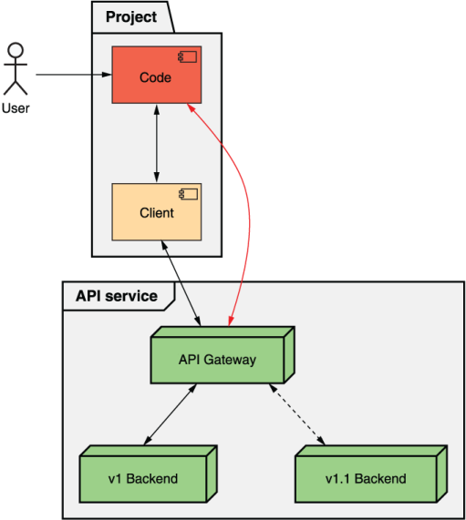
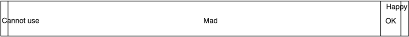
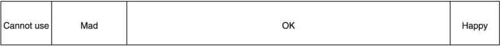

本章涵盖内容

- 什么是版本控制
- 兼容性是什么意思
- 如何定义向后兼容性
- 选择版本控制策略所涉及的权衡
- Web API 的一些流行版本控制策略概述

我们构建的软件很少是静态的。相反，随着新功能的创建和新功能的添加，它往往会随着时间的推移而频繁地变化和发展。这导致了一个问题：我们如何进行这些改进，同时又不会给那些依赖于以前的外观和行为的用户带来严重的不便？在本章中，我们将探讨解决此问题的最常见机制：版本控制。

## 24.1 动机

软件开发不仅很少是静态的，而且很少是一个连续的过程。即使使用持续集成和部署，我们也经常会有一些新功能“上线”并且对用户可见的检查点或启动，这对于 Web API 尤其如此。 API 既严格又公开，这意味着很难安全地进行更改，这加剧了这种需求。这引出了一个明显的问题：我们如何才能对 Web API 进行更改而不会对已经使用该 API 的人造成损害？

“用户将处理它”的默认选项显然是不可接受的。此外，“永远不更改 Web API”的替代方案实际上是不可能的，即使我们从未计划添加新功能。例如，如果存在安全或法律问题（例如，律师通知您有问题的 API 调用在某种程度上违反了法律），则更改将是不可避免的。为了解决这个问题，该模式将探索如何将版本的概念以及适合 Web API 广泛需求的各种不同策略引入 API。

## 24.2 概述

为了确保 API 的现有用户不受后续更改的影响，API 可以引入检查点或 API 版本，为每个不同版本维护单独的部署。这意味着通常可能会给 API 的现有用户带来问题的新更改将部署为新版本，而不是对现有版本的更改。这有效地隐藏了未准备好进行这些更改的用户子集的更改。

不幸的是，这不仅仅是将 Web API 的不同部署标记为单独的版本并调用已解决的问题。我们还必须担心可以实现版本控制的不同级别（例如，客户端库与有线协议）以及从许多可用选项中选择哪种版本控制策略。也许最具挑战性的方面是真的没有正确的答案。取而代之的是，选择如何在 Web API 中实现版本控制将因构建 API 的人员以及在另一端使用它的人员的期望和配置而异。

然而，有一件事保持不变：版本控制的主要目标是为 API 用户提供尽可能多的功能，同时将带来的不便降至最低。牢记这一目标，让我们首先通过检查是否可以将更改视为兼容来探索我们可以做些什么来最大程度地减少不便。

### 24.2.1 什么是兼容性？
兼容性是两个不同组件能否成功相互通信的区别。在 Web API 的情况下，这通常是指客户端和服务器之间的通信。

这个概念可能看起来很基本，但当我们考虑兼容性的时间方面时，它会变得复杂得多。当您启动 Web API 时，任何客户端代码显然都将与 API 兼容，但不幸的是，API 和客户端都不会是静态的或时间冻结的。随着事情的变化，我们开始看到更多的客户端和服务器组合，我们必须考虑这些不同的组合是否能够相互通信，这并不像听起来那么简单。例如，如果您有一个 API 客户端的三个迭代和三个不同的 API 服务器版本可用，您实际上总共需要考虑九个通信路径，但并非所有这些路径都可以正常工作。

由于 API 设计者无法控制 API 用户编写的客户端代码，因此我们必须关注对 API 服务器所做的更改是否与现有客户端代码兼容。换句话说，如果您可以将一个版本换成另一个，并且任何现有的客户端代码都不会注意到差异（或至少不会停止运行），我们会调用两个彼此兼容的 API 服务器版本。

例如，假设 Web API 的用户编写了一些与 API 对话的代码（直接或通过客户端库）。现在让我们假设我们有一个新版本的 Web API 服务（在本例中为 v1.1），如图 24.1 所示。如果在流量从 v1 转移到 v1.1 后客户端代码继续工作，我们会说这两个版本是兼容的。



那么我们为什么要关心兼容性呢？ 如果您还记得本节前面的内容，我们了解到版本控制是一种达到目的的手段：为我们的用户提供最大量的功能，同时尽可能减少不便（理想情况下完全不带来不便）。 我们这样做的一种方法是将新版本与现有版本一起部署，以便用户可以访问新功能，而不会导致任何以前编写的代码被其他人破坏。 这是有效的，因为我们使用新的 API 版本有效地创建了一个全新的世界，但这真的是我们能做到的最好的吗？ 如果有一种更好的方法可以将更多功能交到现有用户手中，而不会造成任何不便呢？

事实证明，我们可以通过将新功能注入现有版本来做得更好，这样 API 本身就足够接近它以前的样子。事实上，修改后的版本会非常接近，以至于客户端甚至可能无法区分添加新功能之前和之后的 API 之间的区别。这意味着，如果我们只对兼容的 API 进行更改，所有现有代码将继续运行，而对我们的更改一无所知。

但是现在这给我们带来了一个非常复杂和错综复杂的问题：我们如何确定给定的更改是否向后兼容？换句话说，我们如何确定更改是否会引人注目或是否会破坏现有的客户端代码？

### 24.2.2 定义向后兼容性

正如我们刚刚看到的，仅对 API 进行向后兼容更改的能力意味着我们拥有神秘的力量，无需做任何工作即可为用户提供新功能。所以现在我们要做的就是决定什么才是向后兼容的变化。通常，这个决定很容易。我们只是问自己一个简单的问题：更改是否会导致现有代码中断？如果是这样，那么它就是破坏性的，或者向后不兼容。

事实证明，这并不是故事的全部，不幸的是，这是 API 设计中没有单一简单答案的场景之一。相反，我们剩下的是许多不同的答案，这些答案都可以说是正确的。此外，正确程度将取决于依赖您的 API 的用户以及他们的期望。换句话说，与本书中的许多其他设计模式不同，这是没有单一清晰和明显的最佳方式来应用该模式的情况之一。

API 设计者在制定什么应该和不应该被认为是向后兼容的策略时，肯定有几个主题应该考虑。换句话说，虽然本节不会提供一个保证正确的答案，但它会提出一些真正应该回答的不同问题。没有任何决定可能是完全正确或错误的；但是，设计人员必须根据 API 用户的期望选择最佳选项。例如，使用 API 的大数据仓库与一组微型 IoT（物联网）设备的期望非常不同，我们稍后会看到。

让我们直接进入并开始研究最值得回答的常见问题。

#### 添加功能
最明显的起点是您是否甚至要考虑将这种增强现有版本的能力作为提供新功能的一种方式。换句话说，你的 API 的用户是否对他们的稳定性要求如此严格，以至于他们希望每个版本都被永远冻结？如果 API 的主要用户是银行，这可能是一个非常合理的期望。他们可能希望明确选择加入任何新版本，以便他们必须实际更改代码以利用任何新功能。这完全没问题。另一方面，如果 API 的用户是一群小型科技初创公司，他们可能更关心获得新功能而不是单个 API 版本的稳定性。

如果您确实决定在现有版本中允许新功能，您可能需要更仔细地考虑新功能对 API 用户的显示方式。例如，新功能可以表示为现有资源上的新字段、全新资源或可以执行的新操作。并且每一种对用户都有不同的影响。

对于现有资源上的新字段，这可能对具有非常严格资源要求的任何用户产生有意义的影响。例如，想象一个可用内存非常有限的 IoT 设备使用的 API。如果将新字段添加到现有资源中，则先前有效的 HTTP GET 请求实际上可能导致设备内存不足和进程崩溃。在检索单个资源时，这似乎有些牵强，但想象一下添加一个可能包含大量信息的字段和列出所有资源的 IoT 设备。不仅每个资源的数据量可能会增加超出预期的界限，而且问题会因响应列出项目而出现的资源数量而被放大。

在添加新资源或新 API 方法的情况下，现有代码不太可能（如果不是不可能的话）知道 API 的这些新方面；然而，这并不意味着我们完全没有任何问题。例如，假设客户端代码从 API 备份所有资源。如果创建了新资源并且现有代码不知道新资源，则备份输出中显然会丢失它。虽然在许多情况下最好避免为这些类型的问题承担责任，但在某些情况下，禁止为此类情况添加新资源可能是合理的。

在新添加的资源引入某种新的依赖或与现有资源或字段的关系的情况下，事情会变得有点棘手。例如，假设一个 API 引入了一个属于 ChatRoom 资源的新 MessagePolicy 子资源（默认情况下包括一个原始策略）。如果我们只能在第一次删除 MessagePolicy 资源后才能删除 ChatRoom 资源，那么我们实际上是在迫使现有用户了解这一新变化，而不是让他们生活在对这一新功能一无所知的状态中，这可能是一个糟糕的选择.

正如我们之前所讨论的，这些当然不是必须遵守的严格规则。相反，这些是任何 API 设计人员在启动新 API 时都应该考虑和决定的潜在场景。归根结底，决定向现有 API 添加新功能是否安全与其说是科学，不如说是艺术，因此至少可以预期的是，就该主题制定了一致且明确的政策。

即使您决定以任何形式添加新功能不是您想要安全地考虑向后兼容的事情，但还有一个更难涵盖的主题：如何处理错误修复。

#### 修复错误

在编写软件时，我们很少在第一次尝试时就把事情做到完美。更常见的是我们犯了一个错误，当他们发现错误时让其他人指出错误，然后我们只需返回并修复错误。但是，正如您现在可能看到的那样，这种变化不就是另一种形式的改进功能吗？如果是这样，我们是否必须在单独的版本中修复我们的错误？或者我们可以安全地将该更改注入现有版本并将其称为向后兼容更改吗？正如您可能猜到的那样，这个问题的答案是，“这要看情况。”

一些错误会非常明显地出现。当客户端发出特定的 API 请求时，服务会出错并返回可怕的 HTTP 500 内部服务器错误响应代码。在这些情况下，修复错误通常是向后兼容的，因为永远不应该有客户端代码假设给定的请求会导致 API 服务器上的内部错误，然后在停止崩溃时失败。

但是更微妙的问题呢？如果特定的 API 请求成功，而本应返回错误（例如，400 Bad Request 错误）却返回无意义的结果，该怎么办？有人开始依赖这种错误但错误的成功行为的可能性要大得多。如果我们“修复错误”，之前返回成功结果的客户端代码将开始看到错误结果。

更进一步，考虑这个错误深埋在一些计算代码中的情况，修复它意味着结果数字会发生变化。有一天，当我们进行像 Add(0.1, 0.2) 这样的 API 调用时，它可能会返回 0.30000000000000004；然后第二天我们用浮点运算修复了这个错误，它开始返回 0.3。这是我们要考虑向后兼容的东西吗？

清单 24.1 带有浮点算术问题的 API 实现示例

```typescript
class AdditionApi {
  Add(a: number, b: number): number {
    return a + b;       // ❶    
  }
}
```

❶ 这只是将两个浮点数相加，导致浮点错误。
清单 24.2 使用定点数学解决浮点问题的示例

```typescript
const Decimal = require('decimal.js');
 
class AdditionApi {
  Add(a: number, b: number): number {
    return Number(Decimal(a).plus(Decimal(b)));   // ❶    
  }
}
```

❶ 通过依赖定点构造，我们避免了浮点错误。但这是向后兼容的变化吗？
不幸的是，再一次，没有正确的答案。一般来说，修复抛出错误的 API 调用对大多数用户来说是非常安全的。让 API 调用突然开始抛出错误可能不是一个好主意，特别是如果 API 的用户非常关心稳定性并且不想让他们的代码在没有明显原因的情况下开始崩溃。对于更微妙的修复，它实际上取决于典型用户的配置文件和错误的影响。例如，如果错误真的只是将两个数字相加，并且有一些非常接近但有一些奇怪的浮点错误的错误，那么修复可能并不那么重要。如果计算用于火箭发射轨迹并且精度至关重要，那么制定修复错误的策略可能是有意义的，即使它会导致结果从一天到下一天发生变化。

这将我们引向了一个类似但不完全相同的值得讨论的问题：强制更改。

#### 处理强制性变更

几乎总是，添加新功能或更改 Web API 的决定是我们自己的。换句话说，事件的典型过程是我们，这个 Web API 的创建者，决定我们想要做出改变并开始将其付诸行动。但有时，我们可能会被别人强加给我们一些工作。例如，当欧盟 (EU) 通过其隐私法（通用数据保护条例；GDPR；https://gdpr-info.eu/）时，需要进行许多新的更改才能为居住在该地区的用户提供服务。欧洲联盟。由于这些要求中的许多都集中在网络上的数据保留和同意上，因此当然有可能需要对 API 进行更改以适应新法规。这引出了一个显而易见的问题：这些更改应该注入到现有版本中，还是应该部署为新的、独立的版本？换句话说，我们是否应该考虑为遵守 GDPR 中规定的规则所做的更改是向后兼容的？

最终，此决定取决于更改的确切内容以及法律的规定，但考虑到谁在使用和依赖 API 本身，更改是否被视为向后兼容仍有待讨论。在 GDPR 的情况下，您可以按照他们的时间表部署具有新更改的新版本，同时将现有的、不合规的 API 保留给所有人使用，直到 GDPR 生效之日。届时，您可能会开始阻止来自在欧盟注册地址的客户（或来自位于欧盟的 IP 地址）的任何请求，要求这些位于欧盟的客户使用新版本的 API符合 GDPR。或者，考虑到违反 GDPR 的潜在风险和罚款，完全关闭不合规的 API 可能更有意义。毋庸置疑，该类别中的安全补丁和其他更改通常是强制要求的，但并非总是由律师强制执行。

虽然在某些情况下根本不可能完全遵守所有法律（例如，有传言说比特币区块链具有在大多数国家/地区都是非法的元数据存储材料，并且区块链是专门构建的，因此您无法更改过去的数据），但几乎始终可以进行更改以符合相关法律。问题实际上是如何最好地进行这些强制更改（通常来自律师或其他主要非技术人员）而不会给 API 用户造成过度的压力。换句话说，当这些类型的更改出现时，几乎不可能将 API 用户与您必须进行的更改隔离开来。问题之一是如何通过在可能的情况下提前通知并最大限度地减少现有用户所需的工作来最大限度地减少对这些用户的影响。

#### 幕后变化
深入研究兔子洞，我们可以开始查看其他细微的变化类型，这些变化可能会或可能不会被认为是向后兼容的。这通常包括更深层次的更改，例如性能优化或其他一般细微的功能更改，这些更改既不是错误修复也不一定是新功能，但仍然是对响应 API 请求的底层系统的修改，并以某种方式导致不同的结果。

一个简单的例子是性能优化（或回归），它使 API 调用比以前更快（或更慢）返回结果。这种类型的更改意味着 API 响应完全相同，但它会在 API 服务器上的不同计算时间后显示。这通常被认为是向后兼容的更改；然而，可以从另一个方向进行论证。

例如，如果 API 调用当前需要大约 100 毫秒才能完成，则很难注意到导致同一调用需要 50 毫秒（如果性能提高）或 150 毫秒（如果性能下降）的更改。另一方面，如果 API 调用突然需要 10 秒（10,000 毫秒）才能完成，这种时间差异足以证明编程范式的改变是合理的。换句话说，对于缓慢的 API 调用，您可能更喜欢使用异步编程风格，以便您的进程可以在等待 API 响应的同时做其他事情。在这种情况下，您可能会认为这是向后不兼容的更改，甚至可能是引入了导致性能如此严重下降的错误。

另一个更深层次变化的例子可能是，如果您依赖机器学习模型在 API 调用中生成一些结果，例如翻译文本、识别图像中的人脸或项目，或标记视频中的场景变化。在此类情况下，更改所使用的机器学习模型可能会导致这些类型的 API 调用产生截然不同的结果。例如，有一天你可能有一张 API 调用说包含一只狗的图片的图像，然后它可能会说它实际上是一个松饼（这比你想象的更常见；尝试搜索“Chihuahua or Muffin”以见一个例子）。

鉴于不同的结果，这种变化可能是对一个 API 用户的改进和对另一个用户的回归。而且，根据 API 用户的个人资料，可能需要机器学习模型的稳定结果。换句话说，一些用户可能真的依赖于提供一致结果的图像，除非他们明确要求进行某种升级。在这种情况下，这种类型的更改实际上可能被认为是向后不兼容的。

#### 改变语义
最后一个要考虑的类别可能是最广泛和最微妙的：一般语义变化。这是指一般行为变化或 API 中各种概念的含义（例如，资源或字段）。

这些类型的变化涵盖了广泛的可能性。例如，这可能是大而明显的事情（例如在 API 中引入新的权限模型导致的行为变化），或者可能是更微妙且难以注意到的事情（例如返回项目的顺序）在数组字段中列出资源或项目时）。正如您可能猜到的那样，没有处理这些类型更改的全面最佳实践策略。相反，我们能做的最好的事情是探索它对现有用户及其代码的影响，考虑这些用户可能如何接受不稳定性，然后决定更改是否具有足够的破坏性以证明将更改注入现有版本或部署一个新的、孤立的。

为了了解这意味着什么，让我们想象一个带有 ChatRoom 和用户资源的示例聊天 API，用户可以在其中创建聊天室中的消息。如果我们决定引入一个消息策略的新概念，该概念确定用户是否能够根据各种因素在聊天室内创建消息，例如用户发送消息的速率（例如，您不能每秒发布一次以上）甚至消息的内容（可能是机器学习算法确定消息是否滥用并阻止它）。引入此资源的更改是否向后兼容？正如您可能猜到的，答案再次是“也许”。

首先，该决定可能取决于现有 ChatRoom 资源的默认语义（例如，现有 ChatRoom 资源是否会自动采用这种新行为？或者这是否仅保留给新创建的 ChatRoom？）。无论如何，我们必须考虑对现有用户的影响。新的消息策略概念是否会导致现有代码中断？这也要看。如果有人有一个试图快速连续发送两条消息的脚本，由于每秒只允许一条消息的限制，该现有代码可能会停止正常运行。

清单 24.3 引入新的语义变化后可能会失败的代码

```typescript
function testMessageSending() {
  const chatRoom = ChatRoom.get(1234);
  chatRoom.sendMessage("Hello!");              // ❶
  chatRoom.sendMessage("How is everyone?");    // ❷
}
```

❶ 这个 sendMessage() 调用会像往常一样成功。
❷ 如果强制执行新的速率限制，则此 sendMessage() 调用可能会失败。
但这种情况如何上演？ 用户是否会在之前获得成功响应时收到错误响应？ 或者消息只是进入队列并在一秒钟后显示？ 这些都不一定是对的，但它们肯定是不同的。 在第一种情况下，用户会立即看到错误，这显然会导致他们认为更改已导致其现有代码中断。 在后者中，错误可能直到上线后才被注意到（例如，如果他们快速发送两条消息，然后验证它们都已收到，则验证步骤将失败，因为消息已延迟整整一秒）。

清单 24.4 更改后可能在不同地方失败的代码

```typescript
function testMessageSending() {
  const chatRoom = ChatRoom.get(1234);
  chatRoom.sendMessage("Hello!");            // ❶    
  chatRoom.sendMessage("How is everyone?");  // ❶    
  const messages = chatRoom.listMessages();
  if (messages.length != 2) {                // ❷
    throw new Error("Test failed!");
  }
}
```

❶ 这两个 sendMessage() 调用会像往常一样成功。
❷ 除非在发送和检查消息结果之间有整整一秒的停顿，否则对正在发布的消息的检查将失败。
正如我们所了解的，最终决定此更改是否向后兼容取决于现有用户的期望。几乎总是会有用户在某个地方拥有能够证明 API 更改正在中断的代码。由您决定用户是否可以合理地期望在特定版本的 API 的生命周期内支持特定的代码位。基于此，您可以确定您的语义更改是否被认为是向后兼容的。

现在我们至少对决定向后兼容性策略时需要考虑的不同问题有了某种了解，我们需要继续研究决定版本控制策略的一些考虑因素。要做到这一点，我们需要了解将进入我们决策的各种权衡。

## 24.3 实现
假设您已经对认为向后兼容的更改做出了一些选择，那么您在决定如何管理版本控制的过程中只走了一半。事实上，您已经完成的唯一情况是，如果您决定绝对所有内容都将向后兼容，因为您永远只需要一个单一版本。但是，在所有其他情况下，我们需要探索和了解在您碰巧需要时如何处理新版本的许多不同选项。换句话说，如果您进行更改，您认为向后不兼容并打算创建一个新版本，那么它究竟是如何工作的？例如，我们应该使用什么作为新版本的名称？理想情况下，有某种模式可以让用户更容易理解。这些版本在被弃用之前应该存活多久？对此的一个可能的答案是永远，但对于其他所有选择，您都需要一个弃用政策来向用户传达他们应该期望旧版本消失并停止工作的时间。

考虑到这些类型的问题，让我们花点时间探索一些流行的版本控制策略。在这些中，我们将根据我们在第 24.2 节中考虑的权衡来解释它们的工作原理、优点和缺点，以及它们如何相互比较。请记住，这些策略可能暗示或暗示了一组用于确定向后兼容性的策略，但它们并不总是规定用于进行此确定的单个策略。换句话说，每个策略在选择是否考虑向后兼容更改的一些策略时都应该具有一定的灵活性。

### 24.3.1 永久稳定
最流行的版本控制策略之一恰好是许多人经常意外使用的策略。比任何人都愿意承认的要多得多，许多 API 在创建时根本没有考虑版本控制方案或策略。只有当需要进行非常大的、可怕的和（最重要的）向后不兼容的更改时，我们才开始考虑版本控制。在这种情况下，我们的下一步是决定今天存在的所有内容都将成为“v1”，而具有新更改的 API 将被称为“v2”。在这一点上，我们通常可能会开始考虑还有什么可以适应 v2。例如，也许我们一直想更改的其他字段可以在 v2 中修复。

这种策略通常被称为永久稳定性，主要是因为每个版本通常永远保持稳定，所有新的潜在向后不兼容的更改都保留给下一个版本。尽管这种策略往往是偶然出现的，但没有什么可以阻止我们有意地使用相同的策略。在这种情况下，它可能如何工作？

我们遵循此策略的一般过程如下：

1. 所有现有功能都标记为“版本 N”（例如，第一个版本是版本 1”）。
2. 任何向后兼容的更改都会直接添加到版本 N 中。
3. 任何可能违反我们的兼容性定义的新功能都作为“版本 N+1”的一部分构建（例如，任何与版本 1 向后不兼容的内容都保存在“版本 2”中）。
4. 一旦我们有足够的功能来开发新版本，我们就会发布 N+1 版本。
5. 或者，在未来的某个时候，我们可能会弃用版本 N，以避免产生额外的维护成本，或者因为似乎没有人再使用该版本。
6. 此时，我们回到第 1 步，循环再次开始。

这个过程在一些场景中效果很好，权衡如图 24.2 所示。首先，如果您不引入许多向后兼容的更改，则大多数更改可以滚动到现有版本中，而不会给用户带来太多麻烦，并且大多数更改会愉快地停留在第 2 步。假设兼容性策略保持合理的高向后兼容的障碍，这可能会导致非常稳定的 API，以换取快速部署大量新功能。


此外，再次假设作为向后兼容更改的合理高标准，该策略倾向于最大化可以基于版本控制策略合理使用 API 的人数。它可能并不完美，但大多数用户很可能在发行版的“好”桶中。

在用户绝对需要极高粒度级别的情况下，此策略不太可能奏效。例如，使用此版本控制策略的作为 API 客户端的物联网设备可能会遇到困难，因为它鼓励将大量更改滚动到现有版本中，而物联网设备通常需要能够将 API 冻结在确切版本以避免一些棘手的边缘情况，例如随着内存溢出。

如果向后兼容性的标准过高（即所有更改都被视为不兼容），您可能最终会遇到版本数量过多（v1、v2、...、v100 等）的世界。显然，对于管理所有这些版本的服务和决定哪个版本适合他们使用的客户来说，这可能变得笨拙。

不管这些问题如何，许多流行的 API 都依赖于这种版本控制机制，并且多年来一直运行良好。例如，许多 Google Cloud Platform API 出于各种原因使用此策略，虽然它肯定不是完美的，但对于许多客户来说它似乎工作得很好。

### 24.3.2 敏捷不稳定性
另一种流行的策略，有时被称为敏捷不稳定性，它依赖于活动版本的滑动窗口，以最大限度地减少 API 设计人员的维护开销，同时仍能及时向客户提供新功能。虽然远非完美，但这种策略对于积极参与的 API 用户来说非常有效，这些用户参与产品开发足以应对以前版本的频繁弃用，以换取提供的新功能。

这种策略的工作原理是通过稳定的生命周期推动每个版本，从诞生（预览）开始，所有功能可能随时更改，一直到死亡（删除），版本本身不再可访问。不同状态的概述如表 24.1 所示，但要了解其工作原理，让我们通过演示 API 中几个版本的示例场景。

表 24.1 不同版本状态概览

| 状态   | 描述                                                         | 更改政策     |
| ------ | ------------------------------------------------------------ | ------------ |
| 预览   | 用户应该期望在下一个当前版本中存在一个不稳定且仍在进行中的功能预览 | 允许所有更改 |
| 当前的 | 一组非常稳定的功能，不应更改，并且可以预期继续运行一段时间   | 仅强制更改   |
| 已弃用 | 根据弃用政策计划即将移除的先前当前版本                       | 仅强制更改   |
| 已删除 | 先前已弃用的版本已被删除或以其他方式使用户无法访问           | N/A          |

刚开始时，API 肯定不够稳定，无法向任何人展示。最重要的是，开发人员希望能够随时自由地更改它。在这种情况下，将所有工作都放到版本 1 中是最简单的。在这种情况下，我们将版本 1 标记为“预览版”，因为它尚未真正为真实用户做好准备。任何接受此阶段没有稳定性保证这一事实的用户都可以自由使用它，但他们应该确定他们理解这里的硬道理：他们今天编写的代码明天可能会被破坏。

一旦版本 1 看起来更加成熟，我们可能希望允许真实用户开始针对此 API 进行构建。在这种情况下，我们将版本 1 提升为“当前”。在此阶段，我们希望确保客户端代码继续工作，因此应该进行的唯一更改是强制性要求（例如，安全补丁）和潜在的关键错误修复。简而言之，通过将版本 1 升级到最新版本，我们将完全冻结它，除非绝对必要，否则不要管它。

不过，显然功能开发不应该简单地停止。那么我们把所有新的努力工作放在哪里呢？简单的答案是，我们希望对版本 1 进行的任何新功能或其他非关键更改都将简单地放入下一个版本：版本 2。而恰巧版本 2 被标记为新的预览版本.正如您所料，版本 2 的规则与我们在预览阶段时对版本 1 的规则相同。

在某个时候，这个循环将重复，版本 2 将变得更加成熟，以至于我们希望将其提升为新的当前版本。当这种情况发生时，我们会遇到一个新问题：我们如何处理现有的当前版本？我们不应该维护两个当前版本，但我们也不想仅仅因为有更新、更闪亮的东西可供用户使用而完全删除一个版本。在此策略中，我们的答案是将此版本标记为“已弃用”。在已弃用状态下，我们将执行与当前版本相同的更改规则；然而，我们为版本最终消失的时间开始计时——毕竟，我们不想维护每个曾经存在的版本直到时间结束！

一旦时钟计时器到期，我们将完全删除有问题的弃用版本，可以将其视为已删除。一个版本从弃用到删除的确切时间取决于 API 用户的期望；然而，最重要的是提前声明一些特定的时间，与 API 的用户共享，并遵守时间表。此时间表的摘要显示在表 24.2 中，其中包含每月发布节奏（和两个月的弃用政策）。

表 24.2 版本及其状态的示例时间线

| Date | Version 1 | Version 2 | Version 3 | Version 4 | Version 5 |
| ---- | --------- | --------- | --------- | --------- | --------- |
| 一月 | 预览      |           |           |           |           |
| 二月 | 当前的    | 预览      |           |           |           |
| 三月 | 已弃用    | 当前的    | 预览      |           |           |
| 四月 | 已弃用    | 已弃用    | 当前的    | 预览      |           |
| 五月 | 已删除    | 已弃用    | 已弃用    | 当前的    | 预览      |

这个策略有很多有趣的地方，图 24.3 总结了不同的权衡。 首先，请注意，虽然可能有许多不同的弃用（和删除）版本，但只有一个当前版本和一个预览版本。 这是该策略的一个关键部分，因为它充当了一个强制功能，以实现持续改进，同时将活动版本的数量保持在绝对最低限度。 换句话说，这种策略倾向于将新版本视为对现有版本的改进，而不是恰好同样好的替代视图。 通过弃用版本以便为最新最好的新版本让路，我们确保新功能不会花太长时间呈现在 API 用户面前。


此外，请注意，快速循环版本的这种好处也可能是一个缺点：针对当前版本编写的任何代码实际上都可以保证最终停止工作。至少，绝对不能保证它会继续运行，所以如果它确实如此，那可能纯属巧合。这意味着任何希望能够编写代码然后在几年内忘记它的用户可能会发现这种版本控制策略完全无法使用。另一方面，考虑到他们对软件开发的态度，任何积极更新和更改代码并对新功能非常欣赏的人都会发现这种策略非常受欢迎。

总体而言，当用户活跃并参与开发并且需要小的稳定性窗口，然后快速升级到具有新功能的新版本时，此策略可以很好地工作。任何需要长期稳定性以换取随着时间的推移对新功能的访问较少的用户几乎肯定会发现该模型很难使用。虽然有可能巧合地让代码继续工作，但对于那些更愿意更有力地承诺他们的代码将继续按预期运行而不是固定的、相对较短的时间的人来说，缺乏保证可能会非常令人反感。时间窗口。

### 24.3.3 语义版本控制
可能是当今最流行的版本控制形式，语义版本控制（或 SemVer；https://semver.org）是一个非常强大的工具，它允许单个版本标签以三个简单的数字传达相当多的含义。最重要的是，这个含义很实用：它可以告诉用户两个 API 之间的差异，以及针对一个 API 编写的代码是否应该继续与另一个 API 一起使用。让我们花点时间看看这到底是如何工作的。

语义版本字符串（如图 24.4 所示）由三个由点分隔的数字组成（例如，1.0.0 或 12.5.2），其中每个数字随着 API 的更改而增加，并且对更改具有不同的含义这样做是为了带来这种增长。版本字符串的第一个数字称为主要版本，在根据定义的兼容性策略（我们在第 24.2.2 节中探讨）认为更改向后不兼容的情况下，会增加。例如，更改字段名称几乎总是被认为是向后不兼容的更改，因此如果我们要重命名字段，版本字符串将增加主要版本（例如，从 1.0.0 到 2.0.0）。换句话说，您可以假设为主要版本 N 编写的任何代码几乎肯定不会像主要版本 M 预期的那样运行。设计保证。


语义版本字符串中的下一个数字是次要版本。当根据兼容性策略中定义的规则（即某些新功能或行为更改）进行向后兼容更改时，此数字会增加。例如，如果我们要向 API 添加一个新字段，并且我们在我们的策略中将此操作定义为向后兼容，那么我们将增加次要版本而不是主要版本（例如，从 1.0.0 到 1.1 .0）。这很强大，因为它允许您假设为特定次要版本编写的任何代码在针对未来次要版本时都保证不会被破坏，因为每个后续次要版本仅进行向后兼容的更改（例如，为版本 1.0 编写的代码.0 在同时运行 1.1.0 和 1.2.0 时不会崩溃）。虽然此旧代码将无法利用较新的次要版本中提供的新功能，但在针对任何较新的次要版本运行时，它仍将按预期运行。

语义版本字符串中的第三个也是最后一个数字是补丁版本。当进行向后兼容且主要是错误修复而不是添加新功能或更改行为的更改时，此数字会增加。理想情况下，此数字不应传达有关兼容性的明显含义。换句话说，如果两个版本之间的唯一区别是补丁版本，那么针对一个编写的代码应该可以与另一个一起使用。

语义版本控制与 Web API 一起使用时，只需在出现新更改时遵循这些规则即可。进行向后不兼容的更改？该更改应作为下一个主要版本发布。向 API 添加一些向后兼容的功能？保持相同的主要版本但增加次要版本。应用向后兼容的错误修复？保持相同的主要和次要版本，并使用递增的补丁版本发布补丁代码。正如我们在 24.2.2 节中探讨的那样，您的兼容性策略将指导您决定您的更改属于哪个类别；所以只要你遵循它，语义版本控制就可以很好地工作。

但是，语义版本控制的一个主要问题是用户可用的版本数量（并作为单独的服务进行管理）。换句话说，语义版本控制提供了大量可供选择的版本，每个版本都有不同的功能集，以至于用户最终可能会感到非常困惑。

此外，由于用户希望能够尽可能长时间地固定到特定的、非常精细的版本，这意味着 Web API 必须实际维护和运行许多不同版本的 API，这可能会成为基础架构方面的难题。幸运的是，由于版本在向用户提供后几乎完全冻结，我们通常可以冻结并继续运行二进制文件，但开销仍然非常令人生畏。也就是说，现代基础架构编排和管理系统（例如 Kubernetes；https://kubernetes.io/）和现代开发范式（例如微服务）可以帮助减轻这个问题带来的大部分痛苦，因此依靠这些工具可以提供很多帮助。

也就是说，不一定要求版本永远存在。相反，定义弃用策略并说明从版本可用时起预计将维护和继续运行多长时间并没有错。一旦该时钟用完，该版本就会从服务中删除并消失。

撇开这个弃用政策不谈，依赖语义版本控制的最好的事情之一是稳定性和新功能之间的平衡，有效地为我们提供了两全其美的优势。从某种意义上说，用户可以固定到特定版本（一直到修复了哪个错误），同时在需要时可以访问新功能。有一个明显的问题是选择特定功能可能很困难（例如，有人可能想要使用 1.0.0 版，但可以访问 2.4.0 版中添加的某些特殊功能），但这只是一个问题使用任何基于时间顺序的版本控制策略。

最后，这个策略还在让每个人都满意和让不少人开心之间找到了平衡（总结在图 24.5 中）。简而言之，因为有这么多的选择，并且假设有一个合理的弃用政策，大多数用例，从想要快速探索新功能的小型初创公司到想要稳定性的大型企业客户，都能够得到他们想要的东西。想要退出这个版本控制方案。最重要的是，这不会以让用户感到沮丧的策略为代价。可用的版本选项数量可能有点多，但总的来说，这个策略允许用户从 API 中获得他们想要的东西，假设它已经构建并放入特定版本。


请记住，这些只是一些流行的 Web API 版本控制策略，并不是一个详尽的列表。正如您所看到的，每个都有自己的优点和缺点，因此不能保证任何一个都适合所有特定场景。因此，重要的是要了解所有可用的不同选项，并考虑到您的独特用户集的约束、要求和偏好，仔细考虑哪个选项可能是您的 Web API 的最佳选择。

## 24.4 权衡
正如我们所见，定义什么类型的更改应该被认为是向后兼容的策略是很复杂的。但更重要的是，我们在这些主题上所做的选择几乎肯定是我们在光谱的两个不同端之间取得平衡的方式。虽然在这些主题上通常永远不会有完美的选择，但我们至少可以做的是了解我们正在做出的权衡，并确保这些选择是有意识和有意识地做出的。让我们花点时间了解在为每种独特情况决定兼容性策略时应该考虑的各种频谱。

### 24.4.1 粒度与简单性
我们的许多选择所依赖的第一个非常广泛的范围是选择之一。在“选择的悖论”（Harper Perennial，2004 年）一书中，巴里·施瓦茨讨论了消费品的更多选择并不总是能让买家更快乐。相反，大量的选择实际上会导致焦虑程度的增加。在设计 API 时，我们并不是真的在购物中心购买产品；然而，这个论点可能仍然有一定的分量，值得一看。在选择版本控制策略时，这种权衡必须在大量粒度和选择与更简单的、一刀切的单一选项之间取得平衡。

要了解这是如何工作的，请考虑这样一种情况：我们认为客户非常关心稳定性，以至于任何更改都应被视为向后不兼容。结果是每一个更改都将部署为一个全新的版本，API 的用户将能够为他们的应用程序从潜在的大量版本中进行选择。确实如此广泛的潜在版本集合确实确保了给定的用户可以选择一个非常具体的版本并坚持使用它，但它提出了一个问题，即该用户是否会被大量可用的选项所淹没或困惑。

此外，以这种方式运行的版本控制方案也很可能会遵循时间流，从而导致随着时间的推移而发生稳定的变化。这意味着用户无法选择 API 的特定方面，而只能获得某种时间机器，他们可以在其中选择代表 API 如何看待特定历史点的特定版本。如果该用户想要两年前的某些行为以及今天的某些功能，他们通常也将被迫接受这两点之间的所有行为变化。简而言之，固定到某个版本的成本是它必须包括在该特定版本发布之前所做的所有更改。

现在考虑范围的另一端：无论对 API 的现有用户产生什么影响，每次更改始终被认为是向后兼容的。在这种情况下，生成的 API 将只有一个版本，永远永远，这意味着用户根本没有选择。虽然没有人会争辩说这种选择并没有提供足够的选择，但它可能过于简单化了。换句话说，一个选择显然是最容易理解的事情，但考虑到 API 的典型受众，尤其是那些有特定稳定性要求的受众，这很少是一个实用的选择。

显然没有正确的答案，但最好的答案几乎肯定介于这两个极端之间。这可能意味着为哪些更改向后兼容找到一组策略，以便它们产生合理数量的版本（这里的合理定义肯定会有所不同），或者可能意味着找到一个弃用策略，您可以在某些时候删除旧版本时间点。无论哪种方式，权衡都将取决于用户以及他们对选择的兴趣有多大（以及您对管理所有这些不同版本的兴趣有多大）。

### 24.4.2 稳定性与新功能
下一个值得讨论的权衡可能是最明显的：API 用户真正需要多少新功能？换句话说，如果您只是对 API 进行较少的更改，那么您甚至没有机会决定更改是否向后兼容。这种权衡实际上更多是关于完全短路兼容性策略，代价是 API 用户对新功能、错误修复或行为更改的访问较少。

从这个角度来看，在这个范围的一端，我们拥有完美的稳定性：永远不要做任何改变，永远。这种情况意味着一旦 API 启动并可供用户使用，它将永远不会再发生变化。虽然这听起来很容易（毕竟，不管它有多难？）但实际上比这复杂得多。为了真正保持完全稳定，您还需要确保您从未为为您的 API 提供支持的服务器应用任何安全补丁或升级底层操作系统，并且您的任何供应商也是如此。如果这些事情中的任何一个发生变化，一些微妙的东西很容易进入用户的视野，从技术上讲，导致改变。这意味着你需要决定这是否值得一个新版本。

另一方面，您可能会认为任何和所有功能对于启动都至关重要。所有错误对于修复都至关重要。操作系统和库升级、安全补丁和其他底层更改应尽快推送给 API 用户。在这种情况下，定义向后兼容性时所做的选择将一如既往地重要。

像往常一样，对于您应该落在这个范围内的哪个位置，没有最佳选择；但是，如果 API 没有选择最适合用户的频谱位置（而只是在运行中进行调整），则更容易激怒和挫败用户。而且，与往常一样，最佳选择几乎肯定介于两者之间。对于不太随和的用户（例如，大型政府组织），对新功能的渴望可能不如稳定性那么重要。如果典型用户是初创公司，情况可能正好相反。但重要的是要确定那些将使用 API 的人的期望，并决定这个频谱上的哪个地方最适合这些用户。

### 24.4.3 幸福与无处不在
最后，可能也是最重要的，权衡与 API 的各个用户如何接收您的策略有关。到目前为止，我们已经将用户视为一个群体，他们对您的政策感到满意或不满意，您的政策可能会被视为向后兼容。不幸的是，所有用户之间的这种类型的同质性相对较少。换句话说，您的政策不太可能受到每个客户的欢迎，原因很简单，即用户彼此不同，并且对我们决定的主题有不同的看法。虽然一些 API 可能偏向于同质的用户群体（例如，为中央银行或市政府构建的一组 API 可能都希望稳定性远远超过新功能），但许多 API 吸引了不同的用户群体，我们不能再假设所有用户都落入同一个桶中。我们做什么？

正如您可能猜到的那样，这是另一个权衡。要理解这一点，我们需要将 API 用户视为对我们的政策具有不同满意度的四个群体之一。范围从那些在特定情况下拒绝使用 API 的人（不能使用），到那些可以使用它但对它一点都不满意（疯狂）的人，再到那些对政策很好但也不兴奋的人（好吧），最后是对政策完全满意的人（高兴）。虽然通常大多数用户都应该接受，但某些策略可能会疏远一大群潜在用户。例如，如果一个 API 有一个考虑所有更改向后兼容的策略，那么该策略可能会疏远很多人，并迫使他们寻找其他地方来满足他们的 API 需求（例如，无法使用存储桶中的许多用户）。鉴于这种分布，让我们看看我们正在考虑的权衡。

一方面，我们为用户提供了最大的快乐，我们的决定旨在通过我们的向后兼容性政策，最大限度地增加快乐桶中的用户数量。虽然我们当然不能让所有用户都满意，但我们可以随时尝试。但是，请记住，这意味着我们在选择策略时不考虑其他存储桶。这会导致如图 24.6 所示的情况，我们可能会最大化满意用户的数量，但由于我们没有考虑其他桶，最终导致相当多的用户落入了无法使用的桶中。


另一方面是所有用户的最大可用性，我们的决定试图最大限度地增加绝对可以使用 API 的用户数量。换句话说，频谱的这一端旨在最小化不能使用桶中的用户数量，因此显然遇到了类似的问题：它不考虑其他用户在哪个桶中，只要他们不在在不能使用的桶中。在图 24.7 中，我们可以看到按这些桶分类的用户的潜在分布，其中我们肯定有最少数量的人在不能使用的桶中。然而，很明显，这不太可能是一个好情况，因为绝大多数用户虽然能够使用 API，但对它并不满意，并陷入了疯狂的困境。



与往常一样，最佳选择可能位于此范围的中间位置，并且显然取决于这些用户的个人资料。这可能会尝试在最大限度地提高幸福感与最大限度地减少那些根本无法完全使用 API 的人之间取得平衡。理想情况下，它还可以最大限度地减少疯狂用户，并寻找一种解决方案，最大限度地增加好或快乐桶中的用户数量。这可能会导致如图 24.8 所示的用户分配桶。我们可以确定的一件事是，通常不可能找到一项让所有人一直开心的政策。我们能做的下一个最好的事情是弄清楚我们是否会以一种解决方案为目标，通过最大限度地减少那些不能完全使用 API 的人或优先考虑最幸福的人，来优先考虑无处不在的 API 访问。



## 24.5 练习
1. 更改字段的默认值是否被认为是向后兼容的？
2. 想象一下，您有一个面向金融服务的 API，一家大型商业银行是该 API 的重要客户。您的许多小客户希望更频繁地更新和新功能，而这家大型银行则希望稳定性高于一切。你能做些什么来平衡这些需求？
3. 在启动 API 之后，您会注意到字段名称中有一个愚蠢且令人尴尬的拼写错误：port_number 被意外地称为 porn_number。你真的想快速改变这一点。在决定是否在不更改版本号的情况下进行此更改之前，您应该考虑什么？
4. 想象一个场景，当您的 API 缺少必填字段时，意外返回空响应（HTTP 中的 200 OK）而不是错误响应（400 Bad Request），表明缺少必填字段。在同一版本中修复此错误是否安全，还是应该在未来版本中解决？如果是未来版本，根据语义版本控制 (semver.org)，这会被视为主要、次要或补丁更改吗？

## 总结

- 版本控制是一种工具，它允许 API 设计人员随着时间的推移更改和发展他们的 API，同时尽可能减少损害并为用户提供尽可能多的改进。
- 兼容性是指针对某个 API 版本编写的代码将继续针对另一个版本运行的属性。
- 如果为先前版本编写的代码继续按预期运行，则新版本被认为是向后兼容的。留给解释的问题是 API 设计者如何定义用户期望。
- 通常看起来无害的事情（例如，修复错误）可能会导致向后不兼容的更改。更改是否向后兼容的定义取决于 API 用户。
- 有几种不同的流行版本控制策略，每种策略都有自己的优点和缺点。大多数都归结为在粒度、简单性、稳定性、新功能、个人用户满意度和普遍可用性之间的权衡。