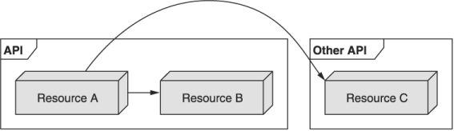
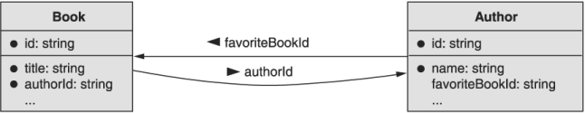

本章涵盖内容

- 引用其他资源时应使用哪些名称字段
- 引用字段应如何处理引用完整性问题
- 何时以及为什么字段应该存储资源数据的副本

在具有多种资源类型的任何 API 中，很可能需要资源相互指向。虽然这种引用资源的方式可能看起来微不足道，但许多行为细节仍待解释，这意味着存在不一致的可能性。这种模式旨在阐明这些引用应该如何定义，更重要的是，它们应该如何表现。

## 13.1 动机

资源很少存在于真空中。因此，必须有一种方法可以让资源相互引用。这些引用的范围从本地（例如，同一 API 中的其他资源）到全局（例如，位于更广泛互联网上其他地方的资源），也可能介于两者之间（例如，同一 API 中的不同 API 中的资源）。提供者）（图 13.1）。



虽然通过唯一标识符简单地引用这些资源似乎很明显，但行为方面主要由实施者决定。因此，我们需要定义一组用于引用资源和支持这些引用的行为模式的指南。例如，您是否应该被允许删除被指向的内容，还是应该被禁止？如果允许，考虑到它指向的资源已经消失，是否应该对该值进行任何后处理（例如将其重置为零值）？还是应该不理会无效指针？

简而言之，虽然引用资源背后的总体思路非常简单，但细节可能相当复杂。

## 13.2 概述

正如您所料，交叉引用模式依赖于一个资源上指向另一个资源的引用属性，使用字段名称来暗示资源类型。该引用使用一个唯一标识符表示为字符串值（参见第 6 章），因为它可以引用同一 API 中的资源、同一提供商的不同 API 或作为标准 URI 位于互联网其他地方的完全独立的资源。

此外，此引用与其指向的资源完全分离。这允许在操作资源时提供最大的灵活性，防止循环引用将资源锁定为存在，并在单个资源被数千个其他资源引用的情况下进行扩展。然而，这也意味着消费者必须预料到指针可能已经过时并且在所引用的基础资源已被移动或删除的情况下可能无效。

## 13.3 实施

这种模式有几个重要方面。 在本节中，我们将更详细地探讨关于一个资源应如何引用另一个资源必须回答的各种问题。 让我们从查看示例引用开始，以及我们应该如何命名该字段以引用另一个资源。

### 13.3.1 引用字段名称

虽然使用的唯一标识符可能传达所引用资源的类型和用途，但使用字段名称来传达这两个方面是一个更安全的选择。 例如，如果我们有一个引用 Author 资源的 Book 资源，我们应该将存储引用的字段命名为 authorId 以传达它是 Author 资源的唯一标识符。

清单 13.1 Author 和 Book 资源的定义

```typescript
interface Book {
  id: string;
  authorId: string;   //  ❶
  title: string;
  // ...              // ❷
}
 
interface Author {
  id: string;         // ❸
  name: string;
}
```

❶ 我们使用保存作者唯一标识符的字符串字段存储对作者资源的引用。
❷ 为简洁起见，我们将省略额外的字段。
❸ 作者资源的唯一标识符。 这是出现在 authorId 字段中的值。
大多数时候，我们将引用的资源是静态类型，这意味着我们可能指向不同的作者资源，但所讨论的资源的类型将始终是作者。 但是，在某些情况下，我们指向的资源类型可能因情况而异，我们将其称为动态资源类型引用。

例如，我们可能想要存储作者和书籍的更改历史记录。 这意味着我们不仅需要能够指向许多不同的资源，还需要能够指向许多不同的资源类型。 为此，我们应该依赖一个额外的 type 字段，该字段指定所讨论的目标资源的类型。

清单 13.2 具有动态资源类型的示例 ChangeLogEntry 资源

```typescript
interface ChangeLogEntry {
  id: string;
  targetId: string;       // ❶
  targetType: string;     // ❷
  // ...                  // ❸
}
```

❶ 目标资源的唯一标识符（例如，作者 ID）
❷ 目标资源的类型（例如，api.mycompany.com/Author）
❸ 在这里，我们将存储有关目标资源的此特定更改的更多详细信息。
现在我们已经了解了如何定义引用字段，让我们更深入地研究行为的一个重要方面，称为数据完整性。

### 13.3.2 数据完整性

由于我们使用简单的字符串值从一个资源指向另一个资源，我们不得不担心这种数据类型提供的自由度：没有类型级别的验证。 例如，想象以下具有一些书籍和作者资源的事件顺序。

清单 13.3 删除一本书引用的作者

```typescript
author = CreateAuthor({ name: "Michelle Obama" });
book = CreateBook({                 // ❶
  title: "Becoming",
  authorId: author.id
});
DeleteAuthor({ id: author.id });    // ❷
```

❶ 在这里，我们创建了一个作者，然后创建了一本引用该作者的书。
❷ 之后，我们从 API 中删除 Author 资源。
此时，我们有了所谓的悬空指针（有时称为孤立记录），其中书籍资源指向不再存在的作者。 在这种情况下应该发生什么？ 有几个选项：

1. 我们可以禁止删除作者并抛出错误。
2. 我们可以允许删除作者，但将 authorId 字段设置为零值
3. 我们可以允许删除作者并在运行时处理坏指针。

如果我们选择禁止删除作者（或者，就此而言，任何在系统中仍有已注册书籍的作者），我们将面临给 API 消费者带来严重不便的风险，他们可能需要删除数百或数千本书 删除单个作者。 此外，如果我们有两个相互指向的资源，我们将永远无法删除它们中的任何一个。 例如，考虑如果每个作者资源都有一个额外的字段来表示他们最喜欢的书，并且（自私的）作者有自己的书作为最喜欢的书，如图 13.2 所示。 在这种情况下，我们永远无法删除这本书，因为作者将其列为收藏。 我们也永远无法删除作者，因为仍有指向该作者的书籍。



如果我们选择通过将作者指针重置为零值来允许删除，我们就避免了这个循环引用问题；然而，由于一次调用，我们可能不得不更新潜在的大量资源。例如，想象一位特别多产的作家，他写了数百甚至数千本书。在这种情况下，删除单个作者资源实际上会涉及更新数千条记录。这不仅可能需要一段时间，而且可能是系统无法以原子方式完成的事情。如果它不能以原子方式完成，那么当重点是避免任何无效引用时，我们就会冒着留下悬空指针的风险。

这些问题给我们留下了第三种选择：简单地让 API 使用者预期引用字段可能无效或指向可能已被删除的资源。虽然这可能不方便，但它为具有明确和简单期望的消费者提供了最一致的行为：应该检查引用。它也不违反标准方法强加的任何约束，例如删除是原子的并且不包含任何副作用。

既然我们已经探讨了在基础数据发生变化时引用应该如何表现，让我们看一下关于引用与缓存值的常见问题。

### 13.3.3 价值与参考

到目前为止，我们假设应该使用字符串标识符引用来引用 API 中的其他资源，但这显然不是唯一的选择。相反，在考虑如何引用 API 其他地方的事物时，首要问题之一是是存储指向其他资源的简单指针还是资源本身的缓存副本。在许多编程语言中，这是按引用传递或按值传递之间的区别，前者传递指向内存中某些内容的指针，后者传递相关数据的副本。

这里的区别因素是，通过依赖参考，我们始终可以确保我们手头的数据是最新的。另一方面，每当副本进入图片时，我们必须关心我们手头的数据自上次检索以来是否发生了变化。另一方面，存储对资源的引用仅意味着使用 API 的任何人都必须发出第二个请求以检索该位置的数据。当我们将这与在我们面前拥有一份数据副本进行比较时，仅凭便利似乎就很诱人。例如，为了检索一本书的给定作者的姓名，我们需要执行两个单独的 API 调用。

清单 13.4 使用两个 API 调用检索一本书作者的姓名

```typescript
book = GetBook({                                      // ❶
  "id: "books/1234"
});
authorName = GetAuthor({ id: book.authorId }).name;   // ❷
```

❶ 在这里，我们通过（随机）唯一标识符检索一本书。
❷ 要查看作者姓名，我们需要单独调用 API。
这两个调用虽然简单，但仍然是我们在检索书籍时在响应中返回完整作者资源的替代设计中所需数量的两倍。

清单 13.5 重新定义 Book 和 Author 资源以使用值

```typescript
interface Book {
  id: string;
  title: string;
  author: Author;      // ❶
}
 
interface Author {
  id: string;
  name: string;
}
```

❶ 这里我们存储了整个 Author 资源值，而不是对作者的引用。
虽然我们现在无需第二次调用 API 即可立即访问本书的作者信息，但我们必须决定如何在服务器端填充该数据。我们可以在每次 GetBook 请求时（例如，使用 SQL JOIN 语句）从我们的数据库中检索作者信息和书籍信息，或者我们可以在书籍资源中存储作者信息的缓存副本。前者会给数据库带来更多负载，但会保证所有信息在请求时都是最新的，而后者会避免这个问题，但会引入数据一致性问题，我们现在必须想出一个策略来保持作者的这个缓存信息新鲜和最新。

此外，我们现在需要处理这样一个事实，即每次 Author 资源增加时 GetBook 响应的大小都会增加。如果我们对一本书的其他方面采用这种策略（例如，如果我们开始存储有关给定图书出版商的信息），那么大小可能会继续增长，甚至可能会失控。

最后，当消费者需要修改 Book 资源时，这种类型的模式可能会导致混淆。他们可以通过更新 Book 资源本身来更新作者姓名吗？他们如何更新作者？

清单 13.6 带注释的示例代码片段

```typescript
author = CreateAuthor({ name: "Michelle Robinson" });
book = CreateBook({                                    // ❶
  title: "Becoming",
  author: { id: author.id }
});
UpdateBook({                                           // ❷
  id: book.id,
  author: { name: "Michelle Obama" }
});
```

❶ 创建一本书需要一些不寻常的语法，我们只设置作者的 ID 字段，并允许自动填充其余字段。
❷ 这是否有效？ 我们可以通过更新书来更新作者姓名吗？
由于所有这些潜在的问题和棘手的问题，通常最好单独使用引用，然后依靠 GraphQL 之类的东西将这些不同的引用拼接在一起。 这允许 API 使用者运行单个查询并获取他们想要的关于给定资源和该资源引用的信息的所有（准确地说是所有）信息，避免膨胀并消除缓存任何信息的需要。

### 13.3.4 API 最终定义

我们可以看到最后一组接口，这些接口说明了如何正确地将资源从一个资源引用到另一个资源。

清单 13.7 最终 API 定义

```typescript
interface Book {
  id: string;
  authorId: string;
  title: string;
}
 
interface Author {
  id: string;
  name: string;
}
 
interface ChangeLogEntry {
  id: string;
  targetId: string;
  targetType: string;
  description: string;
}
```

## 3.4 权衡
如前所述，我们依赖引用所遭受的主要权衡是要求我们要么进行多次 API 调用以获取相关信息，要么使用 GraphQL 之类的东西来检索我们感兴趣的所有信息。


## 11.5 练习

1. 什么时候存储外部资源数据的副本而不是引用有意义？
2. 为什么在 API 系统中维护参照完整性是站不住脚的？
3. API 声称可确保引用在整个 API 中保持最新。后来，随着系统的发展，他们决定放弃这条规则。为什么这是一件危险的事情？

## 总结

- 存储引用的字段通常应该是字符串字段（即，无论标识符是什么类型），并应以“ID”后缀结尾（例如，authorId）。显然，持有外部资源数据副本的字段应该省略这个后缀。
- 通常不应期望在资源的生命周期内维护引用。如果其他资源被删除，引用可能会变得无效。
- 资源数据可以内嵌存储在引用资源中。随着被引用的数据随着时间的推移而变化，此资源数据可能会变得陈旧。