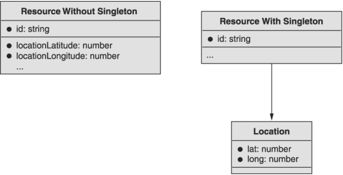
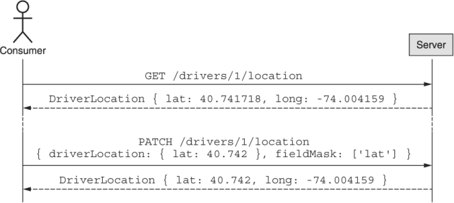
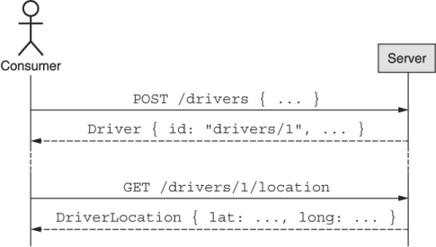
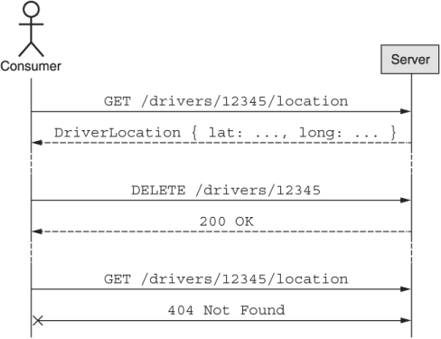
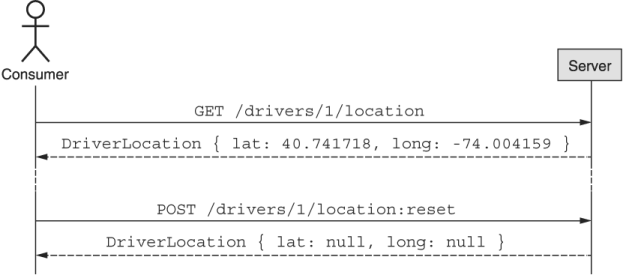

本章涵盖内容

- 什么是单例子资源
- 为什么以及何时我们应该将数据拆分为一个单独的子资源
- 标准方法如何与子资源交互
- 单例子资源在资源层次结构中的位置

在这个模式中，我们将探索一种构建相关但独立的数据的方法，方法是将数据从资源的一组属性移动到该资源的单例子资源。 此模式可处理特定数据集合可能独立于父项而更改、具有不同安全要求或可能太大而无法直接作为资源的一部分存储的情况。

## 12.1 动机
在构建 API 时，我们有时会遇到这样的情况：资源的组件显然属于资源的属性，但由于某种原因，该组件作为常规属性并不实用。换句话说，根据 API 设计最佳实践，组件绝对最适合作为属性，但在这种情况下遵循这些最佳实践是不切实际的，最终会给使用 API 的人带来更糟糕的体验。例如，如果存在代表共享文档的资源，它可能还需要存储访问控制列表 (ACL)，以确定谁可以访问该文档以及以何种身份访问该文档。正如您可能想象的那样，这个 ACL 列表可能会变得非常大（数百甚至数千个访问规则），并且每次我们浏览文档列表（例如，使用 ListDocuments 方法）时检索整个 ACL 通常是一种浪费带宽和计算资源。此外，在大多数场景中，ACL 的细节甚至不是我们感兴趣的。我们只在非常特定的场景中关心 ACL。

显而易见的答案是像这样分离组件，但这将我们引向两个不可避免的问题。首先，我们如何确定某物是否值得以某种方式拆分？其次，一旦我们决定应该从主要资源中分离某些东西，我们如何实现这种分离？

让我们从关注第一个问题开始，并探讨一些可能的原因，我们可能希望将组件从其父资源移到单独的子资源中。之后，我们可以深入研究如何使用单例子资源模式来实现这种分离。

### 12.1.1 为什么要使用单例子资源？

将组件与通常拥有该组件的资源分开的潜在原因有很多。其中一些原因是显而易见的（例如，组件比资源本身大几倍），但其他原因则更加微妙。让我们探讨将组件与其父资源分离的一些常见原因。

#### 规模或复杂性

与资源本身相比，单个组件通常会变得特别大。如果一个组件可能变得比资源的所有其他部分的总和还要大，则将该组件与资源分开可能是有意义的。例如，如果您有一个 API 来存储大型二进制对象（如 Amazon 的 S3），那么将二进制数据本身与有关对象的元数据一起存储是不寻常的。在这种情况下，您可以将两者分开：GetObject 或 GetObjectMetadata 可能会返回有关存储在数据库中的对象的元数据，但明确不包括二进制数据本身。这将改为使用完全不同的 RPC 单独检索，例如 GetObjectData。

#### 安全
通常，资源的某些部分与它们名义上属于的资源具有非常不同的访问限制。在这种情况下，实际上最终可能会严格要求将此信息与其所属的资源完全分开。例如，您可能有一个表示公司员工数据的 API，但与员工的昵称、家乡和电话号码等更常见的信息相比，附加到每个员工的薪酬信息可能受到更严格的限制。因此，将这些信息作为完全独立的资源或使用此处描述的单例子资源模式进行分离可能是最有意义的。

#### 异常处理
除了大小和安全问题外，通常还存在资源的特定组件具有异常访问模式的情况。特别是，如果某个组件比资源上的其他组件更新得更频繁，将它们放在一起可能会导致大量写入争用，最终可能导致写入冲突，或者在极端情况下导致数据丢失.例如，让我们想象一个拼车 API，其中有一个 Driver 资源。当司机的车在移动时，我们希望尽可能频繁地更新资源的位置信息，以显示最新的位置和司机的移动。另一方面，更通用的元数据（例如车牌）可能不会经常更改，甚至可能根本不会更改。因此，将频繁变化的位置信息与其他元数据分开是有意义的，这样更新就可以独立完成。

显然，这并不是一个详尽的列表，因为将组件与资源分开的原因有很多，但这些类别是一些最常见的场景。现在我们已经了解了一些可能将事物分开的一般原因，让我们更详细地了解如何使用单例子资源模式在 API 中对这种分离进行建模。

## 12.2 概述
由于我们的目标是将资源的一个组件从一个简单的属性移动到某种单独的实体，我们可以采用的一种策略是设计一个接口，使得所讨论的组件是成熟资源和 资源的简单属性。 从本质上讲，我们可以创建具有完整资源和其他简单资源属性的一些特征和行为的东西。

为此，我们需要定义一个单例子资源的概念，它具有一些独特的属性和交互方法（图 12.1）。 这个单独的子资源将充当简单属性和完整资源之间的各种混合，这意味着我们将对我们对资源的期望施加一些限制，并添加一些能力来增强我们对资源的期望 特性。



现在我们了解了这种模式如何工作的高级思想，让我们看一些关于这些单例子资源应该如何表现的更多细节。

12.3 实施
一旦我们决定将某些东西从一个简单的资源属性拆分为一个单独的单例子资源，我们就需要确切地弄清楚与这些子资源交互的界面是什么样的。 正如你在表 12.1 中看到的，如果我们通过查看我们之前学到的标准方法集来考虑与单例子资源的交互，很明显某些方法采用常规资源的行为，而其他方法则采用该行为 一个简单的资源属性。

表 12.1 单例子资源的汇总行为

|     标准方法      | 就像一个 . . . |
| :---------------: | :------------: |
|  Get<Singleton>   |   单独的资源   |
| Update<Singleton> |   单独的资源   |
| Create<Singleton> |      财产      |
| Delete<Singleton> |      财产      |
| List<Singletons>  |     不适用     |

### 12.3.1 标准方法
获取和更新
正如我们在表 12.1 中看到的，检索 (get) 和修改 (update) 标准方法的行为就像它们在任何其他资源上一样。 这意味着单例子资源可以像常规资源一样使用标识符进行唯一寻址，并且可以使用部分替换属性（例如，通过 PATCH HTTP 动词）以传统方式进行修改。 为完全清楚起见，以下序列图（见图 12.2）显示了我们如何检索和修改单例子资源。



最终，这意味着我们为单例子资源定义的 get 和 update 方法将与常规资源的相同。重要的是要记住，对单例子资源的寻址是通过唯一标识符完成的，而不是使用父资源的标识符。换句话说，GetDriverLocation 像任何其他检索方法一样接受唯一标识符（例如，drivers/1/location），而不是我们在列表方法中看到的父标识符。

#### 创建

继续表 12.1，我们可以看到 create 方法更像是一个属性。这意味着单例子资源只是凭借其父资源的存在而存在。换句话说，就像不需要在资源上显式创建属性（例如 Driver.licensePlate 属性）一样，也不需要显式创建 DriverLocation 资源。相反，它必须恰好在父资源出现时出现。

这也意味着必须不需要显式初始化才能与单例子资源交互。这并不是说在创建父资源后就永远不需要更新子资源的属性；它是说不应该有一个特定的初始化方法需要执行才能开始更新子资源本身。图 12.3 显示了与创建单例子资源的父资源的交互示例。



这导致了一个明显的问题：我们如何在创建父资源时准确地初始化存储在单例子资源中的数据？换句话说，有没有办法在创建Driver资源的时候创建一个Driver资源并准确地初始化DriverLocation信息？简单回答是不。

将某物分成子资源的全部意义在于以某种方式将其与父资源隔离。这可能是为了响应第 12.1 节中讨论的任何主题（例如，波动性），但这种分离的结果是子资源通常与父资源分开。虽然父资源的创建意味着子资源的存在，但对存储在子资源中的信息的任何更改都需要单独完成，因为这两者最终是完全独立的资源。换句话说，与通过单个 CreateDriver 调用创建两个单独的 Driver 资源相比，在单个 CreateDriver 方法中创建驱动程序并设置 DriverLocation 子资源中的信息是不可能的。这意味着为单例子资源选择合理的默认值很重要，这样即使在隐式初始化时它们也可能有用。

#### 删除

正如创建父资源会导致创建单例子资源一样，删除该父资源也必须删除单例子资源。换句话说，有点像关系数据库如何允许基于外键约束的级联删除，父资源的删除向下级联到任何附加的单例子资源。本质上，这意味着在删除时，单例子资源更像是属性而不是单独的资源。为了证明这一点，级联删除的示例交互如图所示。 12.4.



#### 警告
如果级联删除令人惊讶或不符合典型消费者的期望，这通常是一个好兆头，表明单例子资源模式不太适合用例。

这涵盖了标准删除操作，但它也导致了一些关于非标准删除的重要问题，例如，“当删除父项不是即时的并且使用 LRO（参见第 10 章）或依赖于软删除时，我们该怎么办？模式（第 6.1 节）？”由于删除导致子资源主要作为一个属性而不是一个单独的资源，我们可以将其转移到非标准行为上。这意味着已标记为删除的父资源将仍然存在，直到父删除停止存在。同样，如果删除父资源可能需要一段时间，因此依赖 LRO 来跟踪删除的进度，则子资源只能在删除父资源的操作完成后删除。

### 12.3.2 重置
在某些情况下，可能需要将单例子资源本身恢复为一组合理的默认值，尤其是在第一次创建父资源时设置的默认值。在这种情况下，API 应该支持重置方法，该方法将这些值原子地设置为其原始默认值，就好像单例子资源在创建父资源时刚刚出现一样。重置子资源的示例交互如图 12.5 所示。



### 12.3.3 层次结构

现在我们了解了如何与单例子资源交互，重要的是我们澄清一些关于这些单例与其父级之间的层次关系的重要细节。

#### 需要的父类

顾名思义，子资源应该从属于某个父资源。这意味着单例子资源应始终具有父资源，并且不应附加在 API 层次结构的根级别。这样做的原因是全局单例在功能上等同于全局共享锁，在 API 的所有潜在使用者之间共享资源的单个实例。正如您想象的那样，在 API 的所有潜在使用者之间共享全局状态会导致严重的写入争用，从而将所有写入流量集中到单个资源上。

#### 全资源父类

另一个需要考虑的常见边缘情况是单例子资源是否可以拥有自己的单例子资源。简而言之，如果一个单例子资源充当其他单例的父项，则这些子资源应该成为父项本身的兄弟。简而言之，让一个单身人士充当另一个单身人士的父母确实没有任何附加价值。

### 12.3.4 API 最终定义
从这个实现中获取所有细节，我们可以为我们的示例服务定义 API，其中我们的 Driver 资源具有 DriverLocation 单例子资源。这个最终的 API 定义如清单 12.1 所示。

清单 12.1 使用单例子资源模式的最终 API 定义

```typescript
abstract class RideSharingApi {
  static version = "v1";
  static title = "Ride Sharing API";
 
  @get("/drivers")
  ListDrivers(req: ListDriversRequest): ListDriversResponse;
 
  @post("/drivers")
  CreateDriver(req: CreateDriverRequest): Driver;
 
  @get("/{id=drivers/*}")
  GetDriver(req: GetDriverRequest): Driver;
 
  @patch("/{resource.id=drivers/*}")
  UpdateDriver(req: UpdateDriverRequest): Driver;
 
  @delete("/{id=drivers/*}")
  DeleteDriver(req: DeleteDriverRequest): void;
 
  @get("/{id=drivers/*/location}")
  GetDriverLocation(req: GetDriverLocationRequest): DriverLocation;
 
  @patch("/{resource.id=drivers/*/location}")
  UpdateDriverLocation(req: UpdateDriverLocationRequest): DriverLocation;
}
 
interface Driver {
  id: string;
  name: string;
  licensePlate: string;     // ❶
}
 
interface DriverLocation {
  id: string;               // ❷
  lat: number;
  long: number;
  updateTime: Date;
}
 
interface GetDriverRequest {
  id: string:
}
 
interface UpdateDriverRequest {
  resource: Driver;
  fieldMask: FieldMask;
}
 
interface ListDriversRequest {
  maxPageSize: number;
  pageToken: string;
}
 
interface ListDriversResponse {
  results: Driver[];
  nextPageToken: string;
}
 
interface CreateDriver {
  driver: Driver;
}
 
interface DeleteDriverRequest {
  id: string;
}
 
interface GetDriverLocationRequest {
  id: string;
}
 
interface UpdateDriverLocationRequest {
  resource: DriverLocation;
  fieldMask: FieldMask;
}
```

❶ 请注意，驱动程序的位置未设置为位置属性。它被分成一个单独的子资源。
❷ 请记住，DriverLocation 资源的唯一标识符完全依赖于 Driver 资源的唯一标识符。换句话说，名为drivers/1 的驱动程序将有一个名为drivers/1/location 的DriverLocation。

## 12.4 权衡

正如我们在实现这种模式时了解到的那样，使用这种设计会带来一些权衡，特别是我们会丢失的东西。让我们更深入地研究这些，从父资源和子资源的原子性开始。

### 12.4.1 原子性

在使用单例子资源模式时，我们看到子资源具有属性的一些特征和资源的其他特征，特别是创建就像一个属性（我们从不创建单例子资源；它只是存在）和其他人的行为更像是实际资源（我们直接更新资源而不是通过寻址其父资源）。这样做的一个副作用是我们不再能够同时与资源和子资源进行交互。换句话说，我们没有办法同时与父资源和子资源进行原子交互。

尽管这当然是一个限制（毕竟，当 DriverLocation 信息是 Driver 资源的属性时，我们可以原子地创建具有特定位置的 Driver 资源），但此限制是设计使然。我们将子资源与父资源分开的主要目标是隔离这组特定的信息，可能是因为它很大，也可能是因为它有非常具体的安全要求。换句话说，这种权衡更像是一种功能，即使它可能意味着以前很容易执行的某些常见操作不再可能。

### 12.4.2 正好一个子资源
依赖单例子资源模式的另一个重要权衡是永远只能有一个子资源。这意味着，与可以包含许多相同类型子资源的传统子集合不同，一旦我们采用了这种模式，就只能有这个特定子资源的一个实例。

## 12.5 练习

1. 属性数据需要多大才能将其拆分为单独的单例子资源？做出决定时会考虑哪些因素？
2. 为什么单例子资源只支持两种标准方法（get 和 update）？
3. 为什么单例子资源支持自定义重置方法而不是重新利用标准删除方法来实现相同的目标？
4. 为什么单例子资源不能是资源层次结构中其他单例子资源的子资源？

## 总结

- 单例子资源是属性和资源的混合体，将资源固有的数据存储在单独的隔离位置。
- 出于各种原因，例如大小、复杂性、单独的安全要求或不同的访问模式以及由此产生的波动性，数据可能会从资源中分离到单个子资源中。
- 单例子资源支持标准的 get 和 update 方法，但它们永远不应该被创建或删除，因此不应该支持标准的创建或删除方法。
- 单例子资源通常还应该支持自定义重置方法，该方法将资源的属性恢复到它们的默认状态。
- 单例子资源应该附加到父资源，并且该资源本身不应该是另一个单例子资源。